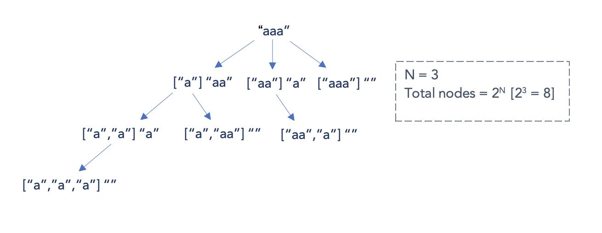

## YouTube Video

<iframe width="560" height="315" src="https://www.youtube.com/embed/dl1gtKWXKEs" frameborder="0" allow="accelerometer; autoplay; encrypted-media; gyroscope; picture-in-picture" allowfullscreen></iframe>

## Problem

Given a string s, partition s such that every substring of the partition is a palindrome.

Return all possible palindrome partitioning of s.

Example:

```
Input: "aab"
Output:
[
  ["aa","b"],
  ["a","a","b"]
]
```

## Code

backtracking

```java
class Solution {
    public List<List<String>> partition(String s) {
        List<List<String>> res = new ArrayList<>();
        helper(res, s, new ArrayList<>(), 0);
        return res;
    }

    private void helper(List<List<String>> res, String s, List<String> temp, int start){
        if(start == s.length()){
            res.add(new ArrayList<>(temp));
            return;
        }

        for(int i = start + 1; i <= s.length(); i++){
            if(isValid(s.substring(start, i))){
                temp.add(s.substring(start, i));
                helper(res, s, temp, i);
                temp.remove(temp.size() - 1);
            }
        }
    }

    private boolean isValid(String s){
        int left = 0;
        int right = s.length() - 1;

        while(left < right){
            if(s.charAt(left) != s.charAt(right)) return false;
            left++;
            right--;
        }

        return true;
    }
}
```

worst case



time: O(N \* 2^N)
space: O(N)

DP + backtracking

```java
class Solution {
    public List<List<String>> partition(String s) {
        int len = s.length();
        boolean[][] dp = new boolean[len][len];
        List<List<String>> result = new ArrayList<>();

        dfs(result, s, 0, new ArrayList<>(), dp);
        return result;
    }

    private void dfs(
        List<List<String>> result,
        String s,
        int start,
        List<String> currentList,
        boolean[][] dp) {

        if (start >= s.length()) {
            result.add(new ArrayList<>(currentList));
            return;
        }

        for (int end = start; end < s.length(); end++) {
            if (s.charAt(start) == s.charAt(end) && (end - start <= 2 || dp[start + 1][end - 1])) {
                dp[start][end] = true;

                currentList.add(s.substring(start, end + 1));
                dfs(result, s, end + 1, currentList, dp);
                currentList.remove(currentList.size() - 1);
            }
        }
    }
}
```

- time: O(N \* 2^N): eliminate one additional iteration to check if substring is a palindrome or not
- space: O(N \* N)

For each character in the string we have 2 choices to create new palindrome substrings, one is to join with previous substring (for(...end++)) and another is to start a new palindrome substring (dfs(..end+1..)). Thus in the worst case there are 2^N palindrome substrings. Each substring will take O(N) time to check if it's palindrome and O(N) time to generate substring from start to end indexes.

In total we have O(2^N _ (N + N)) = O(2^N _ 2N) = O(N\*2^N)

In the second approach we use dp to remove the check for palindrome, but for each palindrome we still need O(N) time to generate substring from start to end indexes. The complexity is still the same O(N\*2^N)
