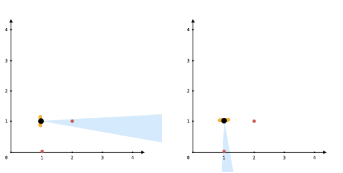

## Problem

You are given an array points, an integer angle, and your location, where location = [posx, posy] and points[i] = [xi, yi] both denote integral coordinates on the X-Y plane.

Initially, you are facing directly east from your position. You cannot move from your position, but you can rotate. In other words, posx and posy cannot be changed. Your field of view in degrees is represented by angle, determining how wide you can see from any given view direction. Let d be the amount in degrees that you rotate counterclockwise. Then, your field of view is the inclusive range of angles [d - angle/2, d + angle/2].

You can see some set of points if, for each point, the angle formed by the point, your position, and the immediate east direction from your position is in your field of view.

There can be multiple points at one coordinate. There may be points at your location, and you can always see these points regardless of your rotation. Points do not obstruct your vision to other points.

Return the maximum number of points you can see.

Example 1:


```
Input: points = [[2,1],[2,2],[3,3]], angle = 90, location = [1,1]
Output: 3
Explanation: The shaded region represents your field of view. All points can be made visible in your field of view, including [3,3] even though [2,2] is in front and in the same line of sight.
```

Example 2:

```
Input: points = [[2,1],[2,2],[3,4],[1,1]], angle = 90, location = [1,1]
Output: 4
Explanation: All points can be made visible in your field of view, including the one at your location.
```

Example 3:



```
Input: points = [[1,0],[2,1]], angle = 13, location = [1,1]
Output: 1
Explanation: You can only see one of the two points, as shown above.
```

## Code

转到一个角度, 同时能看到最多多少个点

```java
class Solution {
    public int visiblePoints(List<List<Integer>> points, int angle, List<Integer> location) {
        List<Double> angles = new ArrayList<>();
        int count = 0;

        for (List<Integer> p : points) {
            int dx = p.get(0) - location.get(0);
            int dy = p.get(1) - location.get(1);
            // edge case of same point
            if (dx == 0 && dy == 0) {
                count++;
                continue;
            }
            // 线段与x轴正方向之间的平面角度(弧度值)
            // 返回值是-pi ~ pi
            angles.add(Math.atan2(dy, dx));
        }

        Collections.sort(angles);
        int size = angles.size();
        for(int i = 0; i < size; i++) {
            // duplicate array to handle turn-around case
            angles.add(angles.get(i) + 2 * Math.PI);
        }

        // 转换成弧度
        double fov = angle * Math.PI / 180;
        int l = 0;
        int res = 0;
        for(int r = 0; r < angles.size(); r++) {
            // 检查可视角度是不是在允许的范围之内
            while(angles.get(r) - angles.get(l) > fov) l++;
            res = Math.max(res, r - l + 1);
        }

        return res + count;
    }
}
```
