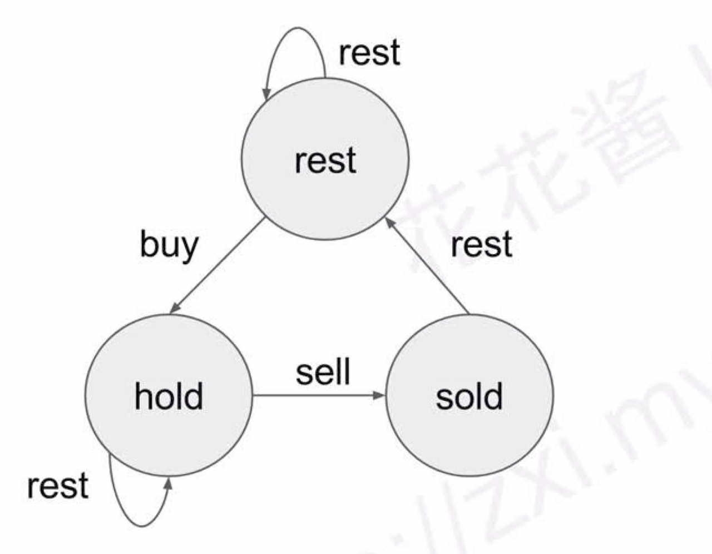

## YouTube Video

## Problem

Say you have an array for which the ith element is the price of a given stock on day i.

Design an algorithm to find the maximum profit. You may complete as many transactions as you like (ie, buy one and sell one share of the stock multiple times) with the following restrictions:

You may not engage in multiple transactions at the same time (ie, you must sell the stock before you buy again).
After you sell your stock, you cannot buy stock on next day. (ie, cooldown 1 day)
Example:

```
Input: [1,2,3,0,2]
Output: 3
Explanation: transactions = [buy, sell, cooldown, buy, sell]
```

## Code

对于每一天，有三种动作，buy, sell, cooldown。
sell 和 cooldown 可以合并成一种状态，因为手里最终没有股票。最终需要的结果是 sell，即手里股票卖了获得最大利润。我们可以用两个数组来记录当前持股和未持股的状态，令 sell[i] 表示第 i 天未持股时，获得的最大利润，buy[i]表示第 i 天持有股票时，获得的最大利润。

对于 sell[i]，最大利润有两种可能，一是今天没动作跟昨天未持股状态一样，二是今天卖了股票，所以状态转移方程如下：

sell[i] = max{sell[i - 1], buy[i-1] + prices[i]}

对于 buy[i]，最大利润有两种可能，一是今天没动作跟昨天持股状态一样，二是前天卖了股票，今天买了股票，因为 cooldown 只能隔天交易，所以今天买股票要追溯到前天的状态。状态转移方程如下：

buy[i] = max{buy[i-1], sell[i-2] - prices[i]}

最终我们要求的结果是 sell[n - 1]，表示最后一天结束时，手里没有股票时的最大利润。

```java
public class Solution {
    public int maxProfit(int[] prices) {
        if (prices == null || prices.length == 0) return 0;

        int[] sell = new int[prices.length];
        int[] buy = new int[prices.length];
        sell[0] = 0;
        buy[0] = -prices[0];

        for (int i = 1; i < prices.length; ++i) {
            sell[i] = Math.max(sell[i - 1], buy[i - 1] + prices[i]);
            buy[i] = Math.max(buy[i - 1], (i > 1 ? sell[i - 2] : 0) - prices[i]);
        }
        return sell[prices.length - 1];
    }
}
```

状态转移


```python
class Solution:
    def maxProfit(self, prices: List[int]) -> int:
        if not prices:
            return 0
        # 第一天可以休息
        rest = 0
        # 第一天可以买
        hold = -prices[0]
        # 第一天不能卖
        sell = 0

        # 从第二天开始算
        for i in range(1, len(prices)):
            temp = sell
            # sell的状态只能从hold来
            sell = hold + prices[i]
            hold = max(hold, rest - prices[i])
            rest = max(rest, temp)

        return max(rest, sell)
```
