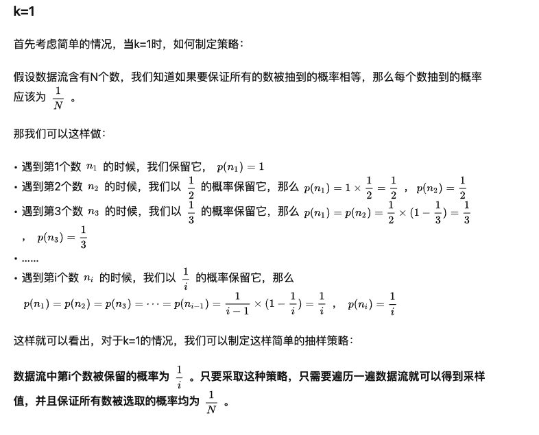

## Problem

Given a singly linked list, return a random node's value from the linked list. Each node must have the same probability of being chosen.

Example 1:

```
Input
["Solution", "getRandom", "getRandom", "getRandom", "getRandom", "getRandom"]
[[[1, 2, 3]], [], [], [], [], []]
Output
[null, 1, 3, 2, 2, 3]

Explanation
Solution solution = new Solution([1, 2, 3]);
solution.getRandom(); // return 1
solution.getRandom(); // return 3
solution.getRandom(); // return 2
solution.getRandom(); // return 2
solution.getRandom(); // return 3
// getRandom() should return either 1, 2, or 3 randomly. Each element should have equal probability of returning.
```

## Code

Reservoir sampling (水塘抽样)

当内存无法加载全部数据时，如何从包含未知大小的数据流中随机选取 k 个数据，并且要保证每个数据被抽取到的概率相等。



```java
class Solution {
    ListNode head;
    Random rand;
    public Solution(ListNode head) {
        this.head = head;
        rand = new Random();
    }

    /** Returns a random node's value. */
    public int getRandom() {
        ListNode temp = head;
        int res = -1;
        int i = 0;

        while(temp != null){
            // 得到[0, ++i)之间的一个随机数
            // 比如到++i = 2的时候
            // 会在0，1之间得到一个随机数
            // 相当于是1/2的概率得到0
            // 因此可以完成水塘抽样的任务
            if(rand.nextInt(++i) == 0){
                res = temp.val;
            }
            temp = temp.next;
        }

        return res;
    }
}
```

```java
class Solution {

    /** @param head The linked list's head.
        Note that the head is guaranteed to be not null, so it contains at least one node. */
    List<Integer> list;
    Random rand;
    public Solution(ListNode head) {
        list = new ArrayList<>();
        while(head != null) {
            list.add(head.val);
            head = head.next;
        }

        rand = new Random();
    }

    /** Returns a random node's value. */
    public int getRandom() {
        int index = rand.nextInt(list.size());
        return list.get(index);
    }
}
```
