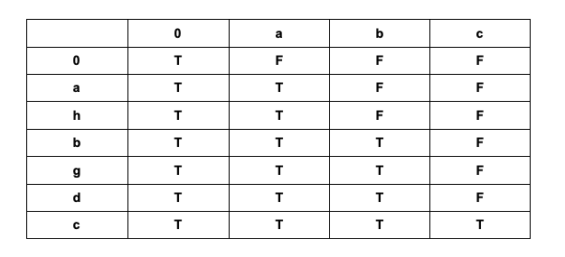

## Problem

Given two strings s and t, check if s is a subsequence of t.

A subsequence of a string is a new string that is formed from the original string by deleting some (can be none) of the characters without disturbing the relative positions of the remaining characters. (i.e., "ace" is a subsequence of "abcde" while "aec" is not).

Example 1:

```
Input: s = "abc", t = "ahbgdc"
Output: true
```

Example 2:

```
Input: s = "axc", t = "ahbgdc"
Output: false
```

## Code

```java
class Solution {
    public boolean isSubsequence(String s, String t) {
        if(s == null || s.length() == 0) return true;

        int curr = 0;
        for(char c : t.toCharArray()) {
            if(curr == s.length()) return true;
            if(c == s.charAt(curr)) {
                curr++;
            }
        }

        return curr == s.length();
    }
}
```



```java
class Solution {
    public boolean isSubsequence(String s, String t) {
        int sLen = s.length();
        int tLen = t.length();

        boolean[][] dp = new boolean[sLen + 1][tLen + 1];
        for(int j = 0; j <= tLen; j++){
            dp[0][j] = true;
        }

        for(int i = 1; i <= sLen; i++){
            for(int j = 1; j <= tLen; j++){
                if(dp[i][j - 1] == true){
                    dp[i][j] = true;
                } else if(s.charAt(i - 1) == t.charAt(j - 1) && dp[i - 1][j - 1] == true){
                    dp[i][j] = true;
                }
            }
        }

        return dp[sLen][tLen];
    }
}
```
