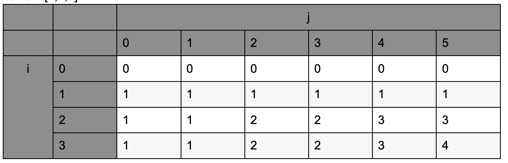

## Problem

You are given an integer array coins representing coins of different denominations and an integer amount representing a total amount of money.

Return the number of combinations that make up that amount. If that amount of money cannot be made up by any combination of the coins, return -1.

You may assume that you have an infinite number of each kind of coin.

The answer is guaranteed to fit into a signed 32-bit integer.

Example 1:

```
Input: amount = 5, coins = [1,2,5]
Output: 4
Explanation: there are four ways to make up the amount:
5=5
5=2+2+1
5=2+1+1+1
5=1+1+1+1+1
```

Example 2:

```
Input: amount = 3, coins = [2]
Output: 0
Explanation: the amount of 3 cannot be made up just with coins of 2.
```

Example 3:

```
Input: amount = 10, coins = [10]
Output: 1
```

## Code



每一列表示组成的综合

第一行表示只用一种硬币，第二行表示允许使用两种硬币

`dp[i][j] = dp[i - 1][j] + (j >= coins[i - 1] ? dp[i][j - coins[i - 1]] : 0);`

当前 amount 的组合数 = 少使用一种硬币组成当前 amount 组合数 + 再使用一枚当前的硬币的组合数

因为每次只多拿出一个当前的硬币，所以不会出现重复计数的情况

```java
class Solution {
    public int change(int amount, int[] coins) {
        if(coins == null || coins.length == 0) return amount == 0 ? 1 : 0;
        int[][] dp = new int[coins.length + 1][amount + 1];

        for(int i = 1; i <= coins.length; i++){
            dp[i][0] = 1;
            for(int j = 1; j <= amount; j++){
                dp[i][j] = dp[i - 1][j] + (j >= coins[i - 1] ? dp[i][j - coins[i - 1]] : 0);
            }
        }

        return dp[coins.length][amount];
    }
}
```
