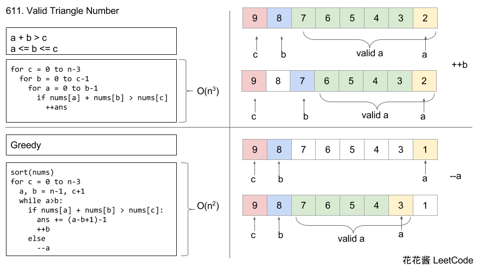

## Problem

Given an integer array nums, return the number of triplets chosen from the array that can make triangles if we take them
as side lengths of a triangle.

Example 1:

```
Input: nums = [2,2,3,4]
Output: 3
Explanation: Valid combinations are:
2,3,4 (using the first 2)
2,3,4 (using the second 2)
2,2,3
```

Example 2:

```
Input: nums = [4,2,3,4]
Output: 4
```

## Code



两边之和大于第三边

反向使用求和方法

```java
class Solution {
    public int triangleNumber(int[] nums) {
        Arrays.sort(nums);
        int res = 0;
        for (int i = nums.length - 1; i >= 2; i--) {
            int j = i - 1;
            int end = 0;
            while (end < j) {
                if (nums[j] + nums[end] > nums[i]) {
                    res += j - end;
                    j--;
                } else {
                    end++;
                }
            }
        }
        return res;
    }
}
```
