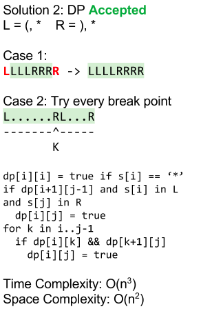

## Problem

Given a string s containing only three types of characters: '(', ')' and '*', return true if s is valid.

The following rules define a valid string:

Any left parenthesis '(' must have a corresponding right parenthesis ')'.
Any right parenthesis ')' must have a corresponding left parenthesis '('.
Left parenthesis '(' must go before the corresponding right parenthesis ')'.
'*' could be treated as a single right parenthesis ')' or a single left parenthesis '(' or an empty string "".


Example 1:
```
Input: s = "()"
Output: true
```
Example 2:
```
Input: s = "(*)"
Output: true
```
Example 3:
```
Input: s = "(*))"
Output: true
```
## Code



两种情况,嵌套或者追加

```java
class Solution {
    public boolean checkValidString(String s) {
        int length = s.length();
        boolean[][] dp = new boolean[length][length];

        for (int len = 1; len <= length; len++) {
            for (int i = 0; i + len <= length; i++) {
                int j = i + len - 1;
                if (i == j) {
                    dp[i][j] = s.charAt(i) == '*';
                    continue;
                }

                if ((s.charAt(i) == '*' || s.charAt(i) == '(')
                        && (s.charAt(j) == '*' || s.charAt(j) == ')')) {
                    if (len == 2 || dp[i + 1][j - 1]) {
                        dp[i][j] = true;
                        continue;
                    }
                }

                for (int k = i; k < j; ++k) {
                    if (dp[i][k] && dp[k + 1][j]) {
                        dp[i][j] = true;
                        break;
                    }
                }
            }
        }

        return dp[0][length - 1];
    }
}
```
