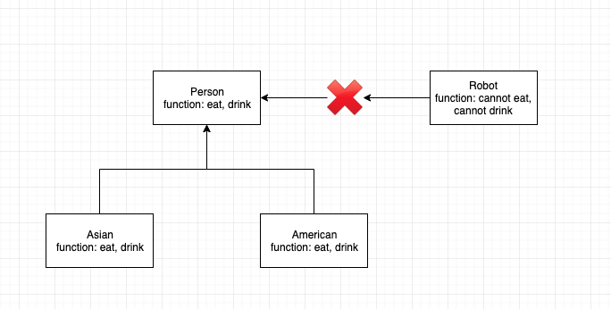

## OOD vs System design

- OOD: Viability 设计一个能用的东西，比如设计停车场
- System Design: Scalability 不用设计全部功能，但是要考虑大数据相关的问题，体现能用性

## SOLID

### S: Single responsibility principle

> 一个类应该只有一项工作

```java
// AreaCalculator只负责计算，Printer只负责打印，不要把Printer放到AreaCalculator中
public class AreaCalculator {
  private float result;

  public float getResult() {
    return this.result;
  }

  public float calculateArea(float h, float b) {
    this.result = h * b / 2;
  }
}

public class Printer {
  public printInJson(float number) {
    jsonPrinter.initialize();
    jsonPrinter.print(number);
    jsonPrinter.close();
  }
}
```

### O: Open close principle

> 对扩展开放，对修改封闭 (open to extension, close to modification)

```java
public interface Shape{
  public float getArea();
}

public class Triangle implements Shape {
  public float getArea() {
    return b * h / 2;
  }
}

public class AreaCalculator {
  private float result;

  public float getResult() {
    return this.result;
  }

  // 抽象化s，可以再扩展任何其他的形状
  // 而对AreaCalculator中的函数不进行修改
  public float calculateArea(Shape s) {
    this.result = s.getArea();
  }
}
```

### L: Liskov substitution principle 里氏替换原则

> 任何一个子类或派生类应该可以替代他们的基类或父类



> 子类(asian, american)可以代表父类

### I: Interface segregation principle 接口分离原则

> 不可以强迫一个类实现它用不上的接口


> 不能让 robot 集成 person 的吃/喝方法

### D: Dependency inversion principle 依赖反转原则

> 抽象不能依赖于具体实现，具体应该依赖于抽象
> high-level 的实体不应该依赖于 low-level 的实体

```java
public class AreaCalculator {
  private float result;

  public float getResult() {
    return this.result;
  }

  // 抽象了Shape
  public float calculateArea(Shape s) {
    this.result = s.getArea();
  }
}
```

**_总结_**

1. S: 类中功能只属于这个类
2. O: 可扩展性强，扩展时不需要对类进行大量修改
3. L/I: 继承是否合理
4. D: 抽象是否合理
