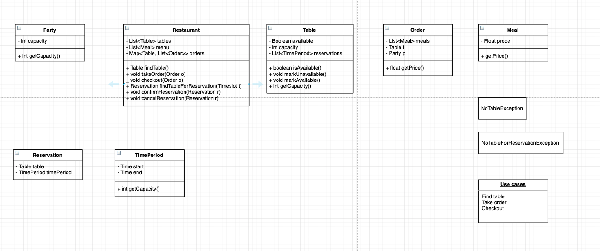
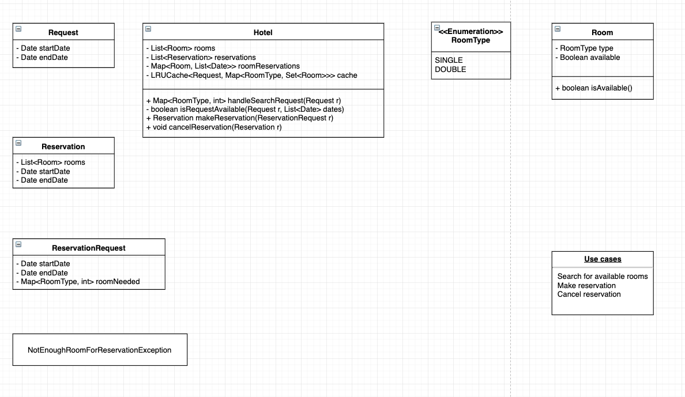

> 例如，设计一个 restaurant

### Restaurant

- 客人进入餐厅，返回一个 table
- 客人点菜，返回一桌菜
- 客人付款，清空 table

### Hotel

> Hotel 通常会遇到搜索的问题，这里常用 LRU cache 解决。
> 在 java 中，可以使用 LinkedHashMap 实现 LRU cache

[LRU cache implementation](https://jacobhuang91.github.io/all-in-one/leetcode/146.%20LRU%20Cache.html)

