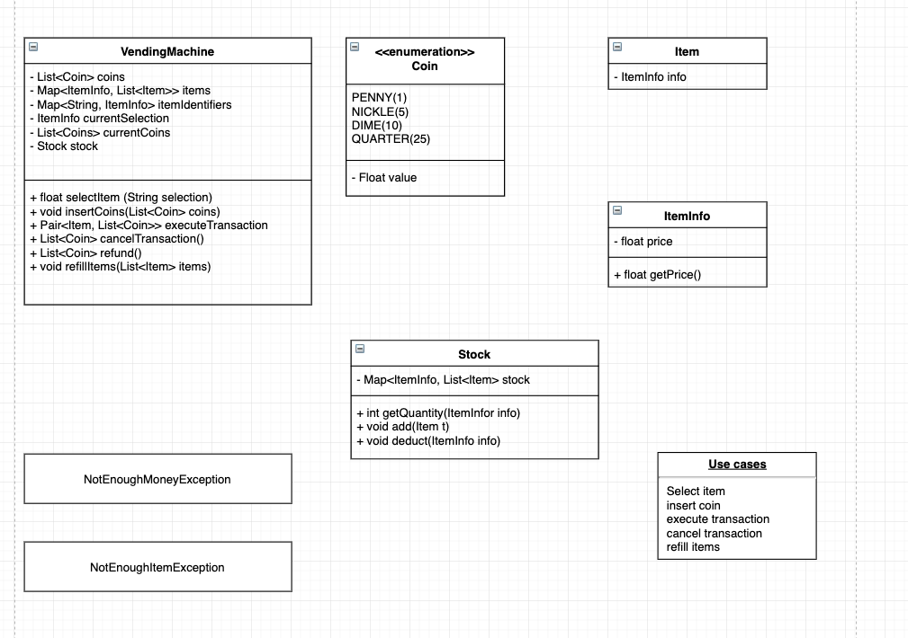
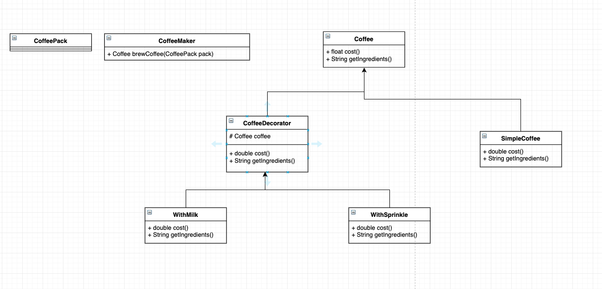

### Vending machine



设计模式: State Design Pattern

### Coffee Maker



设计模式: Decorator design pattern

```java
public interface Coffee {
  public double getCost();
  public String getIngredients();

  // 普通coffee
  public class SimpleCoffee implements Coffee {
    @Override
    public double getCost() {
      return 1;
    }

    @Override
    public String getIngredients () {
      return "Coffee";
    }
  }

  // decorator
  public abstract class CoffeeDecorator implements Coffee {
    protected final Coffee decoratedCoffee;

    public CoffeeDecorator(Coffee c) {
      this.decoratedCoffee = c;
    }

    public double getCost() {
      return decoratedCoffee.getCost();
    }

    public String getIngredients() {
      return decoratedCoffee.getIngredients();
    }
  }

  // two real decorators
  public WithMilk extends CoffeeDecorator {
    public WithMilk (Coffee c) {
      super(c);
    }

    public double getCost() {
      return super.getCost() + 0.5; // 得到父类的价格，再加上奶的价格
    }

    public String getIngredients() {
      return super.getIngredients() + ", Milk";
    }
  }

  public WithSprinkles extends CoffeeDecorator {
    public WithMilk (Coffee c) {
      super(c);
    }

    public double getCost() {
      return super.getCost() + 0.2;
    }

    public String getIngredients() {
      return super.getIngredients() + ", Sprinkles";
    }
  }

  // 主函数
  public class Main {
    public static void printInfo(Coffee c) {
      System.out.println("Cost: " + c.getCost() + "; Ingredients: " + c.getIngredients());
    }

    public static void main(String[] args) {
      Coffee c = new SimpleCoffee();

      c = new WithMilk(c);

      c = new WithSprinkles(c);
    }
  }
}
```
