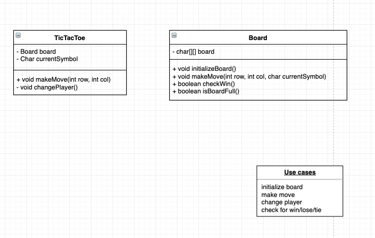
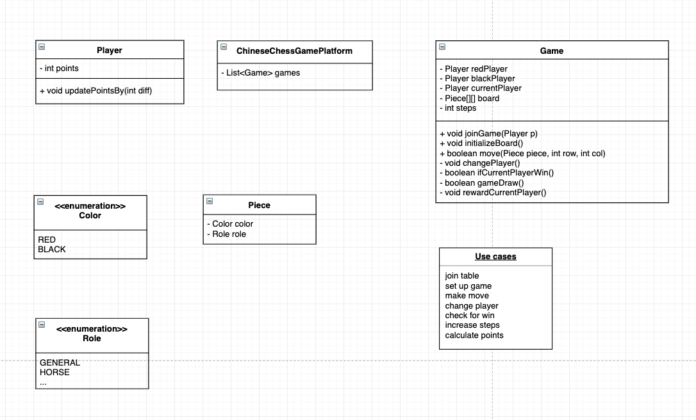
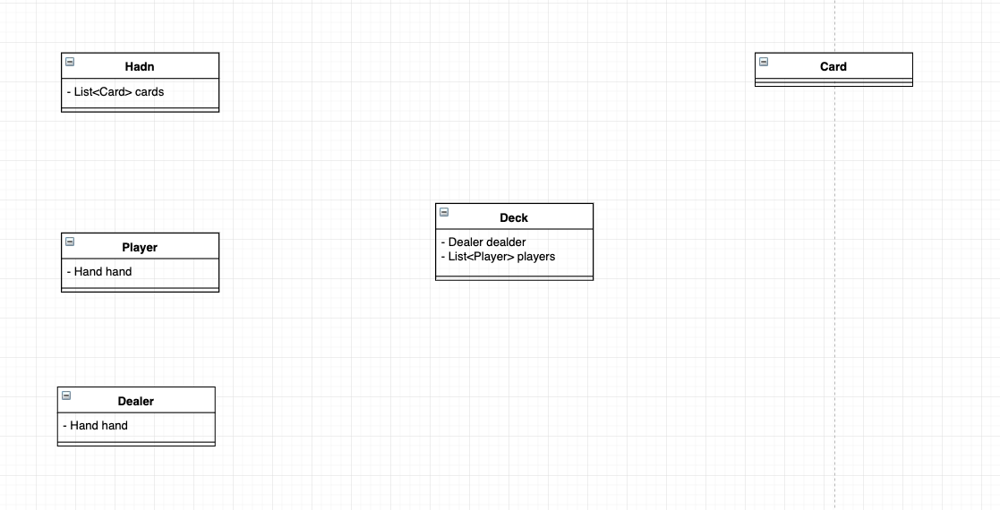
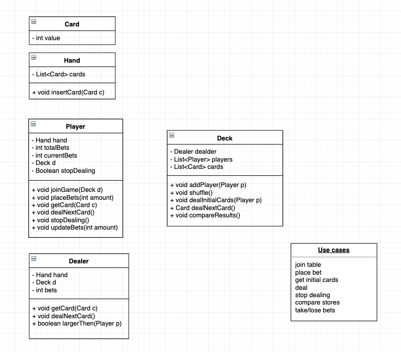
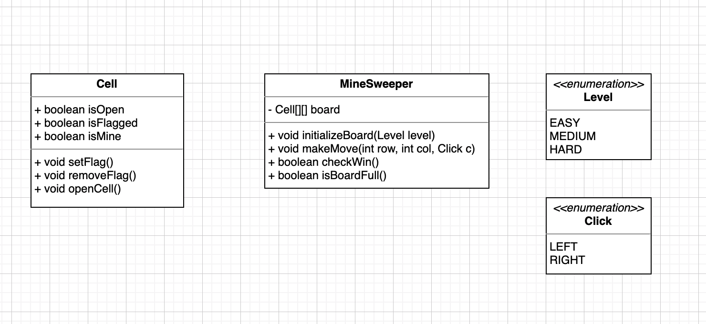

### 游戏类特点

- 玩家
- 规则
- 胜负
- 积分

### 常用术语

- board 棋盘
- suit 花色
- hand 手牌
- piece 棋子
- game draw 游戏最终结果
- deck 牌桌
- bet 赌注

### 通常环节

- initialization 摆盘，洗牌
- play 下棋，出牌
- win/lose check 胜负结算 或者 tie 平局

### Tic Tac Toe

### Chinese chess 游戏大厅

### Blackjack

规则

- 5 players
- 1 dealer
- initialize 2 cards
- initialize bets
- 2 - 10 worth 2 - 10
- jack/queen/king worth 10
- a worth 1 or 11
- 不能超过 21 分，到 21 分赢
- 2 个选择，要牌(call deal)或者不要牌
- 最后玩家和庄家比分数，玩家之间不比分数

**牌类常用的模板**

# 扫雷 Mine sweeper

