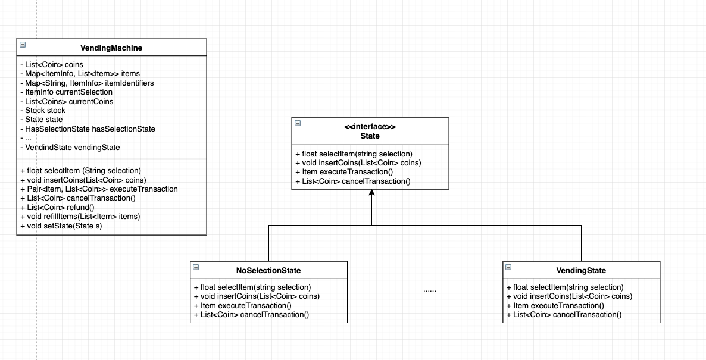
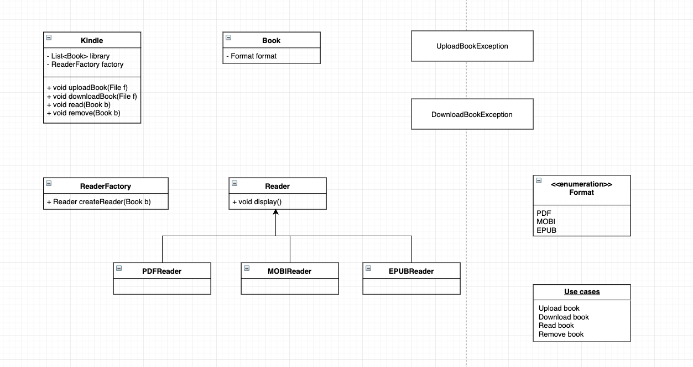
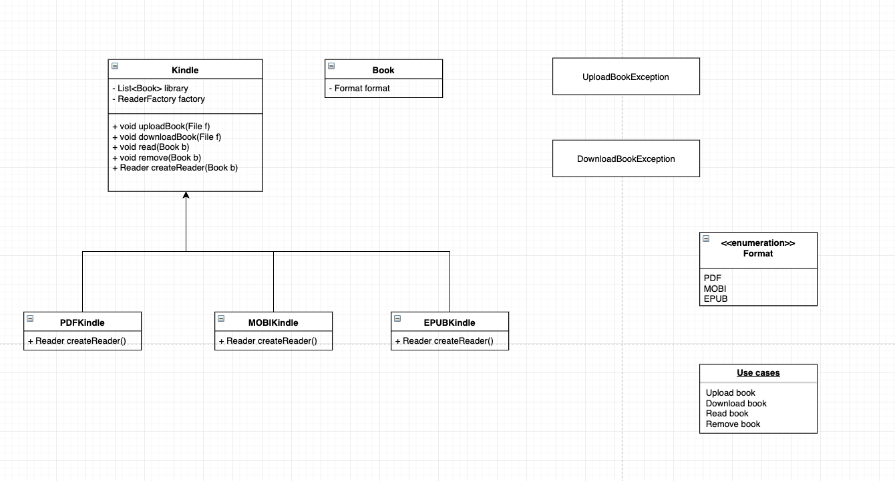
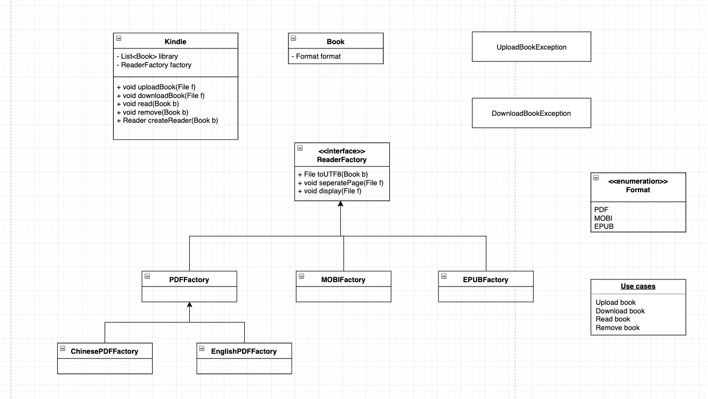

### Singleton

> 通过保证一个 class 只有一个 instance，使得全局可以访问同一个 instance

#### 基本型

- 构造函数是 private 的，因此外部不能使用 new 来创建 instance
- 提供一个 static 方法来访问 instance，实现全局可访问
- 第一次调用时通过 private 构造函数创建 instance
- instance 是 static 和 private 的

```java
public class ParkingLot {
  private static ParkingLot _instance = null;

  private List<Level> levels;

  private ParkingLot() {
    levels = new ArrayList<>();
  }

  public static ParkingLot getInstance() {
    if (_instance == null) {
      _instance = new ParkingLot();
    }

    return _instance;
  }
}
```

### 线程安全型

- synchronized 关键字确保某一时间只有一个线程可以调用 instance，其他线程需要等待
- 缺点是性能较差，需要等待

```java
public class ParkingLot {
  private static ParkingLot _instance = null;

  private List<Level> levels;

  private ParkingLot() {
    levels = new ArrayList<>();
  }

  public static synchronized ParkingLot getInstance() {
    if (_instance == null) {
      _instance = new ParkingLot();
    }

    return _instance;
  }
}
```

### State Design Pattern

> 某些变量决定了几种特定的状态

例如 vending machine 有以下几种状态

- HAS_SELECTION
- NO_SELECTION
- COINS_INSERTED
- VENDING

与上述 state 相关的变量有

- select item
- insert coin
- execute transaction
- cancel transaction



```java
public class VendingMachine{
  private AbstractState state; // current state
  private NoSelectionState noSelectionState;
  private HasSelectionState hasSelectionState;
  private InsertedMoneyState insertedMoneyState;

  public VendingMachine() {
    noSelectionState = new NoSelectionsState(this); // 把自己放进去
    hasSelectionState = new HasSelectionState(this);
    insertedMoneyState = new InsertedMoneyState(this);
    state = noSelectionState;
  }

  // 更改状态
  public void changeToNoSelectionState() {
    state = noSelectionState;
  }

  // 更改状态
  public void changeToHasSelectionState() {
    state = hasSelectionState;
  }

  // 更改状态
  public void changeToInsertedMoneyState() {
    state = insertedMoneyState;
  }

  public void selectItem(String selection) {
    state.selectItm(selection);
  }

  public void addMoney(int value) {
    state.insertMoney(value);
  }

  public void executeTransaction() {
    state.executeTransaction();
  }

  public int cancelTransaction() {
    return state.cancelTransaction();
  }
}
```

```java
public class NoSelectionState implements AbstracState {
  VendingMachine vendingMachine;

  public NoSelectionState(VendingMachine vendingMachine) {
    this.vendingMachine = vendingMachine;
  }

  @Override
  public void SelectItem(String selection) {
    vendingMachine.setSelectedItem(selection);
    vendingMachine.changeToHasSelectionState(); // 改变状态
  }

  @Override
  public void addMoney(int value) {

  }

  @Override
  public void executeTransaction() {

  }

  @Override
  public int cancelTransaction() {

  }
}
```

### Decorator Design Pattern

> Decorator pattern allows a user to add new functionality to an existing object without altering its structure.
> It comes under structural pattern as this pattern acts as a wrapper to existing class.


```java
public interface Coffee {
  public double getCost();
  public String getIngredients();

  // 普通coffee
  public class SimpleCoffee implements Coffee {
    @Override
    public double getCost() {
      return 1;
    }

    @Override
    public String getIngredients () {
      return "Coffee";
    }
  }

  // decorator
  public abstract class CoffeeDecorator implements Coffee {
    protected final Coffee decoratedCoffee;

    public CoffeeDecorator(Coffee c) {
      this.decoratedCoffee = c;
    }

    public double getCost() {
      return decoratedCoffee.getCost();
    }

    public String getIngredients() {
      return decoratedCoffee.getIngredients();
    }
  }

  // two real decorators
  public WithMilk extends CoffeeDecorator {
    public WithMilk (Coffee c) {
      super(c);
    }

    public double getCost() {
      return super.getCost() + 0.5; // 得到父类的价格，再加上奶的价格
    }

    public String getIngredients() {
      return super.getIngredients() + ", Milk";
    }
  }

  public WithSprinkles extends CoffeeDecorator {
    public WithMilk (Coffee c) {
      super(c);
    }

    public double getCost() {
      return super.getCost() + 0.2;
    }

    public String getIngredients() {
      return super.getIngredients() + ", Sprinkles";
    }
  }

  // 主函数
  public class Main {
    public static void printInfo(Coffee c) {
      System.out.println("Cost: " + c.getCost() + "; Ingredients: " + c.getIngredients());
    }

    public static void main(String[] args) {
      Coffee c = new SimpleCoffee();

      c = new WithMilk(c);

      c = new WithSprinkles(c);
    }
  }
}
```

### Factory Design Pattern

#### simple factory



#### Factory method

> 类似加盟店一样，每一个 kindle 都继承一个方法用来生成 reader



#### Abstract factory

> 抽象化工厂，适用于比较复杂的情况


