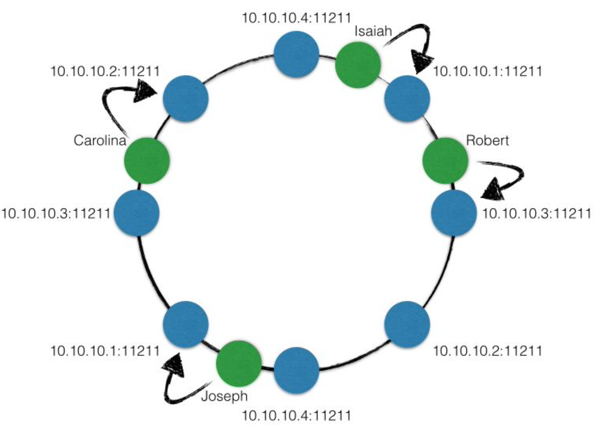

# OOD vs System Design

> design pattern 属于 OOD
> System Design 大多与数据库设计相关
> System Design 通常不用写代码，只需要一个大概的思路或解决方案

系统设计题目举例

- Design Twitter
- Design Facebook
- Design Uber
- Design Whatsapp
- Design Yelp
- Design Tiny URL
- Design NoSQL
- 设计一个功能实现对用户访问频率的限制
- 设计一个功能实现统计时间发生次数
- 设计删除一个 tweet 的功能
- 设计邮件系统中将所有邮件标记为已读的功能

面向对象考察：Class, Object....
系统设计考察：Database, Schema, SQL, Memcached, File System, Distributed System, Latency, Scalibility, Master Slave, Load Balancer, Web Server, Message Queue, Sharding, ConsistentHashing, QPS.....

# System Design 评分标准

- Work Solution 25%
- Special Case 20%
- Analysis 25%
- Tradeoff 15%
- Knowledge Base 15%

## 注意

- 提前问好需要怎么样的系统，不要过度设计
- 先设计一个能工作的系统，然后进行优化
- 系统设计没有标准答案，要分析情况，权衡利弊

# 4S 解题法

## 1. Scenario

### 询问系统的基本信息

> 先了解系统的功能和需求

- 要实现什么功能
- 有多少访问量
  - DAU - Daily Active User 这天是否登录
  - MAU - Monthly Active User 这个月是否登录，衡量网站用户数量的重要指标，一般使用 MAU 表示网站的用户数

### 列出核心功能

> 例如 twitter

- Register / Login
- Post a tweet
- Timeline
- New feed
- Follow/unfollow users

### 要分析什么？

- 并发用户 Concurrent User
  - 日活用户 \* 每个用户平均请求次数 / 一天多少秒
  - 举例: 150 M \* 60 / 86400 ~ 100K 所以平均每秒有 100K 访问
  - 峰值：Peak = 平均每秒访问 \* 3 ~ 300K - 对系统来说，峰值更重要
  - 快速增长的产品 fast growing 的 Peak 一般要 Peak \* 2 ~ 600K
- 读频率 Read QPS - Query per second - 300K 通常情况读得多写得少
- 写频率 Write QPS - 5K
- I/O Per Second 通常更大，一次读写操作通常伴有多次的 I/O

### 为什么分析 QPS？

#### QPS 和服务器搭建

- 如果 QPS=100，name 使用一个笔记本就够了
- 如果 QPS=1K，用一个 web 服务器就够了
- 如果 QPS=1M，需要一个 1000 台服务器的集群，此时就要考虑 maintainance，万一有一台挂了怎么办

#### QPS 和数据库

> QPS 的大小决定了数据存储系统的选择

- SQL Database (MySQL, PosgreSQL) 承受量是 1K QPS
- 硬盘型 NoSQL Database (Cassandra, MongoDB) 承受量是 10K QPS, 功能少，性能好
- 内存型 NoSQL Database (Memcached, Redis) 承受量是 100K ~ 1M QPS, 数据存放在内存中，速度快, 不是 persistent 存储, 所以不能用作存储用户信息

## 2. Service

> 将大 service 拆分成小 service
> Replay 重新过一遍每个需求，为每个需求添加一个服务
> Merge 归并相同的服务

## 3. Storage

> 数据如何存储和访问
> 为每个服务选择存储
> schema 的结构

### 数据库, 文件系统, 缓存系统

#### 数据库 Database

- 关系型数据库 SQL Database
  - 用户信息 User Table
  - 比较成熟，提供很多功能
- 非关系型数据库 NoSQL Database
  - 例如，推文 Tweets，社交图谱 Social Geaph
  - 通常不支持 transaction，Serialization, Secondary Index
  - 通常性能更好，效率高
  - 容易做分布式架构
  - Cassandra - 三层结构的 NoSQL 数据库
    - 第一层: row_key - 决定放在哪个机器
    - 第二层: column_key - 排序的，可以进行 range query; 可以是复合值，比如 timestamp + user_id
    - 第三层: value

#### 文件系统 File System

- 图片
- 视频

#### 缓存系统 Cache

> 缓存，把之后可能要查询的东西先存一下，下次需要的时候，不用再重新计算或者存取数据库

- key-value 结构
- 通常在内存中
- 不支持数据持久化
- 效率高，内存级访问速度
- 常用
  - Memcached: 一般用来优化数据库访问
  - Redis
- memory cs disk
  - memory: 内存，断电消失
  - disk: 硬盘，断电不消失

#### 数据库 vs 文件系统

- 数据库构建与文件系统之上，数据库依赖于文件系统
- 数据库提供丰富的操作，文件系统只提供简单的操作

### 如何存储和访问

> 程序 -> 算法 + 数据结构
> 系统 -> 服务 + 数据存储

- 为每个服务选择合适的存储结构
- 设计 table 结构

## 4. Scale

> 解决缺陷和可能遇到的问题
> optimize
> maintenance

### Single Point Failure

- web server 是 stateless 的，所以挂掉关系不大，重启就行
- db 挂点问题很严重， 数据是否丢失?

#### Sharding and Replica

- sharding: 数据拆分
  - 按照一定的规则，将数据拆分成不同的部分，存在不同的机器
  - 这样就算挂调，也不会全部挂调
  - SQL 通常没有 sharding 功能，NoSQL 通常自带 sharding 功能
  - sharding 有 vertical 和 horizontal 两种
    - vertical: 把一个 table 的列存在不同的机器
    - horizontal: consistent hashing 一致性哈希算法
      - 减少数据迁移
      - 平均数据的存储
      - 将整个 hash 区间看作一个环，每次从环上选择一个点当做机器

- replica: 实时的数据备份
  - 通常备份三个
  - SQL: Master - Slave 结构，master 负责写，slave 负责读；slave 从 master 中同步数据
  - NoSQL: 例如 Cassandra 将数据存在 consistent hashing 环的三个 virtual nodes 中
