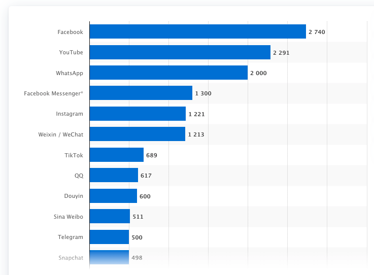

# OOD vs System Design

> design pattern 属于 OOD
> System Design 大多与数据库设计相关
> System Design 通常不用写代码，只需要一个大概的思路或解决方案

系统设计题目举例

- Design Twitter
- Design Facebook
- Design Uber
- Design Whatsapp
- Design Yelp
- Design Tiny URL
- Design NoSQL
- 设计一个功能实现对用户访问频率的限制
- 设计一个功能实现统计时间发生次数
- 设计删除一个 tweet 的功能
- 设计邮件系统中将所有邮件标记为已读的功能

面向对象考察：Class, Object....
系统设计考察：Database, Schema, SQL, Memcached, File System, Distributed System, Latency, Scalibility, Master Slave, Load Balancer, Web Server, Message Queue, Sharding, ConsistentHashing, QPS.....

# System Design 评分标准

- Work Solution 25%
- Special Case 20%
- Analysis 25%
- Tradeoff 15%
- Knowledge Base 15%

## 注意

- 提前问好需要怎么样的系统，不要过度设计
- 先设计一个能工作的系统，然后进行优化
- 系统设计没有标准答案，要分析情况，权衡利弊

# 4S 解题法

## 1. Scenario

### 询问系统的基本信息

> 先了解系统的功能和需求

- 要实现什么功能
- 有多少访问量
  - DAU - Daily Active User 这天是否登录
  - MAU - Monthly Active User 这个月是否登录，衡量网站用户数量的重要指标，一般使用 MAU 表示网站的用户数

### 列出核心功能

> 例如 twitter

- Register / Login
- Post a tweet
- Timeline
- New feed
- Follow/unfollow users

### 要分析什么？

- 并发用户 Concurrent User
  - 日活用户 \* 每个用户平均请求次数 / 一天多少秒
  - 举例: 150 M \* 60 / 86400 ~ 100K 所以平均每秒有 100K 访问
  - 峰值：Peak = 平均每秒访问 \* 3 ~ 300K - 对系统来说，峰值更重要
  - 快速增长的产品 fast growing 的 Peak 一般要 Peak \* 2 ~ 600K
- 读频率 Read QPS - Query per second - 300K 通常情况读得多写得少
- 写频率 Write QPS - 5K
- I/O Per Second 通常更大，一次读写操作通常伴有多次的 I/O

### 为什么分析 QPS？

#### QPS 和服务器搭建

- 如果 QPS=100，name 使用一个笔记本就够了
- 如果 QPS=1K，用一个 web 服务器就够了
- 如果 QPS=1M，需要一个 1000 台服务器的集群，此时就要考虑 maintainance，万一有一台挂了怎么办

#### QPS 和数据库

- 一台 web server 承受量是 1K QPS
- 一台 SQL Database 承受量是 1K QPS
- 一台 NoSQL Database (Cassandra) 承受量是 10K QPS
- 一台 NoSQL Database (Memcached) 承受量是 1M QPS

## 2. Service

> 将大 service 拆分成小 service
> Replay 重新过一遍每个需求，为每个需求添加一个服务
> Merge 归并相同的服务

## 3. Storage

> 数据如何存储和访问
> 为每个服务选择存储
> schema 的结构

### 数据库, 文件系统, 缓存系统

#### 数据库 Database

- 关系型数据库 SQL Database
  - 用户信息 User Table
- 非关系型数据库 NoSQL Database
  - 推文 Tweets
  - 社交图谱 Social Geaph

#### 文件系统 File System

- 图片
- 视频

#### 缓存系统 Cache

- 不支持数据持久化
- 效率高，内存级访问速度

#### 数据库 vs 文件系统

- 数据库构建与文件系统之上，数据库依赖于文件系统
- 数据库提供丰富的操作，文件系统只提供简单的操作

### 如何存储和访问

> 程序 -> 算法 + 数据结构
> 系统 -> 服务 + 数据存储

- 为每个服务选择合适的存储结构
- 设计 table 结构

## 4. Scale

> 解决缺陷和可能遇到的问题
> optimize
> maintenance
