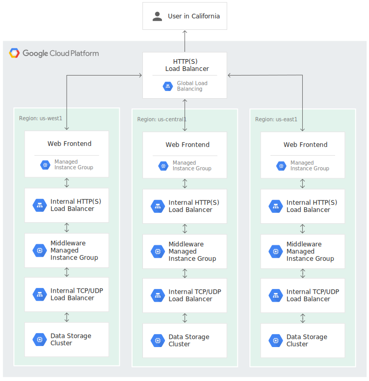
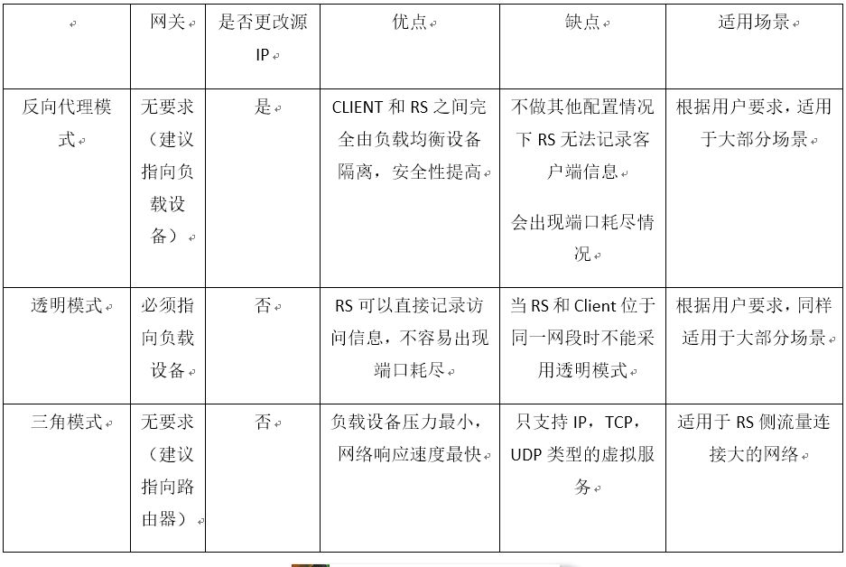

https://github.com/donnemartin/system-design-primer

# 第一步：描述使用场景，约束和假设

把所有需要的东西聚集在一起，审视问题。明确使用场景和约束。讨论假设。

- 谁会使用它？
- 他们会怎样使用它？
- 有多少用户？
- 系统的作用是什么？
- 系统的输入输出分别是什么？
- 我们希望处理多少数据？
- 我们希望每秒钟处理多少请求？
- 我们希望的读写比率？

# 第二步：创造一个高层级的设计

使用所有重要的组件来描绘出一个高层级的设计。

- 画出主要的 service 和连接
- 证明你的想法

# 第三步：设计核心组件

对每一个核心组件进行详细深入的分析。举例来说，如果你被问到设计一个 url 缩写服务，开始讨论：

- 生成并储存一个完整 url 的 hash
- MD5 和 Base62
- Hash 碰撞
- SQL 还是 NoSQL
- 数据库模型
- 将一个 hashed url 翻译成完整的 url
- 数据库查找
- API 和面向对象设计

# 第四步：扩展设计

确认和处理瓶颈以及一些限制

## 负载均衡 load balancer

在多个提供相同服务的服务器的情况下，负载均衡设备存在虚拟服务地址，当大量客户端从外部访问虚拟服务 IP 地址时，负载均衡设备将这些报文请求根据负载均衡算法，将流量均衡的分配给后台服务器以平衡各个服务器的负载压力，避免在还有服务器压力较小情况下其他服务达到性能临界点出现运行缓慢甚至宕机情况，从而提高服务效率和质量，因此对客户端而言，RS（real server 实际服务器）的 IP 地址即是负载均衡设备 VIP（虚拟服务地址 IP）地址，真正的 RS 服务器 IP 地址对于客户端是不可见的

LB 的操作

1. 接受 client 的请求
2. 选择一个 server
3. 等待相应
4. 返回结果给 client

优点

- 防止请求进入 unhealthty 服务器
- 防止 overloading resources
- 帮助消除 single point of failure

缺点

- 如果没有足够的资源配置或配置错误，LB 会变成一个性能瓶颈
- 配置 LB 导致了额外的复杂性
- 单个 LB 可能会导致单点故障(LB 坏了)，但配置多个 LB 会进一步增加复杂性

### GCP Cloud Load Balancing

可以通过每秒可响应超过 100 万次查询

Cloud Load Balancing 是一项完全分布式、软件定义的代管式服务。它并非基于硬件，因此无需管理物理负载平衡基础架构

- 外部负载平衡器将来自互联网的流量分配到您的 Google Cloud Virtual Private Cloud (VPC) 网络。
- 内部负载平衡器将流量分配给 Google Cloud 中的实例

三层 web 服务的 LB

- Web 层: 来自互联网的流量传入该层, 并使用外部 HTTP(S) 负载平衡器进行负载平衡处理, 将来自互联网的流量分配到多个不同地区的一组 Web 前端实例组
- 应用层: 前端组将 HTTP(S) 流量发送到地区内部 HTTP(S) 负载平衡器调节流量, 内部 HTTP(S) 负载平衡器将流量分配到中间件实例组
- 数据库层: 中间件实例组将流量发送到内部 TCP/UDP 负载平衡器, 进而将流量负载平衡到数据存储集群

### 传输模式

在负载均衡设备中，LB 主要工作在以下的三种传输模式中

- 反向代理模式
  - 普通的代理设备是内网用户通过代理设备出外网进行访问，而工作在这种模式下的负载均衡设备，则是外网用户通过代理设备访问内网，因此称之为反向代理
  - 当负载均衡设备收到客户端请求后，会记录下此报文（ 源 IP 地址、目的 IP 地址、协议号、源端口、目的端口，服务类型以及接口索引），将报文目的地址更改为优选后的 RS 设备的 IP 地址，目的端口号不变，源地址修改为负载均衡设备下行与对应 RS 设备接口的 IP 地址，源端口号随机发送给 RS
- 透传模式
- 三角模式

## 反向代理

LB 和 Reverse Proxy 通常是同一回事。但不总是。负载均衡器指的是一个非常具体的东西-一种服务器或设备，
用于平衡服务器上的入站请求以分散负载。但是，反向代理通常具有许多功能：

- 负载平衡：如上所述
- 缓存：它可以缓存来自其后的 Web 服务器的内容，从而减少 Web 服务器上的负载，并将一些静态内容返回给请求者，而不必从 Web 服务器获取数据
- 安全性
  - 它可以通过阻止直接从 Internet 访问来保护 Web 服务器;它可能只是通过混淆 Web 服务器来通过简单的方法来做到这一点，或者它可能具有一些更活跃的组件来实际查看入站请求以查找恶意代码;
  - 防止 DDoS 攻击 (A distributed denial‑of‑service (DDoS) attack is an attempt to make a service, usually a website, unavailable by bombarding it with so much traffic from multiple machines that the server providing the service is no longer able to function correctly)
- Web 加速
  - Compression: gzip
  - SSL Termination: 使用 SSL 时, 它可以用作这些 SSL 会话的终止点, 以便从 Web 服务器上减轻处理加密的工作量
  - Caching

## 数据库水平扩展 horizontal scaling

通过创建 Read Replica 来进行扩展,分散 master 的读压力

GCP: 使用 proxySQL 和 Cloud SQL 进行水平扩展

通过配置 proxySQL,可以把流量自动分配给 master 和 slave

proxySQL 作为一个中间层在 DB 和 APP 之间,不让 APP 和 DB 直接交互,而是通过 proxySQL 进行流量分配, 避免流量只集中在一个 DB 上

例如配置: 只有 master 可以进行 write,而 read 按照 master(20%) slave1(40%) slave2(40%)的比例进行分配

https://cloud.google.com/community/tutorials/horizontally-scale-mysql-database-backend-with-google-cloud-sql-and-proxysql

## 缓存
