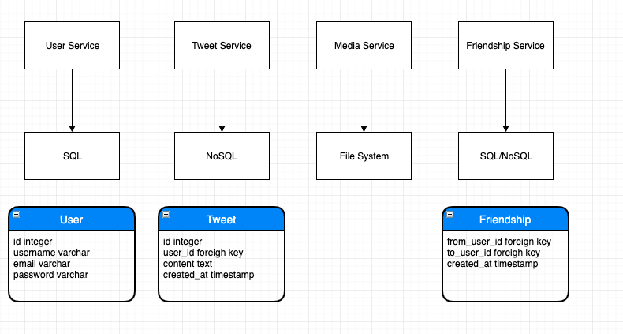
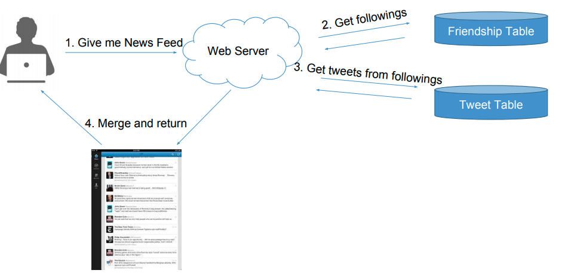
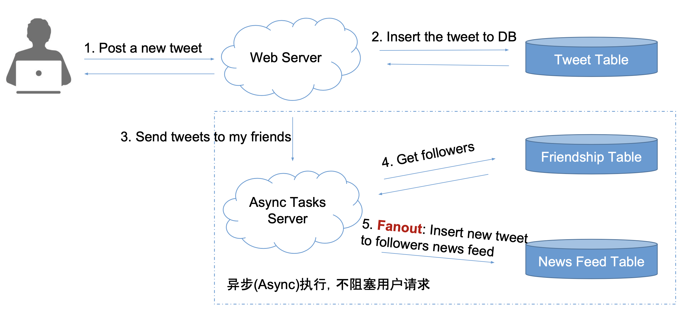

# Scenario

- Register / Login
- Post a tweet
- Timeline
- New feed
- Follow/unfollow users

# Service

# Storage

## New Feed 如何存取 - Push vs Pull

> 按时间顺序，获取所有好友的前 100 个 tweets

### Pull Model

- 方法: 获取每个好友的 100 条 tweets，然后按照时间合并出前 100 个
  - Merge K Sorted Arrays 很快，在内存进行
- 复杂度
  - 读: 若有 N 个关注对象，则时间为 N \* DB Read 时间 + Merge K Sorted Arrays
  - 写: 1 次 DB Write 时间

- 缺陷
  - N 次 DB Read 非常慢

### Push Model

- 方法
  - 为每个用户创建换一个 list 存储 new feeds 信息，也就是提前准备好
  - 用户发一个 tweet 之后，将该 tweet 逐个添加到每个 follower 的 new feeds 中 (fanout)
  - 用户查看 new feed 时，我们只需要读取准备好的数据
- 复杂度
  - 读: 1 次 DB Read
  - 写: 若有 N 个粉丝，则需要 N 次 DB Writes，但是可以再后台异步执行

- 缺陷
  - 如果一个大 V 有 1 亿人关注，那么可能有些 follower 可能很久之后才能得到更新
  - 需要添加一个新的 service 用来处理异步更新数据

### 如何选择 pull or push

- Facebook - pull
- instagram - push + pull
  - 根据粉丝数量: 粉丝多用 pull，粉丝少用 push
- Twitter - pull
- 朋友圈 - push

# Scale

## Optimize

- Pull vs Push
  - 在 Pull 中，可以 cache 读取 new feed 的数据，提高效率
  - 在 Push 中，大 V 发推，可能需要几个小时才能同步完成，此时可以增加机器数量来同步数据
  - 混合使用 pull 和 push，大 v 发推，不使用 push 模型
- 更多功能，比如 ads
- Special cases
  - 僵尸粉

## Mainenance

- Robust
  - 如果有服务器挂了怎么办
- Scalability
  - 如果流量激增，如何扩展
