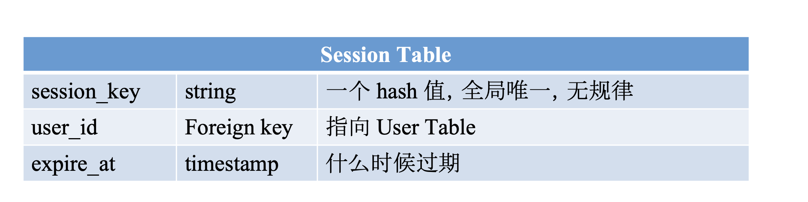

# Scenario

- 注册，登录，查询，信息修改
  - 查询需求量最大
- DAU
  - 假设 100M
- 注册，登录，修改的 QPS
  - 100M \* 0.1 / 86400 ~ 100 每天 0.1 次
  - Peak 100 \* 3 = 300
- 查询的 QPS
  - 100M \* 100 / 86400 ~ 100K 每天 100 次
  - Peak = 100K \* 3 = 300K
- 特点
  - 读多写少的系统，通常要使用 cache 进行优化

# Service

- AuthService - 登录注册
  - 如何保持登录 - session table
    - 用户 Login 以后，为他创建一个 session 对象
    - 并把 session_key 返回给浏览器，让浏览器存储起来
    - 浏览器将该值记录在浏览器的 cookie 中
    - 用户每次向服务器发送的访问，都会自动带上该网站所有的 cookie
    - 此时服务器拿到 cookie 中的 session_key，在 Session Table 中检测是否存在，是否过期
  - Session table 存在哪儿
    - 如果访问多可以存在 cache 中

- UserService - 信息存储和查询
- FriendshipService - 好友关系存储

# Storage

- User table - SQL
- Friendship 使用 NoSQL

# Scale
