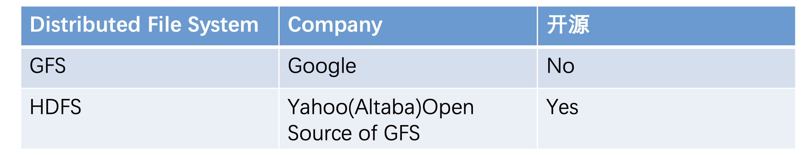
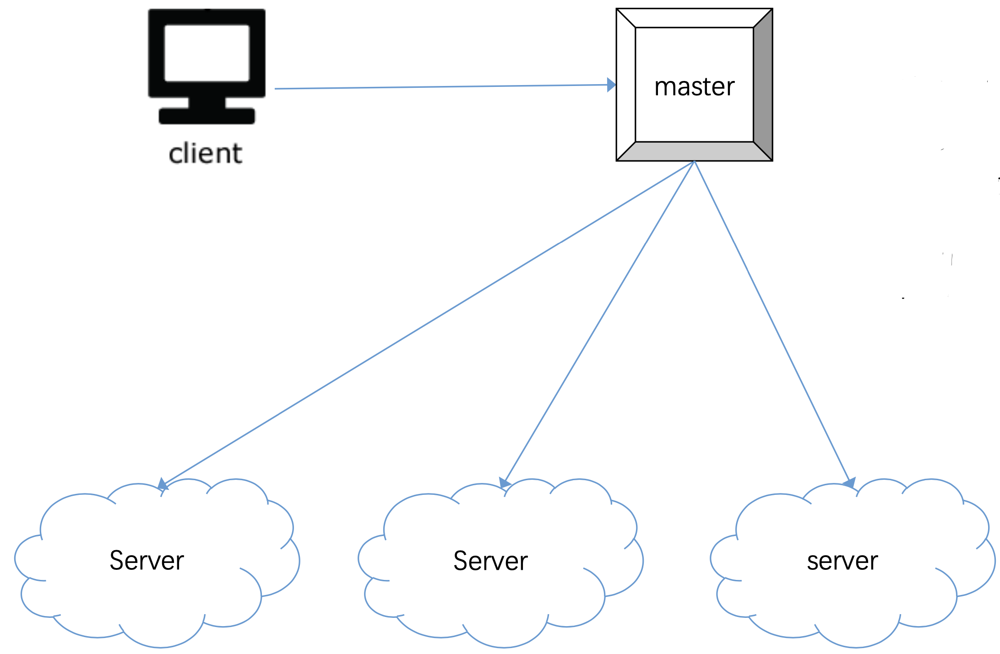
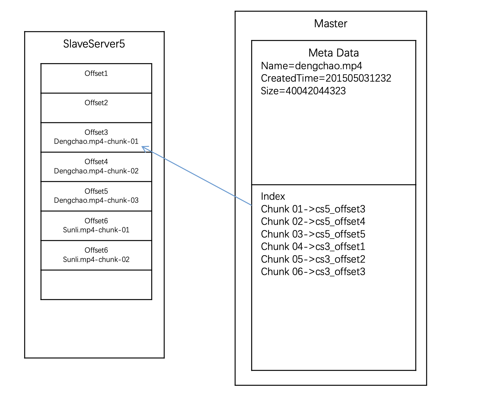
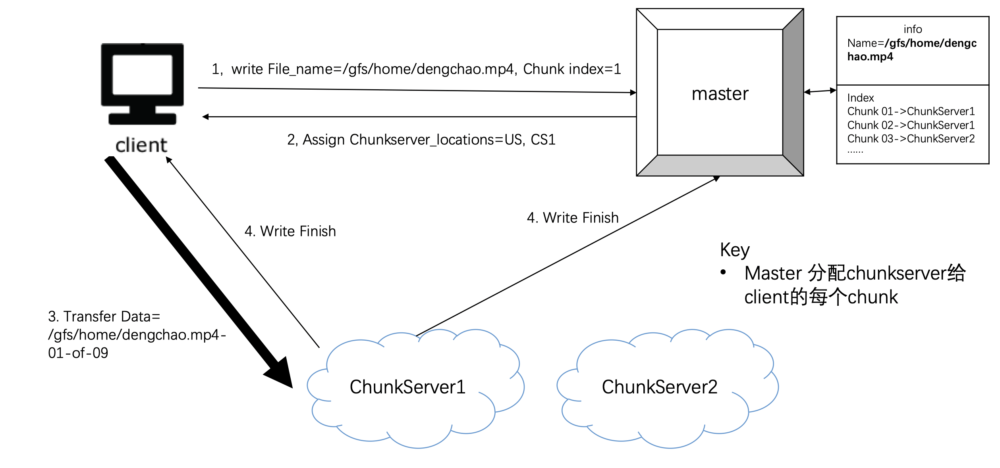
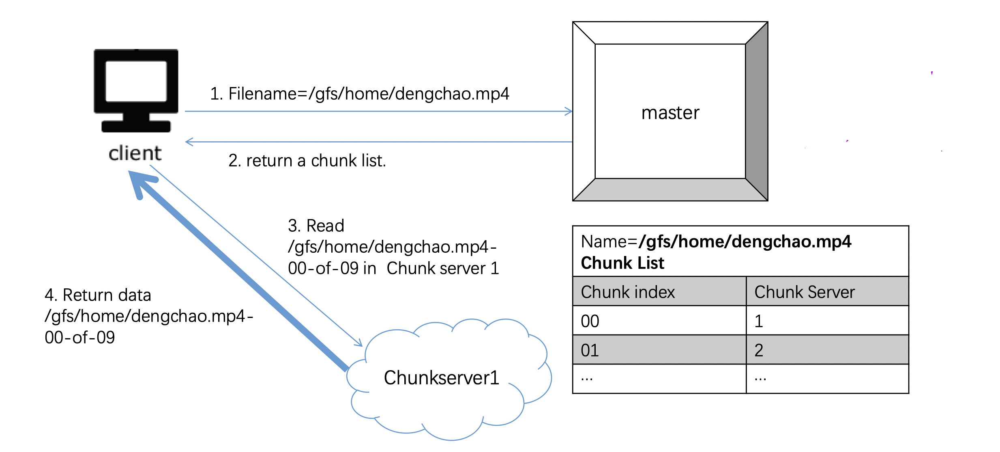

> 分布式系统: 用多台机器去解决一台机器解决不了的问题，比如存储或者 QPS

Distributed File System: Google File System, Hadoop Distributed File System

# Scenario

- 存储量越大越好
- 机器越多越好

# Service

- Client, Server

# Storage

## Master Slave

- 设计简单
- 数据库容易保持一致

## 怎么存？

- 大文件(比如 100G)分块存储

- 超巨大文件(比如 10P)使用 master slave 存

- 普通文件: meta data, block
- 大文件存储: block -> chunk
- 多台机器超大文件: chunk server + master

## 如何写入文件

> 在 client 端把文件进行拆分，然后按份传输

- master + client + chunk server 沟通流程
- master 维护 meta data 和 chunk server table

## 如何读文件

- master + client + chunk server 沟通流程

# Scale

- 单 master 通常够用, 而且架构简单
- 需要检查在 disk 上的 chunk 是否出错: 可以使用 checksum 方法
- avoid data loss: data replica 通常存三份, 其中一份存在较远的位置
- 当需要数据恢复时, 向 master 索要数据信息
- 如何知道 server 的状态: heart beat
  - 一个 master 大概管理 1000 - 2000 台机器
  - master 和 server 要每间隔几分钟进行通信, 确保对方正常运行
