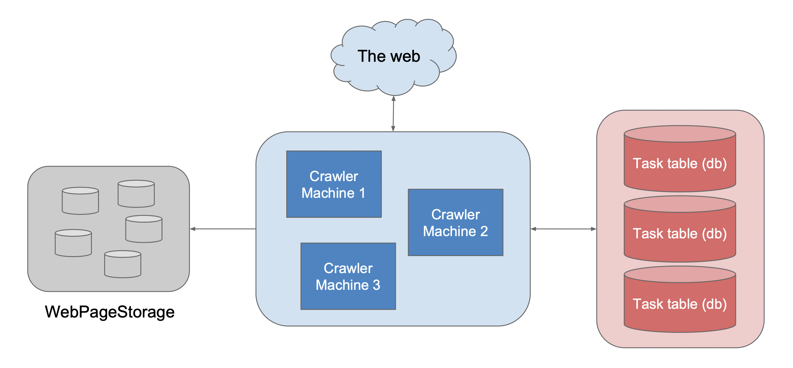
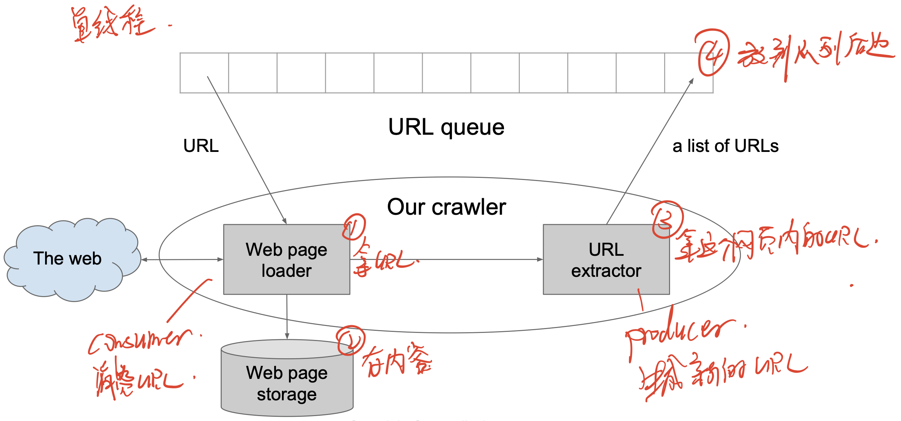
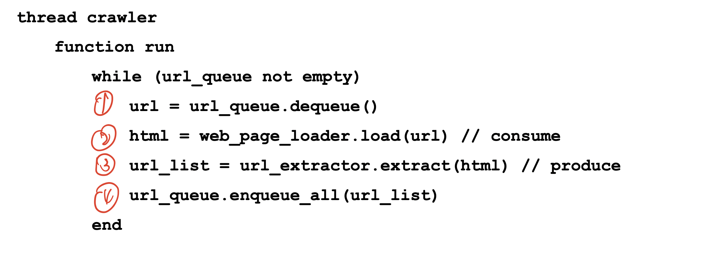
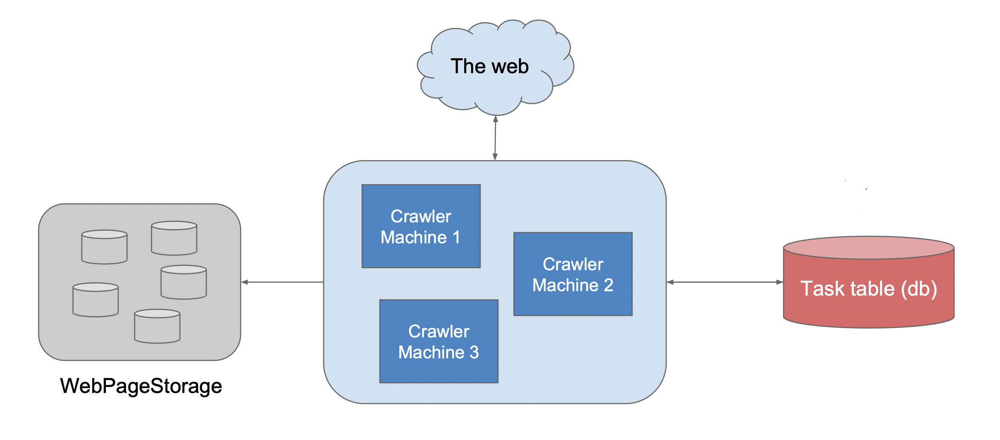
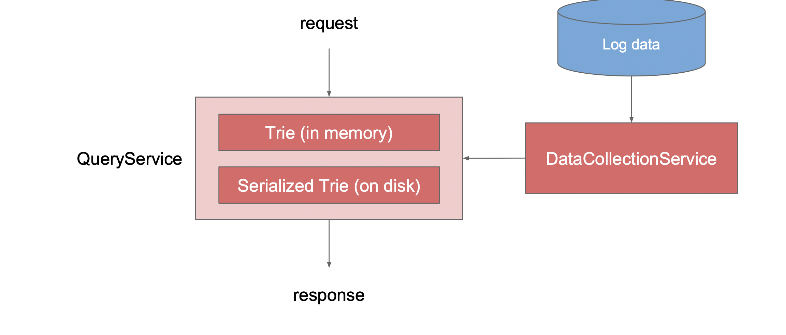
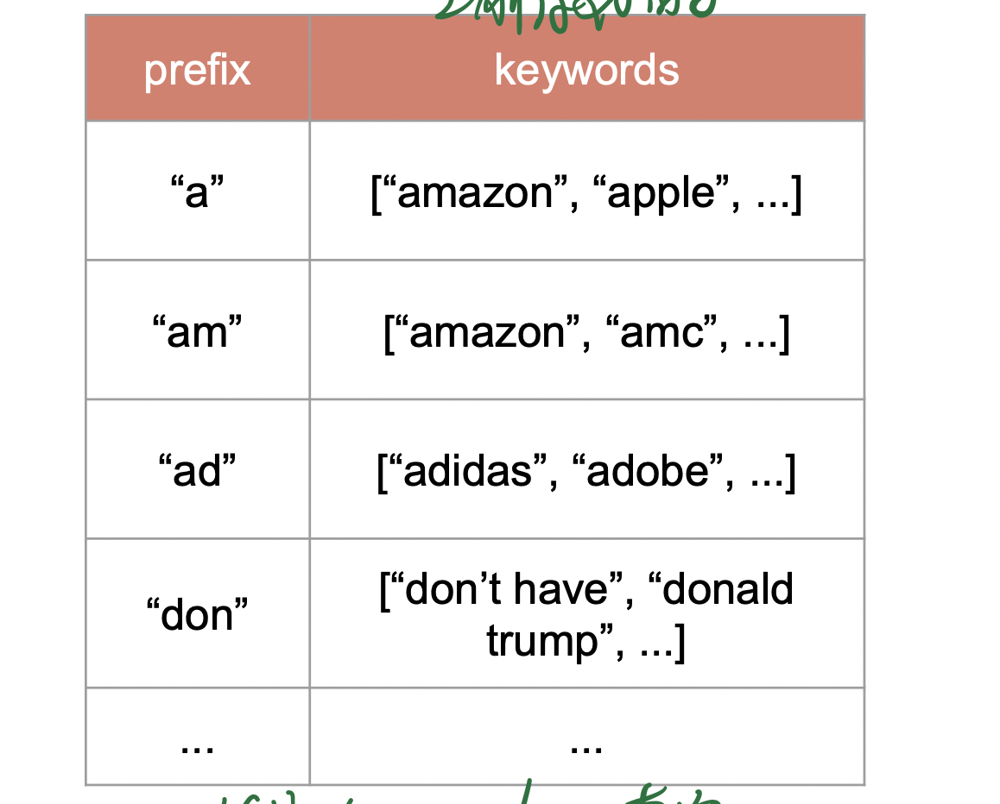
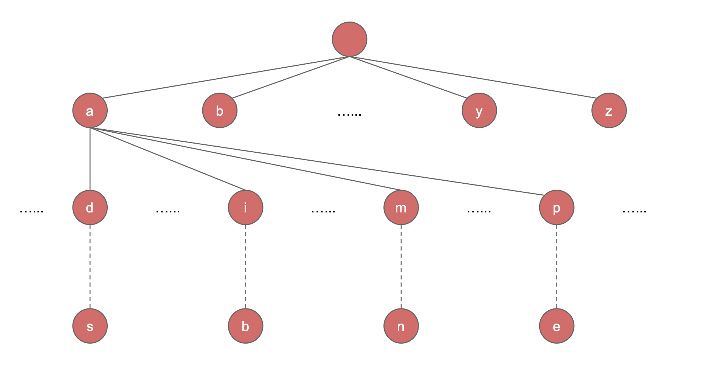

- Design a web crawler
- Design thread-safe producer and consumer
- Design a Typeahead

# Web Crawler

## Scenario

- How many webpages? How long? How large?

## Service

- Crawler, TaskService, StorageService

## Storage

- Use db to store tasks, BigTable to store web pages

## Scale

- 简单 crawler

- 单线程 crawler

- distributed crawler
  - 每个机器抓取里自己最近的地方的网站
  - 使用数据库存储每个网页的抓取状况，解决了在 queue 中 consumer 和 producer 速度不同的问题

# Typeahead

## Scenario

## Services

- QueryService
- DataCollectionService

## Storage

- 提前存好 key-value 在表中，这样可以快速查询到
- 在 query 中使用 LIKE 很费时，所以直接存取 key-value 在表中
- 在用户的每次查询中获得 raw data, 然后存到表中

- 更好的方法是用 trie

## Scale

- 降低 response time:
  - frontend: cache result
  - pre-fetch: 预加载数据, 预测用户会输入什么, 提前拿数据
