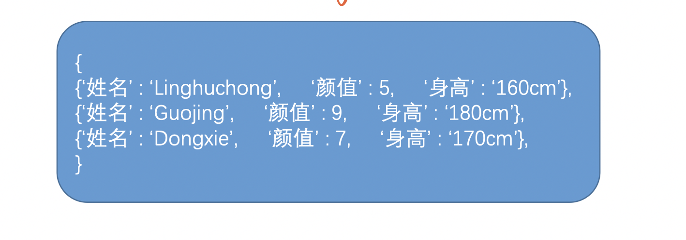

- BigTable 是 Google 的分布式 NoSQL 数据库
- 文件系统提供一些简单的读写文件的操作
- 数据库系统建立在文件系统之上, 提供更丰富的接口

# Scenario

给定条件，进行查询

# Service

# Storage

- 数据最终都会存到文件里边，以 key-value 的形式

- 因为数据太大，无法直接在内存中排序，因此需要在硬盘中进行排序: 可以通过归并排序和二分实现
- 如果要修改数据，追加一条新记录在文件的最后面，这样效率高。然后通过时间戳识别数据的新旧，选择最新的
- 为了防止机器挂掉，要写 WAL (write ahead log)
- 可以为每个内存块建立 Index, 这样查找更快
