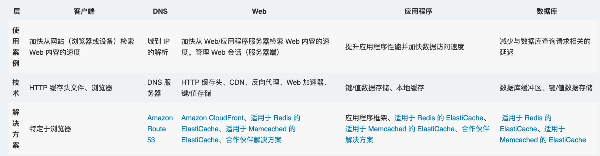

# What is Caching?

In computing, a cache is a **high-speed** data storage layer which stores **a subset of data**, typically transient in nature, so that future requests for that data are served up **faster** than is possible by accessing the data’s primary storage location. Caching allows you to efficiently reuse previously retrieved or computed data.

在计算中，缓存是一个高速数据存储层，其中存储了数据子集，且通常是短暂性存储，这样日后再次请求该数据时，速度要比访问数据的主存储位置快。通过缓存，您可以高效地重用之前检索或计算的数据。

# How does caching work?

The data in a cache is generally stored in fast access hardware such as **RAM** (Random-access memory) and may also be used in correlation with a software component. A cache's primary purpose is to **increase data retrieval performance** by reducing the need to access the underlying slower storage layer.

Trading off capacity for speed, a cache typically stores a subset of data transiently, in contrast to databases whose data is usually complete and durable.

缓存中的数据通常存储在 RAM（随机存取存储器）等快速存取硬件中，也可在软件组件相关操作中使用。缓存的主要目的是减少对底层速度较慢的存储层的访问需求，以此来提高数据检索性能。

在用容量换取速度方面，缓存通常是暂时存储数据子集，而数据库通常是完整且持久地存储数据。

# Caching Overview

RAM 和内存中引擎：因为 RAM 和内存中引擎都支持较高的请求率或 IOPS（每秒输入/输出操作数），所以缓存可以大规模提高数据检索性能并降低成本。要使传统数据库和基于磁盘的硬件达到同样的规模，还需要使用额外的资源。这些额外的资源会增加成本，而且仍然无法实现内存中的缓存提供的低延迟性能。

应用程序：在操作系统、联网层（含内容分发网络 CDN 和 DNS）、Web 应用程序和数据库等各层技术中都可以应用和利用缓存。对于包含**大量读取操作**的许多应用程序工作负载（例如问答门户网站、游戏、媒体共享和社交网络），您可以使用缓存来大幅降低延迟并提高 IOPS。**缓存的信息包括数据库查询结果、计算密集型计算、API 请求/响应和 Web 构件（例如 HTML、JavaScript 和图像文件）**。用于处理数据集的计算密集型工作负载（例如推荐引擎和高性能计算模拟）也将从充当缓存的内存中数据层获益。在这些应用程序中，必须跨计算机集群实时访问非常大的数据集，而这些集群可能涵盖数百个节点。出于底层硬件速度的原因，在基于磁盘的存储中操作这些数据是这些应用程序的一个主要瓶颈。

设计模式：在分布式计算环境中，借助专用缓存层，系统和应用程序可以通过自己的生命周期与缓存相互独立地运行，也不存在影响缓存的风险。缓存作为中心层，可以从具有自己的生命周期和架构拓扑的不同系统对其进行访问。在应用程序节点可以动态缩减和扩展的系统中，这一点尤其重要。如果缓存驻留在与使用它的应用程序或系统相同的节点上，那么扩展可能会影响缓存的完整性。此外，使用本地缓存时，它们只对使用数据的本地应用程序有利。在分布式缓存环境中，数据可以跨多个缓存服务器，并存储在一个中心位置，供所有使用者使用。

缓存最佳实践：实施缓存层时(cache layer)，务必要了解待缓存数据的有效性(validity)。**成功的缓存会产生较高的命中率 (high hit rate)**，这意味着数据在提取时已存在。如果提取的数据在缓存中不存在，则说明缓存未命中。可以使用 TTL（生存时间）等控制措施根据相应情况令数据过期。另外还要考虑该缓存环境是否需要具有高可用性，如果需要，则可以通过 Redis 等内存中引擎来实现。在某些情况下，内存中的层可以用作独立的数据存储层，而不必从主位置缓存数据。在这种情况下，您必须为驻留在内存中引擎中的数据定义适当的 RTO（恢复时间目标 – 从中断中恢复所需的时间）和 RPO（恢复点目标 – 在恢复中捕获到的最后一时间点或事务），以便确定这是否合适。可以应用不同内存中引擎的设计策略和特性来满足大多数 RTO 和 RPO 要求。

