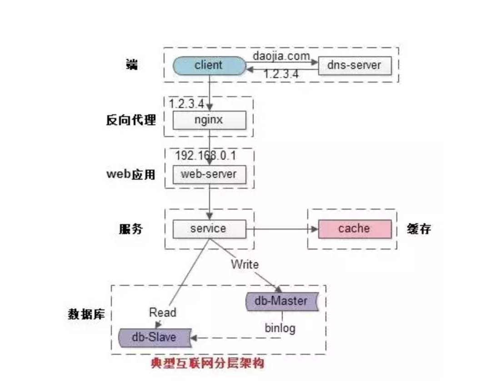
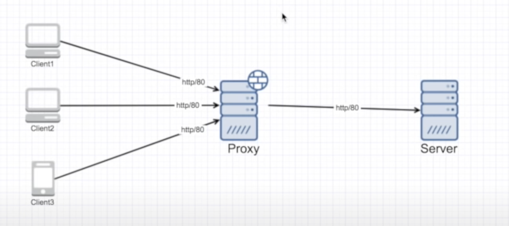
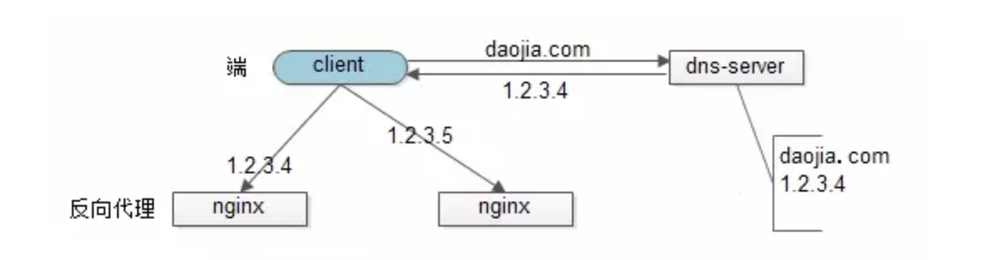
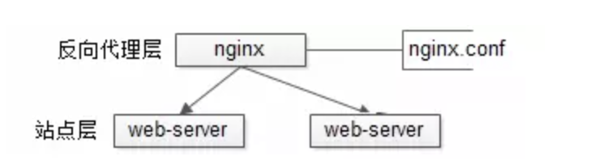
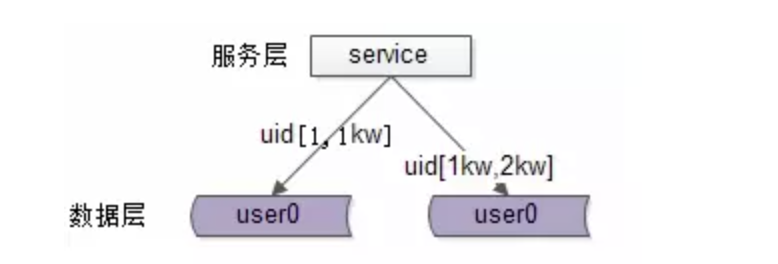
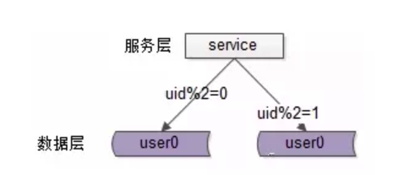

# 客户端：browser, APP

# 反向代理层(reserve proxy)：系统入口，反向代理

proxy and reserve proxy:

- 隐藏了 client 的信息, server 不知道是谁再访问
- proxy 将会对 server 进行 request
- proxy 保存了谁访问的信息，当 proxy 得到 server 的 reponse 时，把信息返回给 client
- 优点
  - Anonymity: client 可以隐藏信息
  - proxy 可以 cache server data，让下一个 client 快速得到结果，减小的 server 的压力
  - block unwanted sites: proxy 可以阻止一些 request
  - GeoFencing: 某些 client 只能访问某些 server

- client 不知道链接的是哪个 server
- reverse proxy 计算当前访问哪个 server 比较好
- 优势
  - 可以使用 load balancing 优化
  - reverse proxy 可以 cache Server data，让下一个 client 快速得到结果，减小的 server 的压力
  - isolating internal traffic
  - logging 可以在 reverse proxy 检测 server 的状况
  - canary deployment

反向代理的水平扩展

反向代理层的水平扩展，是通过 DNS 轮询实现的：dns-server 对于一个域名配置了多个解析 ip，每次 DNS 解析请求来访问 dns-server，会轮询返回这些 ip

当 web 后端成为瓶颈的时候，只要增加服务器数量，新增 web 服务的部署，在 nginx 配置中配置上新的 web 后端，就能扩展站点层的性能，做到理论上的无限高并发

# web 应用层：实现核心应用逻辑，返回 html 或者 json

扩展

站点层的水平扩展，是通过“nginx”实现的。通过修改 nginx.conf，可以设置多个 web 后端

# 服务层：如果实现了服务化，就有这一层

服务层的水平扩展，是通过“服务连接池”实现的。

web 应用层通过 RPC-client 调用下游的服务层 RPC-server 时，RPC-client 中的连接池会建立与下游服务多个连接，当服务成为瓶颈的时候，只要增加服务器数量，新增服务部署，在 RPC-client 处建立新的下游服务连接，就能扩展服务层性能，做到理论上的无限高并发

# 数据-缓存层：缓存加速访问存储

# 数据-数据库层：数据库固化数据存储

在数据量很大的情况下，数据层（缓存，数据库）涉及数据的水平扩展，将原本存储在一台服务器上的数据（缓存，数据库）水平拆分到不同服务器上去，以达到扩充系统性能的目的

互联网数据层常见的水平拆分方式有这么几种，以数据库为例

## 按照范围水平拆分

每一个数据服务，存储一定范围的数据，上图为例：

user0 库，存储 uid 范围 1-1kw

user1 库，存储 uid 范围 1kw-2kw

这个方案的好处是：

（1）规则简单，service 只需判断一下 uid 范围就能路由到对应的存储服务；

（2）数据均衡性较好；

（3）比较容易扩展，可以随时加一个 uid[2kw,3kw]的数据服务；

不足是：

（1）请求的负载不一定均衡，一般来说，新注册的用户会比老用户更活跃，大 range 的服务请求压力会更大

## 按照哈希水平拆分

每一个数据库，存储某个 key 值 hash 后的部分数据，上图为例：

user0 库，存储偶数 uid 数据

user1 库，存储奇数 uid 数据

这个方案的好处是：

（1）规则简单，service 只需对 uid 进行 hash 能路由到对应的存储服务；

（2）数据均衡性较好；

（3）请求均匀性较好；

不足是：

（1）不容易扩展，扩展一个数据服务，hash 方法改变时候，可能需要进行数据迁移

# 小结

高并发（High Concurrency）是互联网分布式系统架构设计中必须考虑的因素之一，它通常是指，通过设计保证系统能够同时并行处理很多请求

提高系统并发能力的方式，方法论上主要有两种：垂直扩展（Scale Up）与水平扩展（Scale Out）。前者垂直扩展可以通过提升单机硬件性能，或者提升单机架构性能，来提高并发性，但单机性能总是有极限的，互联网分布式架构设计高并发终极解决方案还是后者：水平扩展。

各层实施水平扩展后，能够通过增加服务器数量的方式来提升系统的性能，做到理论上的性能无限。
