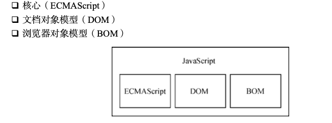

什么是 JS

# 历史

- 1995 年, JS 问世, 主要左右是在客户端进行输入验证
- 1997 年, JS 1.1 提交给欧洲计算机制造商协会(Ecma), 开始进行标准化
- 1998 年, 各种浏览器以 ECMAScript(语言标准) 作为 JS 实现的依据, 但是具体实现各有不同(也就是说 JS 实现了 ECMAScript)

# JS 实现

- 完整的 JS 包括
  
- Web 浏览器和 Node.js 只是 ECMAScript 实现的宿主环境(host environment)

1. ECMAScript: 定义并提供核心功能
2. DOM: 提供与网页内容交互的方法和接口
3. BOM: 浏览器对象模型, 提供与浏览器交互的方法和接口
   - 使用 BOM 可以操控浏览器显示页面之外的部分
   - BOM 主要针对浏览器窗口和子窗口(frame), 例如弹出新浏览器窗口的能力
