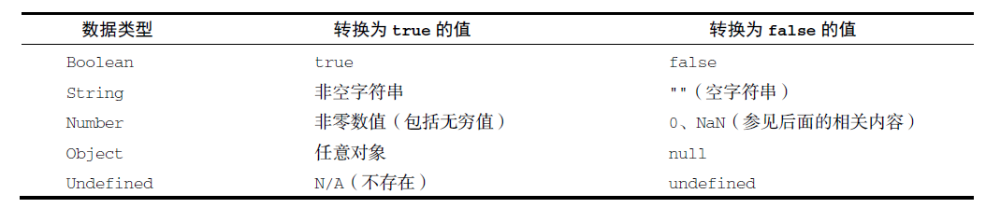
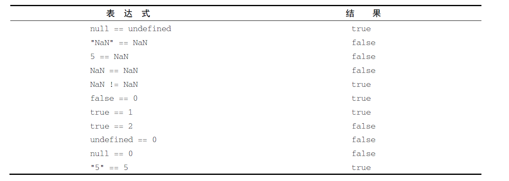

语言基础

# 语法

- ECMAScript 的语法很大程度上借鉴了 C 语言和其他类 C 语言，如 Java 和 Perl
- 标识符
  - 第一个字符必须是一个字母、下划线(\_)或美元符号($)
- 严格模式: "use strict";

# 变量

- var: 函数作用域
  - 声明提升(hoist)

```javascript
function foo() {
  console.log(age);
  var age = 26;
}
foo(); // undefined, 但是不会报错，因为JS运行时会自动提前声明age
```

- let: 块作用域, 不会被提升(hoist), 不可以重复声明

```javascript
if (true) {
  var name = "Matt";
  console.log(name); // Matt
}
console.log(name); // Matt

// 块作用域
if (true) {
  let age = 26;
  console.log(age);
}
console.log(age);
// 26
// ReferenceError: age 没有定义

var name;
var name;
// 不能重复声明
let age;
let age; //SyntaxError;标识符age已经声明过了
```

- const: 声明变量时必须同时初始化变量，并且之后不能更改，块作用域

```javascript
for (const i = 0; i < 10; ++i) {} // TypeError:给常量赋值

// 可以在for中用const表示不会变的变量
let i = 0;
for (const j = 7; i < 5; ++i) {
  console.log(j);
}
// 7, 7, 7, 7, 7
for (const key in { a: 1, b: 2 }) {
  console.log(key);
}
// a, b
for (const value of [1, 2, 3, 4, 5]) {
  console.log(value);
}
// 1, 2, 3, 4, 5
```

# 数据类型

- 基本数据类型包括 Undefined、Null、Boolean、Number、String 和 Symbol
- 复杂数据类型 Object
- 可以使用 typeof 得到数据类型
- typeof null -> object 因为 null 是空对象

## undefined

- 一个假值
- **不要**显式的使用，比如`let x = undefined;`

```javascript
let message = undefined;
console.log(message == undefined); // true
```

## null

- 一个假值
- null 值表示一个空对象指针，这也是给 typeof 传一个 null 会返 object 的原因
- 可以显式的使用，例如`let x = null;`

```javascript
let car = null;
console.log(typeof car); // "object"

console.log(null == undefined); // true
```

## boolean

- 所有其他 ECMAScript 类型的值都有相应布尔值的等价形式, 可以调用特定的 Boolean()转型函数

```javascript
let message = "Hello world!";
let messageAsBoolean = Boolean(message);
```



## number

- 表示整数和浮点值
- 浮点值的精确度最高可达 17 位小数，但在算术计算中远不如整数精确。例如，0.1 加 0.2 得到的不是 0.3，而是 0.300 000 000 000 000 04

```javascript
// 别这么干！
if (a + b == 0.3) {
  console.log("You got 0.3.");
}
```

- Number.MIN_VALUE, Number.MAX_VALUE
- 任何无法表示的负数以-Infinity 表示，任何无法表示的正数以 Infinity 表示，可以使用 isFinite()判断
- NaN: not a number

```javascript
console.log(0 / 0); // NaN
console.log(-0 / +0); // NaN

console.log(5 / NaN); // NaN, 任何涉及NaN 的操作始终返回NaN

console.log(NaN == NaN); // false

console.log(isNaN(NaN)); // true
console.log(isNaN(10)); // false，10 是数值
console.log(isNaN("10")); // false，可以转换为数值10
console.log(isNaN("blue")); // true，不可以转换为数值
console.log(isNaN(true)); // false，可以转换为数值1

console.log(5 / 0); // Infinity
console.log(5 / -0); // -Infinity
```

- 数值转换
  - Number()用于任何数据类型
  - parseInt()主要用于字符串
  - parseFloat()主要用于字符串

```javascript
Number(true); // 1
Number("Hello world!"); // NaN
Number(undefined); // NaN
Number(null); // 0

Number(""); // 0
Number("000011"); // 11
Number("    1"); // 1
Number("1234blue"); // NaN
```

```javascript
parseInt(true); // NaN
parseInt("Hello world!"); // NaN
parseInt(undefined); // NaN
parseInt(null); // NaN

parseInt(""); // NaN
parseInt("000011"); // 11
parseInt("    1"); // 1
parseInt("1234blue"); // 1234

parseInt("0xA"); // 10，解释为十六进制整数
parseInt(22.5); // 22
parseInt("70"); // 70，解释为十进制值
parseInt("0xf"); // 15，解释为十六进制整数
parseInt("10", 2); // 2，按二进制解析
```

```javascript
parseFloat(true); // NaN
parseFloat("Hello world!"); // NaN
parseFloat(undefined); // NaN
parseFloat(null); // NaN

parseFloat(""); // NaN
parseFloat("000011"); // 11
parseFloat("    1"); // 1
parseFloat("1234blue"); // 1234
parseFloat("1234.45blue"); // 1234.45

parseFloat("0xA"); // 0
parseFloat("22.5"); // 22.5
parseFloat("22.34.5"); // 22.34
parseFloat("0908.5"); // 908.5
parseFloat("3.125e7"); // 31250000析
```

## string

- 数值、布尔值、对象和字符串都有 toString(), null 和 undefined 没有 toString()方法
- 在数值使用 toString()时，可以接受第二个参数表示基数

```javascript
let num = 10;
console.log(num.toString()); // "10"
console.log(num.toString(2)); // "1010"
console.log(num.toString(8)); // "12"
console.log(num.toString(10)); // "10"
console.log(num.toString(16)); // "a"
```

- 如果不确定是不是 null 或者 undefined，可以使用 String()

```javascript
let value1 = 10;
let value2 = true;
let value3 = null;
let value4;
console.log(String(value1)); // "10"
console.log(String(value2)); // "true"
console.log(String(value3)); // "null"
console.log(String(value4)); // "undefined"
```

- 模板

模板字面量保留换行字符，可以跨行定义字符串

```javascript
let myMultiLineTemplateLiteral = `first line
second line`;
```

- 标签函数(tag function) - 标签可以用函数解析模板字符串

> A tag function is the function name followed by a template literal.

```javascript
// use case 1
let a = 6;
let b = 9;
function simpleTag(strings, ...expressions) {
  console.log(strings);
  for (const expression of expressions) {
    console.log(expression);
  }
  return "foobar";
}
let taggedResult = simpleTag`${a} + ${b} = ${a + b}`;
// ["", " + ", " = ", ""]
// 6
// 9
// 15
console.log(taggedResult); // "foobar"

// use case 2
let a = 6;
let b = 9;
function zipTag(strings, ...expressions) {
  return (
    strings[0] + expressions.map((e, i) => `${e}${strings[i + 1]}`).join("")
  );
}
let untaggedResult = `${a} + ${b} = ${a + b}`;
let taggedResult = zipTag`${a} + ${b} = ${a + b}`;
console.log(untaggedResult); // "6 + 9 = 15"
console.log(taggedResult); // "6 + 9 = 15""

// use case 3
const people = [
  { name: "Alfred", age: 47 },
  { name: "George", age: 27 },
  { name: "Regina", age: 31 },
  { name: "Trisha", age: 30 },
];
function greet(arr, n, a) {
  console.log(arr[0] + n + arr[1] + a + arr[2]);
}
people.forEach((p) => {
  greet`Woah, ${p.name} is ${p.age}?`;
});
// Woah, Alfred is 47?
// Woah, George is 27?
// Woah, Regina is 31?
// Woah, Trisha is 30?
```

## Symbol

符号是原始值，且符号实例是唯一、不可变的。符号确保对象属性使用唯一标识符，不会发生属性冲突

```javascript
let sym = Symbol();
console.log(typeof sym); // symbol

// 可以传入一个description，但是并不会让两个Symbol相等
let fooSymbol = Symbol("foo");
let otherFooSymbol = Symbol("foo");
console.log(fooSymbol == otherFooSymbol);

// 全局注册和重用符号: 使用for创建全局符号，需要传入一个string
let fooGlobalSymbol = Symbol.for("foo"); // 创建新符号并注册到全局
let otherFooGlobalSymbol = Symbol.for("foo"); // 重用已有符号
console.log(fooGlobalSymbol === otherFooGlobalSymbol); // true

// 查询全局注册
let s = Symbol.for("foo");
console.log(Symbol.keyFor(s)); // foo

// 但是使用for创建的符号和使用Symbol创建的符号并不相同
let localSymbol = Symbol("foo");
let globalSymbol = Symbol.for("foo");
console.log(localSymbol === globalSymbol); // false
```

凡是可以使用字符串或数值作为属性的地方，都可以使用符号

```javascript
let s1 = Symbol("foo"),
  s2 = Symbol("bar"),
  s3 = Symbol("baz"),
  s4 = Symbol("qux");
let o = {
  [s1]: "foo val",
};
// 这样也可以：o[s1] = 'foo val';
console.log(o);
// {Symbol(foo): foo val}
```

## object

每个 Object 实例都有如下属性和方法。

- constructor
- hasOwnProperty(propertyName)：用于判断当前对象实例（不是原型）上是否存在给定的属性
- isPrototypeOf(object)：用于判断当前对象是否为另一个对象的原型
- propertyIsEnumerable(propertyName)：用于判断给定的属性是否可以使用 for-in 语句枚举。
- toLocaleString()：返回对象的字符串表示, 该字符串反映对象所在的本地化执行环境
- toString()：返回对象的字符串表示
- valueOf()：返回对象对应的字符串、数值或布尔值表示, 通常与 toString()的返回值相同。

# 操作符

如果将一元加应用到非数值，则会执行与使用 Number()转型函数一样的类型转换

```javascript
let s1 = "01";
let s2 = "1.1";
let s3 = "z";
let b = false;
let f = 1.1;
let o = {
  valueOf() {
    return -1;
  },
};
s1 = +s1; // 值变成数值1
s2 = +s2; // 值变成数值1.1
s3 = +s3; // 值变成NaN
b = +b; // 值变成数值0
f = +f; // 不变，还是1.1
o = +o; // 值变成数值-1
```

```javascript
console.log(!false); // true
console.log(!"blue"); // false
console.log(!0); // true
console.log(!NaN); // true
console.log(!""); // true
console.log(!12345); // false

// 同时使用两个叹号（!!），相当于调用了转型函数Boolean()
console.log(!!"blue"); // true
console.log(!!0); // false
console.log(!!NaN); // false
console.log(!!""); // false
console.log(!!12345); // true
```



# 语句

for-in 用于枚举对象中的非符号键属性

```javascript
for (const propName in window) {
  document.write(propName);
}
```

for-of 用于遍历可迭代对象的元素

```javascript
for (const el of [2, 4, 6, 8]) {
  document.write(el);
}
```

标签语句

```javascript
let num = 0;
outermost: for (let i = 0; i < 10; i++) {
  for (let j = 0; j < 10; j++) {
    if (i == 5 && j == 5) {
      break outermost;
    }
    num++;
  }
}
console.log(num); // 55

let num = 0;
outermost: for (let i = 0; i < 10; i++) {
  for (let j = 0; j < 10; j++) {
    if (i == 5 && j == 5) {
      continue outermost;
    }
    num++;
  }
}
console.log(num); // 95
```

# 函数

最佳实践是函数要么返回值，要么不返回值。只在某个条件下返回值的函数会带来麻烦，尤其是调试时

- 函数不能以 eval 或 arguments 作为名称；
- 函数的参数不能叫 eval 或 arguments；
- 两个命名参数不能拥有同一个名称。
