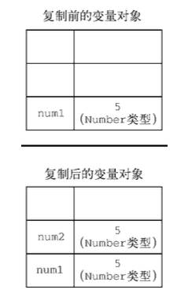
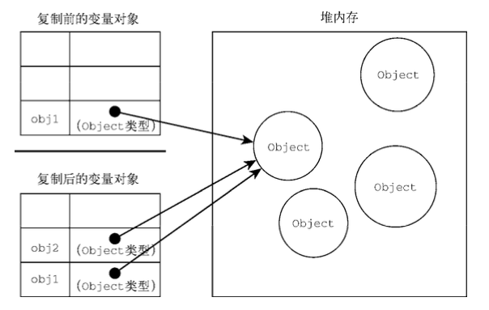

变量，作用域和内存

# 原始值和引用值

ECMAScript 变量可以包含两种不同类型的数据: 原始值和引用值。

- 原始值(primitive value)就是最简单的数据：Undefined、Null、Boolean、Number、String 和 Symbol
- 引用值(reference value)则是由多个值构成的对象，引用值是保存在内存中的对象

## 复制值

```javascript
let num1 = 5;
let num2 = num1;

let obj1 = new Object();
let obj2 = obj1;
obj1.name = "Nicholas";
console.log(obj2.name); // "Nicholas"
```

原始值赋值 到另一个变量时，原始值会被复制到新变量的位置



引用值从一个变量赋给另一个变量时，复制的是一个指针，指向同一个对象



## 传递参数

ECMAScript 中所有函数的参数都是按值传递的

```javascript
// 按值传递
function addTen(num) {
  num += 10;
  return num;
}
let count = 20;

let result = addTen(count);
console.log(count); // 20，没有变化
console.log(result); // 30

// 依然是按值传递
function setName(obj) {
  obj.name = "Nicholas"; // 按值传递，保存到obj中
  obj = new Object(); // 在函数中被销毁，不会影响外部传入的obj
  obj.name = "Greg";
}
let person = new Object();
setName(person);
console.log(person.name); // "Nicholas"
// 当 obj 在函数内部被重写时，它变成了一个指向本地对象的指针。而那个本地对象在函数执行结束时就被销毁了
```

## 确定类型

```javascript
console.log(personinstanceofObject); //变量person是Object吗?
console.log(colors instanceof Array); // 变量 colors 是 Array 吗?
console.log(pattern instanceof RegExp); // 变量 pattern 是 RegExp 吗?
```

# 执行上下文与作用域
