# Design a notification system

> Three types of notifications:

- Mobile push notification
- SMS message
- Email

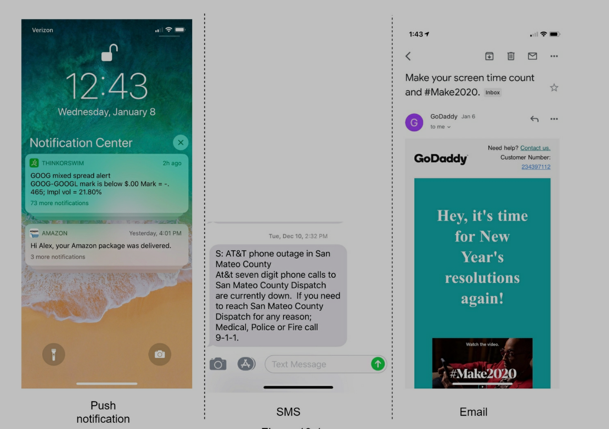

# Step 1: Understand the problem and establish design scope

## Problems and answers

- Candidate: What types of notifications does the system support?
- Interviewer: Push notification, SMS message, and email.
- Candidate: Is it a real-time system?
- Interviewer: Let us say it is a soft real-time system. We want a user to receive notifications as soon as possible. However, if the system is under a high workload, a slight delay is acceptable.
- Candidate: What are the supported devices?
- Interviewer: iOS devices, android devices, and laptop/desktop.
- Candidate: What triggers notifications?
- Interviewer: Notifications can be triggered by client applications. They can also be scheduled on the server-side.
- Candidate: Will users be able to opt-out?
- Interviewer: Yes, users who choose to opt-out will no longer receive notifications.
- Candidate: How many notifications are sent out each day?
- Interviewer: 10 million mobile push notifications, 1 million SMS messages, and 5 million emails.

# Step 2: Propose high-level design and get buy-in

- Different types if notifications
- Contact info gathering flow
- Notification sending/receiving flow

## 2.1 Different types of notifications

### 2.1.1 IOS push notification

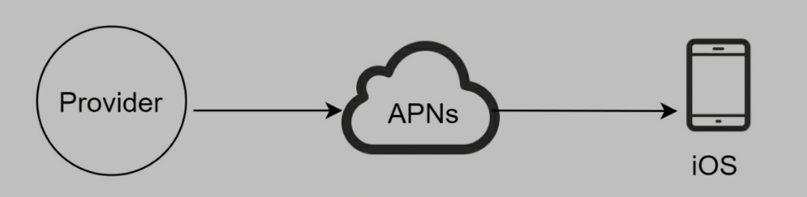

- Provider
  - build, send notification request to Apple Push Notification Service (APNS)
  - Sending
    - Device token: unique ID for sending push notifications
    - Payload: push title, content....
- APNS
  - Apple service to push notification to IOS devices
- IOS
  - End client to receive notifications

### 2.1.2 Android push notification

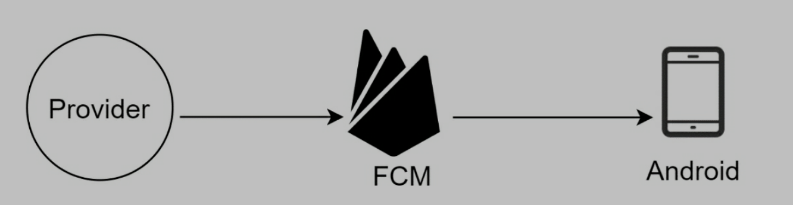

- Similar to IOS, but use FCM

### 2.1.3 SMS message

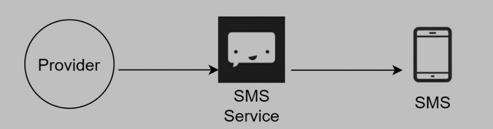

> SMS messages typically use third-party services,like Twilio, Nexmo...

### 2.1.4 Email

> Third-party email services, like sendgrid, Mailchimp... providing with delivery rate and data analytics

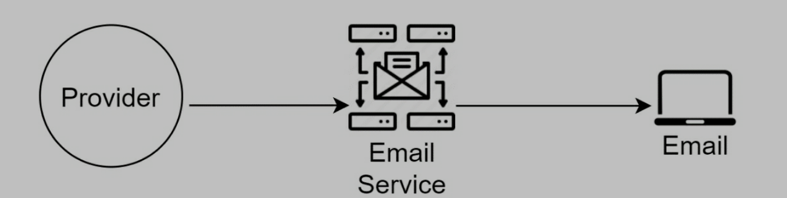

> Design including all third-party service

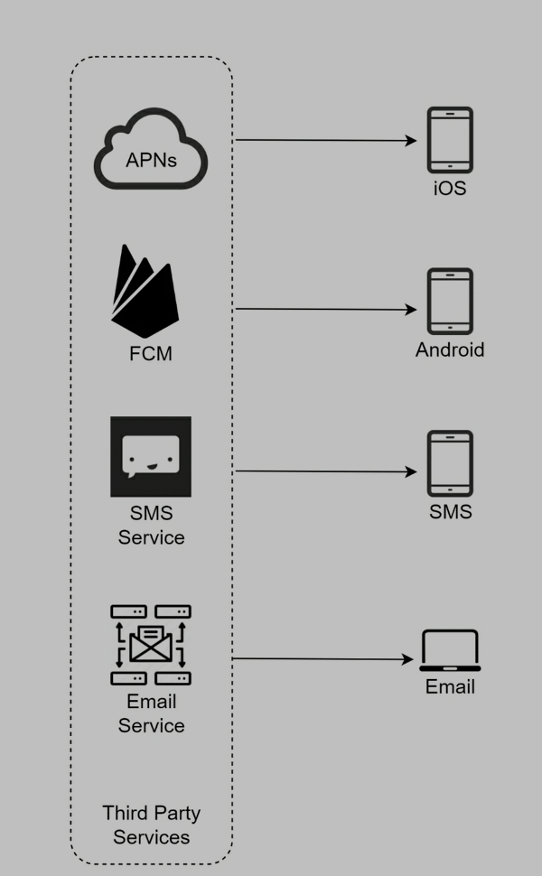

## 2.2 Contact info gathering flow

- We need to collect mobile device tokens, phone number, email address...
- When user register app, API servers save info to db

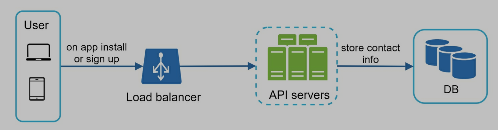

> db tables

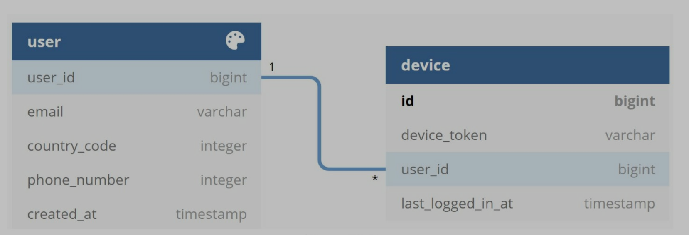

## 2.3 Notification sending/receiving flow

### 2.3.1 High-level design - v1

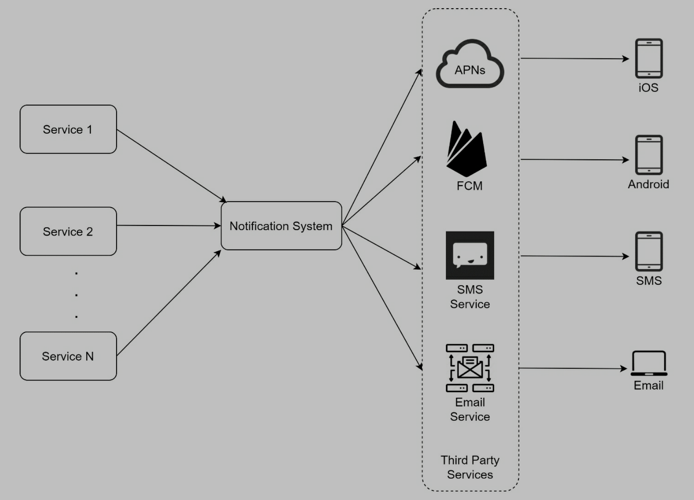

- Service 1 to N
  - Service can be microservice, cron job, distributed system...
- Notification system
  - Provides API for service 1 to N
  - Build notification payload for third-party services
- Third-party services
  - Deliver notification to users
  - Extensibility
  - Third-party service might be unavailable in some regions
- IOS, Android, SMS, Email
  - Users receive notification on devices

### 2.3.2 Problems

- Single point of failure
- Hard to scale
- Performance bottleneck

### 2.3.3 High-level design - v2

- Move db and cache out of the notification server
- Add more servers and set up automatic horizontal scaling
- Introduce message queue to decouple the system components

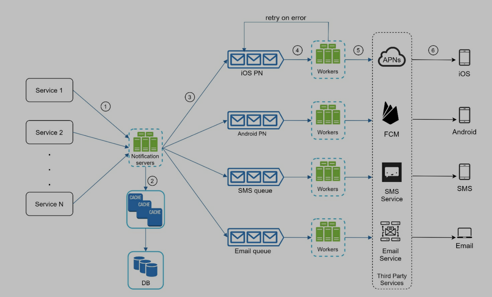

- Service 1 to N: different services send notifications via APIs provided by notification servers
- Notification servers
  - Provide APIs for services to send notifications
  - Basic validations for emails, phone numbers...
  - Query db or cache to get needed data to render a notification
  - Put notification data to message queues for parallel processing
- Cache
  - User info
  - Device info
  - Notification templates
- DB
  - Stores data about users, notification, settings...
- Message queue
  - Remove dependencies between components
  - Server as buffers when high volumes of notifications
  - Each type of notification is assigned to a distinct message queue
- Workers
  - Pull notification events from message queues
  - Send message to third-party services
- Third-party service
- IOS, Android, SMS, Email

### 2.3.4 API Examples

POST https://api.example.com/v/sms/send

request body

```json
{
  "to": [
    {
      "user_id": 123456
    }
  ],
  "from": {
    "email": "from_address@example.com"
  },
  "subject": "hello world",
  "content": {
    "type": "text/plain",
    "value": "hello world"
  }
}
```

> Workflow

- A service call APIs provided by notification servers
- Notification servers fetch metadata, like user info, device token, and notification setting from cache or db
- Notification event is sent to corresponding queue for processing
- Workers pull notification events from message queues
- Workers send notifications to third-party services
- Third-party service send notifications to user devices

# Step 3: Design deep dive

## 3.1 Reliability

### 3.1.1 How to prevent data loss?

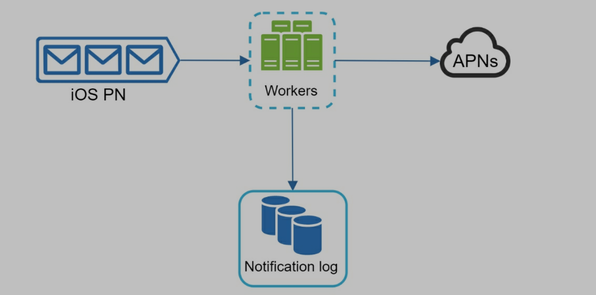

- Save notification data in db
- Implement retry mechanism
- Notification log database for data persistence

### 3.1.2 Will recipients receive a notification exactly once?

> We should avoid duplicate notifications

- When receive a notification event, first check event ID
- If event ID is existing, drop current event
- If event ID is not existing, move forward

## 3.2 Additional components and consideration

- Notification template
  - A lof of notifications are similar, so we need templates
  - Efficiency
  - Fault tolerance
  - Save time
- Notification setting
  - Save user's notification setting in table
  - If some users don't want to receive notifications, we save it to db, and check it before sending
- Rate limiting
  - Limit the number of notifications a user can receive
  - Users probably turn off notifications if they receive too many
- Retry mechanism
  - When third-party cannot send notification, we should put notification to queue and retry
  - If retry does not work, we should send alert to developers
- Security in push notification
  - IOS and Android have their own security methods, like only authenticated clients can send notification
- Monitor queued notification
  - Total number of queued notifications
  - If too many jobs, we should add more workers 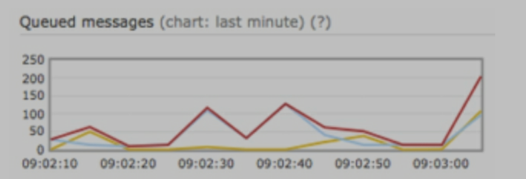
- Events tracking
  - Open rate
  - Click rate
  - Engagement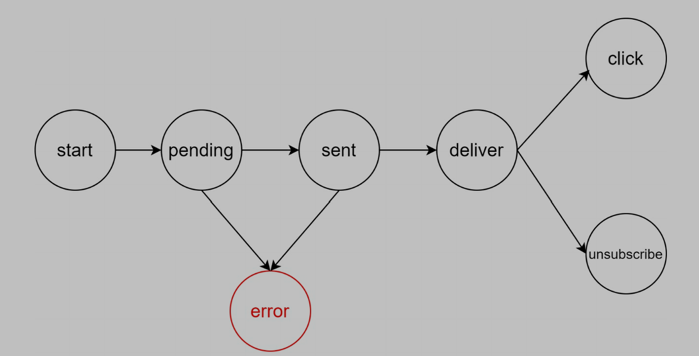

## 3.3 Update design

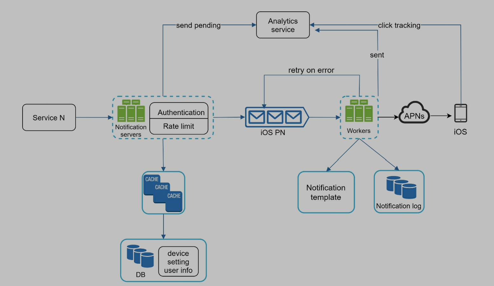

- Notification servers
  - Authentication
  - Rate limit
- Add retry mechanism to handle notification failures
- Notification template
- Monitoring and tracking systems

# Step 4: wrap up

- Reliability: retry mechanism to minimize failure rate
- Security: third-party server verify clients to send notification
- Tracking and monitoring
- User setting: don't send notifications if user opt-out
- Rate limiting: don't send notifications to a user too frequently
