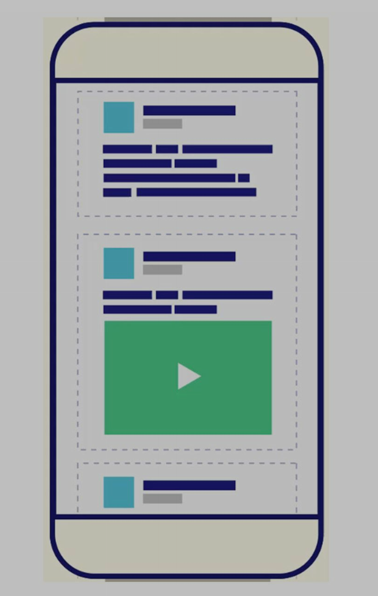
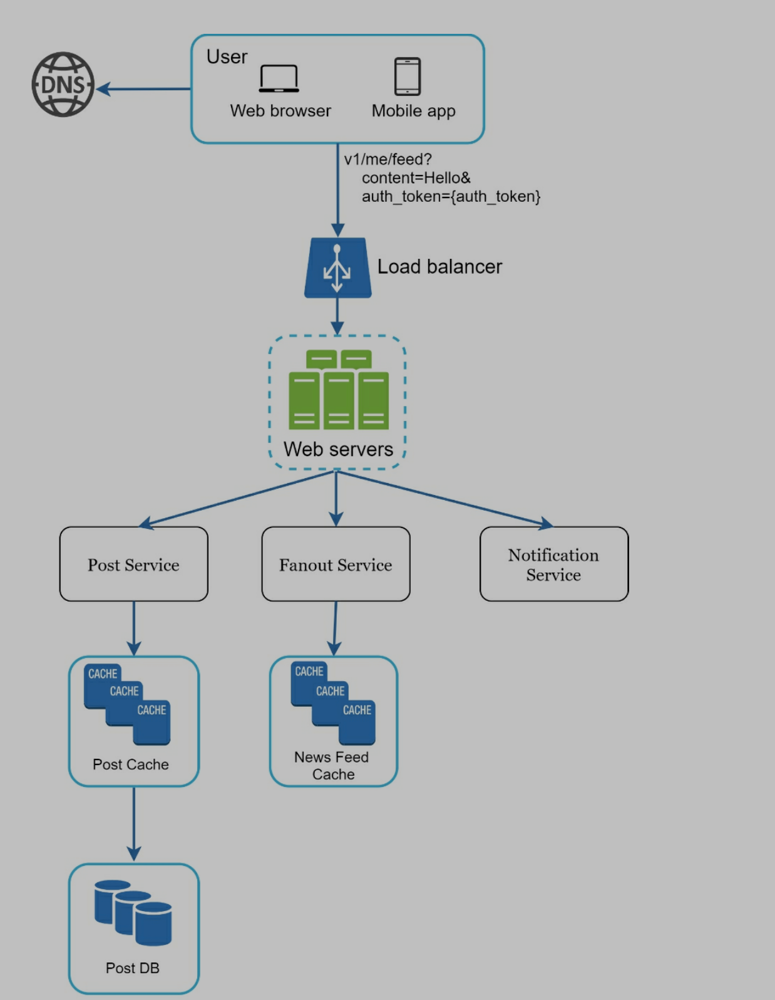
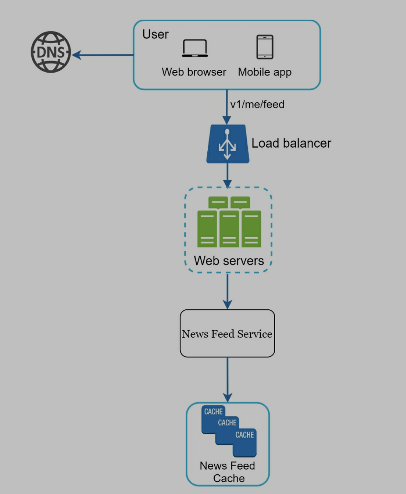
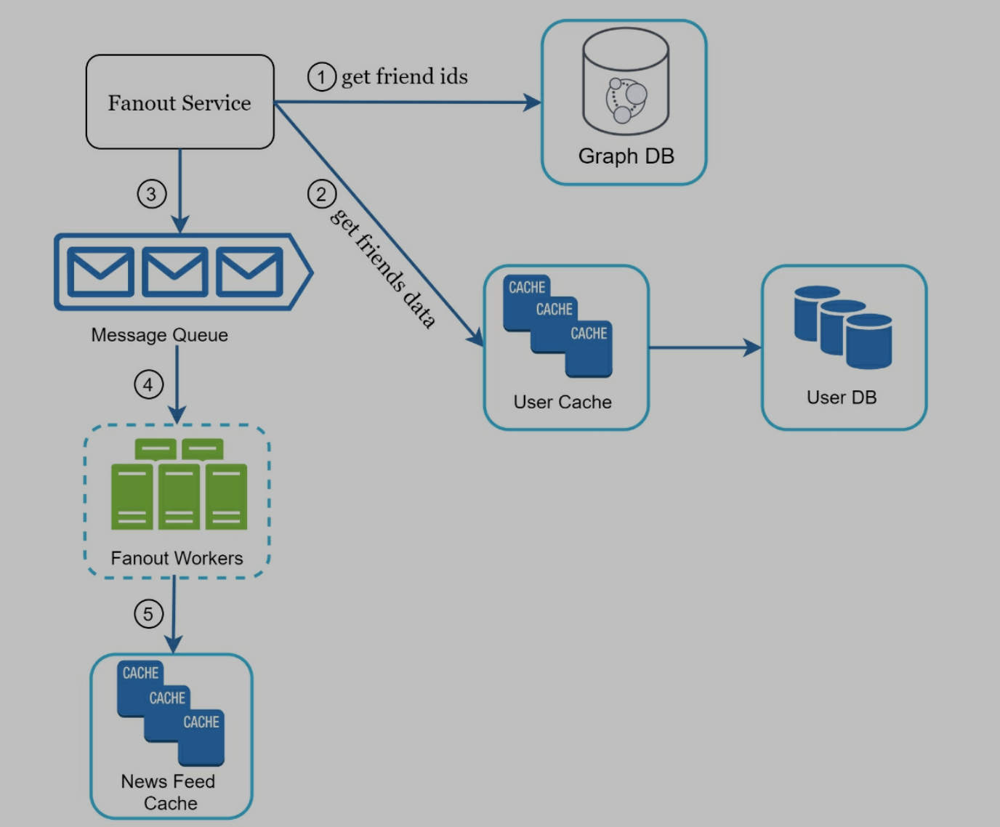
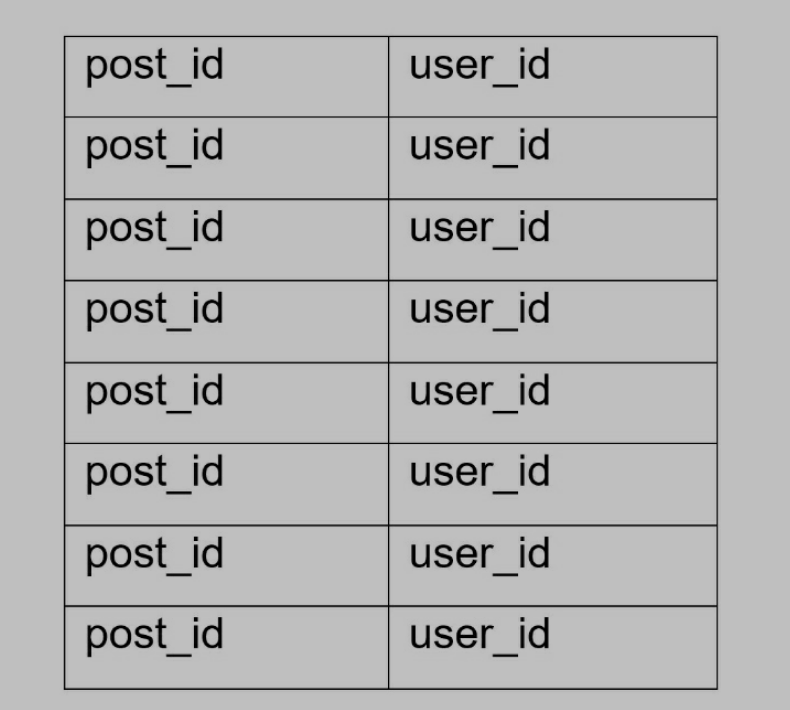
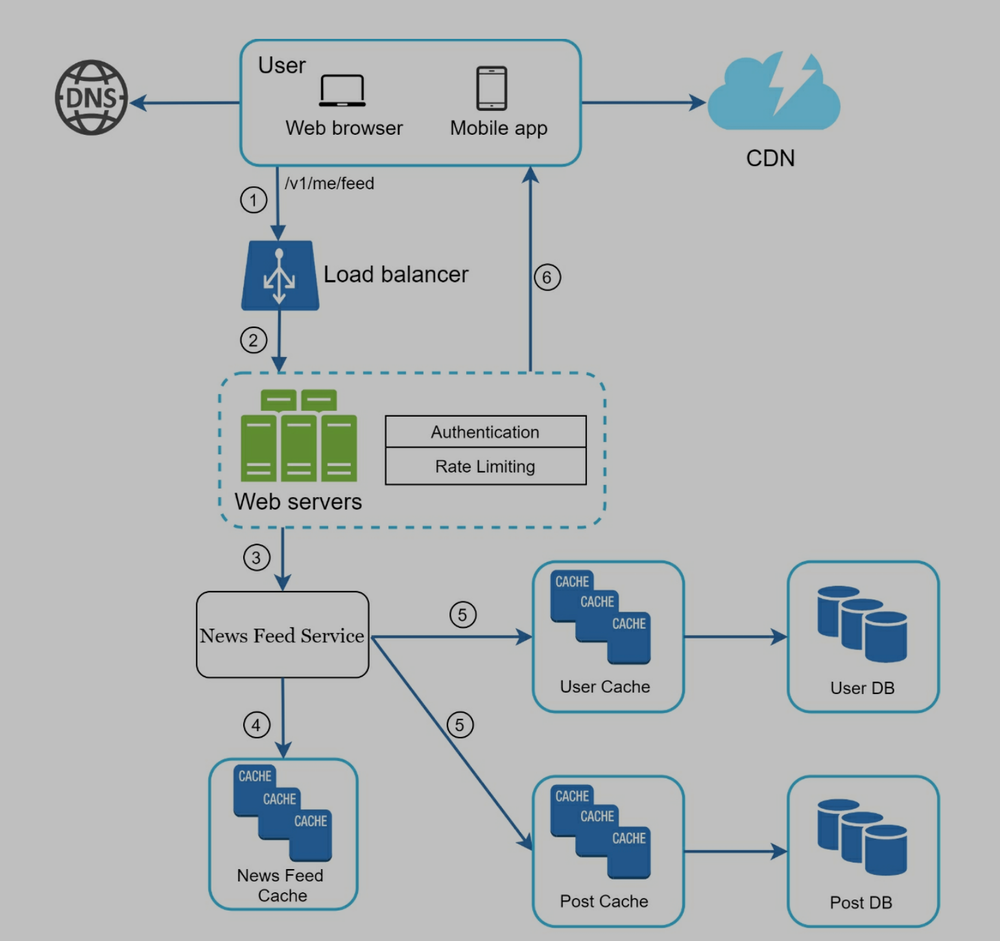
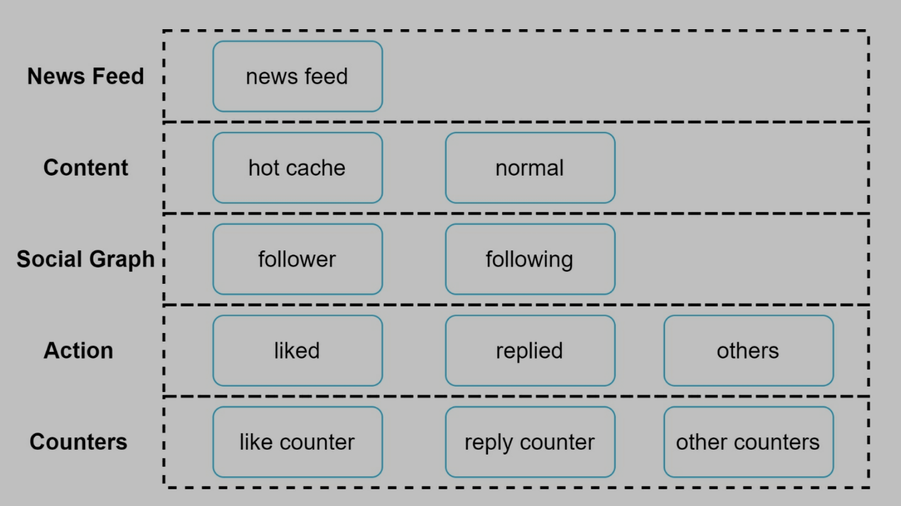

# Design a news feed system

> News feed is the constantly updating list of stories in the middle of your home page. News Feed includes status updates, photos, videos, links, app activity, and likes from people, pages, and groups that you follow on Facebook

Similar design:

- Facebook news feed
- Instagram feed
- Twitter timeline

# Step 1: Understand the problem and establish design scope

- Candidate: Is this a mobile app? Or a web app? Or both?
- Interviewer: Both
- Candidate: What are the important features?
- Interview: A user can publish a post and see her friends’ posts on the news feed page.
- Candidate: Is the news feed sorted by reverse chronological order or any particular order such as topic scores? For instance, posts from your close friends have higher scores.
- Interviewer: To keep things simple, let us assume the feed is sorted by reverse chronological order.
- Candidate: How many friends can a user have?
- Interviewer: 5000
- Candidate: What is the traffic volume?
- Interviewer: 10 million DAU
- Candidate: Can feed contain images, videos, or just text?
- Interviewer: It can contain media files, including both images and videos.

# Step 2: Propose high-level design and get buy-in

## 2.1 Main workflow

- Feed publishing
  - Write data to cache and db
  - A post is populated to her friends' news feed
- Newsfeed building (show feeds)
  - Aggregate friends' posts in reverse chronological order

## 2.2 Newsfeed APIs

### 2.2.1 Feed publishing API

POST /v1/me/feed

- Content: post text
- auth_token: authenticate API requests

### 2.2.2 Newsfeed retrieval API

GET /v1/me/feed

- auth_token: authenticate API requests

## 2.3 Feed publishing

- User
  - View new feeds on browser or mobile app
  - Post through API /v1/me/feed?content=Hello&auth_token={auth_token}
- Load balancer: distribute traffic to web servers
- Post service: save post to db and cache
- **Fanout service**
  - Push new content to friends' news feed
  - Newsfeed data is stored in the cache for fast retrieval
- Notification service
  - Inform friends new content is available
  - Send out push notification

## 2.4 Newsfeed building

- User
  - Send request to retrieve her news feed
  - /v1/me/feed
- Load balancer: redirect traffic to web servers
- Web servers: route requests to newsfeed service
- Newsfeed service: fetch news feed from cache
- Newsfeed cache: store new feed IDS needed to render the news feed

# Step 3: Design deep dive

## 3.1 Feed publishing deep dive

### 3.1.1 Web server

- Authentication: only authenticated users can post
- rate limiting: can only make a certain number of posts

### 3.1.2 Fanout service

#### 3.1.2.1 Types

> Fanout is the process of delivering a post to all friends. Two types of fanout models:

- Fanout on write - push model
- Fanout on read - pull model

> Best practice is hybrid method

- Speed is important for fetching news feed, so push model is great for most users
- Celebrities have many friends/followers, followers should pull news content on-demand

#### 3.1.2.2 Fanout on write - push model

- News feed is **pre-computed** during write time
- A new post is delivered to friends' cache immediately after it is published
- Pros
  - News feed is generated in real-time and can be pushed to friends immediately
  - Fetching news feed is fast because the news feed is pre-computed during write time
- Cons
  - If a user has many friends, fetching the friend list and generating news feeds for all of them are slow. It is called hotkey problem.
  - For inactive users, pre-computing news feeds waster computing resources

#### 3.1.2.3 Fanout on read - pull model

- News feed is generated during read time.
- On-demand model
- Recent posts are pulled when a user loads her home page
- Pros
  - For inactive users, it will not waste computing resources
  - No hotkey problem
- Cons
  - Fetching the news feed is slow because the news feed is not pre-computed

1. Fetch friend IDs from graph db
2. Get friends info from user cache, like filtering out muted friends...
3. Send friend list and new post ID to message queue
4. Workers fetch data from message queue and save news feed data in the cache
   1. News feed cache: <post_id, user_id> mapping table 
   2. When new post made, append it to the mapping table
   3. Only save post_id and user_id to save memory
5. Store <post_id, user_id> in cache

## 3.2 Newsfeed retrieval

> Media content are saved in CDN for fast retrieval

1. User sends a request /v1/me/feed
2. Load balancer redistributes request to web server
3. Web servers call news feed service to fetch news feeds
4. News feed service get a list of post IDs from the news feed cache
5. News feed service get complete user and post objects from users cache and post cache
6. Return results

## 3.3 Cache architecture

> Divide cache tier into 5 layers

- News feed: save IDs of new feeds
- Content: save every post data. Popular content is saved in hot cache
- Social graph: save user relationship data
- Action: save actions(like a post, reply a post...)
- Counters: save counters for like, reply, follower, following....

# Step 4: Wrap up

## 4.1 Scale DB

- Vertical scaling vs horizontal scaling
- SQL vs NoSQL
- Master-salve replication
- Read replicas
- Consistency models
- DB sharding

## 4.2 Other topic

- Keep web tier stateless
- Cache data
- Support multiple data centers
- Use message queue to lose couple components
- Monitor key metrics, like QPS, latency...
