# Design a chat system

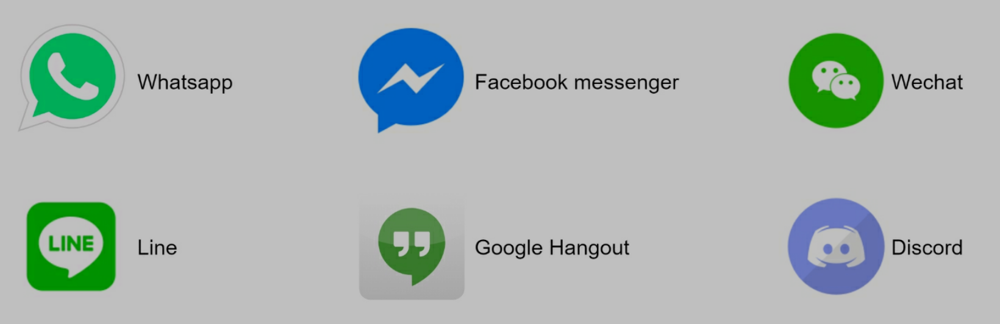

# Step 1: Understand the problem and establish design scope

- Candidate: What kind of chat app shall we design? **1 on 1 or group** based?
- Interviewer: It should support both 1 on 1 and group chat.
- Candidate: Is this a mobile app? Or a web app? Or both?
- Interviewer: Both.
- Candidate: What is the scale of this app? A startup app or massive scale?
- Interviewer: It should support 50 million daily active users (DAU).
- Candidate: For group chat, what is the group member limit?
- Interviewer: A maximum of 100 people
- Candidate: What features are important for the chat app? Can it support attachment?
- Interviewer: 1 on 1 chat, group chat, online indicator. The system only supports text messages.
- Candidate: Is there a message size limit?
- Interviewer: Yes, text length should be less than 100,000 characters long.
- Candidate: Is end-to-end **encryption** required?
- Interviewer: Not required for now but we will discuss that if time allows.
- Candidate: How long shall we store the chat history?
- Interviewer: Forever.

## Requirements

- One-on-one chat with low delivery latency
- Small group chat (max of 100 people)
- Online presence
- Multiple device support, same account log in to different devices
- Push notification
- Support 50 million DAU

# Step 2: Propose high-level design and get buy-in

## 2.1 Basic design

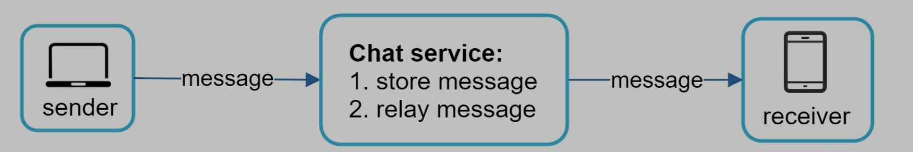

- Clients do not communicates directly with each other
- Each client connects to chat service
- Chat service
  - Receive messages from clients
  - Find right recipients for each message and relay the message to the recipients
  - If a recipient is not online, hold the messages until she is online

> HTTP is client-initiated, how to send message? Many techniques are used to simulate a server-initiated connection: polling, long polling, and WebSocket.

## 2.2 Polling

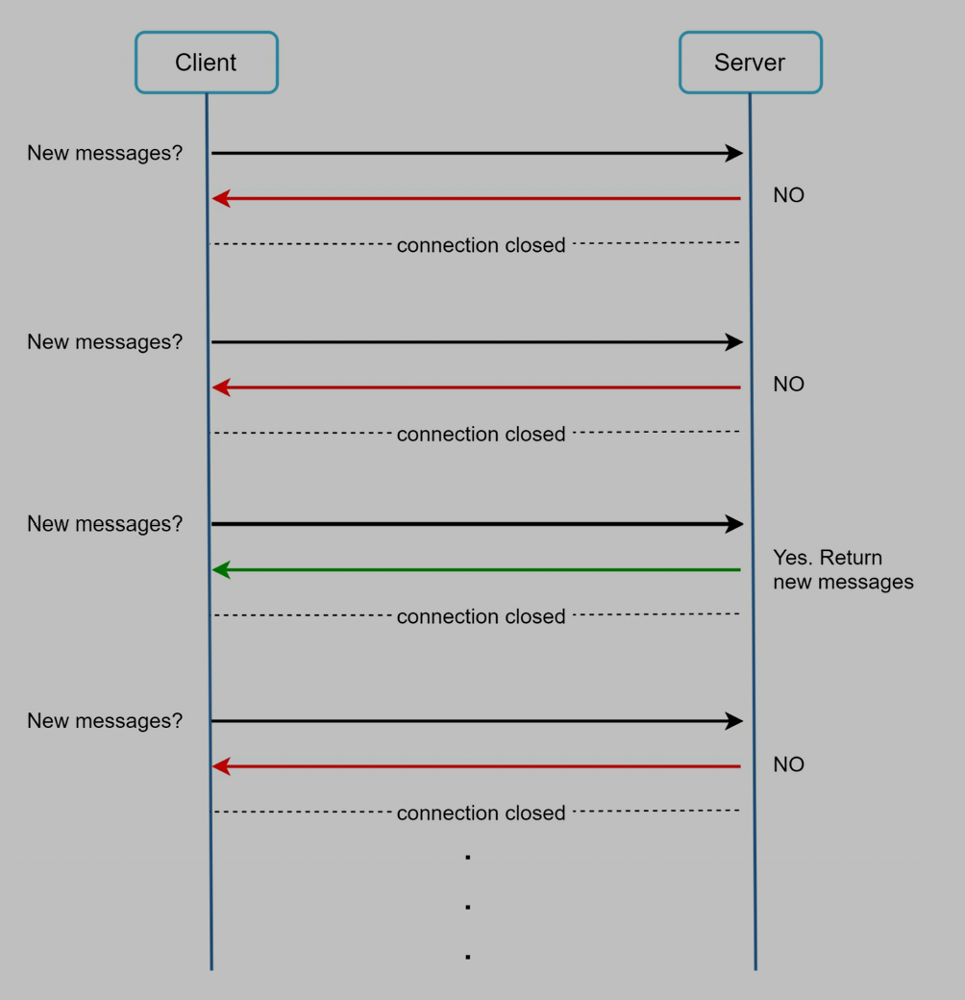

- Client periodically ask the server if there are messages available
- Costly, inefficient

## 2.3 Long polling

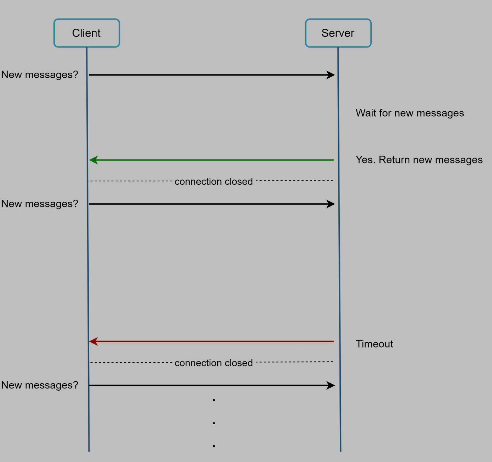

- Client holds the connection open until new message available or timeout
- When client receives new messages, it immediately sends another request to the server, restarting the process
- Cons
  - Sender and receiver may not connect to the same chat server.
  - Server cannot tell if a client is disconnected
  - Inefficient

## 2.4 WebSocket

> WebSocket is a computer communications protocol, providing full-duplex communication channels over a single TCP connection

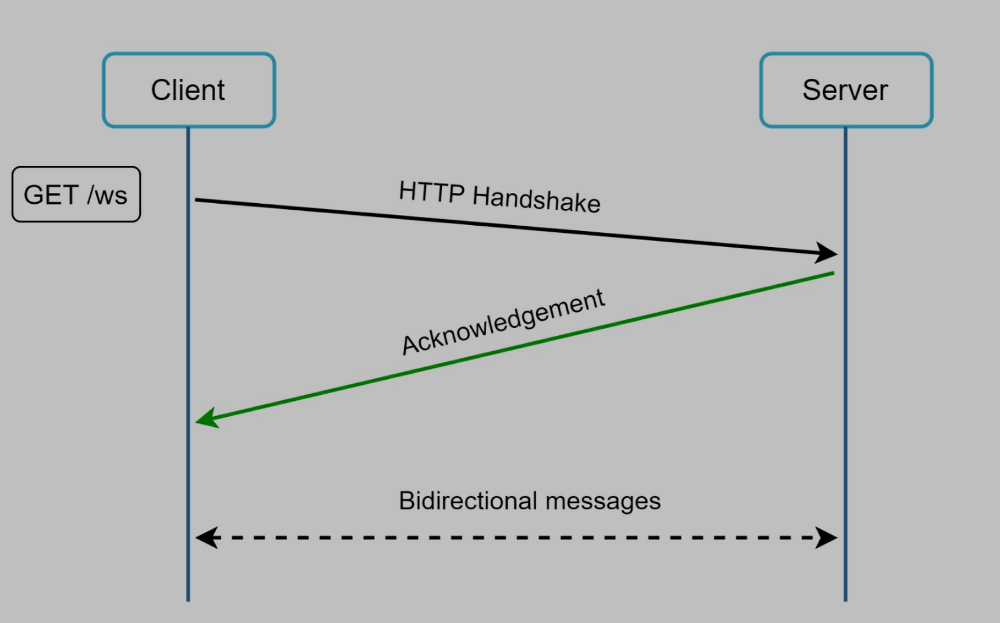

- Most common solution for sending asynchronous updates from server to client
- Initiated by client
- Bi-directional and persistent
- Server can send updates to clients
- Efficient

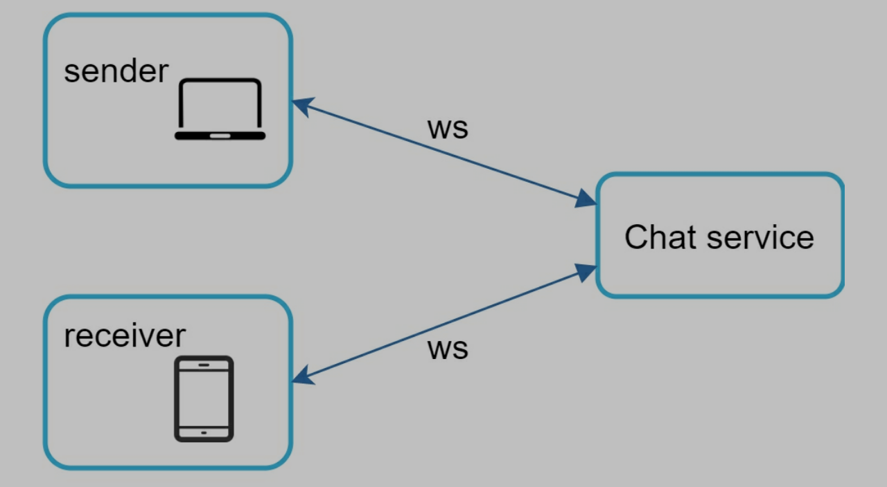

## 2.5 High-level design

> Only chat part uses webSocket, the rest of parts use HTTP

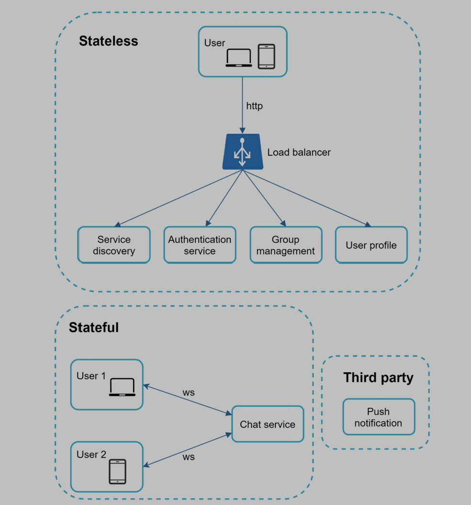

### 2.5.1 Stateless services

- Manage login, signup, user profile...
- Load balancer routes requests to correct services

### 2.5.2 Stateful service

- Each client maintains a persistent network connection to a chat server
- Service discovery coordinates with chat service to avoid server overloading

### 2.5.3 Third-part integration

> Check chapter 10

- Push notification
- Inform users when new messages have arrived

### 2.5.4 Scalability

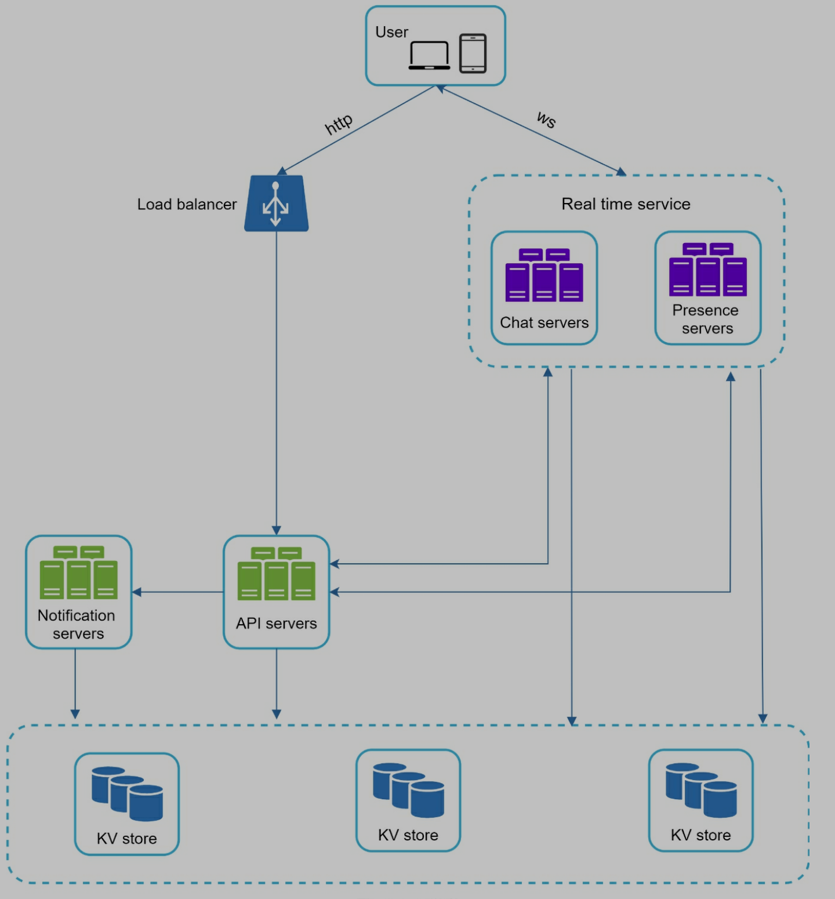

- Chat servers send/receive messages
- Presence servers manage online/offline status
- API servers handle login, signup, profile...
- Notification server
- Key-value store saves chat history

### 2.5.5 Storage

> Two types of data

- Generic data
  - Profile, setting , user friend list...
  - Relational db
  - Replication, sharding
- Chat history data
  - Enormous data (facebook, 60 billion messages a day)
  - Only recent chats are accessed frequently
  - Need to support search, view your mentions, jump specific messages...
  - Eead to write ratio is about 1:1

> Why key-value store?

- Easy horizontal scaling
- Low latency
- Relational db do not handle long tail of data. When indexes grow, random access is expensive
- Popular chat apps are using it (facebook - HBase, discord - Cassandra)

## 2.6 Data models

### 2.6.1 Message table for 1 on 1 chat

> message_id is used to decide message sequence

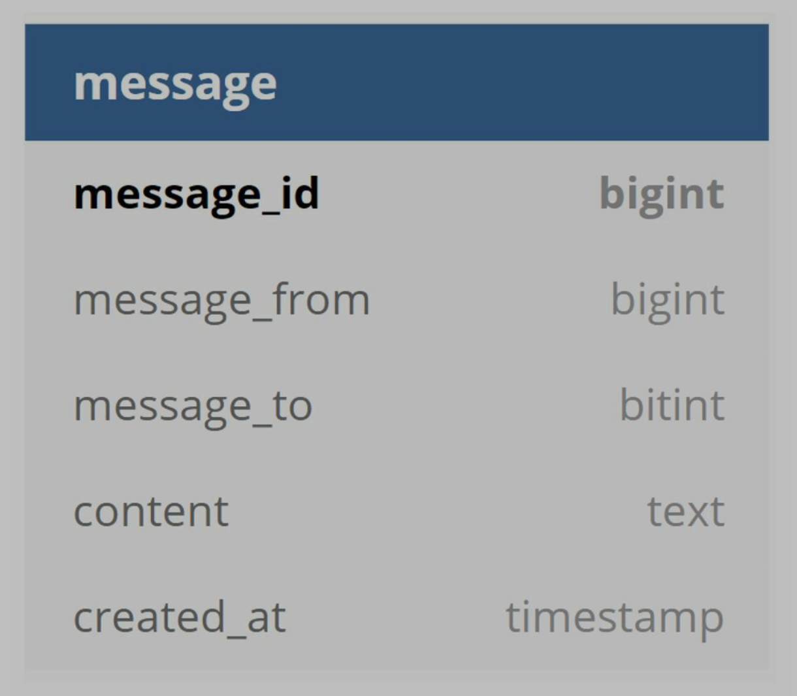

### 2.6.2 Message table for group chat

> Composite primary key: (channel_id, message_id)

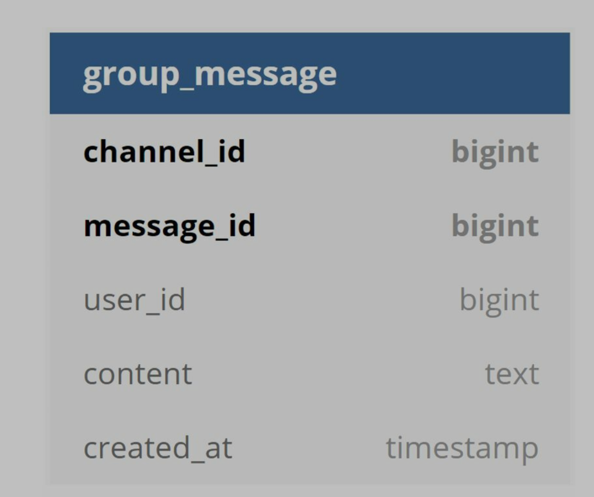

### 2.6.3 Message ID

#### 2.6.3.1 Requirements

- Unique
- Sortable by time, new rows have higher IDs than old ones

#### 2.6.3.2 Solutions

- NoSQL does not have auto_increment
- 64bit sequence number generator (Chapter 7)
- Local sequence number generator
  - IDs are only unique within a group
  - Sufficient

# Step 3: Design deep dive

## 3.1 Service discovery

- Recommend the best chat server for a client
- Based on criteria like geographical location, server capacity
- Apache Zookeeper is a solution
  - Register all available chat servers
  - Picks the best chat server for a client based on predefined criteria

> ZooKeeper is a centralized service for maintaining configuration information, naming, providing distributed synchronization, and providing group services

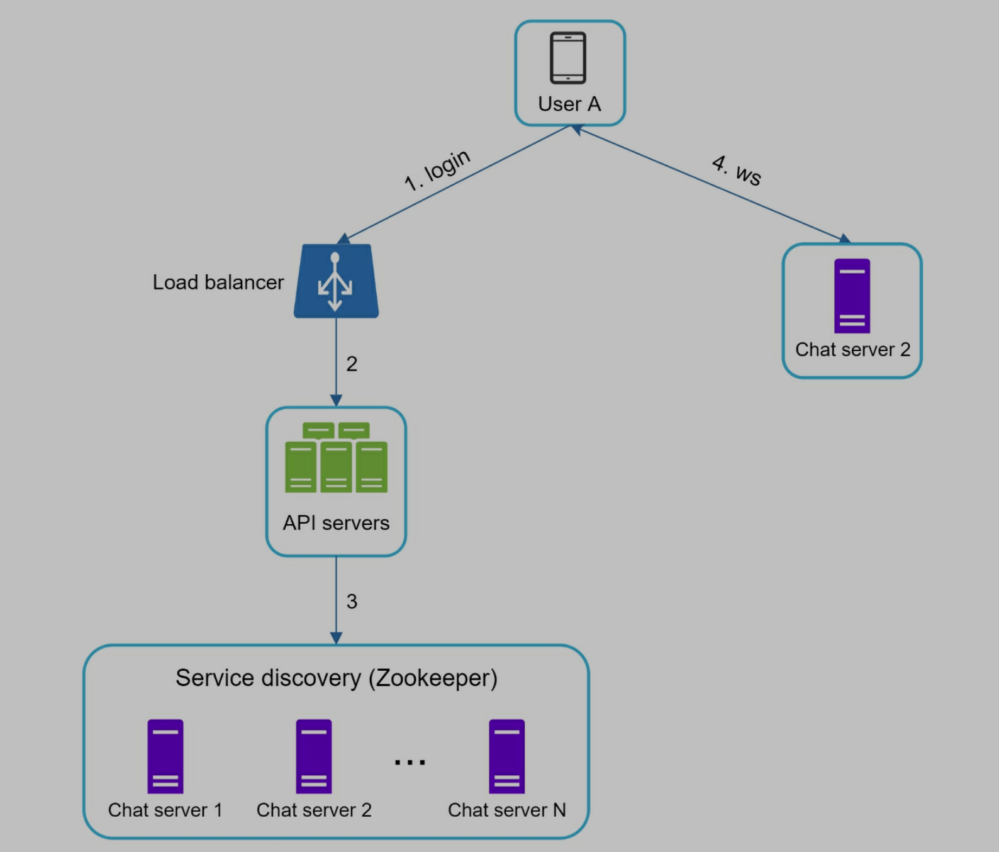

> Workflow

1. User tries to log in
2. Load balancer sends login request to API servers
3. After authentication, service discovery finds the best chat server for the user (server 2 is the best now), and return to the user
4. User connect chat server 2 through WebSocket

## 3.2 Message flows

### 3.2.1 1 on 1 chat flow

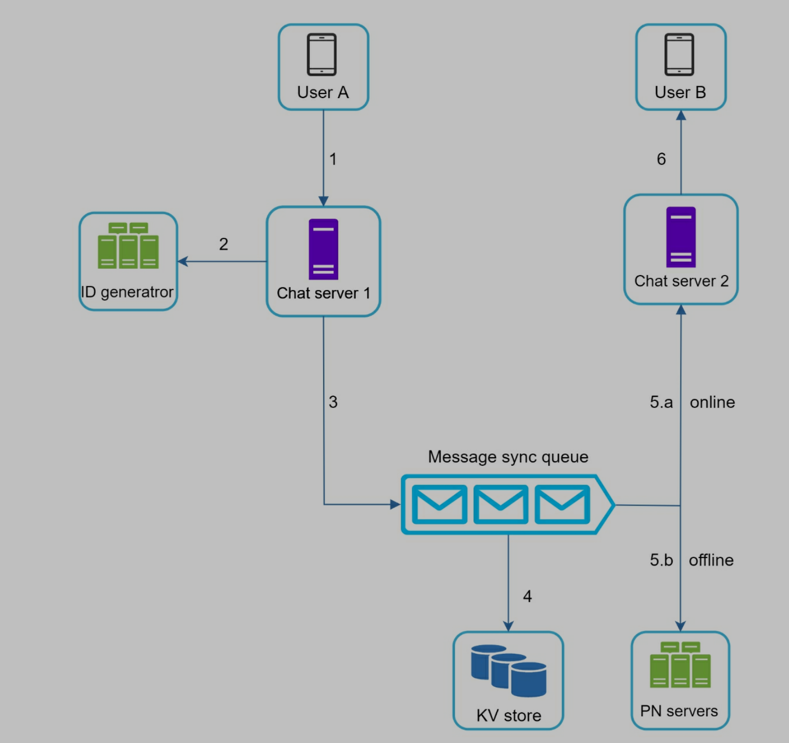

1. User A send a chat message to chat server 1
2. Chat server 1 requests a message ID from ID generator
3. Chat server 1 sends the message to the message sync queue
4. Save message in key-value store
5. User B
   1. If user B is online, message is forwarded to chat server 2 (user B connected with WebSocket)
   2. If user B is offline, push notification (PN) servers send a notification
6. Chat server 2 sends message to user B

### 3.2.2 Message synchronization across multiple devices

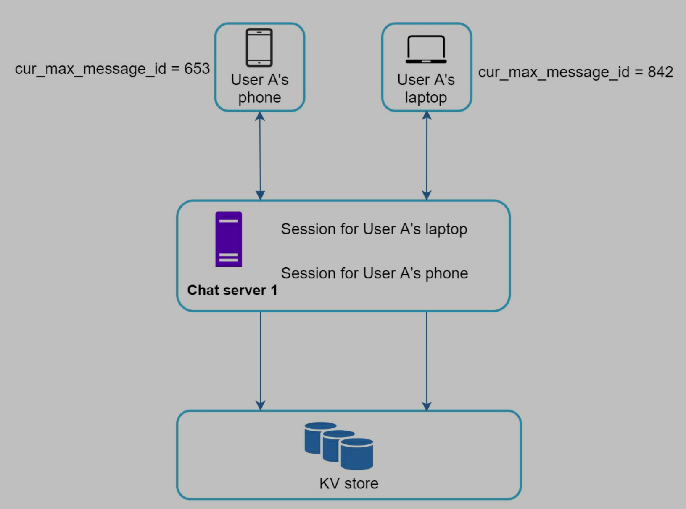

- User A has two devices
- When user A log in devices, it establish a WebSocket connection with Chat server 1
- Each device maintains a variable cur_max_message_id, which keeps track of the latest message ID on the device
- Messages are considered as new when
  - Recipient ID is equal to the currently logged-in user ID
  - Message ID in key-value store is larger than cur_max_message_id

### 3.2.3 Small group chat flow

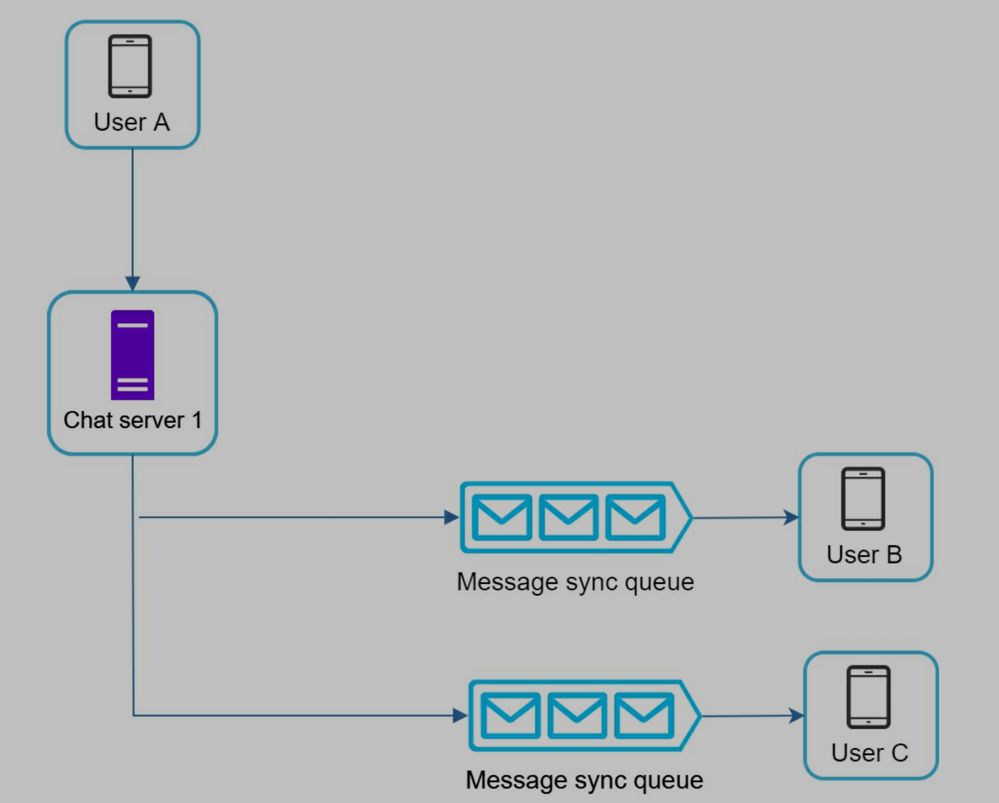

- User A sends a message
- Message is copied to each group member's message sync queue
- Message sync queue is an inbox for a recipient
- Good for small group
  - Simplifies message sync flow as each client only needs to check inbox to get new message
  - When group number is small, storing a copy in each recipient's inbox is not too expensive
- Each recipient can receive message from multiple users
- Each recipient has an inbox which contains messages from different senders

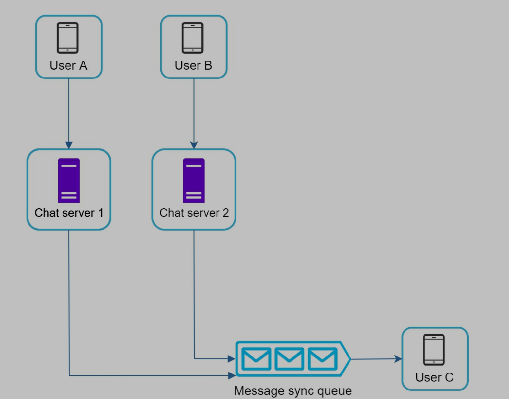

> WeChat uses a similar approach. However, for large group, storing a message copy for each member is not acceptable.

### 3.2.4 Online presence

> Some flows will trigger online status change

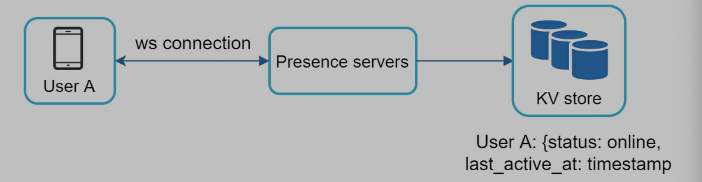
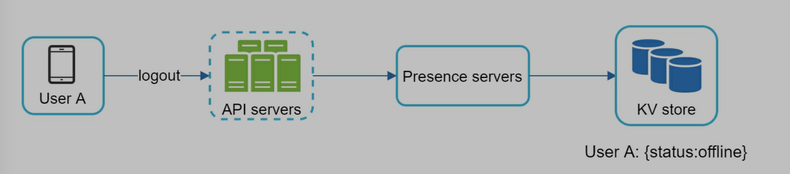

- User login
  - When WebSocket connection is built
  - Status and last_active_at are saved to KV store
- User logout
  - Online status is changed to offline in KV store
  - Presence indicator shows a user is offline

### 3.2.5 User disconnection

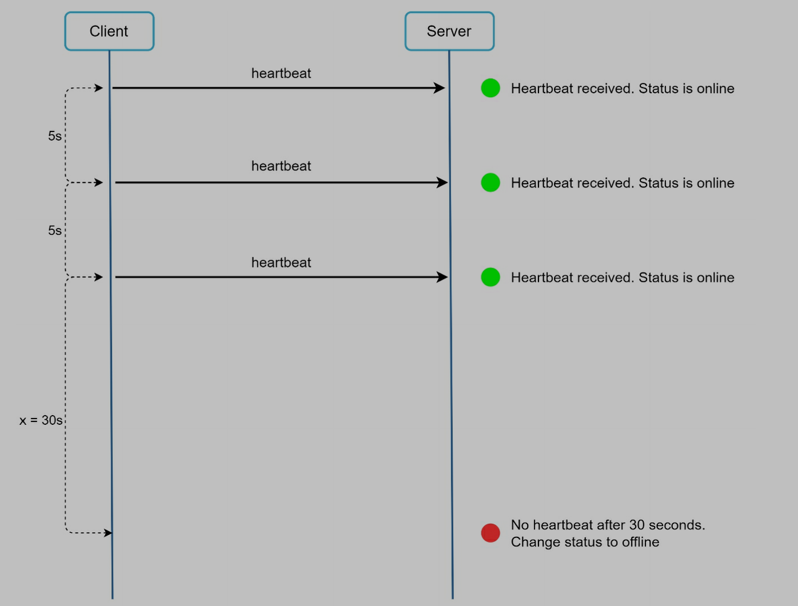

- User might disconnect/reconnect frequently
- Update online status in DB for every disconnect/reconnect is too often
- Solution: heartbeat mechanism
  - Periodically, client sends a heartbeat to presence servers
  - If presence servers receive a heartbeat event in a certain time -> online

### 3.2.6 Online status fanout

> How do user A's friends know about the her status?

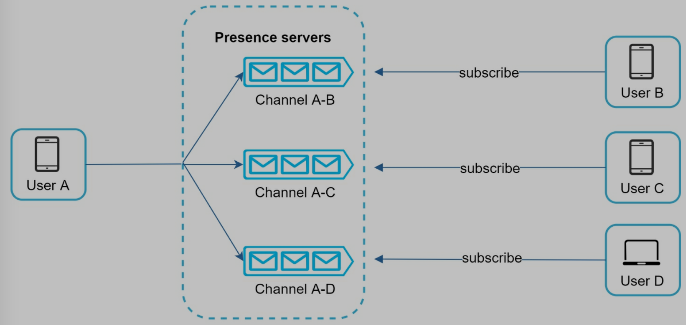

- Presence servers use publish-subscribe model
- Each friend pair maintains a channel
- When a online status changes, it publishes the event to three channels
- Three channels are subscribed by b, c, d
- Client and servers uses WebSocket
- It is good enough for small group, but not good for large group

# Step 4: Wrap up

- Chat servers for real-time messaging
- Presence servers for managing online status
- Push notification servers for sending notifications
- key-value stores for chat history
- API servers for other functionalities

- Extend chat app to support media files
  - Compression
  - Cloud storage
  - Thumbnails
- End-to-end encryption
- Caching message on client-side
- Improve load time
- Error handling
  - Chat server error
  - Message resent mechanism - retry and queue
