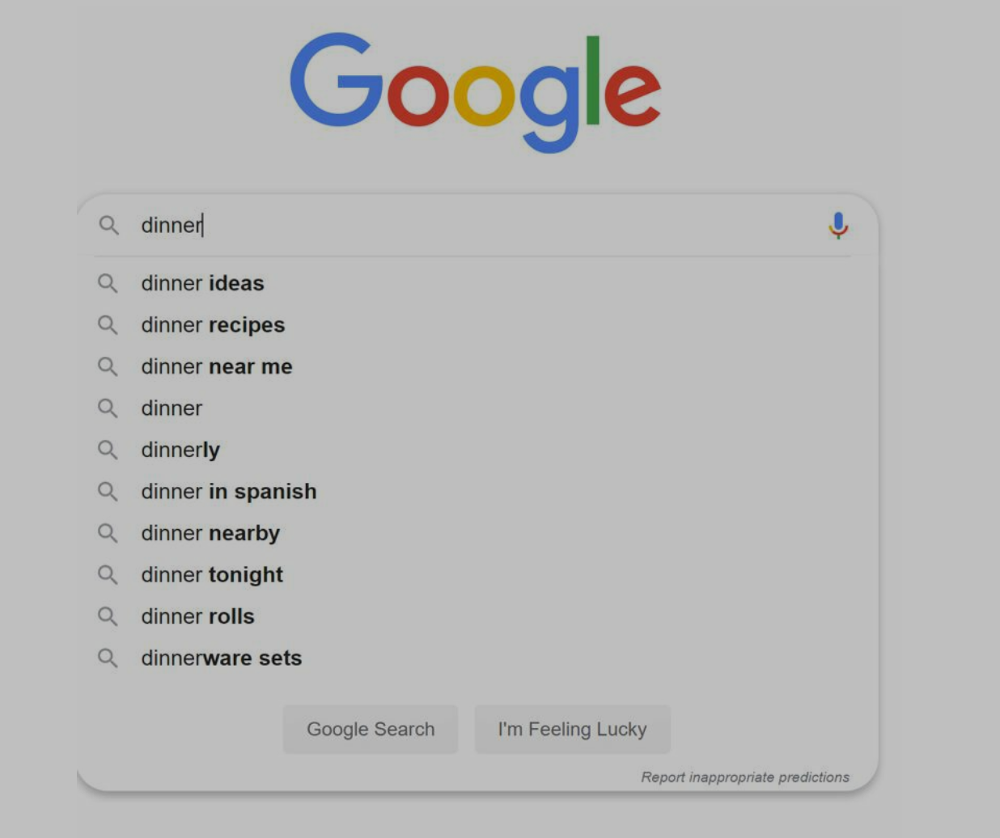

# Step 1: Understand the problem and establish design scope

- Candidate: Is the matching only supported at the beginning of a search query or in the middle as well?
- Interviewer: Only at the beginning of a search query.
- Candidate: How many autocomplete suggestions should the system return?
- Interviewer: 5
- Candidate: How does the system know which 5 suggestions to return?
- Interviewer: This is determined by popularity, decided by the historical query frequency.
- Candidate: Does the system support spell check?
- Interviewer: No, spell check or autocorrect is not supported.
- Candidate: Are search queries in English?
- Interviewer: Yes. If time allows at the end, we can discuss multi-language support.
- Candidate: Do we allow capitalization and special characters?
- Interviewer: No, we assume all search queries have lowercase alphabetic characters.
- Candidate: How many users use the product?
- Interviewer: 10 million DAU.

## requirements

- fast response time: less than 100 milliseconds
- relevant
- sorted by popularity or other ranking models
- scalable: handle high traffic volume
- highly available

## back of the envelope estimation

- 10 million daily active users
- one person 10 searches per day
- 20 bytes of data per query string
  - use ASCII character encoding. 1 char = 1 byte
  - assume a query contains 4 words, each word contains 5 char
  - 4 \* 5 bytes per query
- every character entered into the search box, a client sends a request to the backend for autocomplete suggestions
- on average, 20 requests are sent for a search query, like work dinner
  - search?q=d
  - search?q=di
  - search?q=din
  - search?q=dinn
  - search?q=dinne
  - search?q=dinner
- ~ 24000 query per seconds = 10 million users _ 10 queries / day _ 20 characters / 24 hours / 3600 seconds
- peak QPS: 2 \* QPS ~= 48000
- assume 20% of daily queries are new
  - 10 million _ 10 queries/day _ 20 byte per query \* 20% = 0.4 GB.
  - we have 0.4 GB new data per day

# Step 2: propose high-level design and get buy-in

two components

- data gathering service
  - gather user input queries
  - aggregate queries in real-time
- query service
  - given a search query or prefix, return 5 most frequently searched terms

## Data gathering service

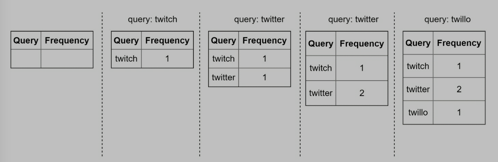

frequency table

### query service

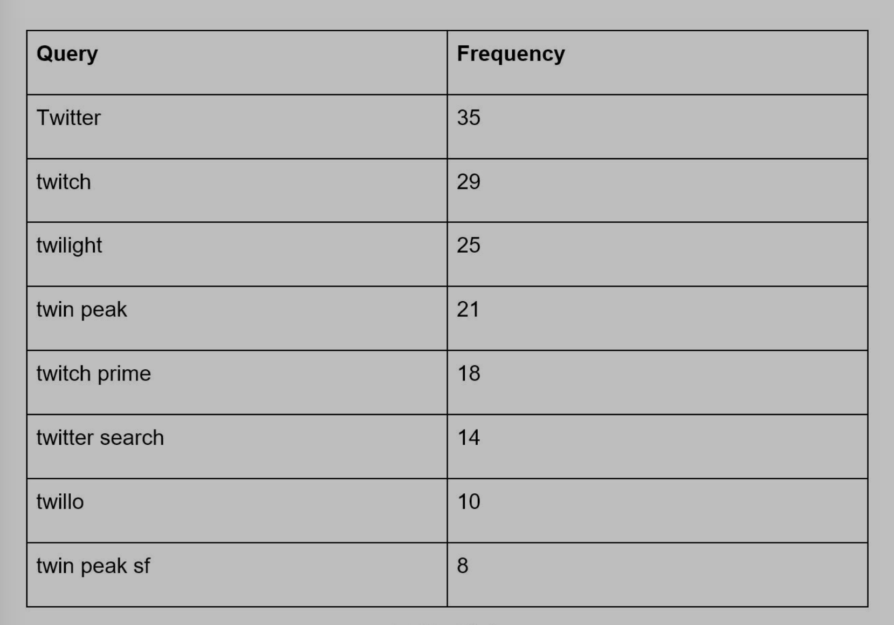

frequency table two fields

- query string
- frequency: the number of times a query has been searched

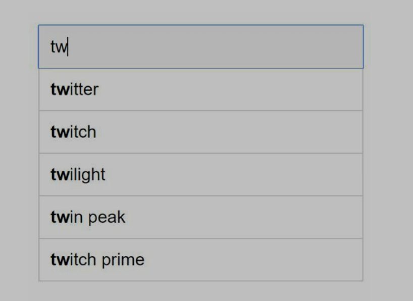

- when "tw" in search box, the five keywords should be popped up
- query like below
- good for small data set

```sql
SELECT * FROM frequency_table
WHERE query LIKE `prefix%`
ORDER BY frequency DESC
LIMIT 5
```

# Step 3: Design deep dive

## Tire data structure


- relational db is not efficient
- tire (prefix tree, "try", word is from re**trie**val, indicates it is designed for string retrieval operations) data structure is used to overcome the problem
  - trie is a tree-like data structure
  - root represents an empty string
  - each node stores a character
  - each node has 26 children
  - each tree node represents a sing word or a prefix string
- to support sorting by frequency, we save frequency info into nodes

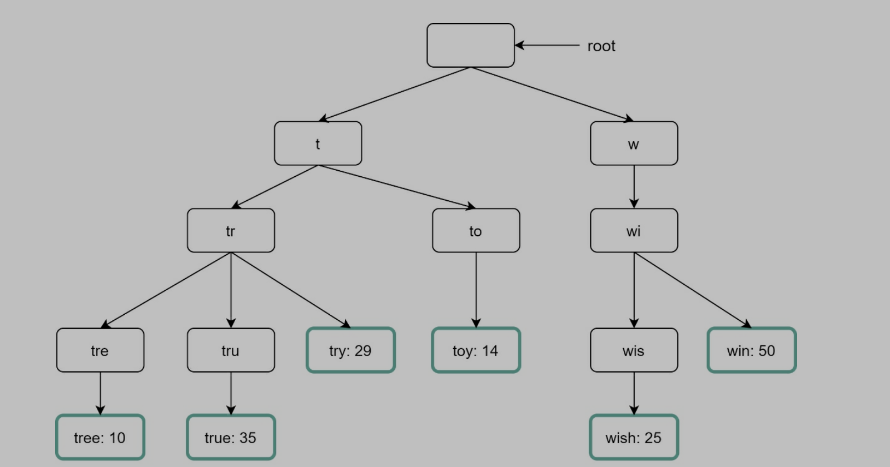

some terms

- p: length of a prefix
- n: total number of nodes in a trie
- c: number of children of a given node

steps to get top k most searched queries:

1. find the prefix, O(p)
2. traverse the subtree for the prefix node to get all valid children. A child is valid if it can form a valid query string O(c)
3. sort children and get top k. O(clogc)

举例

when search "tr" in search box and get top 2

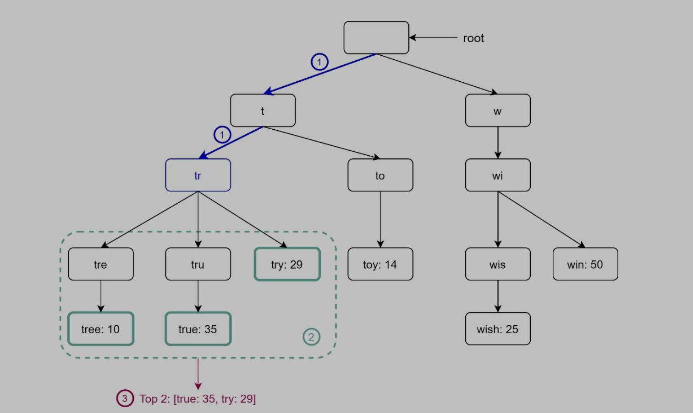

1. find prefix node "tr"
2. traverse subtree to get all valid children.
   1. [tree, 10]
   2. [true, 35]
   3. [try, 29]
3. sort children and get top 2
   1. [true, 35]
   2. [try, 29]

是可行解, 但是效率不行

优化方法

- limit the max length of a prefix
  - user rarely types a long search query
  - reduce p to 50
  - O(0) -> O(50) -> O(1)
- cache top search queries at each node
  - store top k most frequent queries for each node
  - need more space, but fast
  - top k queries are cached, O(c) -> O(1)

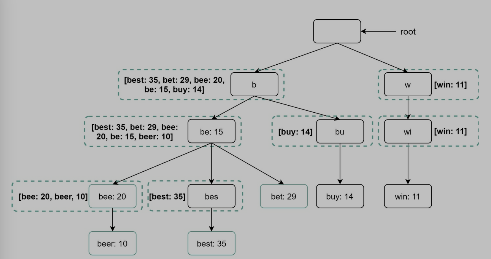

- top 5 queries are stored on each node

## data gathering service

real-time update trie is not practical for two reasons

- users enter billion of queries per day. Updating the trie on every query slows down query service
- top suggestions do not change much once the trie is built. So it is unnecessary
- twitter needs real-time update, but google search does not

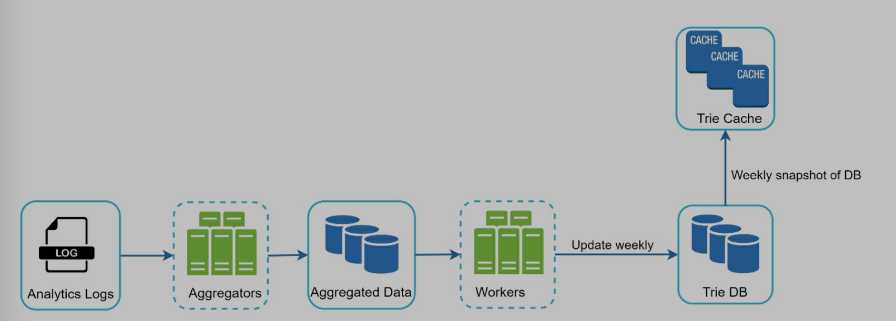

### analytics logs

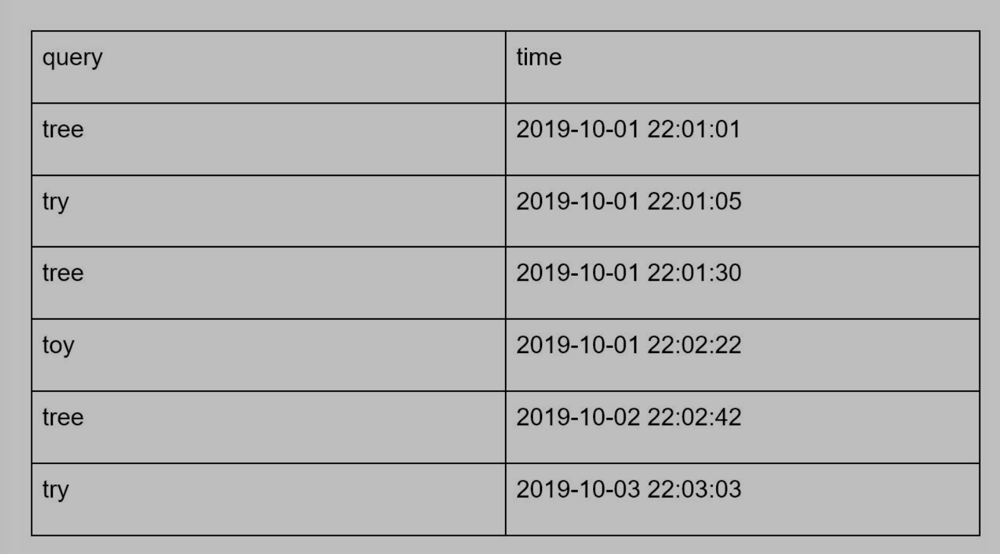

- stores raw data about search quires
- logs are append-only

### aggregators

- analytics log is large
- analytics log is not in right format
- aggregate differently
  - real-time app, twitter
    - aggregate data in a shorter time interval
  - not real-time app
    - aggregate data less frequently, like once per week

### aggregated data

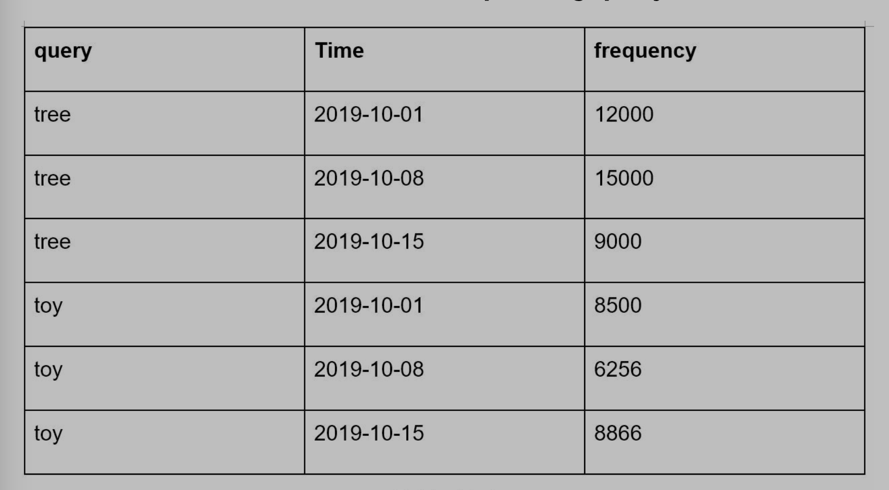

- time: start time of a week
- frequency: sum of the occurrences for the corresponding query in that week

### workers

- performance asynchronous jobs at regular intervals
- build trie data structure
- store data to Trie DB

### Trie cache

- distributed cache system
- keep tire in memory
- take a weekly snapshot of the db

### trie db

- persistent storage
- two options
  - document store - like MongoDB
    - serialize trie
  - key-value store
    - a trie can be represented in a hash table form
    - every prefix in the trie is mapped to a value in a hash table
    - data on each trie node is mapped to a value in a hash table

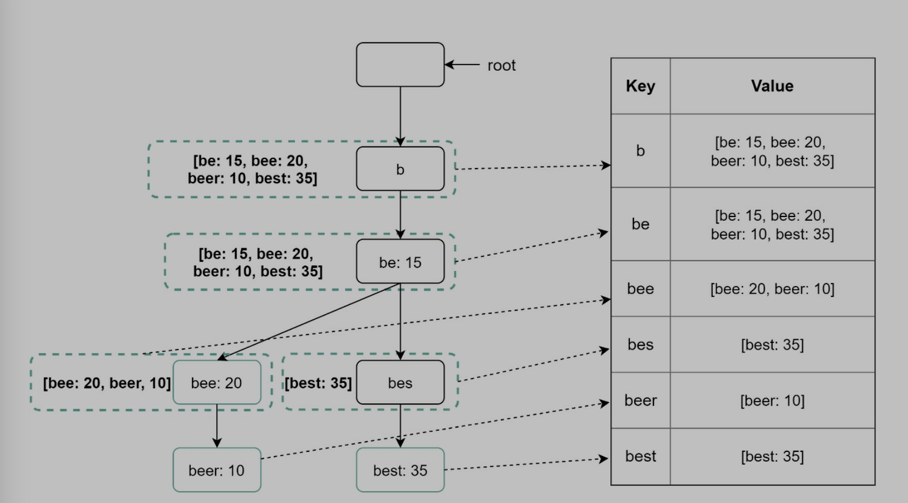

mapping between trie and hash table

## query service


- search query is sent to load balancer
- load balancer routes the request to API servers
- API servers get trie data from Trie cache and build suggestion
- if data is not in cache, fetch from db and add to cache, then build suggestion

optimization

- AJAX request: does not refresh the whole web page
- browser caching
  - search suggestions do not change much, so can be saved in browser cache, Google uses this method
- data sampling
  - do not log every search
  - only 1 out of every N requests is logged by the system
  - it is useful fo large-scale system

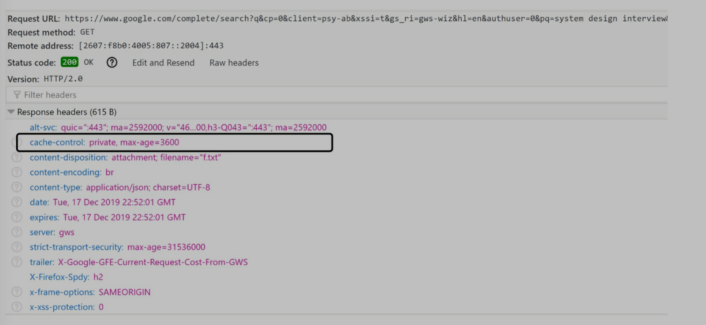

Google save suggestions into browser cache.

- private
  - results are intended for a single user
  - results are not be cached by a shared cache
- max-age=3600
  - cache is valid for 3600 seconds, an hour

## Trie operations

### create

- workers use aggregated data to update it
- source data is from analytics Log/db

### update

two ways

1. update tire weekly
   1. replace old one with new one
2. update individual trie node directly
   1. not recommend
   2. slow
   3. if trie is small, it is ok

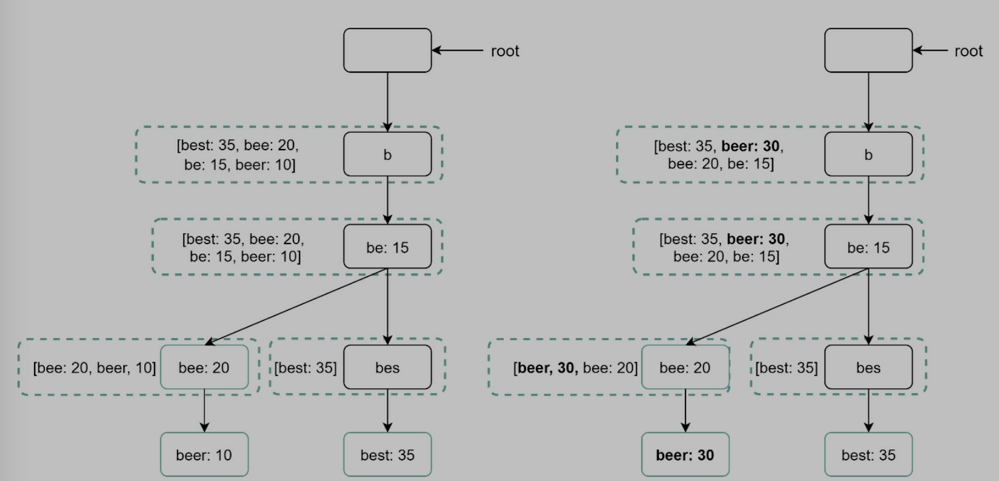

update individual node

### delete

- remove hateful, violent... suggestions
- add filter layer in the front of tire cache


## scale storage

when a tire is too large to fit in one server

### simple solution

- two servers
  - server 1 - a - m
  - server 2 - n - z
- three servers
  - server 1 - a - i
  - server 2 - j - r
  - server 3 - s - z
    ...
- 26 servers ...
  ...
- ...

  - server 1 aa-ag
  - server 2 ah-an
  - ...

- problem: data imbalance, letter c has much more suggestions than x.
- solution
  - analyze historical data distribution pattern and apply smarter sharding logic
  - create shard map manager
    - maintain a lookup db
    - identify where data should be saved
    - if s and u-z have similar number of historical queries, we only create two shards

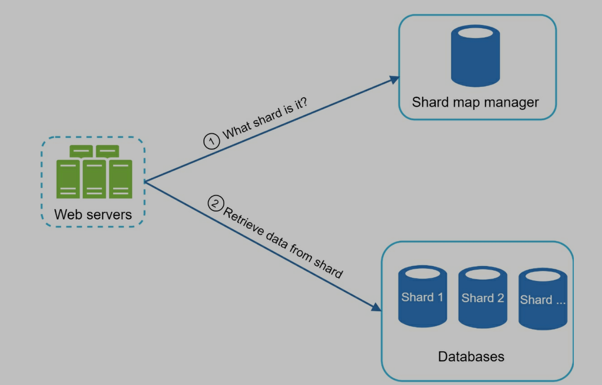

# Step 4: Wrap up

- extend design to support multiple language
  - store unicode characters in trie nodes
  - unicode: an encoding standard covers all the characters for all the writing systems of the world, modern and ancient
- top search queries are different from countries
  - build different tries for different countries
  - can store tries in CDNs
- support real-time search queries
  - reduce working data set by sharding
  - change ranking model and assign more weight to recent search queries
  - if it is streaming data, we need tools like Apache Hadoop MapReduce...
