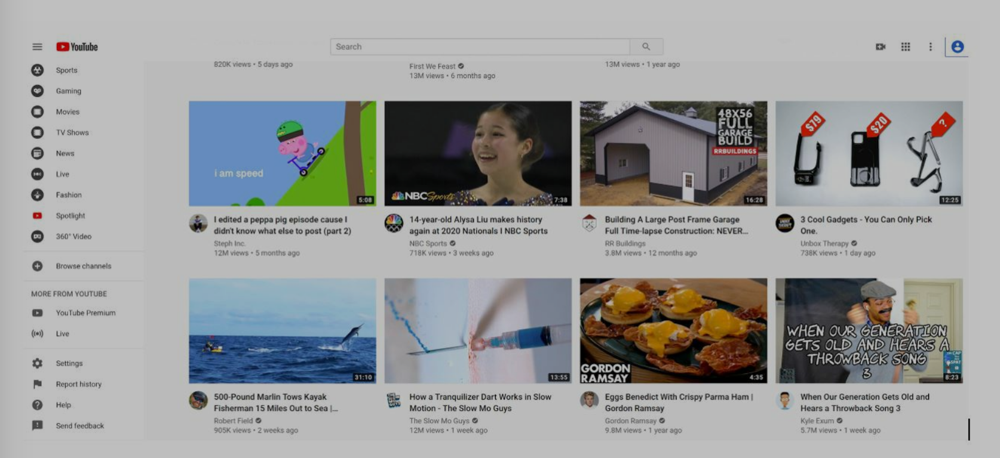

- Total number of monthly active users: 2 billion.
- Number of videos watched per day: 5 billion.
- 73% of US adults use YouTube.
- 50 million creators on YouTube.
- YouTube’s Ad revenue was $15.1 billion for the full year 2019, up 36% from 2018.
- YouTube is responsible for 37% of all mobile internet traffic.
- YouTube is available in 80 different languages.

# Step 1: Understand the problem and establish design scope

- Candidate: What features are important?
- Interviewer: Ability to upload a video and watch a video.
- Candidate: What features are important?
- Interviewer: Ability to upload a video and watch a video.
- Candidate: What clients do we need to support?
- Interviewer: Mobile apps, web browsers, and smart TV.
- Candidate: How many daily active users do we have?
- Interviewer: 5 million
- Candidate: What is the average daily time spent on the product?
- Interviewer: 30 minutes.
- Candidate: Do we need to support international users?
- Interviewer: Yes, a large percentage of users are international users.
- Candidate: What are the supported video resolutions?
- Interviewer: The system accepts most of the video resolutions and formats.
- Candidate: Is encryption required?
- Interviewer: Yes
- Candidate: Any file size requirement for videos?
- Interviewer: Our platform focuses on small and medium-sized videos. The maximum allowed video size is 1GB.
- Candidate: Can we leverage some of the existing cloud infrastructures provided by Amazon, Google, or Microsoft?
- Interviewer: That is a great question. Building everything from scratch is unrealistic for most companies, it is recommended to leverage some of the existing cloud services.

## requirements

- upload videos
- smooth video streaming
- change video quality
- low infrastructure cost
- availability, scalability, reliability
- mobile apps, web browser, smart TV

## back of the envelope estimation

- 5 million DAU
- users watch 5 videos per day
- 10% users upload 1 video per day
- average video size is 300 MB
- daily storage: 5 million _ 10% _ 200 MB = 150 TB
- CDN cost
  - when CDN serves a video, you are charged by CDN
  - Amazon CDN CloudFront $0.02/GB
  - 5 million \* 5 videos \* 0.3 GM \* 0.02 = $150000 / day

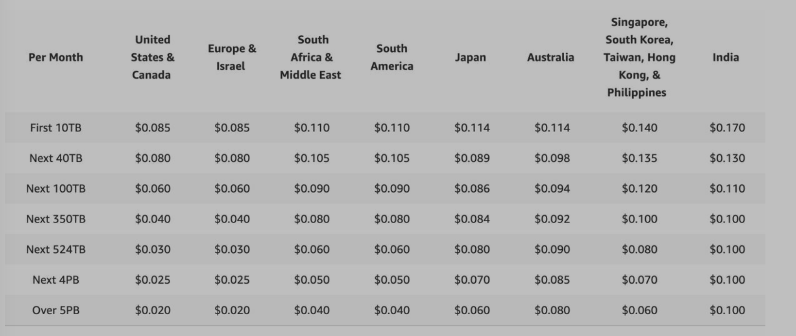

on-demand pricing for data transfer to the Internet (per GB)

# Step 2: Propose high-level design and get buy-in

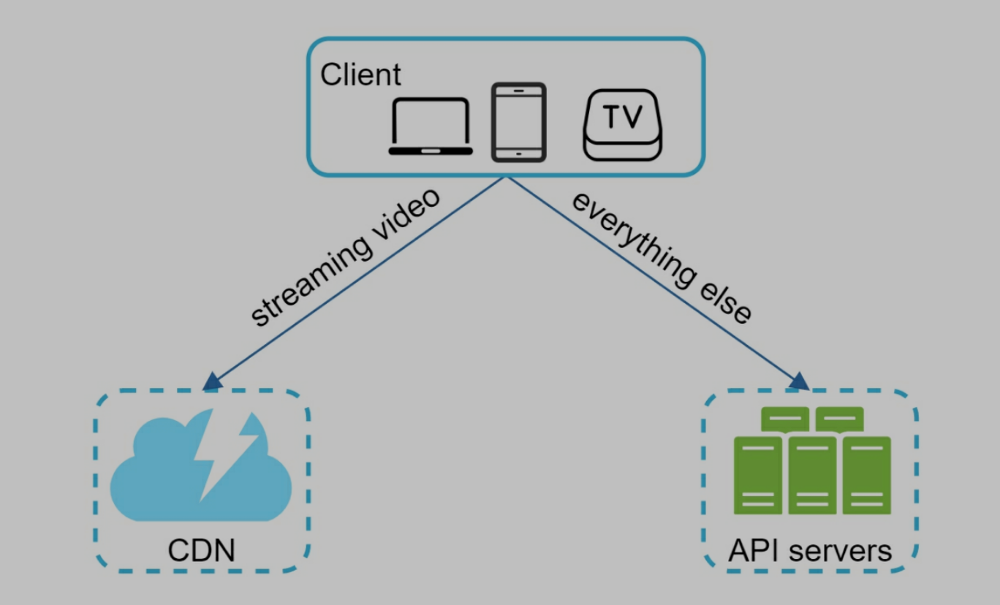

## client

- watch YouTube on computer, mobile phone, smartTV

## CDN

- videos are stored in CDN
- when play a video, it is streamed from the CDN

## API servers

- everything else except video streaming goes through API servers
- feed recommendation
- generate video upload URL
- update metadata db, cache, user signup...

## video uploading flow

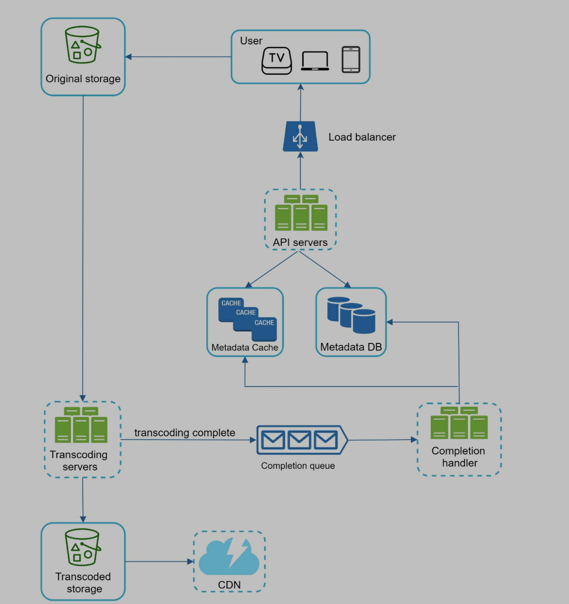

### components

- user: a user watches YouTube
- load balancer: distributes request to API servers
- API servers
- Metadata db
  - video metadata are stored in db
  - it is sharded and replicated
- metadata cache
  - video metadata and user object are cached
- original storage
  - a blob storage system
  - store original videos
  - A Binary Large Object (BLOB) is a collection of binary data stored as a single entity in a database management system
- transcoding servers
  - video encoding
  - convert a video format fo other formats (MPEG, HLS...) to provide the best video streams for different devices and bandwidth capabilities
- transcoded storage
  - blob storage that stores transcoded video files
- CDN
  - video are cached in CDN
- completion queue
  - message queue
  - stores information about video transcoding completion events
- completion handler
  - a list of workers
  - pull event from completion queue
  - update metadata cache and db

### Flow a: upload the actual video

1. upload video
2. update video metadata

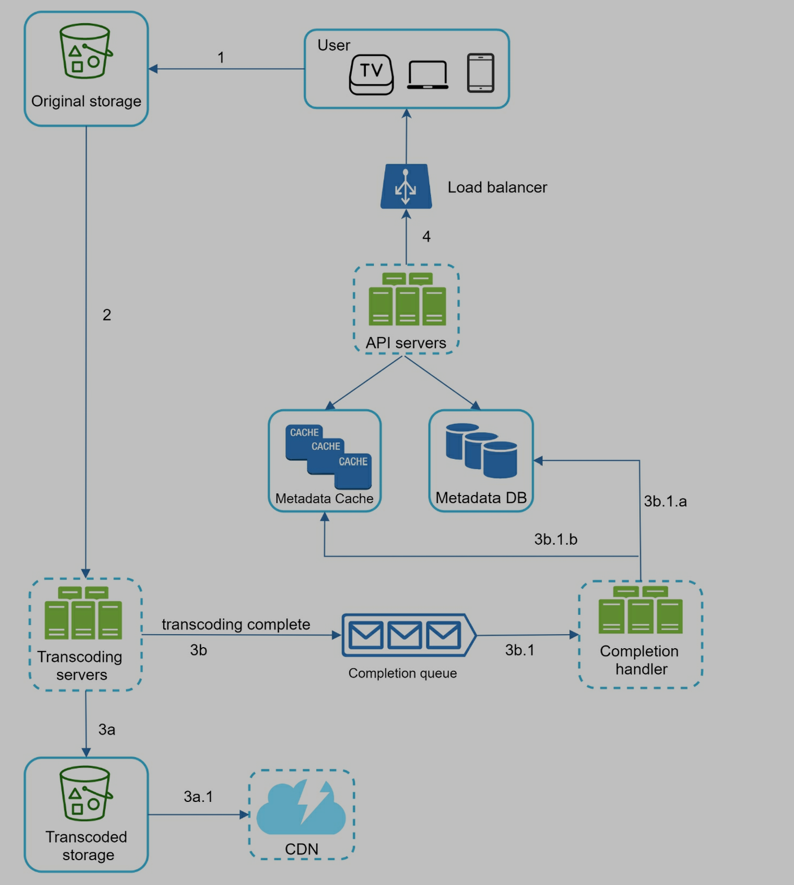

1. videos are uploaded to original storage
2. transcoding servers fetch videos from original storage and start transcoding
3. When transcoding is complete
   1. transcoded videos are sent to transcoded storage
      1. transcoded videos are distributed to CDN
   2. transcoding completion events are queued in the completion queue
      1. completion handler (workers) pull event data from the queue
      2. completion handler updates metadata db and cache
4. API servers inform client that video is successfully uploaded and is ready for streaming

### flow b: update the metadata

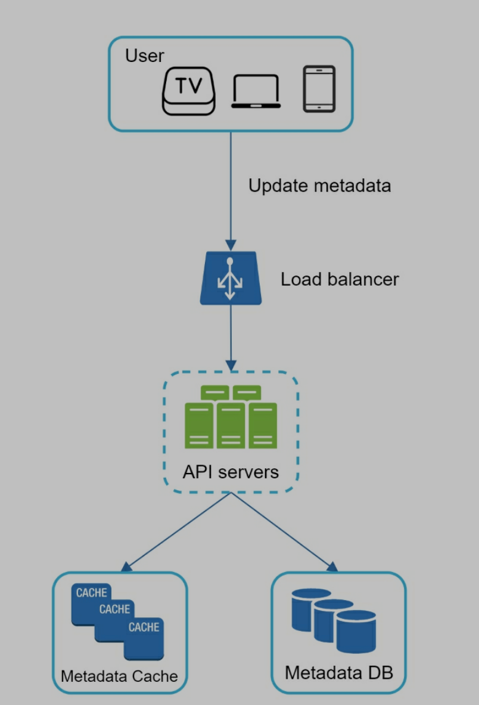

- while a video is uploaded to original storage, client in parallel sends request to update video metadata
- request contains video metadata like file name, size, format...
- API servers update the metadata cache and db

## video streaming flow

### download and streaming

- download: whole video is copied to device
- streaming
  - device continuously receives video streams from remote source videos
  - load a little bit of data at a time
  - watch videos immediately and continuously

### Streaming protocol

- standard way to control data transfer for video streaming
- popular streaming protocols:
  - MPEG-DASH: moving picture experts group - dynamic adaptive streaming over HTTP
  - Apple HLS: HTTP Live Streaming
  - Microsoft smooth streaming
  - Adobe HTTP Dynamic Streaming (HDS)
- videos are streamed from CDN
- server closest to you will deliver the video
- little latency

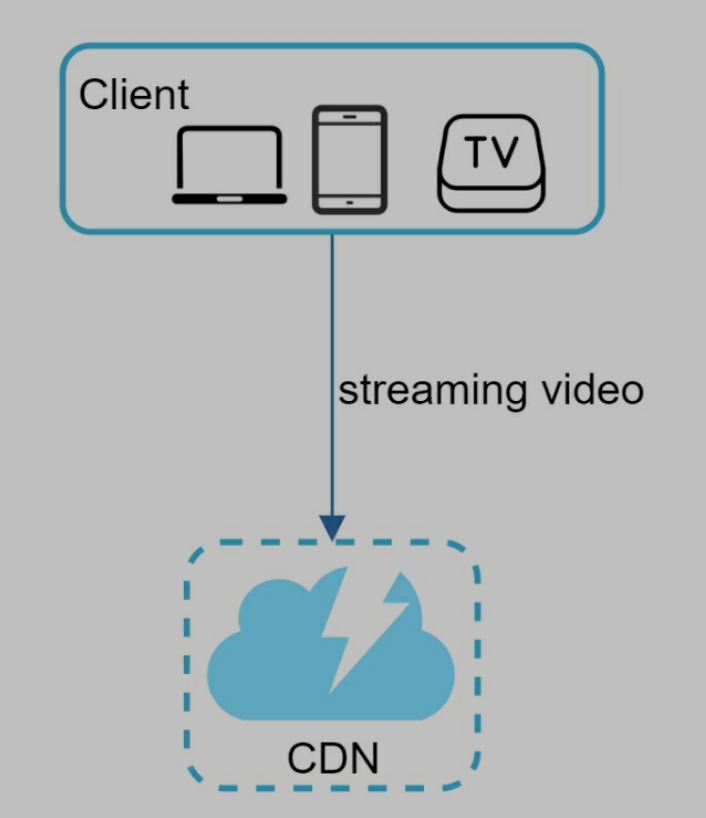

# Step 3: Design deep dive

## Video transcoding

### why video transcoding is important

- raw video consumes large storage
- devices and browsers only support certain types of video formats. video need to be encoded to different formats for compatibility reasons
- deliver high resolution video to high network bandwidth users; deliver low resolution video to low network bandwidth users
- network conditions can change, like mobile. Switching video quality feature is necessary.

### encoding formats contains two parts

- container
  - a basket contains video file, audio, metadata
  - can tell the container format by file extension, like .avi, .mov, .mp4
- codec
  - compression and decompression algorithms
  - reduce video size while preserving video quality
  - H.264, VP9, HEVC

## directed acyclic graph model (DAG)

### requirements

- transcoding is time-consuming
- content creators have different requirements, like watermarks
- different video processing pipeline
- maintain high parallelism
- define tasks to execute

### DAG (facebook)

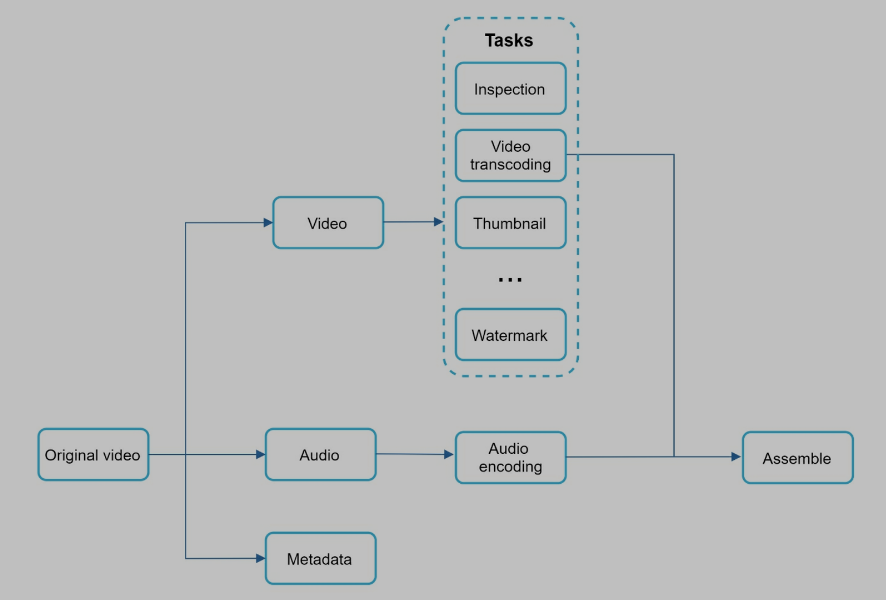

- define tasks in stages so they can be executed sequentially or parallelly
- video tasks
  - inspection
    - videos have good quality
    - not malformed
  - video encodings
    - videos are converted to support different resolutions, codec...
  - thumbnail
    - can be uploaded by a user or automatically generated
  - watermark
    - an image overlay contains identifying info about the video

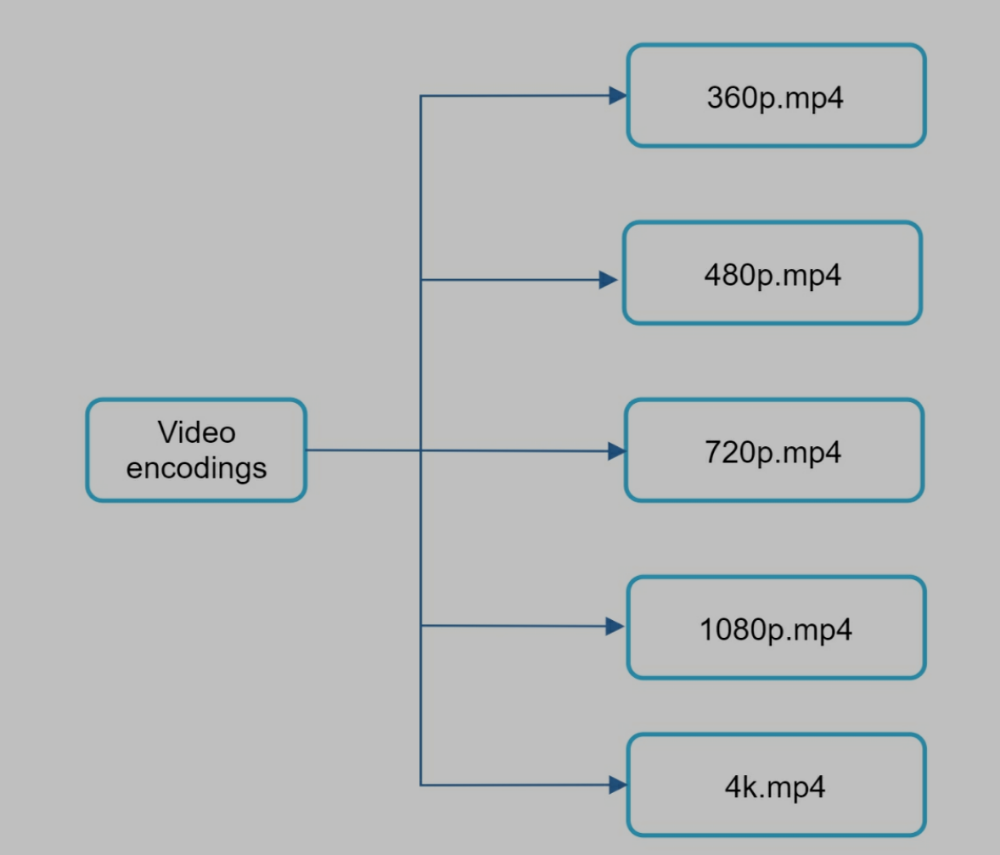

## video transcoding architecture

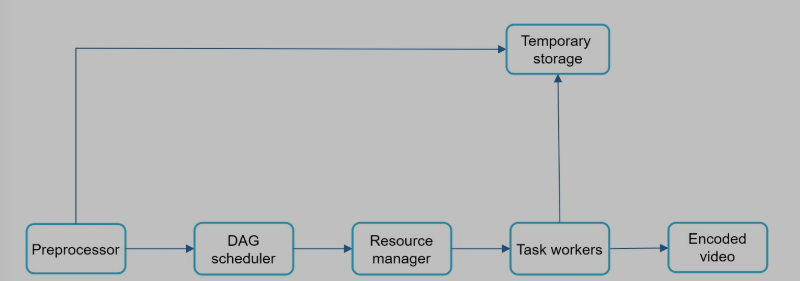

### preprocessor

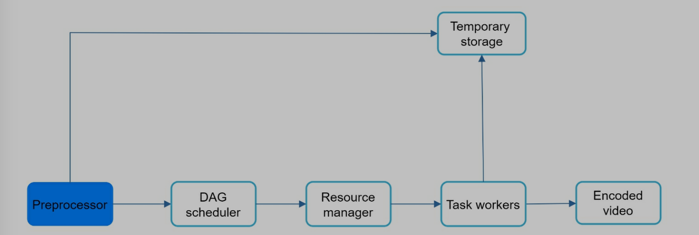

- video splitting
  - video stream is split into smaller group of pictures (GOP) alignment
  - GOP is a chunk of frames arranged in a specific order
  - each chunk is an independently playable unit
  - each chunk is a few seconds in length
- some old devices or browsers do not support video splitting. preprocessor split video by GOP alignment for them.
- DAG generation
  - processor generates DAG based on configuration files client programmers write
- cache data
  - preprocessor is a cache for segmented videos
  - preprocessor stores GOPs and metadata in temporary storage
  - if encoding fails, system can use persisted data for retry

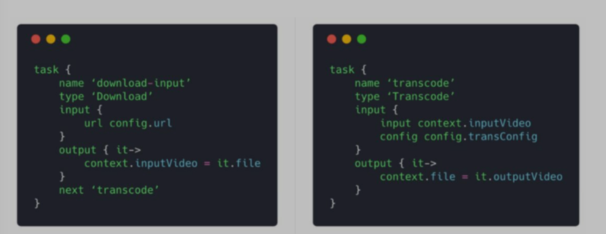

simplified DAG representation, has 2 nodes and 1 edge. The DAG is generated from the two configurations files.

### DAG scheduler

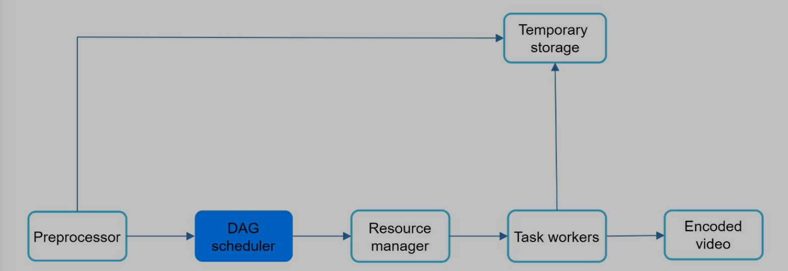

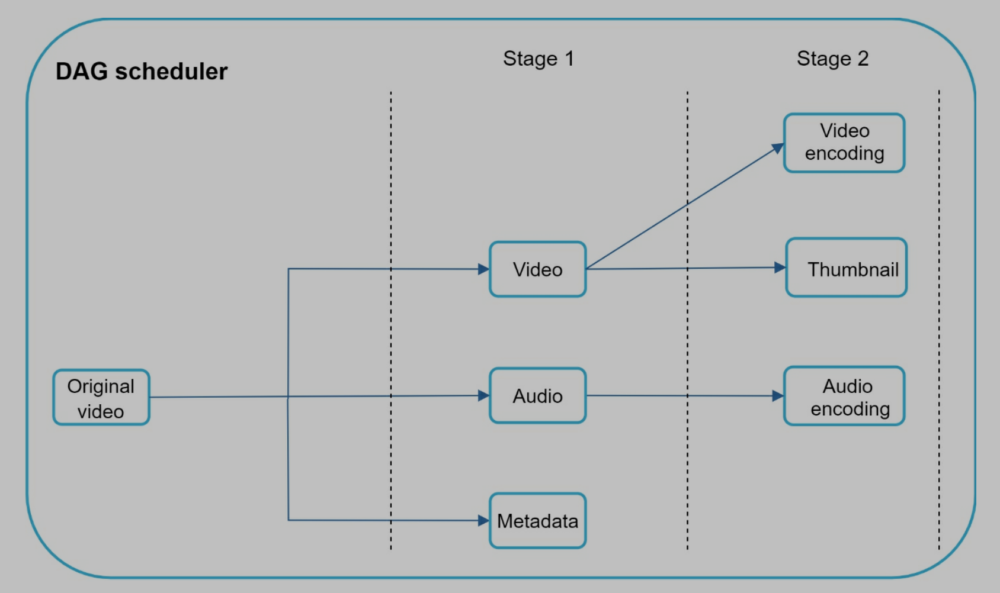

- DAG scheduler splits a DAG graph into stages of tasks and put them in the task queue in the resource manager.
- split original video into 2 stages
  - stage 1: video, audio, metadata
  - stage 2: video -> video encoding, thumbnail. audio -> audio encoding

### Resource manager

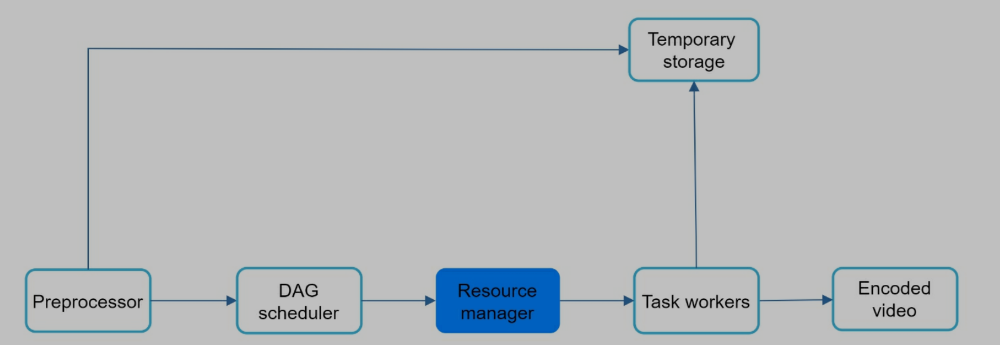
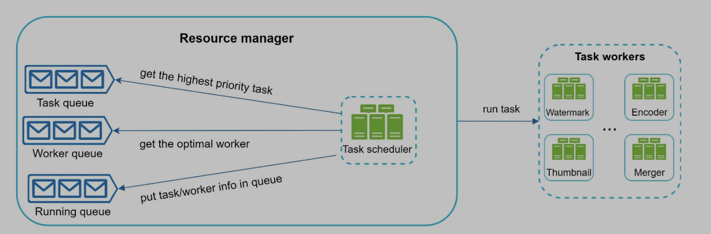

#### Functions and Components

- resource allocation
- contains 3 queues and a task scheduler
- task queue
  - priority queue
  - contains tasks to be executed
- worker queue
  - priority queue
  - worker utilization info
- running queue
  - currently running tasks info
  - workers info
- task scheduler
  - pick optimal task/worker
  - instruct the chosen task worker to execute the job

#### Workflow

1. task scheduler gets the highest priority task from the task queue
2. task scheduler gets the optimal task worker to run the task from the worker queue
3. task scheduler instructs the chosen task worker to run the task
4. task scheduler binds the task/worker info and puts it in the running queue
5. task scheduler removes the job from the running queue once the job is done

### Task workers

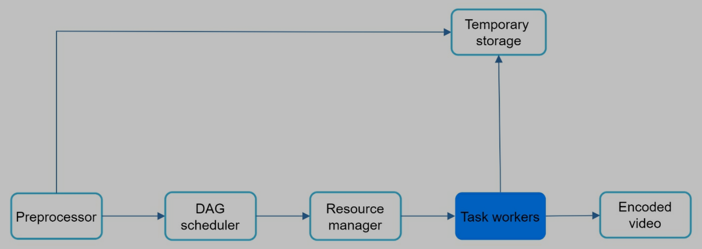
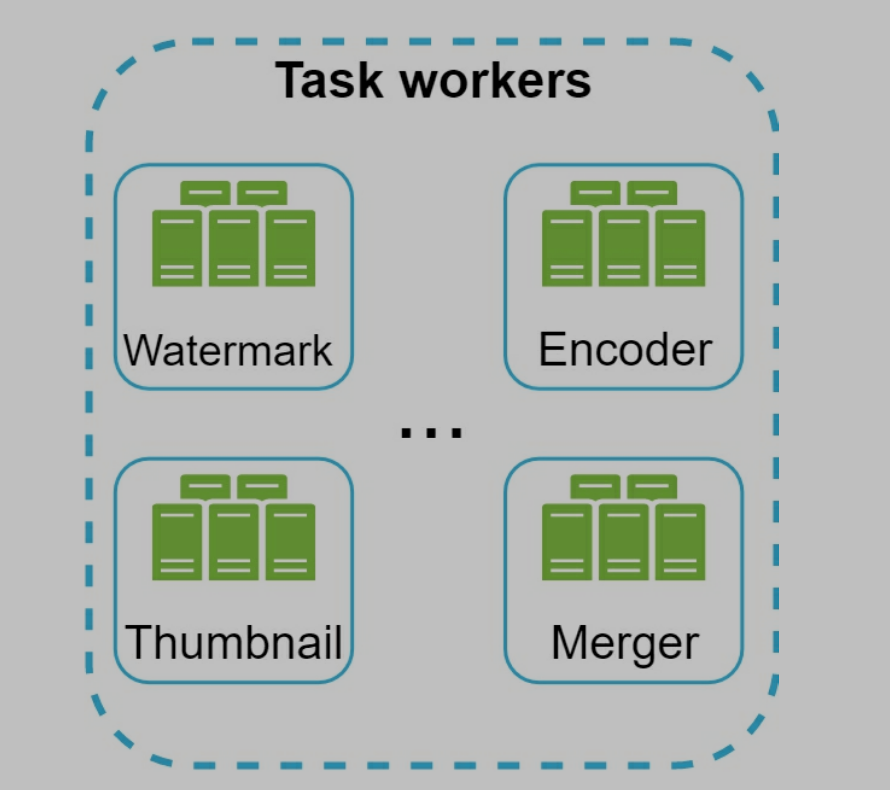

- Task workers run the tasks defined in the DAG.
- Different task workers run different tasks

### Temporary storage

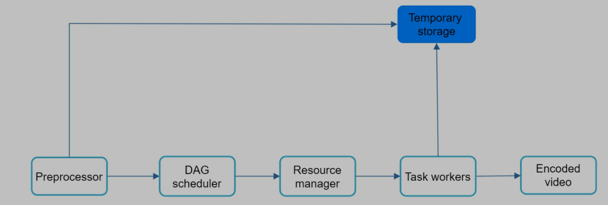

- multiple storage systems are used
- metadata
  - frequently accessed
  - small size
  - cache in memory
- video/audio
  - blob storage
- data is freed up once the processing is complete

### Encoding video

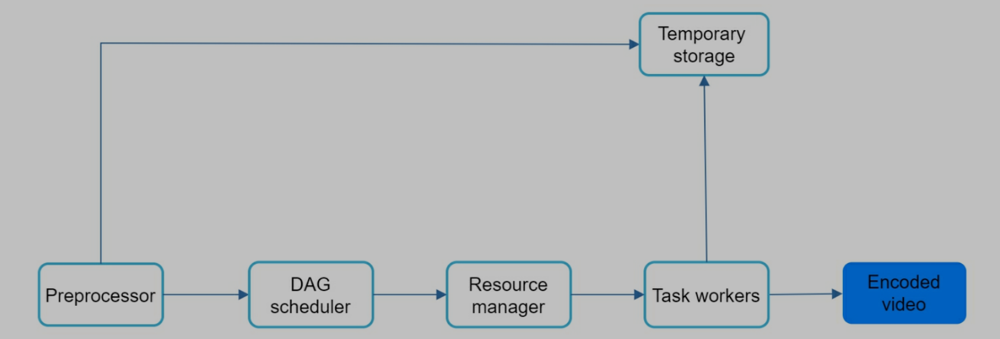

- final output of the encoding pipeline
- example: funny_720p.mp4

## System optimizations

### Speed optimization: parallelize video uploading

- upload a video as a whole unit is not efficient
- split a video into smaller chunks by GOP alignment
- fast resumable uploads from previous failure
- split can be implemented by client to improve upload speed

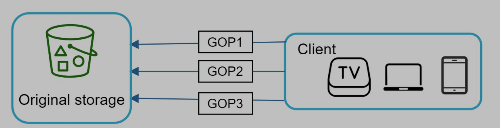

### Speed optimization: place upload center close to users

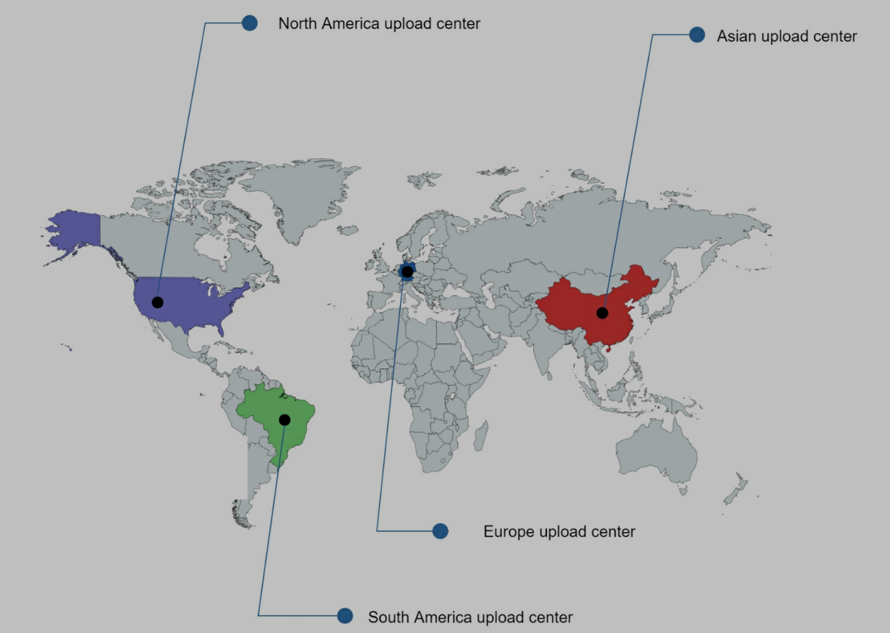

- multiple upload centers
- use CDN as upload centers

### Speed optimization: parallelism everywhere

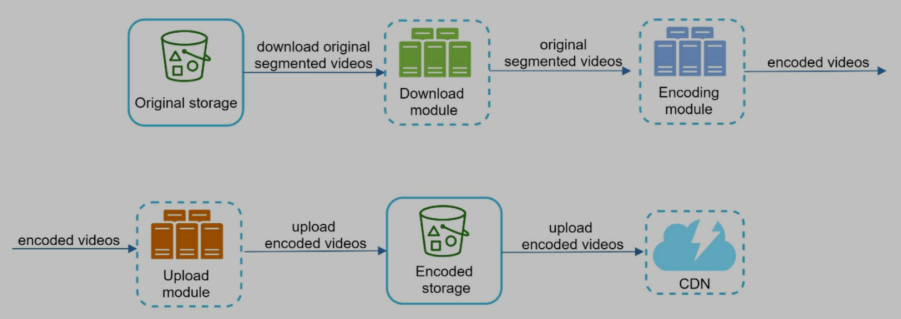

- current design
  - output depends on the input of the previous step
  - dependency makes parallelism difficult
- build loosely coupled system
- enable high parallelism
- **message queue** is a great tech to decouple
  - before message queue: encoding module must wait until the download module is done
  - after message queue: encoding module can execute jobs in message queue in parallel, no more waiting

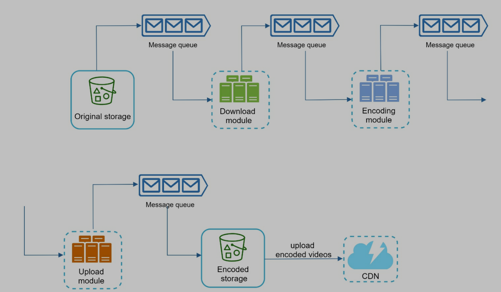

### Safety optimization: pre-signed upload URL

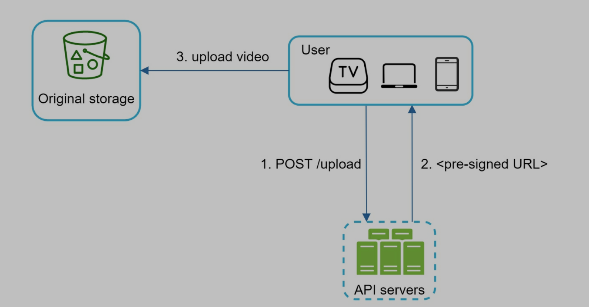

1. clients request pre-signed URL
2. API servers return pre-signed URL
3. clients use pre-signed URL uploads video

### Safety optimization: protect videos

- digital rights management (DRM) systems
  - Apple FairPlay
  - Google Widevine
  - Microsoft PlayReady
- AES encryption
  - encrypt a video
  - configure an authorization policy
  - only authorized users can watch an encrypted video
- visual watermarking
  - image overlay on top of the video

### cost-saving optimization

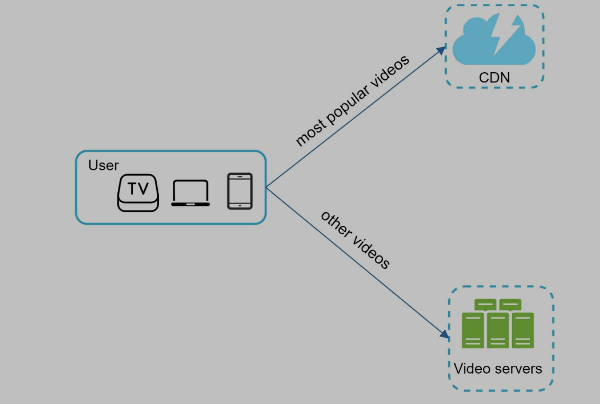

- CDN is expensive
- popular videos from CDN
- less popular videos are from high capacity storage video servers
- less popular less encoded video versions
- some videos are only popular in certain regions. no need to distribute them to other regions
- build own CDN, like Netflix

## Error handling

- recoverable error
  - example: video segment fails to transcode
  - solution: retry; return error code
- non recoverable error
  - example: malformed video format
  - solution: stop running and return error code

# Step 4: Wrap up

- Scale the API tier
- Scals the db
- Live streaming: record and broadcasted in real time
- video takedowns: remove illegal videos
