# Design Google Driver

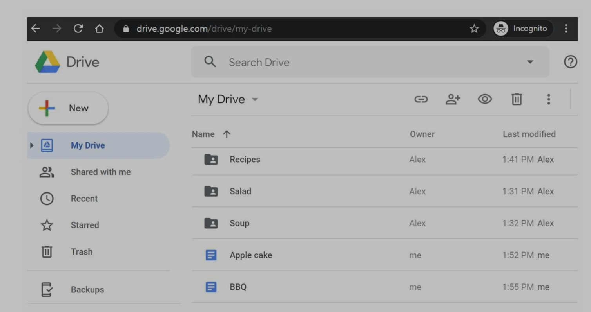
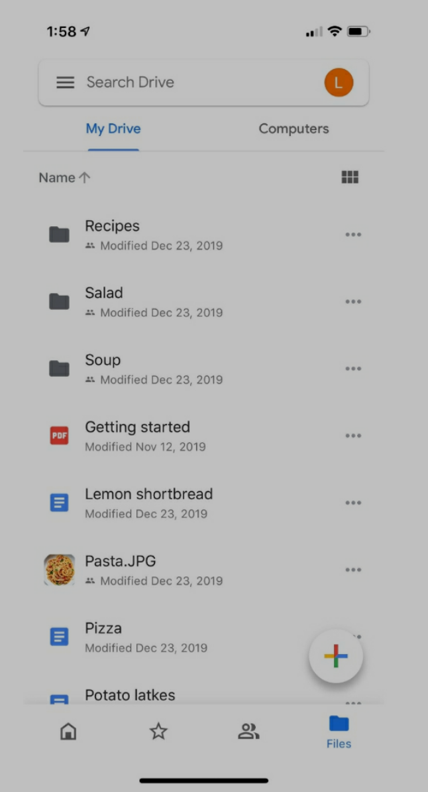

# Step 1: Understand the problem and establish design scope

- Candidate: What are the most important features?
- Interviewer: Upload and download files, file sync, and notifications.
- Candidate: Is this a mobile app, a web app, or both?
- Interviewer: Both.
- Candidate: What are the supported file formats?
- Interviewer: Any file type.
- Candidate: Do files need to be encrypted?
- Interview: Yes, files in the storage must be encrypted.
- Candidate: Is there a file size limit?
- Interview: Yes, files must be 10 GB or smaller.
- Candidate: How many users does the product have?
- Interviewer: 10M DAU.

## Requirements

- add files
- download files
- sync files across multiple devices
- see file revisions
- share files with people
- send notification
- reliability: data loss is unacceptable
- fast sync usage
- bandwidth usage
- scalability
- availability: when some server are offline, users should be use the system

## back of the envelope estimation

- 50 million signed up users
- 10 million DAU
- users get 10 GB free space
- users upload 2 files per day
- file size is 500 kb
- 1:1 read and write ratio
- total space: 50 million \* 10 GB = 500 PB
- QPS: 10 million \* 2 uploads / 24 / 3600 ~= 240
- peak QPS: QPS \* 2 = 480

# Step 2: Propose high-level design and get buy-in

## single server architecture

- a web server to upload and download files
- a db to keep track of metadata, like user data, login info, files info...
- a storage system to store files.

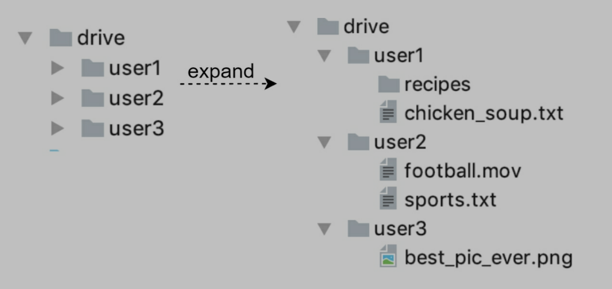

## APIs

### Upload a file to Google Drive

- simple upload: small file
- resumable upload: large file

examples

- https://api.example.com/files/upload?uploadType=resumable
  - params
    - uploadType=resumable
    - data: local file
  - resumable upload steps:
    - request resumable URL
    - upload data
    - monitor upload state
    - if upload is disturbed, resume the upload

### Download a file from Google Drive

example

- https://api.example.com/files/download
  - params
    - path: download file path
    - "path": "/recipes/soup/best_soup.txt"

### Get file revisions

example

- https://api.example.com/files/list_revisions
  - params
    - path: file path
    - limit: maximum number of revisions to return
    - {"path": "/recipes/soup/best_soup.txt", "limit": 20}

## Move away from single server

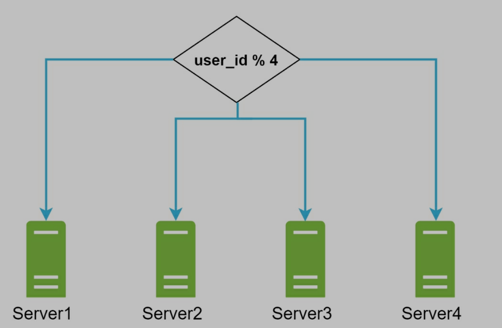

shard data based on user_id

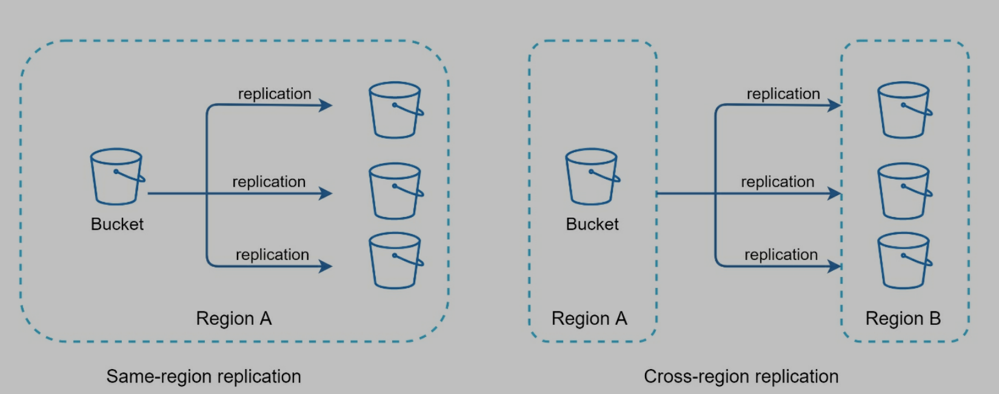

data replication

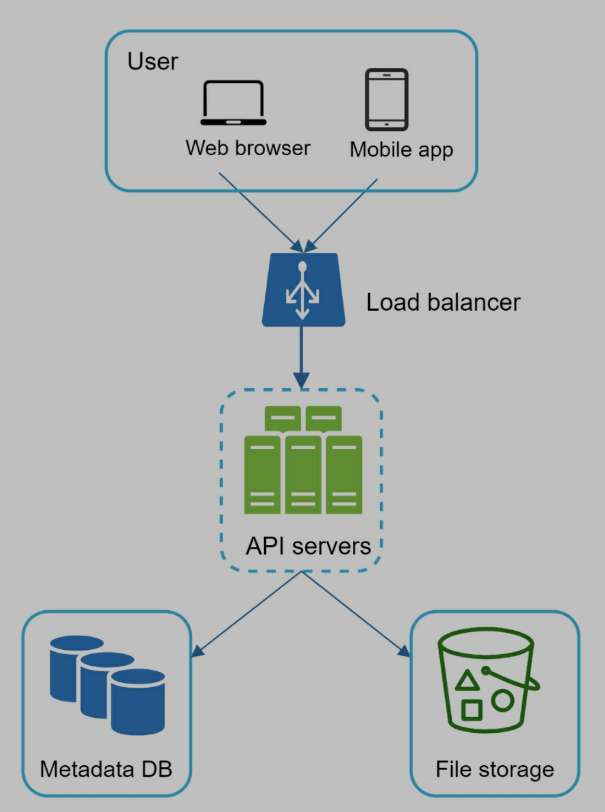

- load balancer: distribute traffic
- web servers: after load balancer, servers can be added/removed depending on traffic load
- metadata db
  - move db out of server to avoid single point of failure
  - data replication and sharding - availability and scalability
- file storage
  - amazon s3 - availability and durability

## Sync conflicts

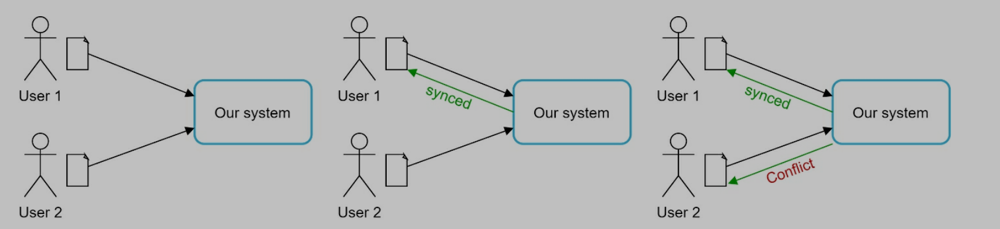
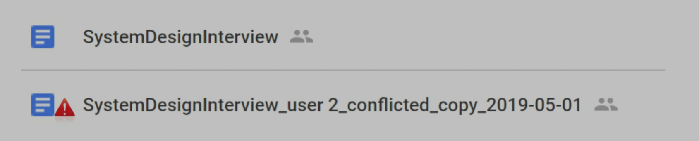

- system presents both copies of the same files
- user 2's local copy and latest version from server
- user 2 can merge both files or override one version

## high-level design

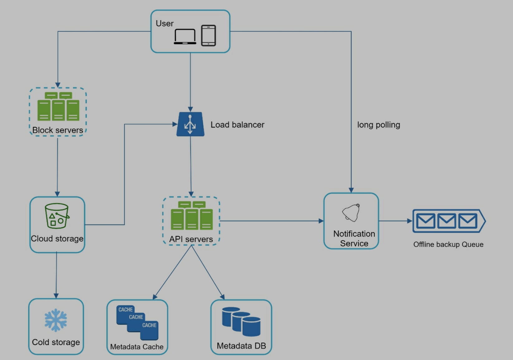

- user
- block server
  - upload blocks to cloud storage
  - block storage: block-level storage, store data files on cloud-based environments
  - a file can be split into several blocks, each has a unique hash value stored in metadata db
  - each block is an independent object and stored in storage system (S3)
  - to reconstruct a file, blocks are joined in a particular order
  - Dropbox block size is 4 MB
- cloud storage: file is split into small blocks and stored in cloud storage
- cold storage: store inactive data
- load balancer: distribute requests
- API servers
  - do everything except uploading flow
  - user authentication
  - user profile
  - updating file metadata...
- metadata db
  - store metadata of users, files, blocks, versions...
  - not store the file itself
- metadata cache
- notification service
  - publisher/subscriber system
  - from notification service to clients
  - add/edit/remove...
- offline backup queue
  - if client is offline, cannot pull the latest file changes, offline backup queue stores the info so changes will be synced when client is online

# Step 3: Design deep dive

## Block servers

- Delta sync: when a file is modified, only modify blocks
- compression: blocks are compressed
- split -> compression -> encryption -> upload to cloud storage

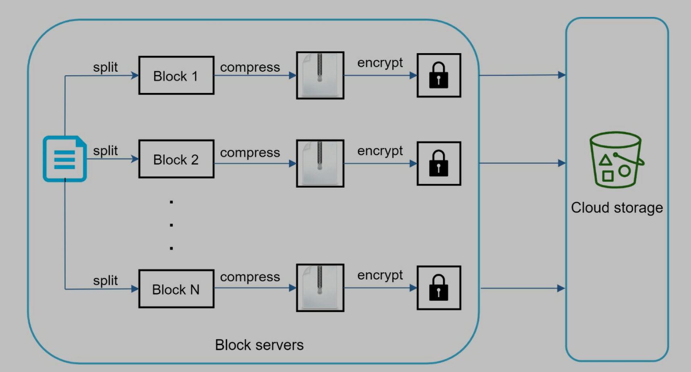
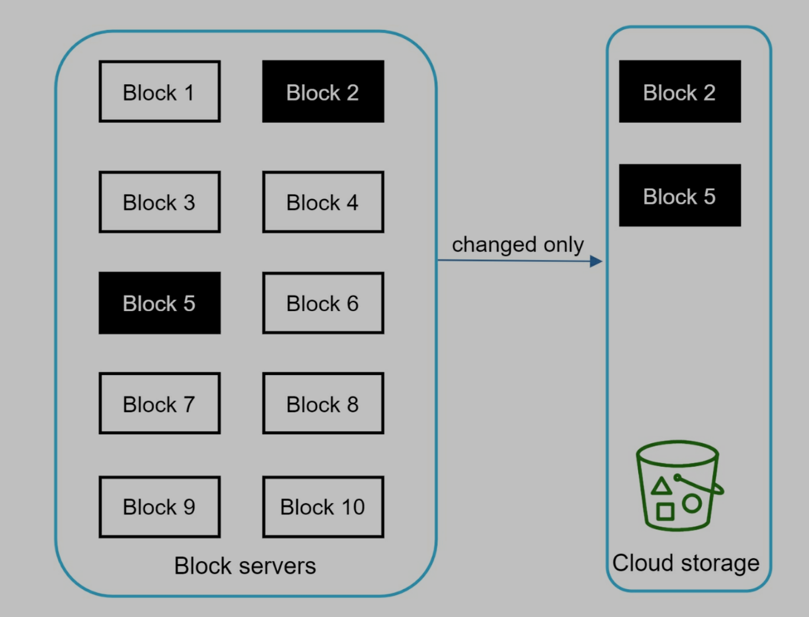

- only modified blocks are uploaded to the cloud storage
- save network traffic

## high consistency requirements

- by default, memory cache adopt an eventual consistency model, but we need strong consistency
- data in cache replicas and master is consistent
- invalidate caches on db write to ensure cache and db hold same value

## metadata db

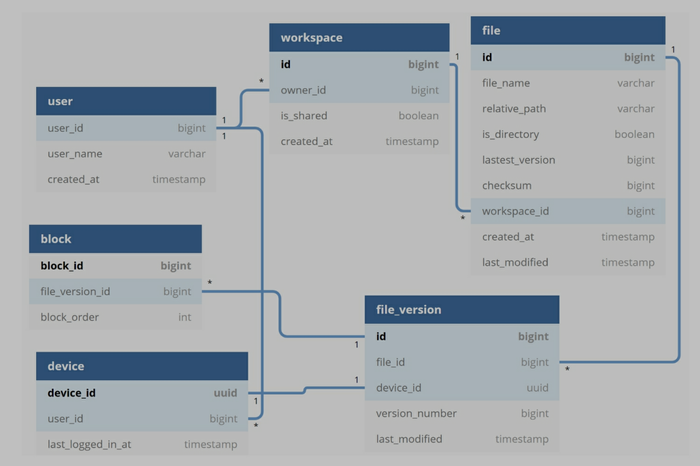

- user: username, email, profile photo...
- device:
  - device info.
  - push_id is used for sending and receiving mobile push notification
- namespace: root directory of a user
- file: related to the latest file
- file_version: version history of a file
- block: related a file block

## upload flow

[img](assets/15-14.png)

two requests are sent in parallel: add file metadata and upload to cloud storage

- add file metadata
  - client 1 requests to add metadata of the new file
  - store new file metadata in db and change the file upload status to "pending"
  - tell notification service that a new file is being added
  - notification service tell relevant clients (client 2)
- upload files to cloud storage
  - client 1 uploads files to block servers
  - block servers split files into blocks, compress, encrypt, upload to cloud storage
  - once file is uploaded, cloud storage triggers upload completion callback, send request to API servers
  - change file status to "uploaded" in metadata db
  - tell notification service that file status is changed to "uploaded"
  - notification service notifies relevant clients (client 2)

## download flow

triggered when a file is added or edited.

How does a client know if a file is added or edited by anther client? two ways

- if client A is online and file is changed by another client, notification service can tell her
- if client a is offline and file is changed by another client, data will be saved to cache. When she is online, she can pull the latest changes

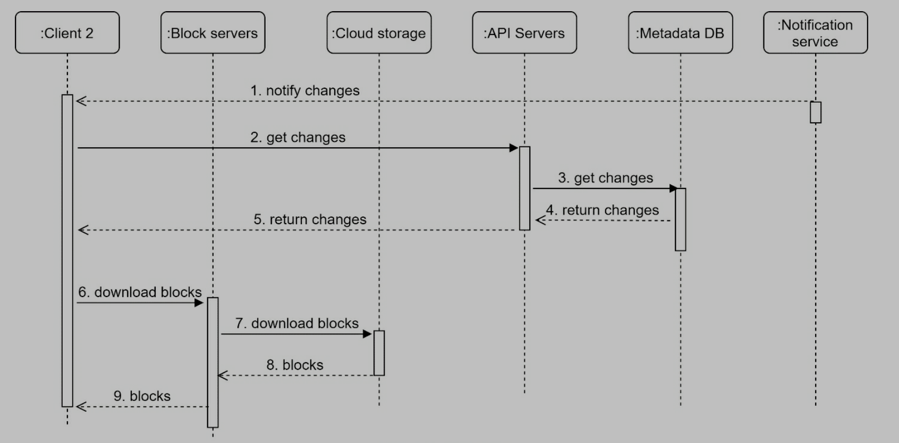

1. Notification service informs client 2 that a file is changed
2. Once client 2 knows that new updates are available, it sends a request to fetch metadata.
3. API servers call metadata DB to fetch metadata of the changes.
4. Metadata is returned to the API servers.
5. Client 2 gets the metadata.
6. Once the client receives the metadata, it sends requests to block servers to download blocks.
7. Block servers first download blocks from cloud storage.
8. Cloud storage returns blocks to the block servers.
9. Client 2 downloads all the new blocks to reconstruct the file.

## notification service

- modifications need to be informed to clients to reduce conflicts
- when events happen, send notifications to clients
- long polling
  - each client establishes a long polling connection to the notification service
  - when modifications happen, client will close long poll connection
  - connect to the metadata server to download the latest changes
  - send a new request to keep the connection open

## save storage space

- de-deplicate data block
  - eliminate redundant blocks
- intelligent data backup strategy
  - set a limit number of versions to store
  - only keep valuable versions
- moving infrequently data to cold storage

## Failure handling

- load balancer failure
  - secondary becomes active and pick up the traffic
  - heartbeat check
- block server failure
  - other servers pick up jobs
- cloud storage failure
- API server failure
  - redirect to other API servers by load balencer
- metadata cache failure
  - replicate cache servers
  - bring up a new cache server to replace the failed one
- metadata db failure
  - master down: promote a slave to master
  - slave down: bring anther db server to replace it
- notification service failure
  - online users keep a long poll connecting with notification server
  - each notification server is connected with many users (1 million connections for one server, Dropbox)
  - if one server goes down, all poll connection are lost
  - reconnect all clients to another server
- offline backup queue failure
  - queue are replicated multiple times

# Step 4 - Wrap up
