# Scale from Zero to Million of Users

# Single server setup

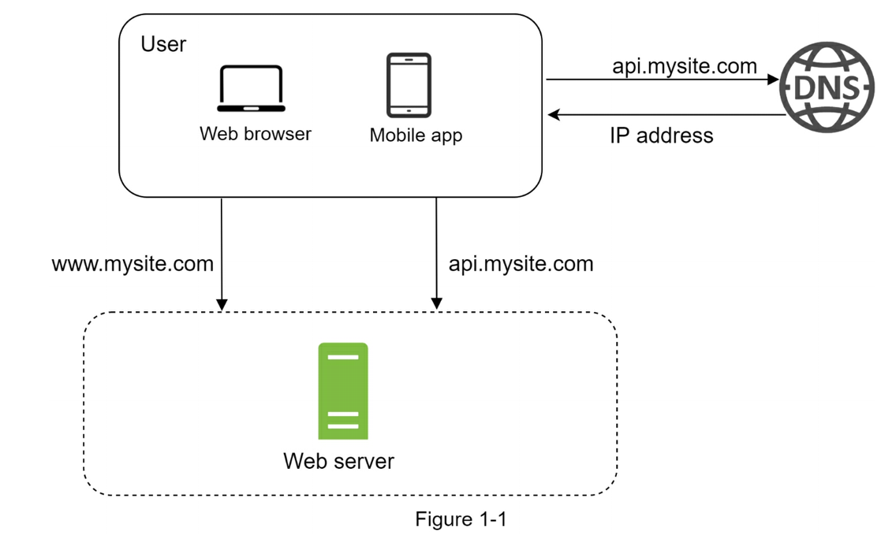

1. Client sends domain to DNS
2. DNS returns IP address
3. HTTP requests are sent to server
4. Server returns HTML pages or JSON response

用户变多,需要添加 server 和 db

1. 一个 server 负责 web/mobile traffic
2. 一个 server 负责数据库

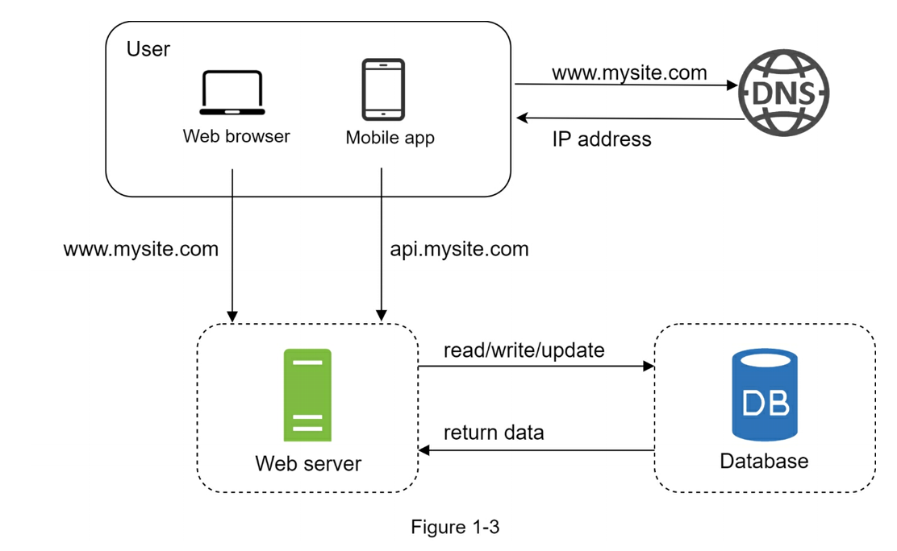

- relational db
- non-relational db
  - key-value stores, graph stores, column stores, document stores...
  - app requires super-los latency
  - data are unstructured
  - don't have any relational data
  - only need to serialize/deserialize data (JSON, XML, YAML...)
  - need to save a massive amount of data

# Vertical scaling vs horizontal scaling

- vertical: "scale up"; add more power (CPU, RAM...)
  - good for small app
  - simple
  - has a hard limit
  - no failover (故障转移) and no redundancy(冗余)
- horizontal: "scale out"; add more servers
  - good for large app

# Load balancer

A LB evenly distributes incoming traffic among servers

- client 不能直接访问 server
- private IPs 用做 server 之间以及 LB 和 server 之间的通信, 更安全
- solve no failover issue (如果 server1 坏了, traffic 会转移到 server2)
- improve availability (可以随时添加更多的 server)

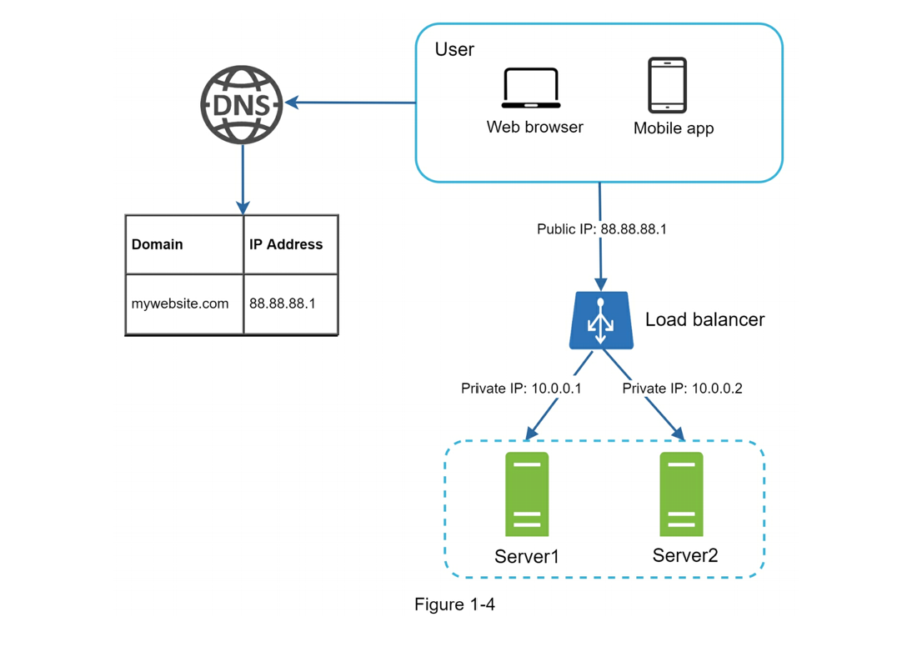

# Database replication

- master, slave architecture
- master: write; slave: read

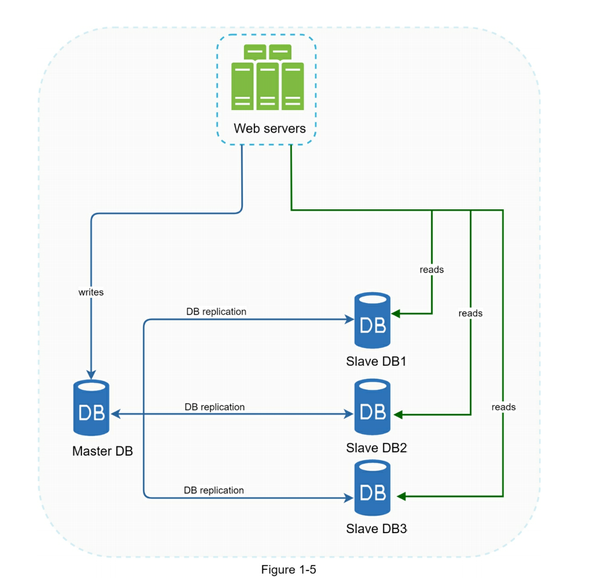

优点

- better performance
- reliability: 多个数据备份, 不易丢失
- high availability: 多地区备份, 坏了一个还有其他
  - slave 坏了: operations 会被转移到 master 或者其他 slave
  - master 坏了: 一个 slave 会被提升为 master

当前 design (web tier and data tier)

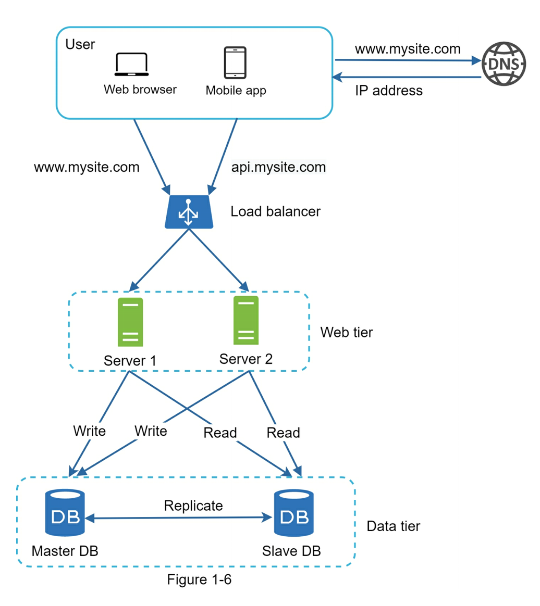

- client -> DNS
- DNS returns IP address of LB
- client -> LB
- HTTP request is routed to server1/2
- server read date from slave; write to master

> 下一步
> improve load/response time - cache and CDN

# Cache (tier)

A cache is a temporary storage area that stores the result of expensive responses or frequently accessed data in memory so that subsequent requests are served more quickly.

The cache tier is a temporary data store layer, much faster than the db.

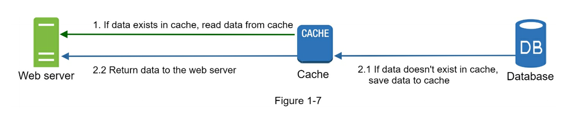

server first checks if the cache has the response

1.  if it has, server sends data back to client
2.  if not, go to db get data, save to cache, and then sends data back to client

Memcached API

```
SECONDS = 1
cache.set('myKey', 'hi', 3600 * SECONDS)
cache.get('myKey')
```

注意事项

1. use when read frequently, but modified infrequently
2. 设定 expiration policy
3. consistency: keep data store and cache in sync
4. mitigating (减轻) failures:
   1. single cache server 会造成 SPOF(single point of failure), 所以推荐使用 multiple cache servers
   2. overprovision(过度供给) the required memory, 防止内存不够
5. Eviction (驱逐) policy: 当 cache 满了之后, 一些数据会被清除来存放新数据(例如 LRU eviction policy)

# CDN

A CDN is a network of geographically dispersed servers used to deliver static content. CDN servers cache static content like images, videos, CSS, JavaScript files, etc.

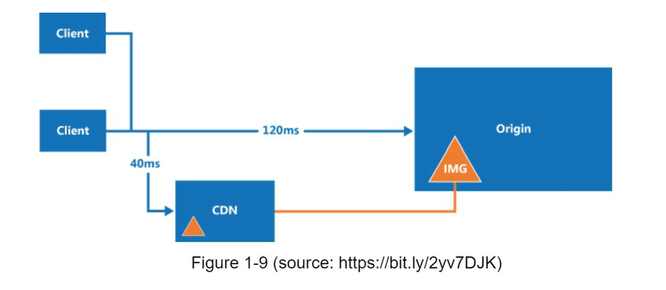
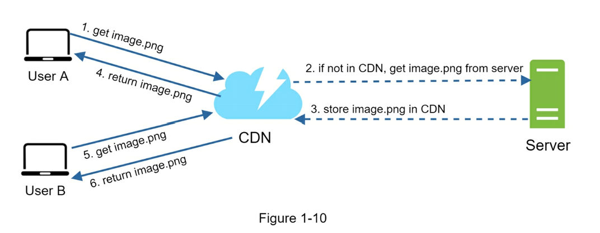

流程

1. A 向 CDN 请求图片
2. CDN server 的 cache 中没有图片, CDN 向 web server 或 online storage 请求图片
3. 返回图片和 TTL(cache 的 Time to Live)给 CDN
4. CDN cache 图片然后返回给 A
5. B 向 CDN 请求图片
6. CDN cache 中有图片,直接返回

注意事项

1. cost
2. 设定 cache expiration 时间
3. CDN fallback: 需要能够检测到 CDN 是否健康. 如果 CDN 坏了, 用户应该可以直接从 server 拿资源
4. Invalidating files
   1. 有办法 invalidate 文件, 通常 vendors 提供
   2. use object versioning

当前设计

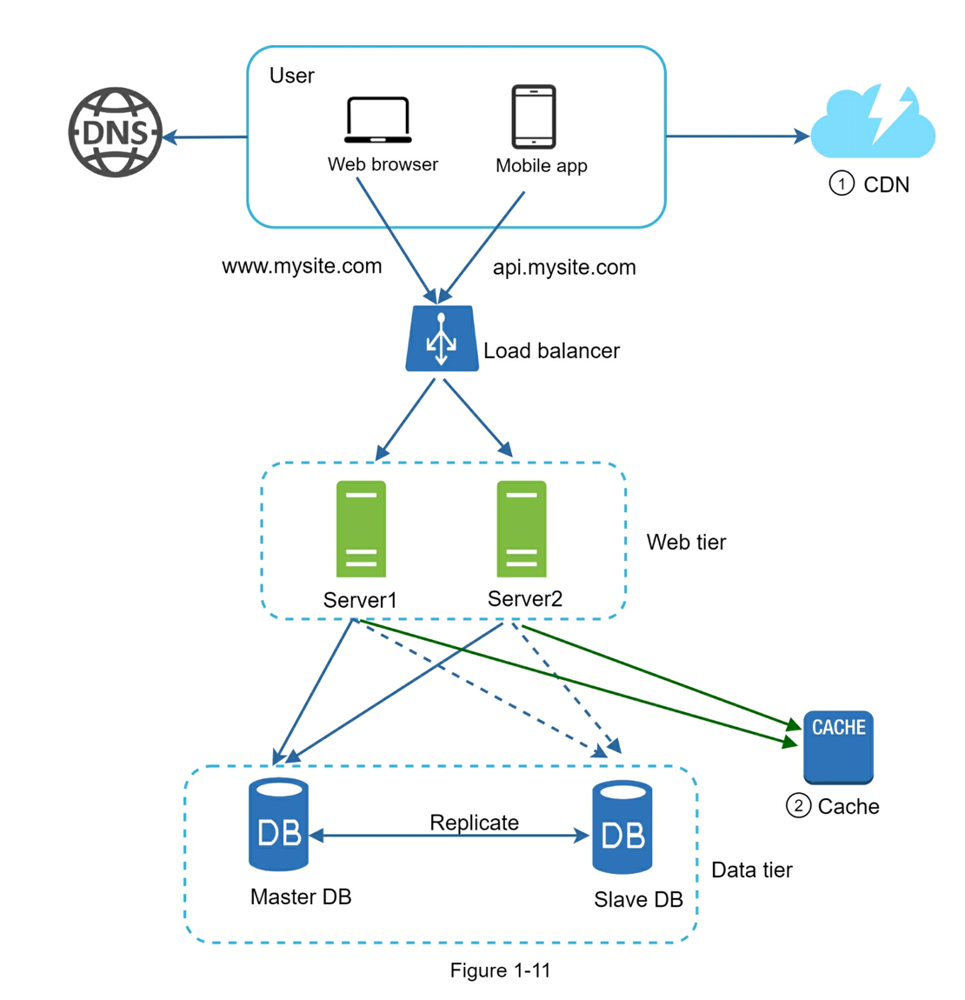

# Stateless web tier

Scale web tier horizontally.

## Stateful and Stateless server 的区别

- Stateless web tier
  - Move state (like user session data) out of the web tier and into database. So each web server in the cluster can access state data from db.
  - Request can be sent to any web servers
- Stateful web tier
  - remember client data (state) from one request to the next
  - user A 的信息存在 server A; user B 的信息存在 Server B. Server B 不能验证 User A.
  - Request from the same client must be routed to the same server
  - can be implemented by sticky sessions in most LB
  - **hard to add or remove servers**
  - **hard to handle server failures**

stateful architecture
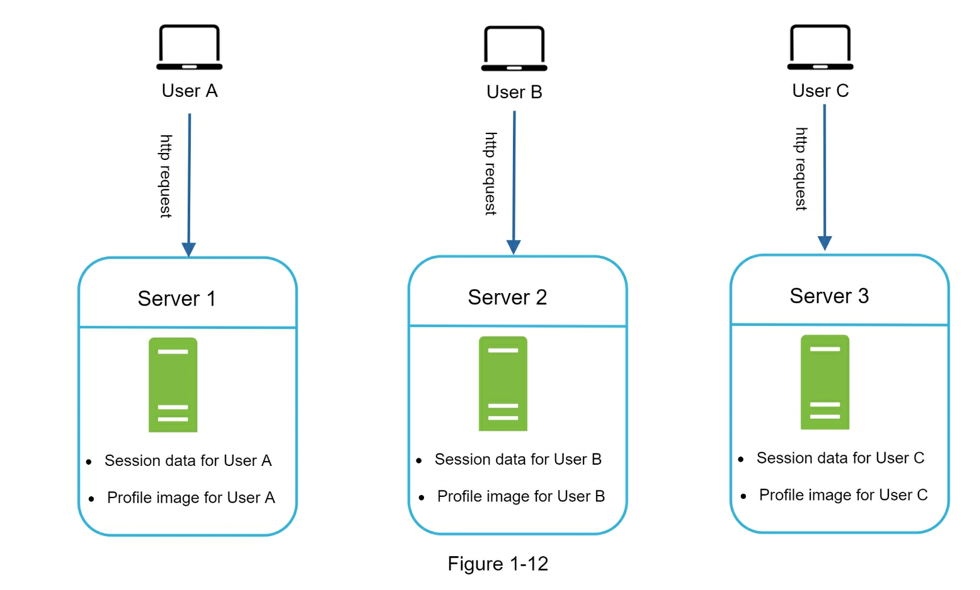

stateless architecture
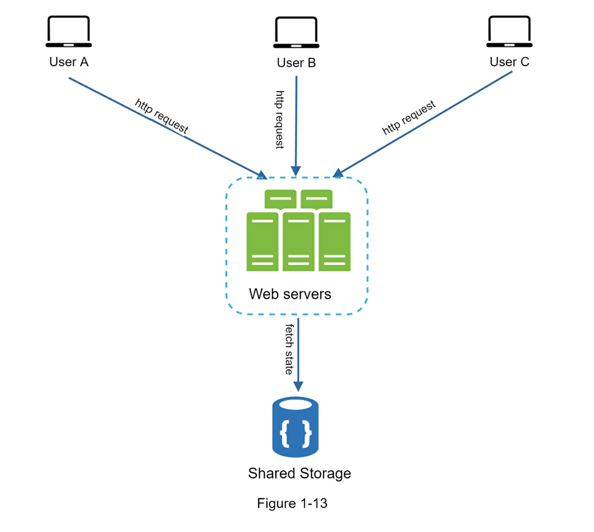

当前设计
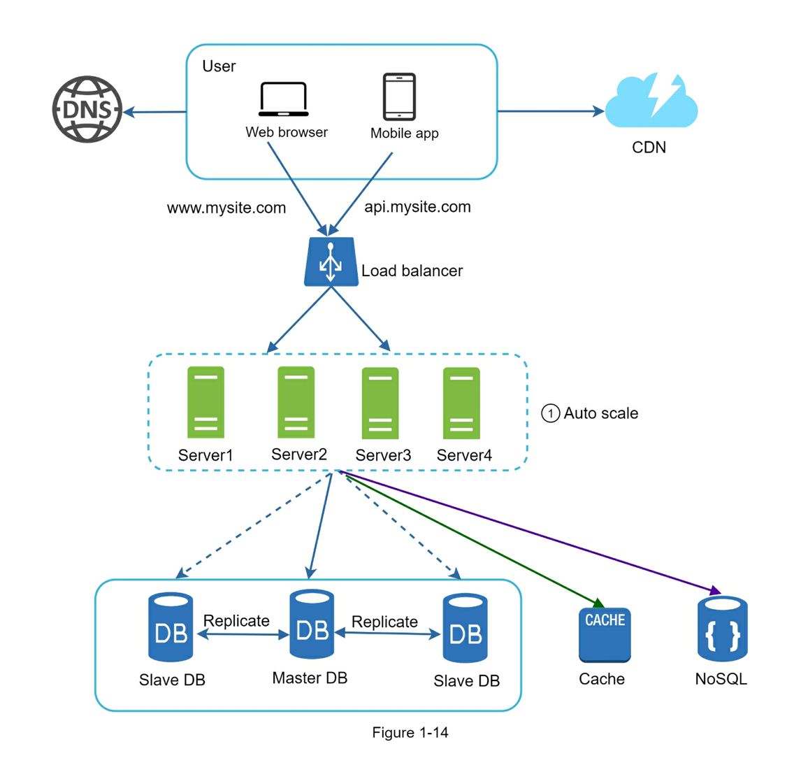

shared data store could be relational db. Memcached/Redis, NoSQL.

# Data center

To improve availability and provide a better user experience across wider geographical areas,
supporting multiple data centers is crucial.

- 两个 data center, 根据用户的所在地, 把用户的请求分散到地理位置比较近的 data center
- 当有一个 data center 坏了(outage/offline), 可以暂时把所有的流量转移到另一个 data center

实现 data center 需要解决的问题

- traffic redirection: 需要根据用户地理位置选择 data center, 例如使用 GeoDNS
- data synchronization: 不同地区的用户可能使用不同的数据库和 cache, 当出现 failover 的时候, 如何转移这些用户到新的 data center? 通常的做法是在多个 data center 都有数据备份
- test and deployment: 确保在不同地区的 server 运行成功. 通常使用 automatic deployment tools

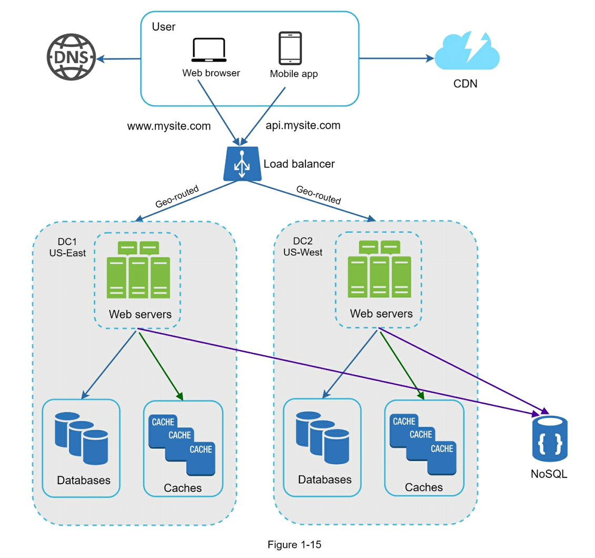

# Message queue

decouple different components of the system so they can be scaled independently

**A message queue is a durable component, stored in memory, that supports asynchronous communications. It serves as a buffer and distributes asynchronous requests.**

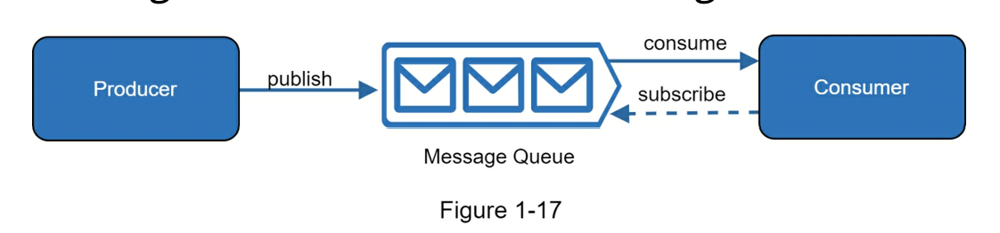

- 有些任务需要很长时间处理, 例如图片处理. 此时可以 publish 任务到 queue 中, 然后 worker 拉取任务并执行. 这样就不必等待了, 实现了异步操作
- 通过 message queue, 可以动态的调整 worker server 的数量, 繁忙的时候增加 server, 清闲的时候减少 server, 从而打到高效工作

# Logging, metrics, automation

- logging
  - monitor error logs
  - 得到每个 server 的信息
- Metrics
  - host level metrics: cpu, memory, disk IO...
  - aggregated level metrics: performance of database tier, cache tier...
  - key business metrics: daily active users, retention, revenue...
- Automation
  - continuous integration
  - automate build, test, deploy process...

# Add message queues and different tools

message queue 的好处

- loosely coupled
- failure resilient

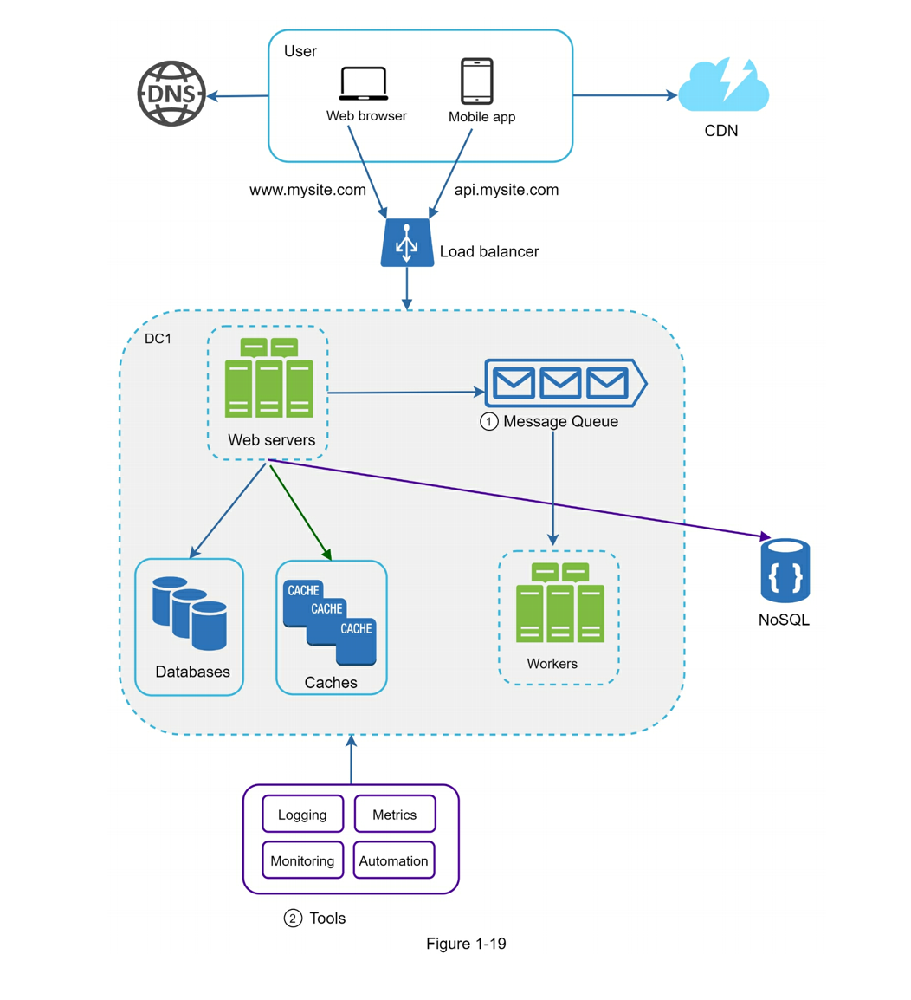

# Database scaling

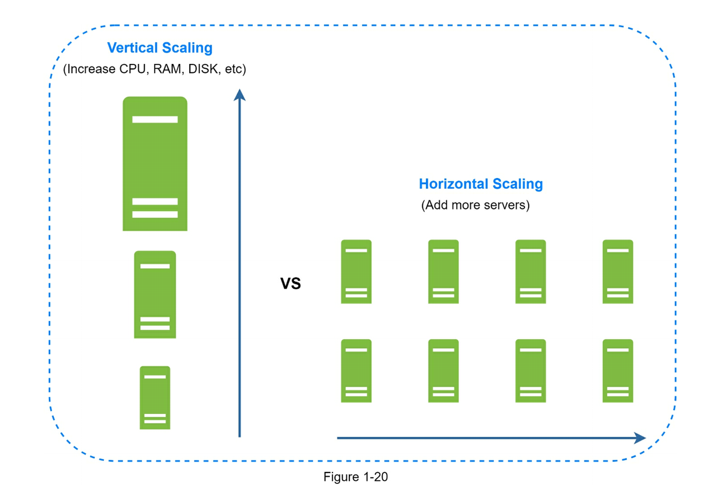

## vertical scaling (scale up)

- 用更好的机器, CPU, RAM (AWS 可以扩展到 24TB), DISK....
  - stackoverflow 2013 年有 10,000,000 月访问, 但是他们只用了一个 master database
- 缺点
  - hardware limits, 总会不够用的
  - risk of single point of failures
  - cost is high

## horizontal scaling (sharding)

> 定义: Sharding separates large db into smaller, more easily managed parts called shards.
> Each shard shares the same schema
> Actual data on each shard is unique

- add more servers
- 根据一定的规则(hash function)拆分数据, 然后存在不同的 shard 中
- sharding key (partition key)的选择很重要, 最好是可以得到 evenly distributed data. 下面的例子使用 user_id 作为 sharding key
- 挑战
  - 可能需要 resharding data
    - 当 single shard 打到存储上限了
    - uneven data distribution 可能造成某些 shards 有很多数据(sharding exhaustion), 某些几乎没有数据. 此时需要更新 sharding function 并且移动数据. **consistent hash 是通常的解决方案**
  - celebrity problem (hotspot key problem)
    - 某一个 shard 有超多访问, 例如很多名人的数据存放在一个 shard 上会造成 server overload. 此时可能需要把每个名人放到一个 shard 上
  - join and de-normalization
    - 当数据被分散到各个 shard 之后, 数据就不容易做 join 操作了. 通常可以 de-normalize db 的方法解决问题, 也就是把某些经常使用的数据弄到一起再存一份, 这样会多存一份数据, 但是会加快查询速度 https://rubygarage.org/blog/database-denormalization-with-examples

使用 user_id % 4 拆分数据, 如果结果为 0, 那么数据存在 shard0...
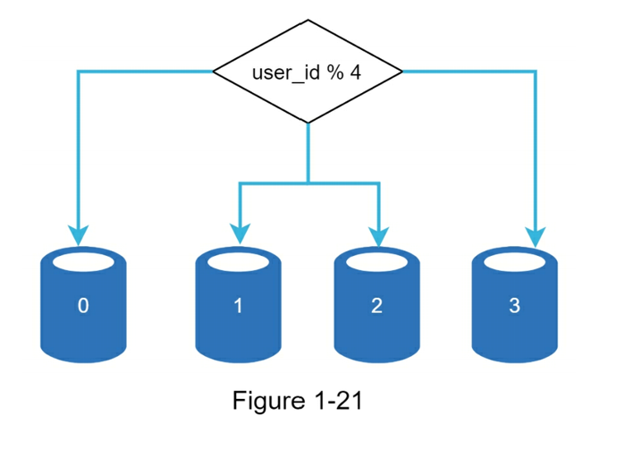
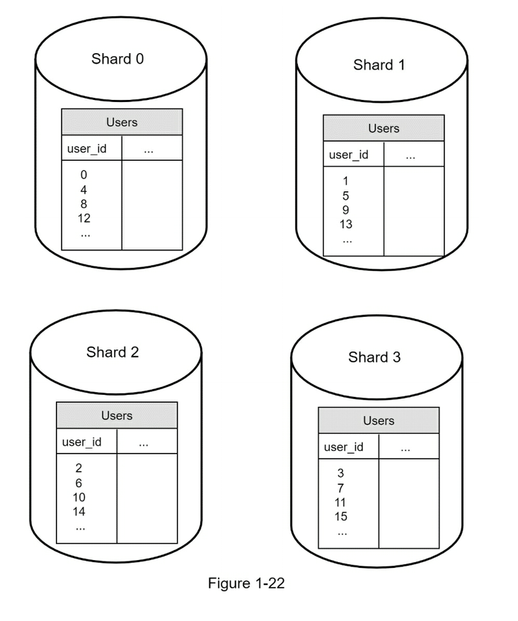
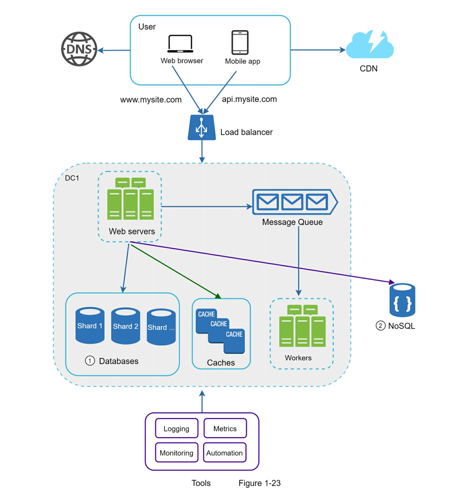

# Millions of users and beyond

- keep web tier stateless
- build redundancy at every tier
- cache data as much as you can
- support multiple data centers
- host static assets in CDN
- scale data tier by sharding
- split tiers into individual services
- monitor system and use automation tools
