# Chapter 1: Scale from Zero to Million of Users

# 1. Single server setup

## 1.1 Simple design V1

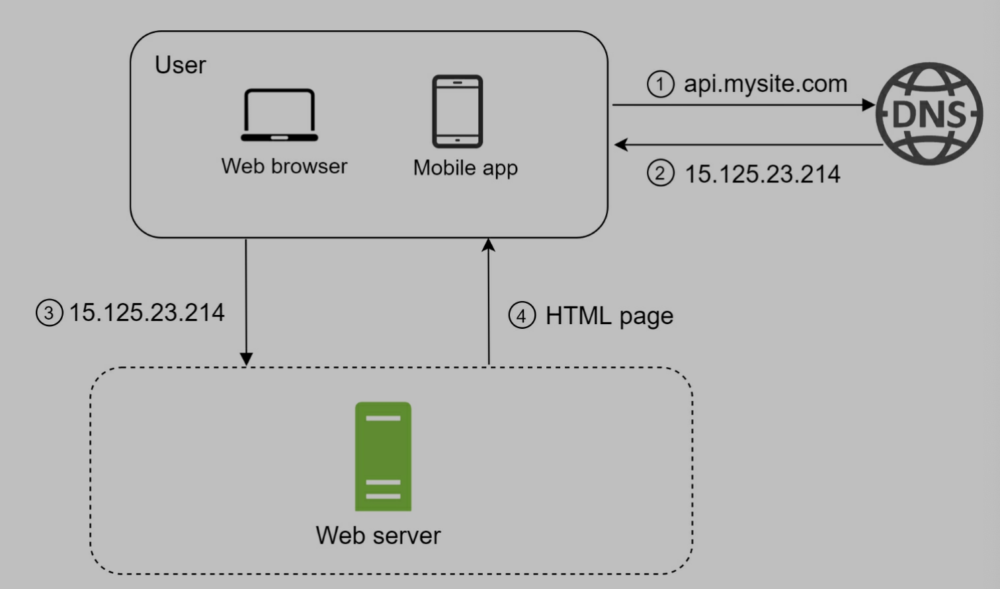

1. Client sends domain to DNS (Domain Name System)
2. DNS returns IP address
3. Client sends HTTP requests to web server
4. Server returns HTML pages or JSON response

## 1.2 Simple design V2

### Two servers

> With the growth of the users numbers, one server is not enough, what we should do?
> Add one more server!

1. server 1 for web/mobile traffic
2. server 2 for DB

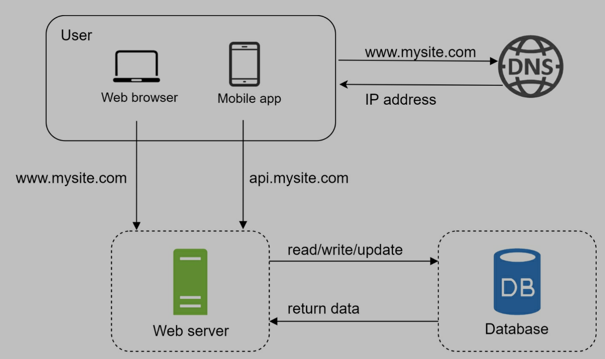

### DB selections

- Relational DB (MySQL, Oracle database, PostgreSQL...)
- Non-relational DB (CouchDB, Neo4j, Cassandra, HBase, Amazon DynamoDB...)
  - Four categories:
    - key-value stores
    - Graph stores
    - Column stores
    - Document stores
  - No join operations

> When select NoSQL?

- Require super-low latency
- Data is unstructured
- No any relational data
- Only need to serialize/deserialize data (JSON, XML, YAML...)
- A massive amount of data

# 2. Vertical scaling vs horizontal scaling

## 2.1 Vertical - Scale up!

- Add more power to servers (CPU, RAM...)
- Pros
  - Good for small app
  - Simple
- Cons
  - Hard limit: impossible to add unlimited CPU and memory to one server
  - No failover (故障转移)
  - No redundancy

## 2.2 Horizontal - Scale out!

- Add more servers
- Good for large app

# 3. Load balancer

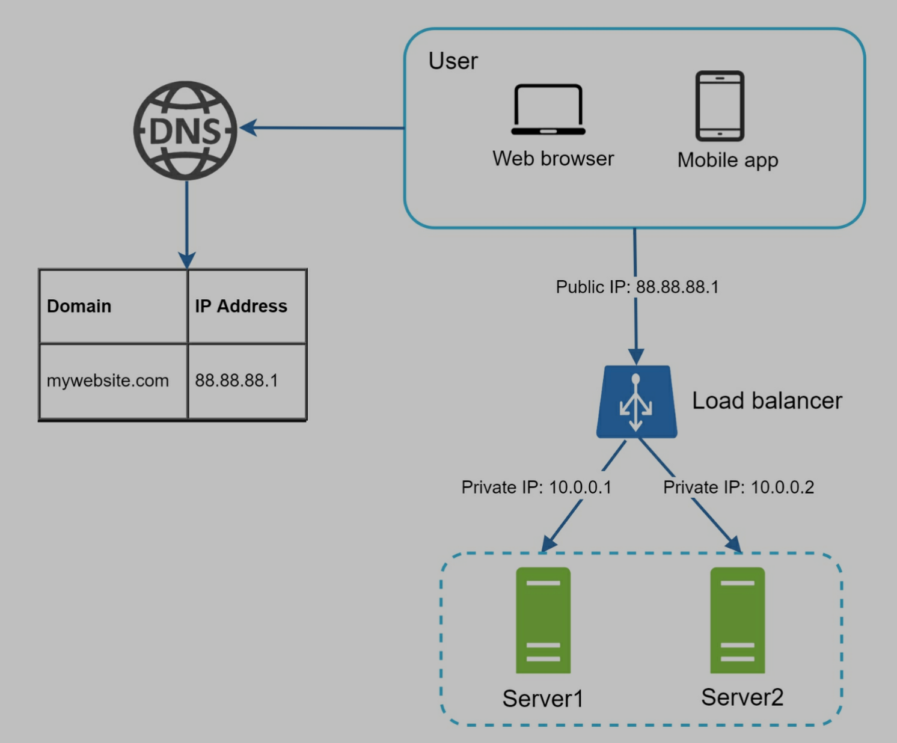

- Evenly distributes incoming traffic among servers
- Security
  - Servers are not reachable directly by clients
  - Private IPs are used for server-server and server-LB communications
- Availability
  - Failover, if s1 is down, traffic will be redirected to s2
  - We can add more servers anytime if traffic grows

# 4. Database replication

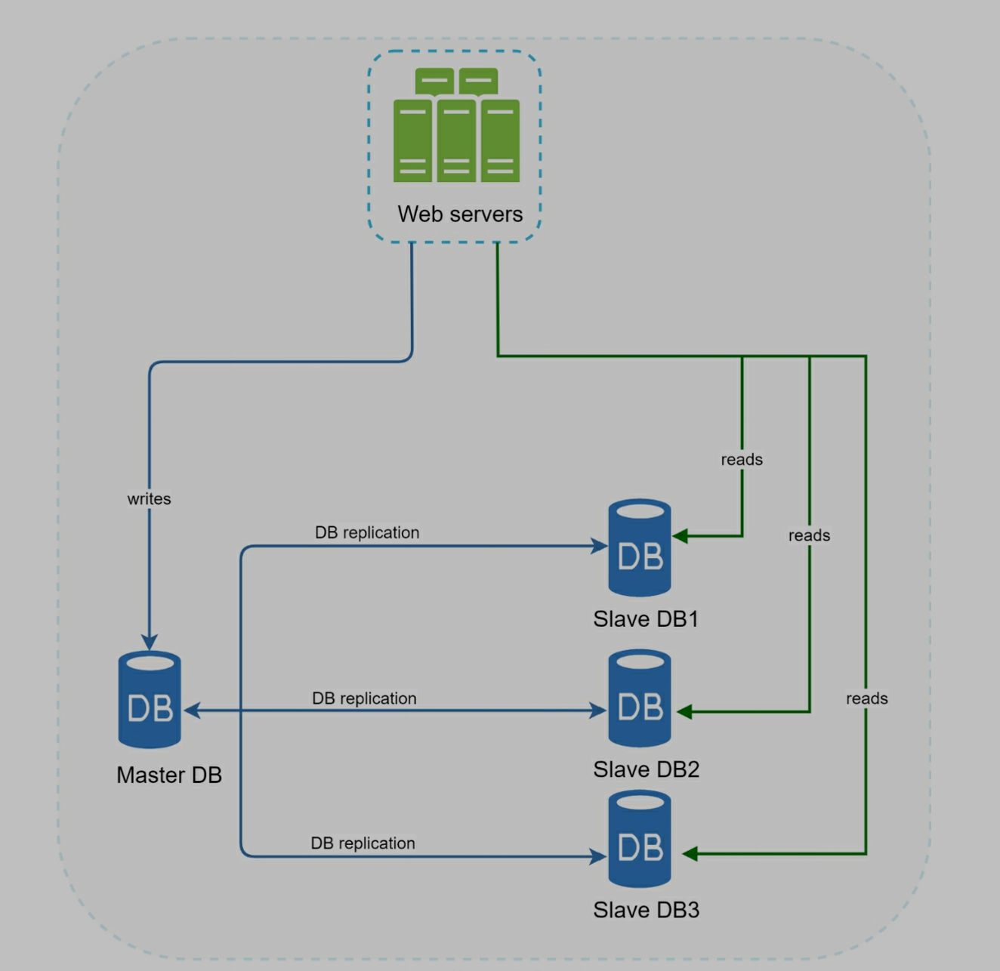

- Master-slave architecture
- Master: write; slave: read
- Pros
  - Performance
  - Reliability: no data lose
  - Availability
    - Multi-regions replications
    - If slave is down, operations are redirected to master
    - If master is down, a slave is promoted to be master

> Current design (web tier and data tier)

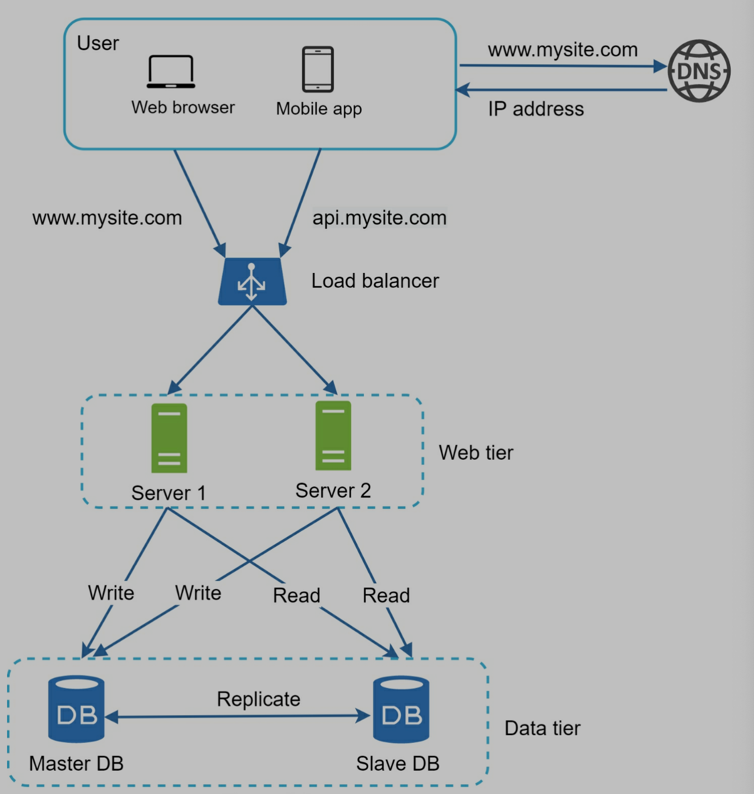

> What is the next step?
> Improve load/response time with cache and CDN

# 5. Cache

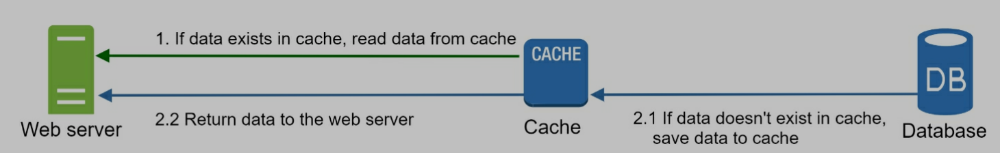

## What is cache and cache tier?

> A cache is a temporary storage area that stores the result of expensive responses or frequently accessed data in memory so that subsequent requests are served more quickly. The cache tier is a temporary data store layer, much faster than the db.

## How it works?

> Server first checks if the cache has the data

1. If it has, server sends data back to client
2. If not, server goes to DB get data, save to cache, and then sends data back to client

> Example: Memcached API

```
SECONDS = 1
cache.set('myKey', 'hi', 3600 * SECONDS)
cache.get('myKey')
```

## Considerations for using cache

- Use cache when read is frequent, but modification is not
- Set up expiration policy
- Consistency: keep data store and cache in sync
- Mitigate (减轻) failures
  - Use multiple cache servers to avoid SPOF(single point of failure)
  - Overprovision(过度供给) required memory
- Eviction (驱逐) policy: when cache is full, delete some data (like LRU eviction policy)

# 6. CDN

## What is CDN?

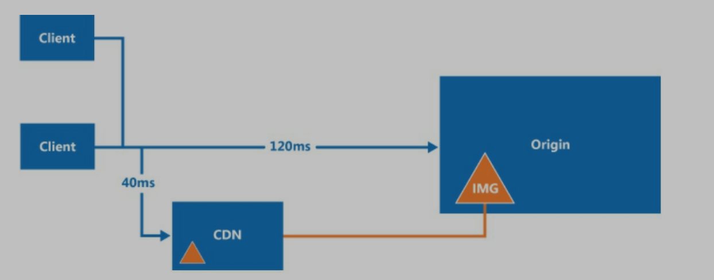
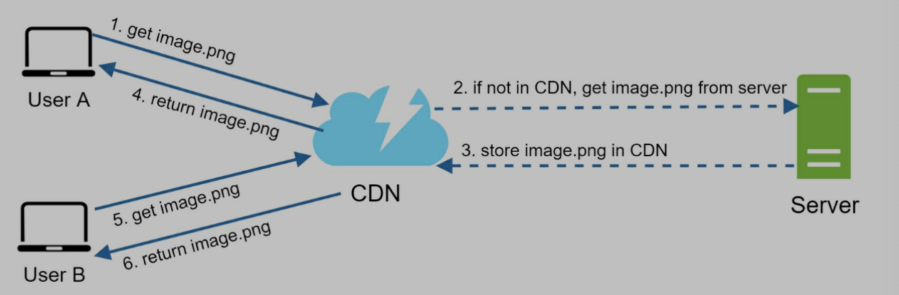

> A CDN is a network of geographically dispersed servers used to deliver static content.
> CDN servers cache static content like images, videos, CSS, JavaScript files, etc.

## Workflow

1. User A requests image.png to CDN
2. If CDN does not have the image, CDN gets it from web server or storage
3. Server returns the image and TTL(Time to Live) to CDN
4. CDN caches the image and returns to A
5. B requests image.png to CDN
6. CDN has the image, so returns to B

## Considerations of using a CDN

- Cost
- Set up cache expiration
- CDN fallback: check if CDN is health. If not, we should return images from servers
- Implement invalidating files feature
- Versioning objects

> Current design

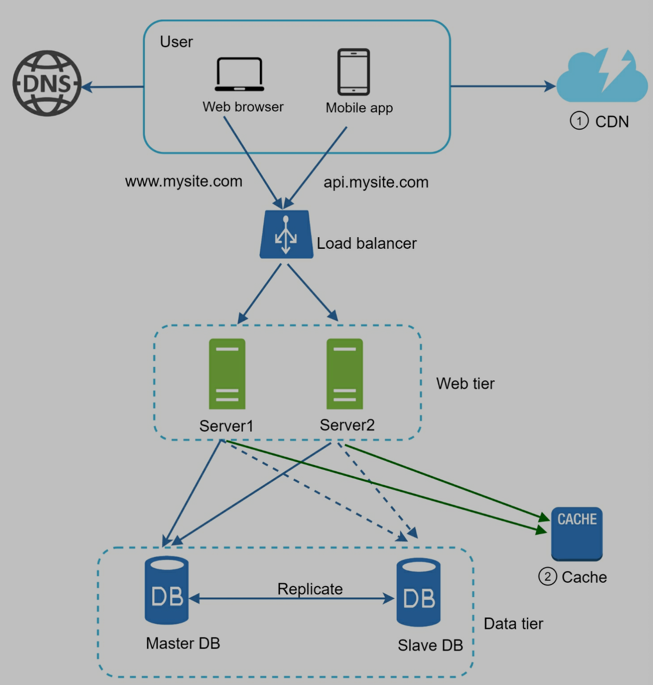

# 7. Stateless web tier

> How to scale web tier horizontally

## Stateful vs Stateless web tier

- Stateless
  - Move state (like user session data) out of the web tier and into a shared database (like NoSQL)
  - Each web server in the cluster can access state data from db
  - Request can be sent to any web servers
- Stateful
  - Remember client data/state from one request to the next
  - User A is saved in server A; user B is saved in server B. Server B cannot authenticate user A.
  - Request from the same client must be routed to the same server
  - Can be implemented by sticky sessions in most LB
  - **Hard to add or remove servers**
  - **Hard to handle server failures**

Stateful architecture


Stateless architecture
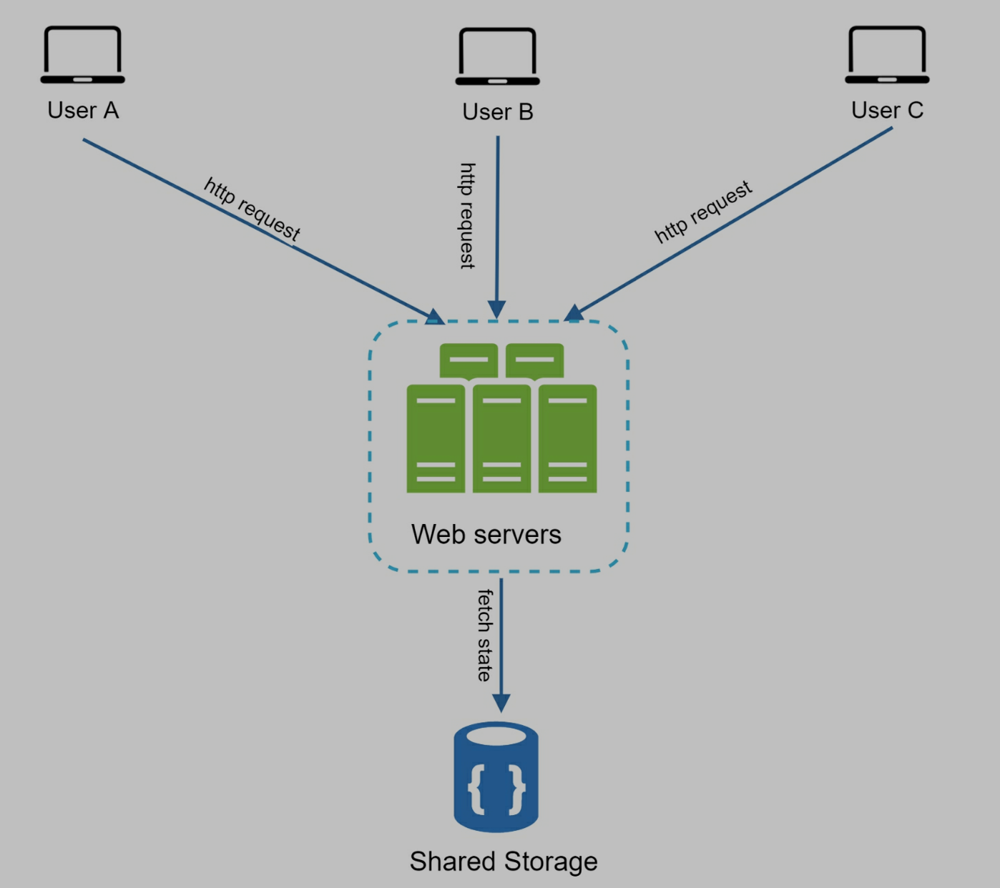

Current design
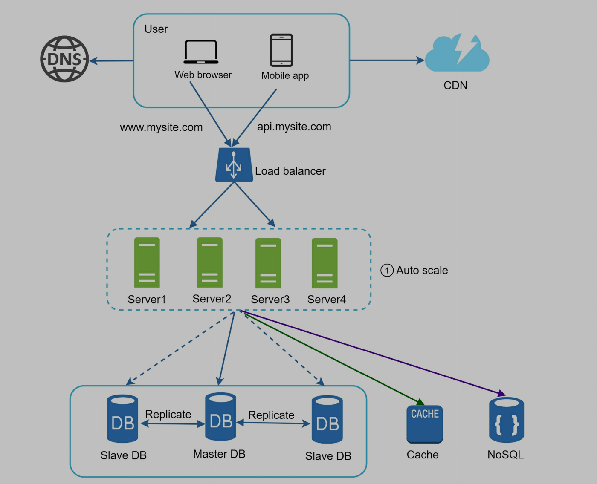

# 8. Data center

> To improve availability and provide a better user experience across wider geographical areas,
> supporting multiple data centers is crucial.

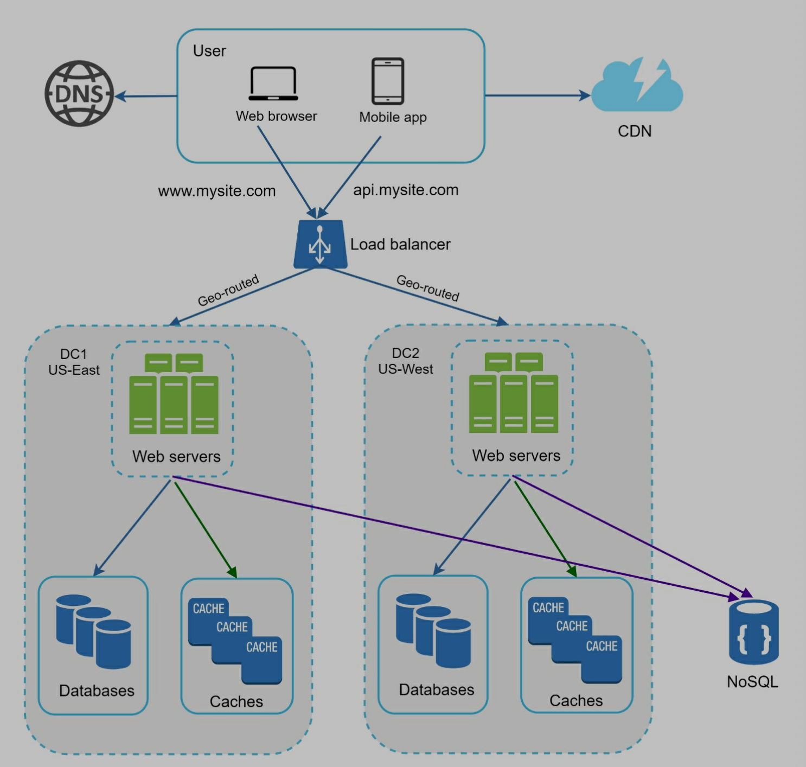

## Pros

- Performance: routes requests to the close data center
- Availability: When one data center is down (outage/offline), data center can pick up the traffic

## Problems and solutions

- Traffic redirection: redirect traffic based on location (use GeoDNS)
- Data synchronization: replicate data across multiple data centers
- Test and deployment: make sure servers in different data centers are running successfully (use automatic deployment tools)

# 9. Message queue

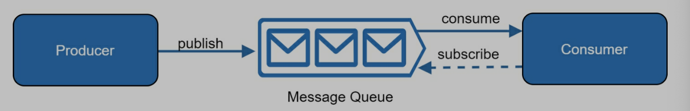

**A message queue is a durable component, stored in memory, that supports asynchronous communications. It serves as a buffer and distributes asynchronous requests.**

## Why message queue?


- Producers/publisher (consumers/subscribers) model
- **Decouple system and then scale independently**
- Dynamically add/remove servers/workers
- Failure resilient

# 10. Logging, metrics, automation

## Logging

- Monitor error logs
- Info for each server

## Metrics

- Host level metrics: cpu, memory, disk IO...
- Aggregated level metrics: performance of database tier, cache tier...
- Key business metrics: daily active users, retention, revenue...

## Automation

- Continuous integration
- Automate build, test, deploy process...

> Current design

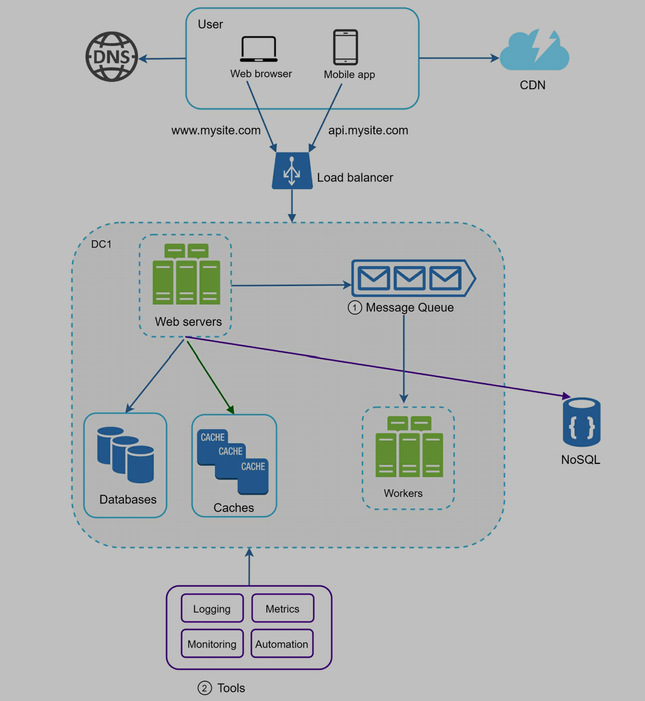

# 11. Database scaling

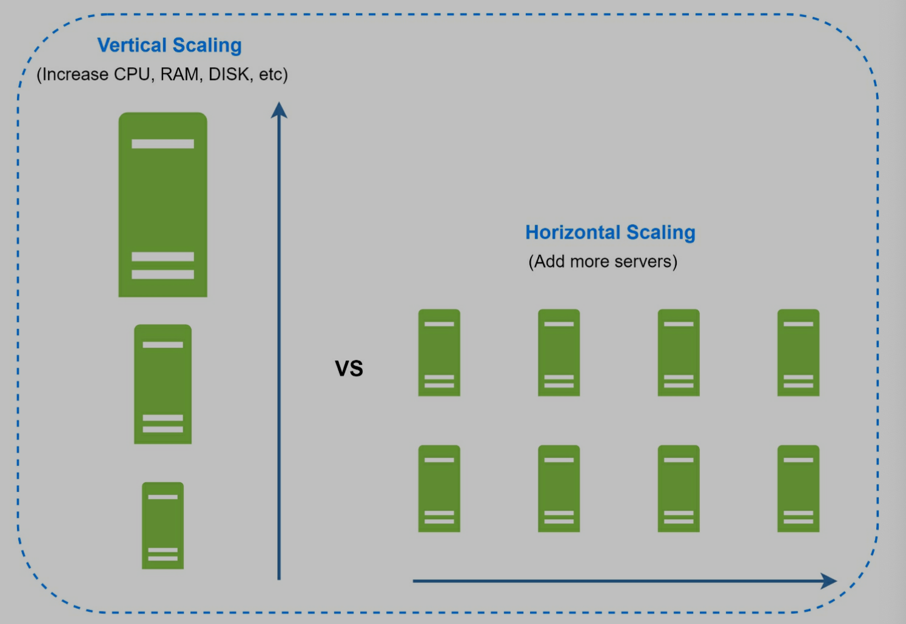

## Vertical scaling (scale up)

- Better machine, CPU, RAM (AWS can scale to 24TB), DISK....
  - In 2013, stackoverflow used one master database to handle 10,000,000 monthly visit
- Cons
  - hardware limits
  - risk of single point of failures
  - cost

## Horizontal scaling (sharding)

> Sharding separates large DB into smaller, more easily managed parts called shards.
> Each shard shares the same schema, but actual data on each shard is unique.

### How to sharding?

- Add more servers
- Separate data based on **hash functions**, then save data into different shards
- **Sharding key** (partition key) is crucial, it should evenly distribute data

### Problems and solutions

- Resharding data is required
  - When one shard is full
  - When uneven data distribution
  - **Solution: Consistent hash**
- Celebrity problem (hotspot key problem)
  - Specific shards are overloaded because of celebrity data
  - Solution: put only one or few celebrities on one server
- Join and de-normalization
  - Data is in different shards, it is hard to join
  - Solution: de-normalize DB. Collect frequent data in different shards into one table to improve performance

> Separate data with user_id % 4

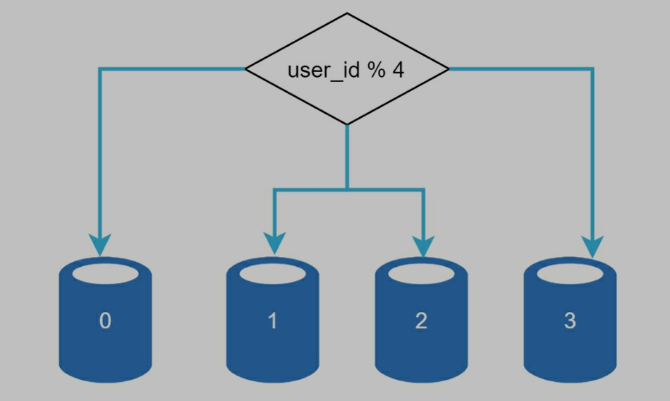


> Current design

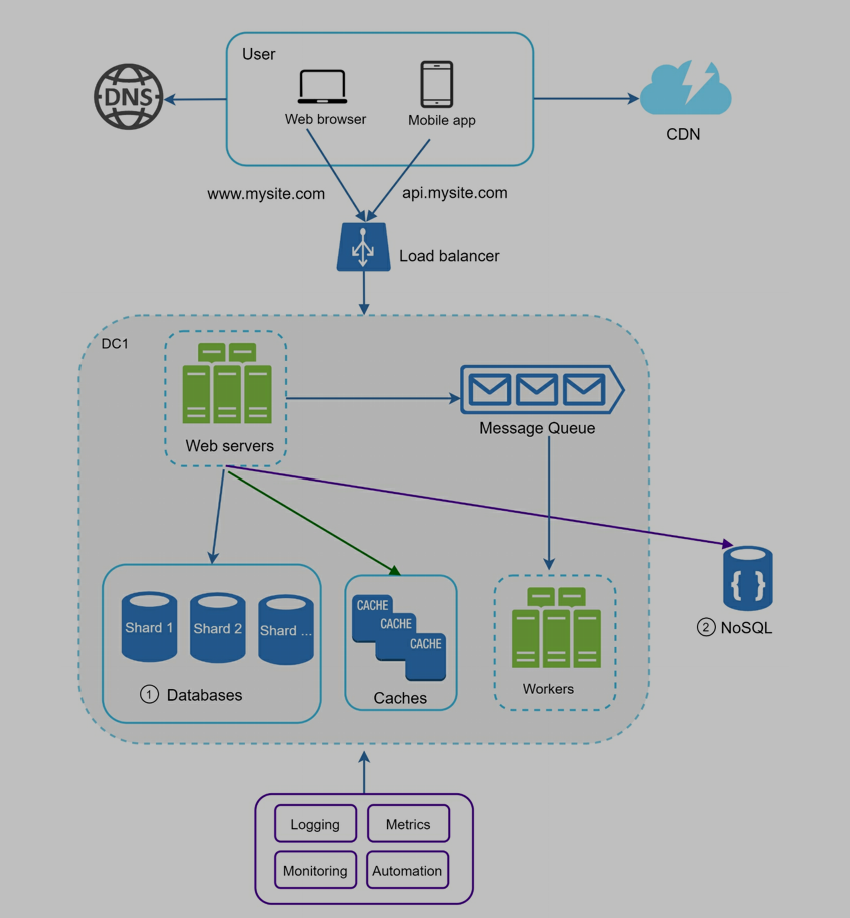

# 12. Millions of users and beyond

- Keep web tier stateless
- Build redundancy at every tier
- Cache data as much as you can
- Support multiple data centers
- Host static assets in CDN
- Scale data tier by sharding
- Split tiers into individual services
- Monitor system and use automation tools
