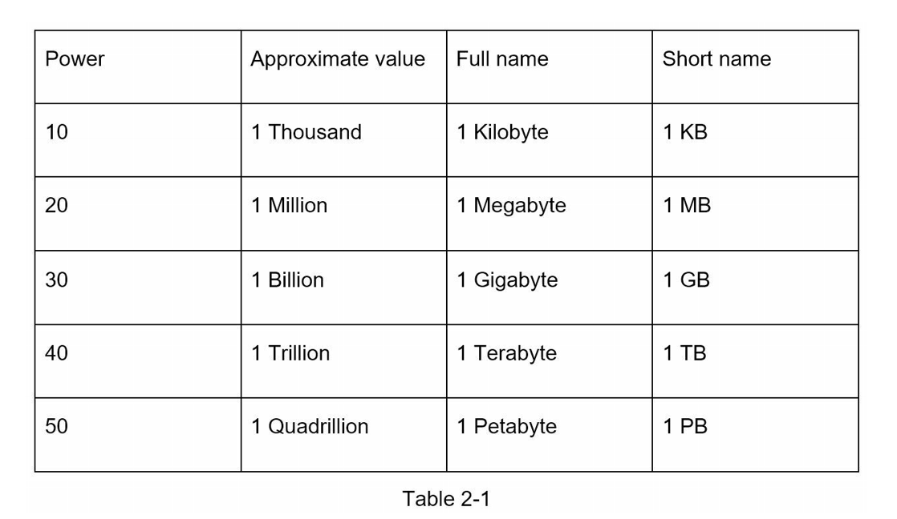
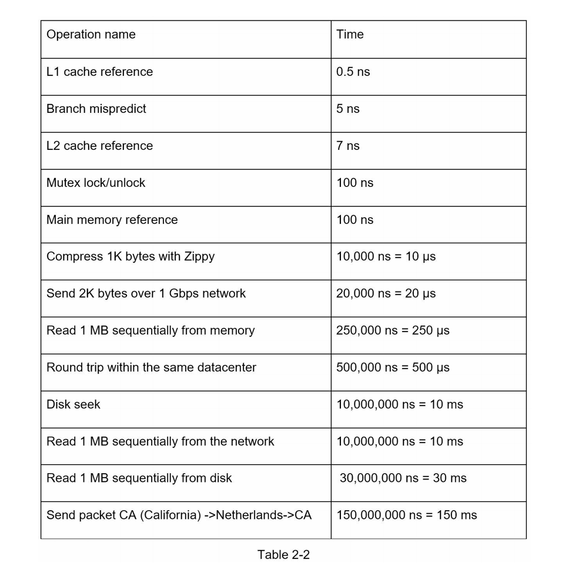
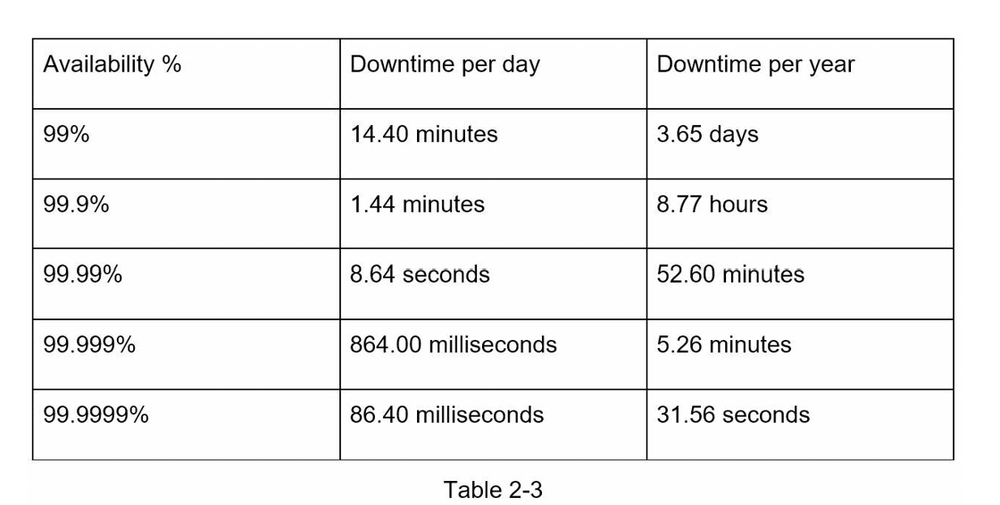

# Back-of-the-envelope Estimation

> back-of-the-envelope calculations are estimates
> you create using a combination of thought experiments and common performance numbers to
> get a good feel for which designs will meet your requirements

# Power of two

A byte is a sequence of 8 bits. An ASCII character uses one byte of memory (8 bits).

# Latency (潜在的) numbers every programmer should know

- Memory is fast but the disk is slow
- Avoid disk seeks if possible
- Simple compression algorithms are fast
- Compress data before sending it over the internet if possible
- Data centers are usually in different regions, and it takes time to send data between them

# Availability numbers

High availability is the ability of a system to be continuously operational for a desirably long period of time.

High availability is measured as a percentage, with 100% means a service that has 0 downtime. Most services fall between 99% and 100%.

A **service level agreement (SLA)** is a commonly used term for service providers. (AWS/GCP 等通常为 99.99%)

# Example: estimate twitter QPS and storage requirements

## 假设

- 300 million monthly active users (3 亿月活)
- 50% users use daily
- users post two tweets per day on average
- 10% tweets contain media
- data is stored for 5 years

## 预测

**Query per second (QPS)**

- Daily active users (DAU) = 300 million / 2 = 150 million (日活 = 月活 / 2)
- QPS = 150 million \* 2 tweets / 24 hour / 3600 second ~= 3500
- Peak QPS = 2 \* QPS ~= 7000 (peak qps = 2 \* qps)

**media storage**

- average tweet size
  - tweet_id: 64 bytes
  - text: 140 bytes (一个英文字母占 1byte, 一个汉子占 2 byte)
  - media: 1 MB
- media storage: 150 million \* 2 \* 10% \* 1 MB = 30TB / day
- 5 year media storage: 30 TB \* 265 \* 5 ~= 55 PB
