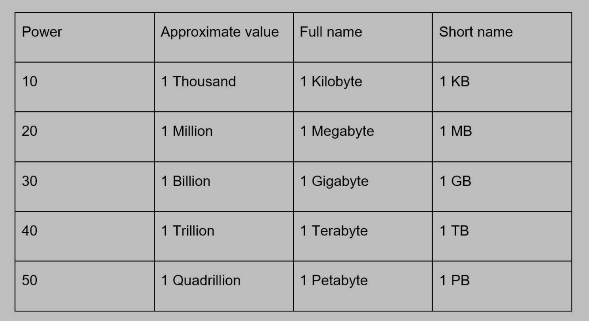
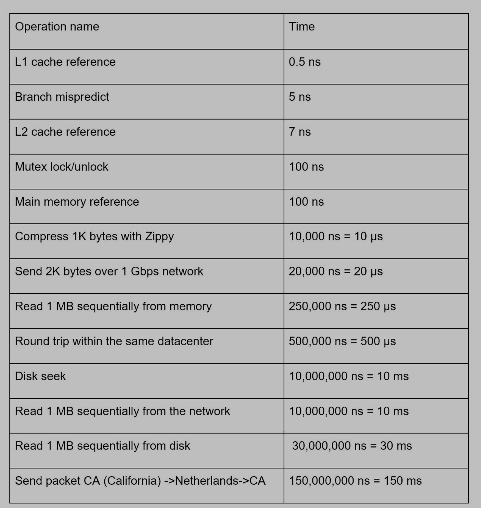
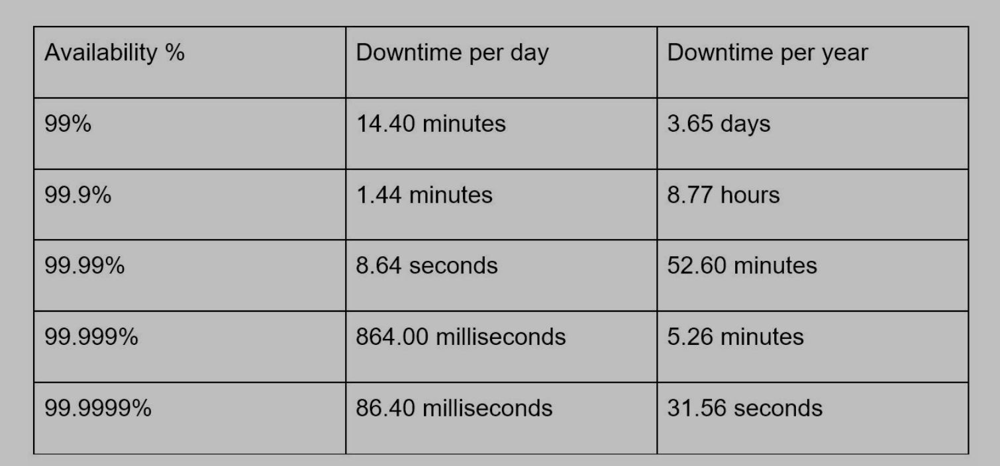

# Back-of-the-envelope Estimation

> Back-of-the-envelope calculations are estimates
> using a combination of thought experiments and common performance numbers to
> get a good feel for which designs will meet your requirements

# 1. Power of two

> A byte is a sequence of 8 bits. An ASCII character uses one byte of memory (8 bits).

# 2. Latency numbers

- Memory -> ns - us; Disk -> ms
- Memory is fast; the disk is slow
- Avoid disk seeks if possible
- Simple compression algorithms are fast
- Compress data before sending it over the internet if possible
- Data centers are usually in different regions. It takes time to send data between them

# 3. Availability numbers

- High availability is the ability of a system to be continuously operational for a desirably long period of time.
- High availability is measured as a percentage, with 100% means a service that has 0 downtime. Most services fall between 99% and 100%.
- **Service level agreement (SLA)** is a commonly term for service providers. It defines the level of uptime. (AWS/GCP is 99.99%)

# 4. Example: estimate twitter QPS and storage requirements

## 4.1 Assumptions

- 300 million monthly active users
- 50% users use daily
- Users post two tweets per day on average
- 10% tweets contain media
- Data is stored for 5 years

## 4.2 Estimations

### Query per second (QPS)

- Daily active users (DAU) = 300 million / 2 = 150 million
- QPS = 150 million \* 2 tweets / 24 hour / 3600 second ~= 3500 / second
- Peak QPS ~= 2 \* QPS ~= 7000

### Media storage

- Average tweet size
  - tweet_id: 64 bytes
  - text: 140 bytes (One English character: 1byte, one Chinese character: 2 byte)
  - media: 1 MB
- Media storage: 150 million \* 2 \* 10% \* 1 MB = 30TB / day
  - 150,000,000 \* 1 MB = 300,000,000 \* 1,000,000 \* 1KB = 300,000,000,000,000 = 300 TB
- 5 year media storage: 30 TB \* 365 \* 5 ~= 55 PB
