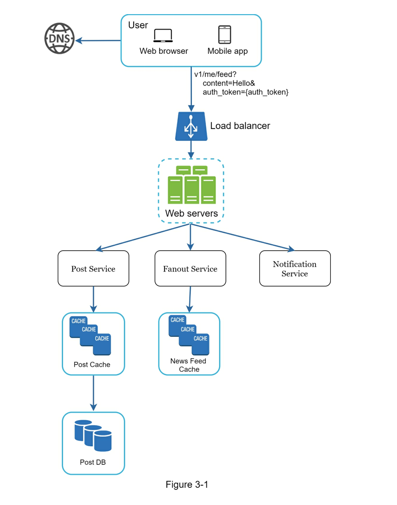
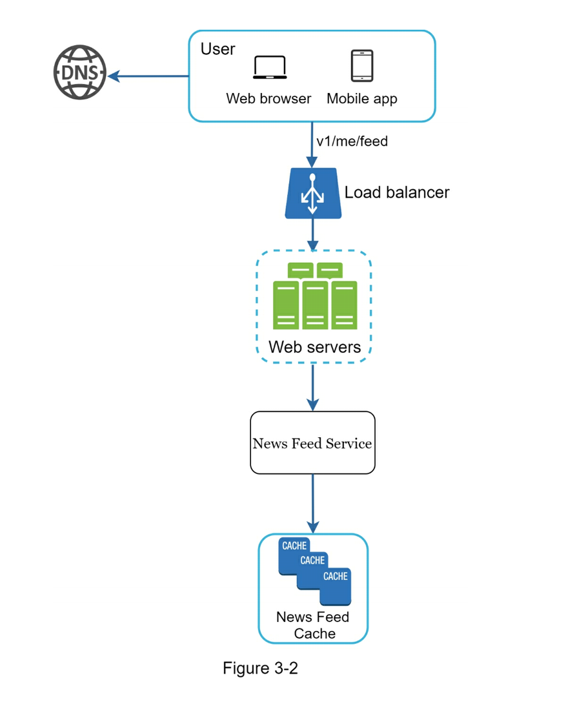
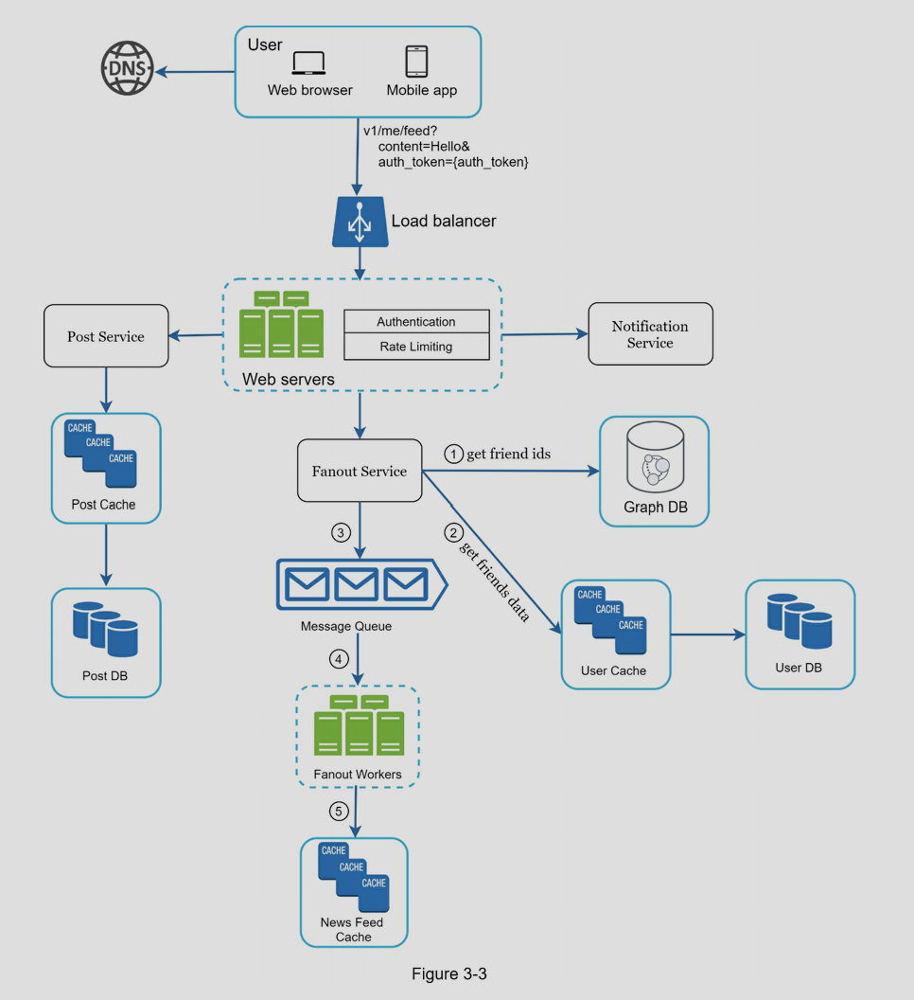
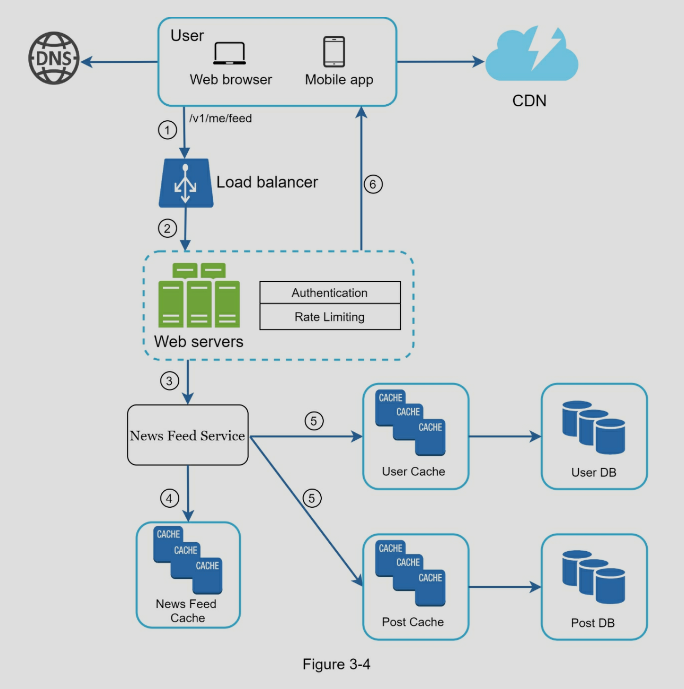

# A framework for system design interviews

- collaboration
- work under pressure
- resolve ambiguity constructively
- don't make over-engineered system
- don't ignore tradeoffs
- save money

**Ask questions!!**

# A 4-step process for effective system design interview

## Step 1 - understand the problem and establish design scope

- 不要急于回答问题, 先分析需求
- 如果面试官要你自己假设, 那就把假设写下来, 随时使用

要问什么问题?

- What specific **features**?
- How many **users**?
- How fast does the company anticipate to scale up (3 months, 6 months, and a year)?
- What is technology stack?
- What existing services we can leverage to simplify the design?

举例 design a news feed system

- Candidate: Is this a mobile app? Or a web app? Or both?
- Interviewer: Both.
- Candidate: What are the most important features for the product?
- Interviewer: Ability to make a post and see friends’ news feed.
- Candidate: Is the news feed sorted in reverse chronological order or a particular order? The particular order means each post is given a different weight. For instance, posts from your close friends are more important than posts from a group.
- Interviewer: To keep things simple, let us assume the feed is sorted by reverse chronological order.
- Candidate: **How many friends** can a user have?
- Interviewer: 5000
- Candidate: What is the **traffic volume**?
- Interviewer: 10 million daily active users (DAU)
- Candidate: Can feed contain images, videos, or just text?
- Interviewer: It can contain media files, including both images and videos.

## Step 2 - propose high-level design and get buy-in

reach an agreement with interviewer

- collaboration: 和面试官合作完成, 把他当成 teammate
- 完成 initial blueprint
- 画出核心 components, 比如 client, APIs, servers, data stores, cache, CDN, message queue...
- 列出 use cases, 逐一分析
- back-of-the-envelope 计算出大概的 scale

举例 design a news feed system

At the high level, the design is divided into two flows:
feed publishing and news feed building.

- Feed publishing: when a user publishes a post, corresponding data is written into cache/database,database, and the post will be populated into friends’ news feed.
- Newsfeed building: the news feed is built by aggregating friends’ posts in a reverse chronological order.

Feed publishing

news feed building

## Step 3 - Design deep dive

- 通过和面试官沟通, 知道要主要处理哪个 service
- 通常来讲, 会集中在一到两个 service 的设计上

example

两个主要的 use cases

1. feed publishing
2. news feed retrieval

## Step 4 - wrap up

follow-up questions

- system bottlenecks
- potential improvements
- recap the whole design
- error cases (server failure, network loss...)
- monitoring
- how to scale to more users, like 10 million
- other refinements

# Time allocation on each step

- Step 1 Understand the problem and establish design scope: 3 - 10 minutes - Step 2 Propose high-level design and get buy-in: 10 - 15 minutes
- Step 3 Design deep dive: 10 - 25 minutes
- Step 4 Wrap: 3 - 5 minutes
