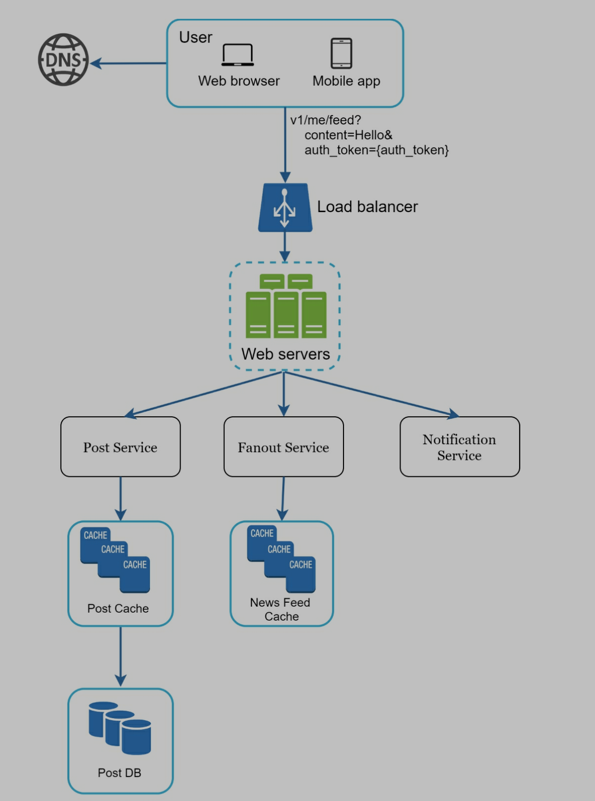
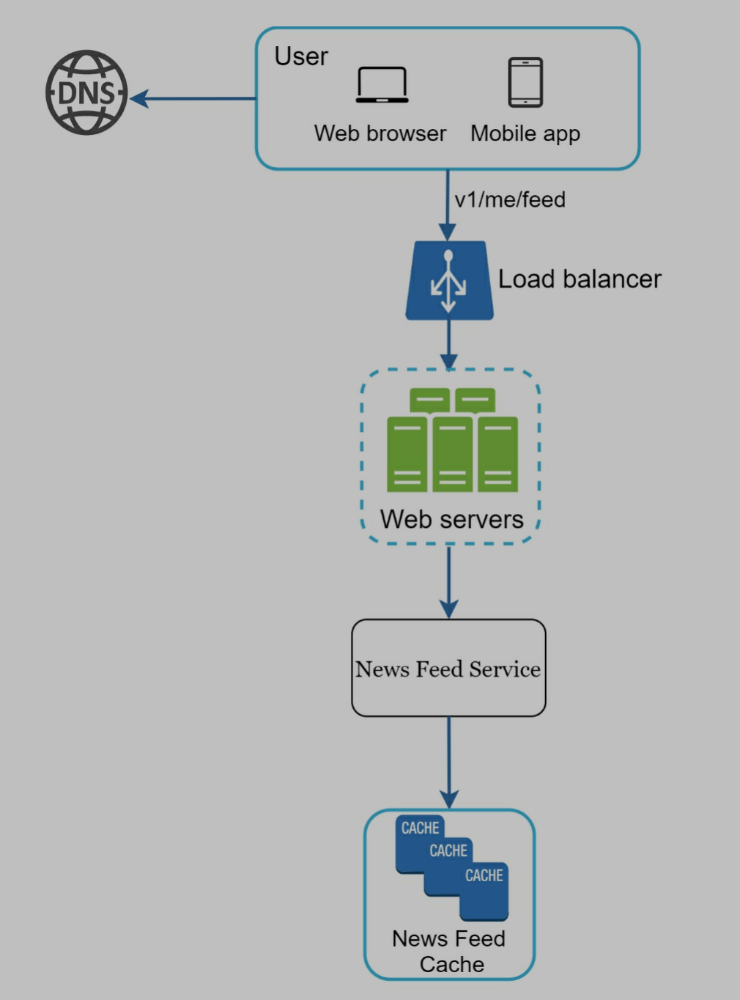
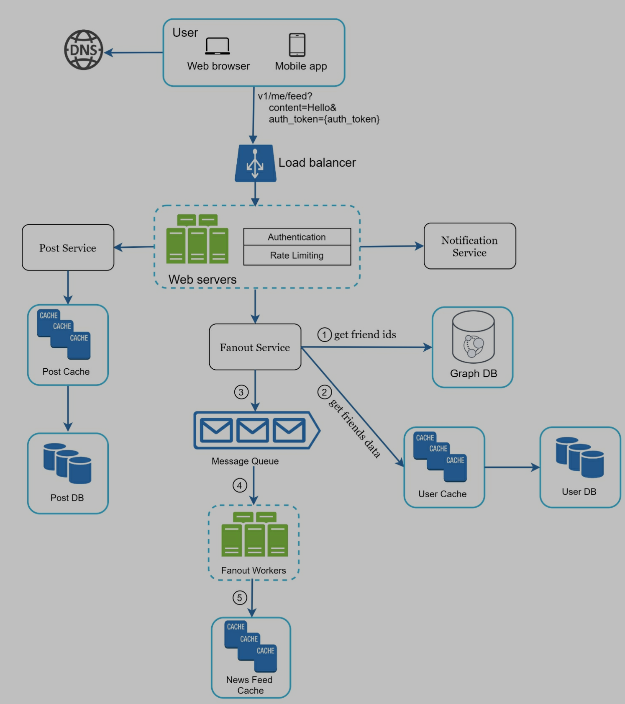
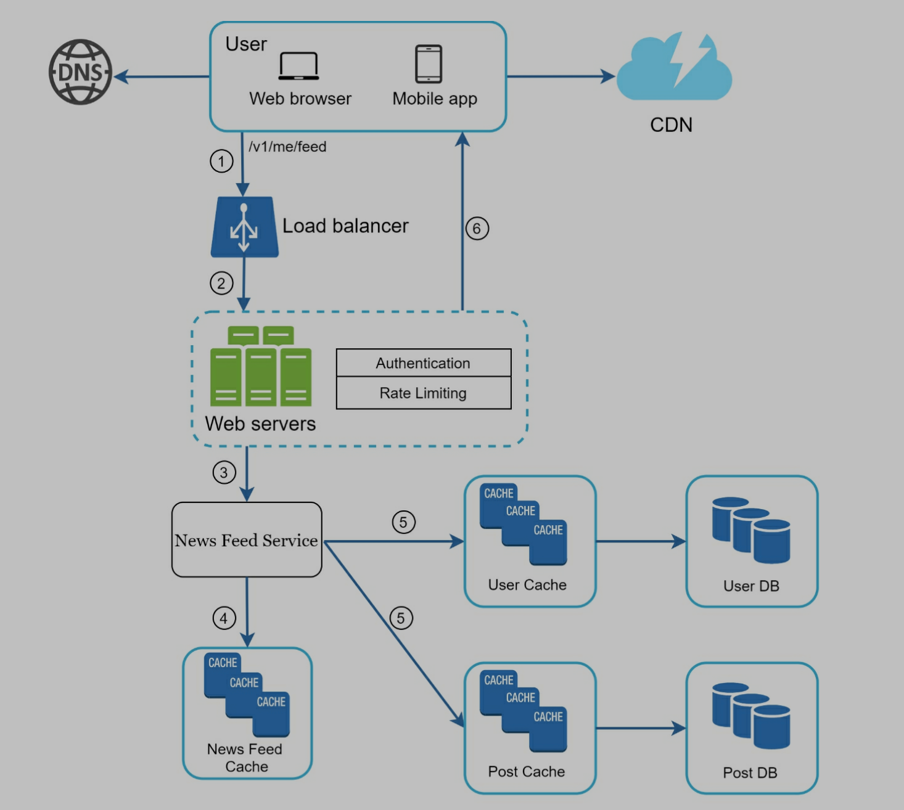

# A Framework for System Design Interview

# 1. Key points

- Collaboration
- Work under pressure
- Resolve ambiguity
- Don't make over-engineered system
- Don't ignore tradeoffs
- Save money

# 2. A 4-step process for effective system design interview

## Step 1 - Understand the problem and establish design scope (3 - 10 minutes)

> Think deeply and ask questions to clarify requirements and assumptions

### What are the questions?

- What specific **features**?
- How many **users**?
- How fast does the company anticipate to scale up (3 months, 6 months, and a year)?
- What is technology stack?
- What existing services we can leverage to simplify the design?

### Example: design a news feed system

- Candidate: Is this a mobile app? Or a web app? Or both?
- Interviewer: Both.
- Candidate: What are the most important features for the product?
- Interviewer: Ability to make a post and see friends’ news feed.
- Candidate: Is the news feed sorted in reverse chronological order or a particular order? The particular order means each post is given a different weight. For instance, posts from your close friends are more important than posts from a group.
- Interviewer: To keep things simple, let us assume the feed is sorted by reverse chronological order.
- Candidate: **How many friends** can a user have?
- Interviewer: 5000
- Candidate: What is the **traffic volume**?
- Interviewer: 10 million daily active users (DAU)
- Candidate: Can feed contain images, videos, or just text?
- Interviewer: It can contain media files, including both images and videos.

## Step 2 - Propose high-level design and get buy-in (10 - 15 minutes)

> Reach an agreement with interviewer

### Key points

- Collaboration: treat interviewer as a teammate
- Complete initial blueprint
- Draw key components, like client, APIs, servers, data stores, cache, CDN...
- List use cases and analyze
- Back-of-the-envelope

### Example: design a news feed system

- At the high level, the design is divided into two flows
  - Feed publishing
  - Newsfeed building
- Feed publishing: when a user publishes a post, corresponding data is written into cache/database, and the post will be populated into friends’ news feed.
- Newsfeed building: news feed is built by aggregating friends’ posts in a reverse chronological order.

- Feed publishing
- Newsfeed building

## Step 3 - Design deep dive (10 - 25 minutes)

> Talk to interviewer: which parts we need to dive into?

### Example: design a news feed system

> Two important use cases

1. Feed publishing
2. newsfeed retrieval

## Step 4 - Wrap up (3 - 5 minutes)

> Follow-up questions

- System bottlenecks
- Potential improvements
- Recap the whole design
- Error cases (server failure, network loss...)
- Monitoring
- How to scale to more users, like 10 million
- Other refinements
