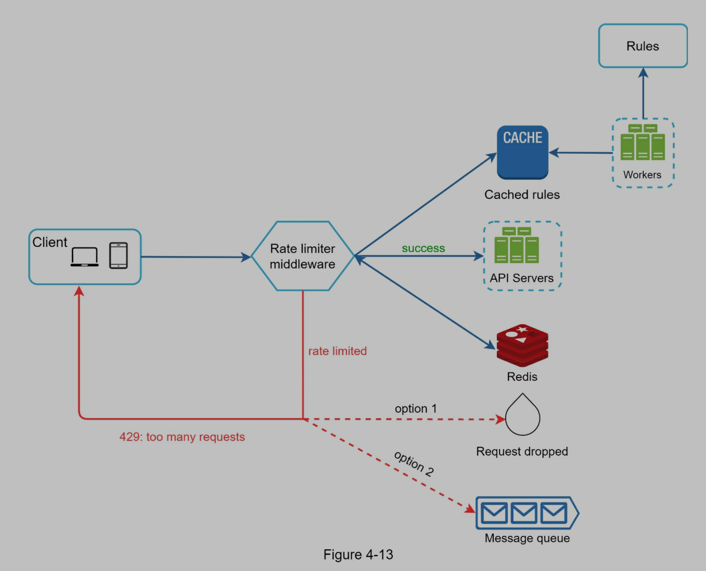
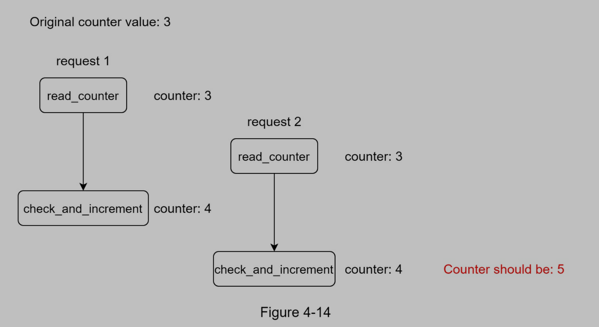
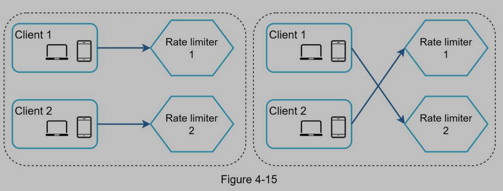
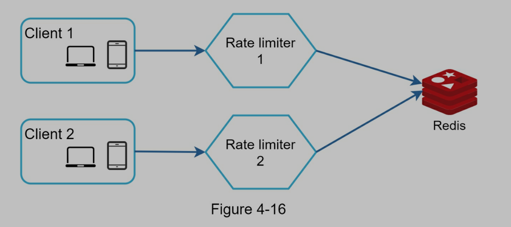

# Design a Rate Limiter

# What is a Rate Limiter?

## Definition

> In a network system,
> a rate limiter is used to control the rate of traffic sent by a client or a service.
> In the HTTP world,
> a rate limiter limits the number of client requests allowed to be sent over a specified period.

## Example

- User cannot send 2 posts per second
- User cannot create more than 10 accounts from same IP address
- User cannot claim rewards more than 5 times per week

## Rate limiter benefits

- Prevent **Denial of Service (DoS)** attack: Flood the targeted machine or resource with superfluous requests in an attempt to overload systems and prevent some or all legitimate requests
- Reduce cost
- Prevent servers from being overloaded

# Step 1 - Understand the problem and establish design scope

## Questions

- Candidate: What kind of rate limiter are we going to design? Is it a client-side rate limiter or server-side API rate limiter?
- Interviewer: Great question. We focus on the **server-side API rate limiter**.
- Candidate: Does the rate limiter throttle (节流) API requests based on IP, the user ID, or other properties?
- Interviewer: The rate limiter should be flexible enough to support different sets of throttle rules.
- Candidate: What is the scale of the system? Is it built for a startup or a big company with a large user base?
- Interviewer: The system must be able to handle a large number of requests.
- Candidate: Will the system work in a distributed environment?
- Interviewer: Yes.
- Candidate: Is the rate limiter a separate service or should it be implemented in application code?
- Interviewer: It is a design decision up to you.
- Candidate: Do we need to inform users who are throttled?
- Interviewer: Yes.

## Requirements

- Accurately limit excessive requests
- Low latency. The rate limiter should not slow down HTTP response time
- Use as little memory as possible
- Distributed rate limiting. The rate limiter can be shared across multiple servers or processes.
- Exception handling. Show clear exceptions to users when their requests are throttled.
- High fault tolerance. If there are any problems with the rate limiter (for example, a cache server goes offline), it does not affect the entire system.

# Step 2 - Propose high-level design and get buy-in

## 2.1 Where to put the rate limiter?

- Client-side rate limiter is not secure and hard to implement
- Server-side rate limiter - OK
- Rate limiter middleware - OK
  - API gateway
    - **Cloud microservices** have become widely popular and rate limiting is usually implemented within a component called **API gateway**.
    - An API gateway **takes all API calls from clients, then routes them to the appropriate microservice** with request routing, composition, and protocol translation.
    - An API gateway is a fully managed service that supports **rate limiting, SSL termination, authentication, IP whitelisting, servicing static content**, etc. For now, we only need to know that the **API gateway is a middleware** that supports rate limiting.


https://cloud.google.com/api-gateway

### Server-side or middleware?

- Depends on technology stack, engineering resources, priorities, goals...
- Limiting algorithm: business needs
- If we already have microservice architecture and API gateway, we only need to add rate limiter to API gateway
- Cost: commercial API gateway is a better option if no enough resources

## 2.2 Rate limiting algorithm

### 2.2.1 Token bucket (widely used for tate limiting)

- Two parameters
  - bucket size: max token number
  - refill rate: how many tokens put into a bucket periodically
- Put tokens into a bucket, like 4 tokens/min
- Every request consumes a token
- When a request comes in, check if we have tokens
  - If we have, assign a token to the request, and move on
  - If not, the request is dropped
- Different APIs with different buckets cause they have different rate limits
- IP address + bucket is also an option
- If system has a limit, like 10000 request/sec, we can set up a global bucket
- Pros
  - Simple
  - Memory efficient
  - Token bucket allows a burst of traffic for short periods. A request can go through as long as there are tokens left.
- Cons
  - Hard to know the best values of the two parameters


### 2.2.2 Leaking bucket

- Two parameters
  - bucket size: max request in queue
  - outflow rate: max request handle/min
- Similar to token bucket, but use first-in-first-out(FIFO) queue
- When a request comes in, check if queue is full
  - If not, put the request into queue
  - If it is, the request is dropped
  - Requests are pulled from the queue and processed at regular intervals.
- Pros
  - memory efficient
  - Requests are processed at a fixed rate therefore it is suitable for use cases that a stable outflow rate is needed
- Cons
  - **A burst of traffic** fills up the queue. If they are not processed in time, recent requests will be rate limited.
  - Hard to know the best values of the two parameters


### 2.2.3 Fixed window counter

- Set up
  - Fix-sized time windows
  - A counter for each window
- When a request comes in
  - Increase counter
  - When counter increases to threshold, request is dropped
- Pros
  - Memory efficient
  - Easy understanding
  - Fit in certain conditions
- Cons
  - **A burst of traffic** is at the edge of a time window, some requests will be rate limited


One time window per second, counter is 3


- 00 - 01 - 5 requests;
- 01 - 02 - 5 requests;
- 00:30 - 01:30 - 10 requests, rate limited!

### 2.2.4 Sliding window log

- Save request timestamp in log file
- When a request comes in
  - Add timestamp to the request
  - Remove all outdated timestamps (outdated timestamp = current timestamp - time window)
  - If log size is larger than count, request is dropped
- Pros
  - Accurate
  - Solve fixed window counter issue. A burst of traffic is at the edge of a time window is not a problem
- Cons
  - Consume memory, save timestamp to log for evert request


- Allow 2 requests/min
- 1:01:40 - 1 request - valid window: [1:00:40 - 1:01:40)
- Requests before 1:00:40 are outdated (1:00:01 - 1:00:30), removed from log (1:00:01, 1:00:30)
- After removing, log size is 2 (1:00:50 is saved into log even it is dropped)

### 2.2.5 Sliding window counter

- A combination of fixed window counter and sliding window log
- Calculate requests number based on rolling window
- Pros
  - Smooth traffic
  - Memory efficient
- Cons
  - Hard to know the best values of parameters


- Assume max 7 requests/min
- Requests in current window(3) + requests in the previous window(5) \* overlap percentage of the rolling window and previous window (0.7)
- 3 + 5 \* 0.7 = 6.5 (max is 7, so the request is good)

## 2.3 High-level architecture

- A variety of algorithms, but the main idea is counting request numbers
- Save counter into in-memory cache(like redis) to improve performance
  - Redis: INCR (+1) and EXPIRE functions
- Workflow
  - Request -> rate limiter middleware
  - Rate limiter middleware -> redis (counter)
  - Check if limit is reached
    - reached: request is dropped
    - not reached: send request to server, increase counter in redis


# Step 3 - Design deep dive

两个问题没有解决

- How are rate limiting rules created? Where are the rules stored?
- How to handle requests that are rate limited?

## Rate limiting rules

lyft 的设计, 把配置文件存在 disk 上

allow a maximum of 5 marketing messages per day.

```yaml
domain: messaging
descriptors:
  - key: message_type
    Value: marketing
    rate_limit:
      unit: day
      requests_per_unit: 5
```

用户不能一分钟登录超过 5 次

```yaml
domain: auth
descriptors:
  - key: auth_type
    Value: login
    rate_limit:
      unit: minute
      requests_per_unit: 5
```

## exceeding the rate limit

- 超过限制, 返回 429 code
- 可以把超过限制的 request 放到 queue 中, 稍后处理

## rate limiter header

可以在 response 的 header 中加入一些信息, 告诉 client 超过了限制次数

- X-Ratelimit-Remaining: The remaining number of allowed requests within the window.
- X-Ratelimit-Limit: It indicates how many calls the client can make per time window.
- X-Ratelimit-Retry-After: The number of seconds to wait until you can make a request again without being throttled.

## detailed design



- rules are stored on the disk. Workers frequently pull rules from the disk and store them in the cache
- 当有一个 request 的时候, request 会被发送到 rate limiter middleware
- rate limiter middleware
  - load rules from cache
  - fetch counter from redis
- 如果 request 没有超过 counter, 发送 request 到 server
- 如果 request 超过 counter, rate limiter 返回 429; 同时, request 被 dropped 或者被推送到 queue

## Rate limiter in a distributed environment

### race condition

- 发生在 highly concurrent environment
  - 假设当前的 counter 是 3, 两个 request 同时读取 redis 中的 counter, 最后更新为 4, 但是实际上应该是 5
- 通常可以使用 lock(会使系统变慢)
- 更好的方法是 Lua script 和 sorted sets data structure in redis



### synchronization issue

- 当有多个 rate limiter server 的时候, 同步很重要
- 因为 web tier 是 stateless 的, 所以 client 可以发送到任意的 rate limiter server 上, 这样就会造成计数错误
- 解决方法是使用 centralized data stores, like redis




### performance optimization

- multi-data center 很重要
  - 降低 latency(Latency is the time it takes for data to be transferred between its original source and its destination)
- synchronize data with an eventual consistency model

### Monitoring

- The rate limiting algorithm is effective.
- The rate limiting rules are effective.

- 如果 rule 太过于严格, 可以放款 rule
- rate limiter becomes ineffective when there is a sudden increase in traffic like flash sales. In this scenario, we may replace the algorithm to support burst traffic. Token bucket is a good fit here.

# Step 4 - Wrap up

- 讨论各种算法的优缺点
- 讨论 system architecture, distributed environment, performance optimization, monitoring
- hard vs soft rating limiting
  - Hard: The number of requests cannot exceed the threshold.
  - Soft:  Requests can exceed the threshold for a short period.
- rate limiting at different levels
- avoid being rate limited
  - use client cache to avoid making frequent API calls
  - dont send too many requests in a short time frame
  - catch exceptions
  - retry logic
