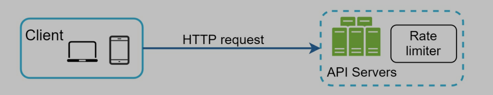
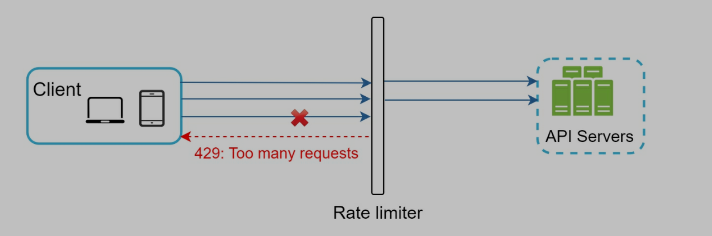
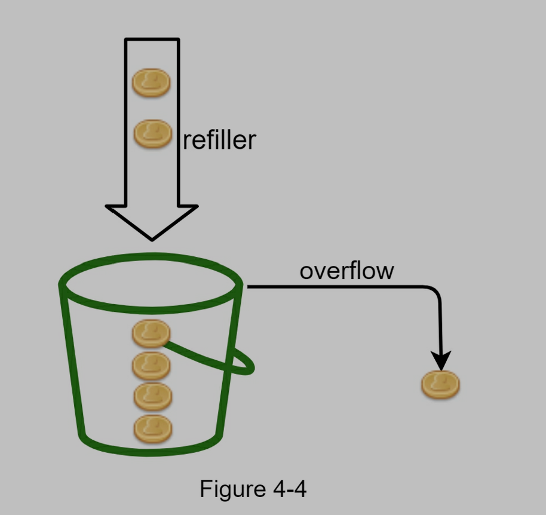
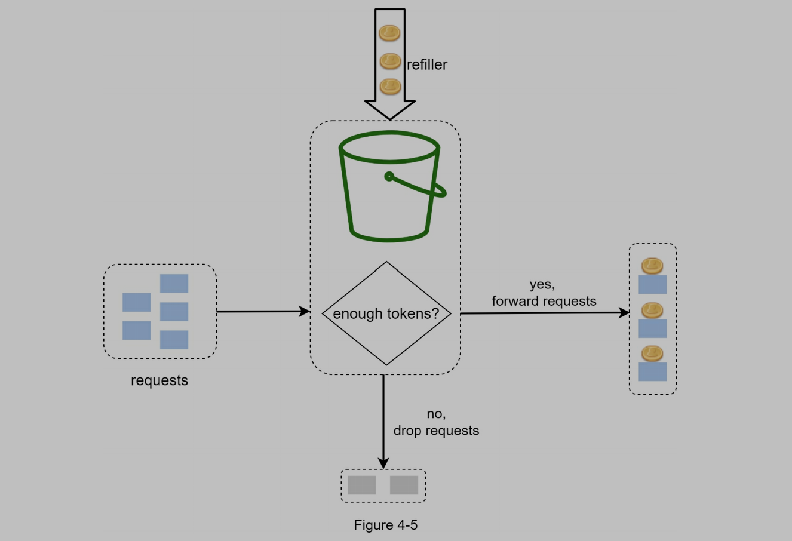
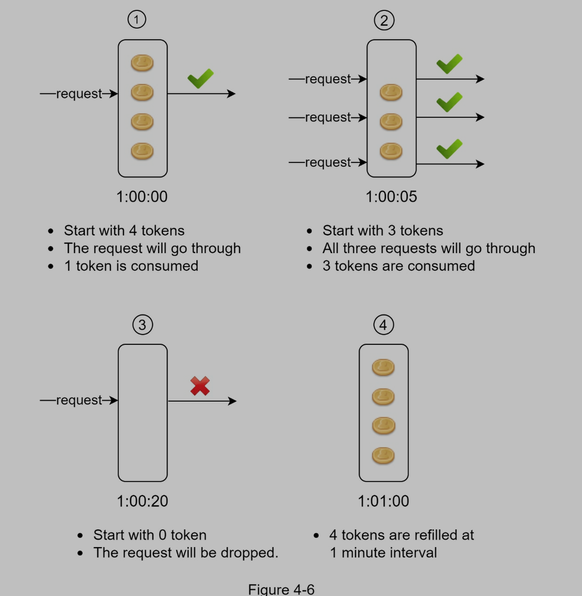
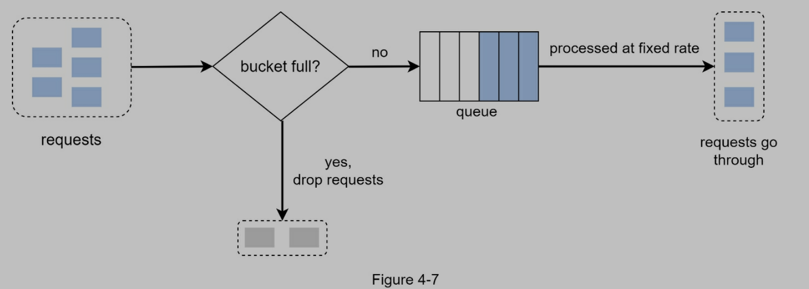
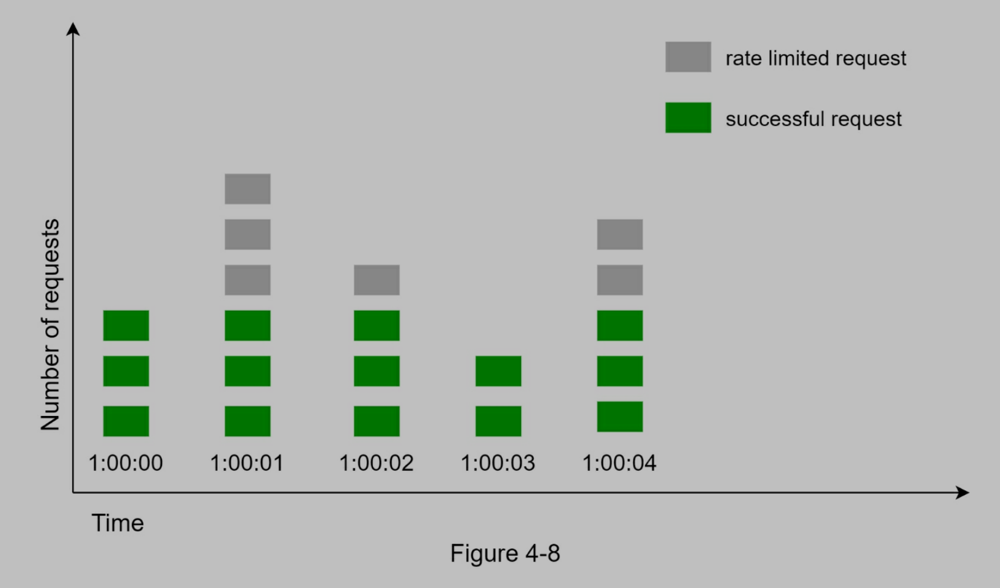
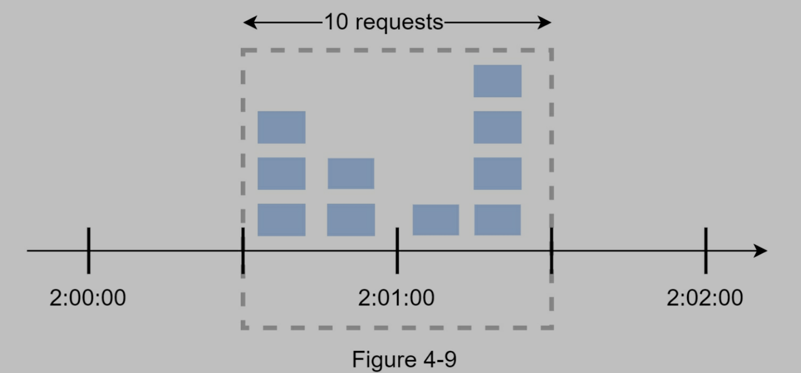
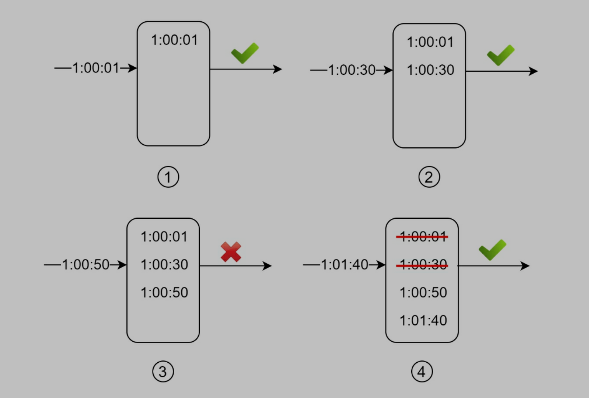
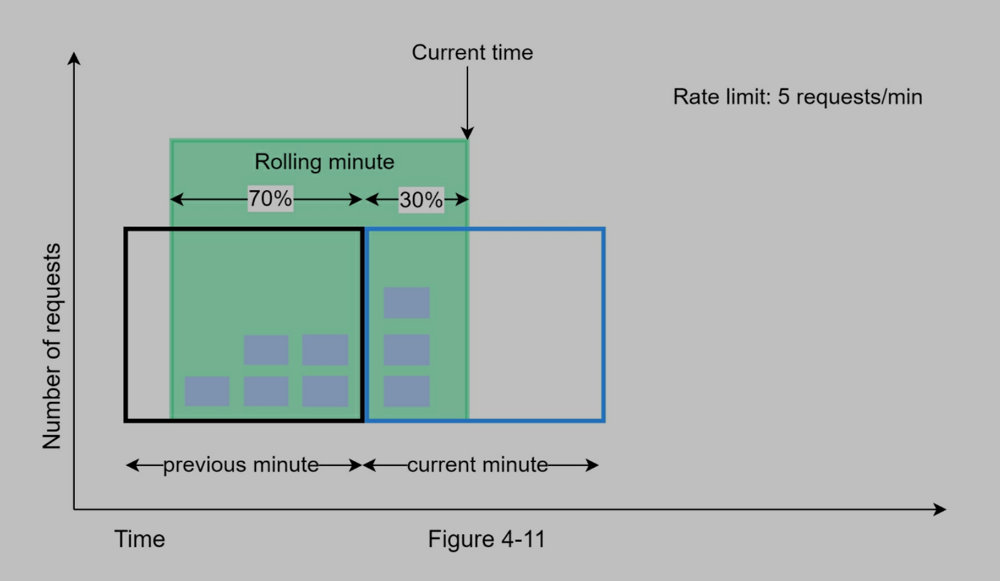

> In a network system,
> a rate limiter is used to control the rate of traffic sent by a client or a service.
> In the HTTP world,
> a rate limiter limits the number of client requests allowed to be sent over a specified period.

举例

- user cannot send 2 posts per second
- user cannot create more than 10 accounts from same IP address
- user cannot claim rewards more than 5 times per week

API rate limiter benefits

- prevent Denial of Service (DoS) attach: 拒绝服务攻击(发送大量请求占用资源)
- reduce cost
- prevent servers from being overloaded

# Step 1 - understand the problem and establish design scope

- Candidate: What kind of rate limiter are we going to design? Is it a client-side rate limiter or server-side API rate limiter?
- Interviewer: Great question. We focus on the server-side API rate limiter.
- Candidate: Does the rate limiter throttle (节流) API requests based on IP, the user ID, or other properties?
- Interviewer: The rate limiter should be flexible enough to support different sets of throttle rules.
- Candidate: What is the scale of the system? Is it built for a startup or a big company with a large user base?
- Interviewer: The system must be able to handle a large number of requests.
- Candidate: Will the system work in a distributed environment?
- Interviewer: Yes.
- Candidate: Is the rate limiter a separate service or should it be implemented in application code?
- Interviewer: It is a design decision up to you.
- Candidate: Do we need to inform users who are throttled?
- Interviewer: Yes.

requirements

- Accurately limit excessive requests.
- Low latency. The rate limiter should not slow down HTTP response time.
- Use as little memory as possible.
- Distributed rate limiting. The rate limiter can be shared across multiple servers or processes.
- Exception handling. Show clear exceptions to users when their requests are throttled.
- High fault tolerance. If there are any problems with the rate limiter (for example, a cache server goes offline), it does not affect the entire system.

# Step 2 - Propose high-level design and get buy-in

client rate limiter 不安全,也不容易实现,因此可以选用 Server rate limiter



也可以使用一个 rate limiter middleware, 当用户发送过多请求的时候,返回 429



**Cloud microservices** have become widely popular and rate limiting is usually implemented within a component called **API gateway**.

API gateway

https://cloud.google.com/api-gateway

- 借助 API Gateway，您可以创建、保护和监控各种 Google Cloud 无服务器后端（包括 Cloud Functions、Cloud Run 和 App Engine）的 API。API Gateway 基于 Envoy 构建，提供了出色的性能、可伸缩性和自由度，让您可以专注于打造优秀应用。基于用量的层级式定价让您可以更好地管理相关费用
- An API gateway **takes all API calls from clients, then routes them to the appropriate microservice** with request routing, composition, and protocol translation. Typically it handles a request by invoking multiple microservices and aggregating the results, to determine the best path. It can translate between web protocols and web‑unfriendly protocols that are used internally.
- is a fully managed service that supports **rate limiting, SSL termination, authentication, IP whitelisting, servicing static content**, etc. For now, we only need to know that the API gateway is a middleware that supports rate limiting.

在什么地方实现 rate limiter? server or gateway?

这取决于公司的 technology stack, engineering resources, priorities, goals...

- current technology stack: language, cache service... 确保设计和当前架构具有一致性
- limiting algorithm: 与 business needs 一致
- 如果已经使用 microservice architecture 和 API gateway, 可能我们只需要在 API gateway 中添加一个 rate limiter 就可以了
- 成本: 如果没有足够的人力和时间, 不要自己在 server 上搭建, 选择使用商业的 API gateway 更划算

## rate limiting algorithm

### Token bucket (最常用)

- 设置两个参数
  - bucket size: 在 bucket 中的最大 token 数量
  - refill rate: 每秒钟向 bucket 中放入 token 的数量
- 系统周期性的向 bucket 中放入 token, 比如每分钟放入 4 个 token
- 每一个 request 消耗 一个 bucket 中的 token
- 当有一个 request 的时候, 我们检查 bucket 中是否有足够的 token
  - 如果有, 我们拿一个 token 给这个 request, 然后继续进行下边的操作
  - 如果没有, 这个 request 被 dropped
- 通常情况下, 对不同的 API, 我们有不同的 bucket, 因为他们的 rate limit 不同, 比如 send post 和 add friends 不应该使用同一个 bucket
- 也可以使用 IP 地址, 每个 IP 给定的 bucket
- 如果系统本身有限制, 比如只能接受 10000 request/sec, 那么可以设定一个 global bucket
- 优点:
  - 容易实现
  - memory efficient
  - Token bucket allows a burst of traffic for short periods. A request can go through as long as there are tokens left.
- 缺点
  - 需要两个合适的参数, 不易调整





### Leaking bucket

- 设置两个参数
  - bucket size: 在 queue 中的最大 request 数量
  - outflow rate: 每秒钟处理多少个 request
- 与 token bucket 类似, 但是实现上使用了 first-in-first-out(FIFO) queue
- 当有一个 request 的时候, 我们检查 queue 是不是满了
  - 如果没有满, 那么把 request 加到 queue 中
  - 如果满了, request 被 dropped
  - Requests are pulled from the queue and processed at regular intervals.
- 优点
  - memory efficient
  - Requests are processed at a fixed rate therefore it is suitable for use cases that a stable outflow rate is needed.
- 缺点
  - A burst of traffic fills up the queue with old requests, and if they are not processed in time, recent requests will be rate limited.
  - 需要两个合适的参数, 不易调整



### Fixed window counter

- 设定 fix-sized time windows 并且给每个 window 设定一个 counter
- 每个 request 增加一个 counter
- 当 counter 达到设定的阈值, request 被 dropped
- 优点
  - memory efficient
  - 容易理解
  - 适合某些情况
- 缺点
  - 如果 A burst of traffic 在 time window 的边缘, 那么可能造成某段时间超过限制数量的 request

每秒钟是一个 time window, 最多允许 3 个 request/sec


00 - 01 有 5 个 request; 01 - 02 有 5 个 request; 但是 00:30 - 01:30 有 10 个 request, 超过了限制


### Sliding window log

- 保存 request timestamp 在 log 中
- 当有一个 request 的时候, 去掉所有 outdated timestamps (比当前 time window 的开始时间早的)
- 给 request 加 timestamp
- 如果 log size 小于等于 count, 处理 request; 否则拒绝
- 优点
  - accurate, 解决了 fixed window counter 的主要问题, 不会出现某个时间段出现超过限制数量的 requests
- 缺点
  - 算法消耗大量 memory, 因为及时 request 被拒绝, 依然会吧 timestamp 存在 log 中

allow two requests per minute


- 当 1:01:40 有一个 request 的时候, 当前的范围是[1:00:40 - 1:01:40)
- 在 1:00:40 之前的算 outdated(1:00:01 和 1:00:30), 被移出 log
- 移出之后 log size 是 2 (1:00:50 虽然没有执行,但是也在 log 中被记录下来)

### Sliding window counter

- fixed window counter 和 sliding window log 的组合方法
- requests 数量在 rolling window 的计算方法 (如下图, 假设最大 7 request/min)
  - Requests in current window(3) + requests in the previous window(5) \* overlap percentage of the rolling window and previous window (0.7)
  - 3 + 5 \* 0.7 = 6.5 (因为最大是 7, 所以当前状态可以通过)
- 优点
  - 平滑了流量
  - memory efficient
- 缺点
  - 很难给定精确的参数



## high-level architecture

- 算法多种多样, 但是大致就是用一个 counter 计算 request 的数量(对一个 user 或者一个 IP), 如果数量超过, 那就拒绝 request
- 应该把 counter 存在 in-memory cache(例如 redis)中, 以达到更高的效率
  - 可以使用 redis 中的 INCR (+1) 和 EXPIRE
- 流程
  - request -> rate limiter middleware
  - rate limiter middleware -> redis 拿到 counter
  - 检查是否超过限制
    - 超过: 拒绝 request
    - 没超过: 发送请求到 server, 增加 redis 的 counter


# Step 3 - Design deep dive

两个问题没有解决

- How are rate limiting rules created? Where are the rules stored?
- How to handle requests that are rate limited?

## Rate limiting rules

lyft 的设计, 把配置文件存在 disk 上

allow a maximum of 5 marketing messages per day.

```yaml
domain: messaging
descriptors:
  - key: message_type
    Value: marketing
    rate_limit:
      unit: day
      requests_per_unit: 5
```

用户不能一分钟登录超过 5 次

```yaml
domain: auth
descriptors:
  - key: auth_type
    Value: login
    rate_limit:
      unit: minute
      requests_per_unit: 5
```

## exceeding the rate limit

- 超过限制, 返回 429 code
- 可以把超过限制的 request 放到 queue 中, 稍后处理

## rate limiter header

可以在 response 的 header 中加入一些信息, 告诉 client 超过了限制次数

- X-Ratelimit-Remaining: The remaining number of allowed requests within the window.
- X-Ratelimit-Limit: It indicates how many calls the client can make per time window.
- X-Ratelimit-Retry-After: The number of seconds to wait until you can make a request again without being throttled.

## detailed design


- rules are stored on the disk. Workers frequently pull rules from the disk and store them in the cache
- 当有一个 request 的时候, request 会被发送到 rate limiter middleware
- rate limiter middleware
  - load rules from cache
  - fetch counter from redis
- 如果 request 没有超过 counter, 发送 request 到 server
- 如果 request 超过 counter, rate limiter 返回 429; 同时, request 被 dropped 或者被推送到 queue

## Rate limiter in a distributed environment

### race condition

- 发生在 highly concurrent environment
  - 假设当前的 counter 是 3, 两个 request 同时读取 redis 中的 counter, 最后更新为 4, 但是实际上应该是 5
- 通常可以使用 lock(会使系统变慢)
- 更好的方法是 Lua script 和 sorted sets data structure in redis


### synchronization issue

- 当有多个 rate limiter server 的时候, 同步很重要
- 因为 web tier 是 stateless 的, 所以 client 可以发送到任意的 rate limiter server 上, 这样就会造成计数错误
- 解决方法是使用 centralized data stores, like redis


### performance optimization

- multi-data center 很重要
  - 降低 latency(Latency is the time it takes for data to be transferred between its original source and its destination)
- synchronize data with an eventual consistency model

### Monitoring

- The rate limiting algorithm is effective.
- The rate limiting rules are effective.

- 如果 rule 太过于严格, 可以放款 rule
- rate limiter becomes ineffective when there is a sudden increase in traffic like flash sales. In this scenario, we may replace the algorithm to support burst traffic. Token bucket is a good fit here.

# Step 4 - Wrap up

- 讨论各种算法的优缺点
- 讨论 system architecture, distributed environment, performance optimization, monitoring
- hard vs soft rating limiting
  - Hard: The number of requests cannot exceed the threshold.
  - Soft:  Requests can exceed the threshold for a short period.
- rate limiting at different levels
- avoid being rate limited
  - use client cache to avoid making frequent API calls
  - dont send too many requests in a short time frame
  - catch exceptions
  - retry logic
