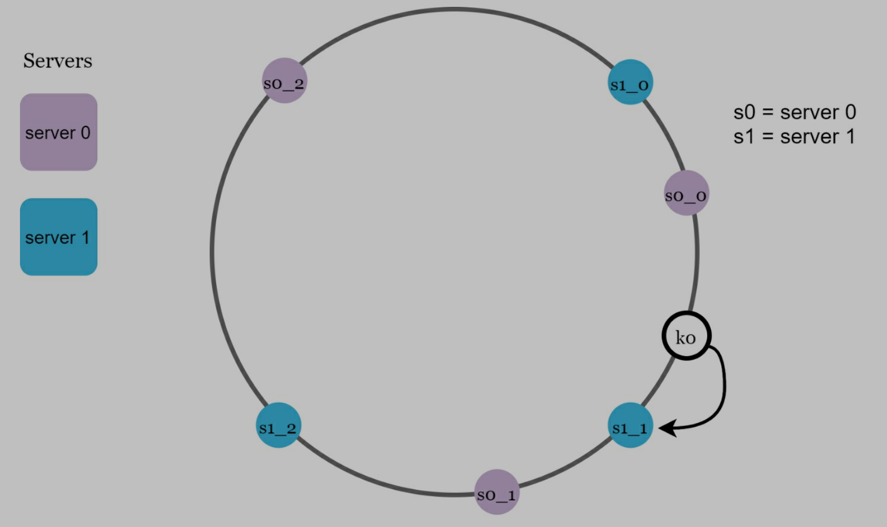

# Design Consistent Hashing

> How to distribute requests/data **efficiently** and **evenly** across servers?

# 1. Rehashing problem

## 1.1 Hash function

> Assume we have n servers, a common way to balance load is hash method

**serverIndex = hash(key) % N**, N is the size of the server pool

- 4 servers, 8 string keys and their hash
- We can use hash % 4 to get a server. In this way, request/data can be distributed to a server

> What we should when adding/removing servers?

- Assume server1 goes offline, server number is 3 now
- After % 4, we have new distributions
- A lot of different distributions, how to reduce redistributions?

# 2. Consistent hashing

> When hash table changed, consistent hashing only moves **k / n keys**,
> k is key number, n is slots number

## 2.1 Hash space & Hash ring

- Use **SHA-1 as hash function**, hash space is 0 ~ 2^160 - 1
- Connect both ends, we can get a hash ring

## 2.2 Hash servers & keys

`hash(server IP or name) = server position on hash ring`

## 2.3 Server lookup

> How to get a server for a key?

- Go clockwise from the key until a server is found on hash ring

## 2.4 Add a server

- Add a new server4 on hash ring
- We only need to move k0 from server0 to server4

## 2.5 Remove a server

- Remove server1 on hash ring
- We only need to move k2 from server1 to server2

## 2.6 Two issues in the basic approach

> How consistent hash works?

1. Map servers and keys on to the ring using a uniformly distributed hash function
2. To find out which server a key is mapped to, go clockwise from the key position until the first server is found.

> Two issues for it!

1. Servers might not distribute evenly
2. Servers have uneven distributions of data/request

## 2.7 Virtual nodes

- Each server is represented as many virtual nodes
- More virtual nodes lead to more balanced data distribution
- server0 and server1 both have 3 virtual nodes (in real system, we select a bigger number)
- server0 manages 3 virtual nodes range; server1 manages 3 virtual nodes range

- Same to basic method, go clockwise from the key position until the first virtual node is found
- Get the real server based on the virtual node

## 2.8 Find affected keys

> When redistributed, how can we find the affected range to redistribute the keys?

- Add server4
- Go clockwise from server4, then server3 is found
- Redistribute data/requests from server3 to server4

- Remove server1
- Go clockwise from server1, then server0 is found
- Redistribute data/requests from server0 to server1

# 3. Wrap up

> What is the benefits of consistent hash?

- When add/remove servers, less data/requests have to be redistributed
- Easy to scale horizontally since data/requests are evenly distributed
- Mitigate **hotspot key problem**
