# Design Consistent Hashing

问题: How to distribute requests/data **efficiently** and **evenly** across servers?

# The rehashing problem

假设有 n 个 cache servers, 一种通常的 balance load 的方法是 hash method

```
serverIndex = hash(key) % N, N is the size of the server pool
```

假设有 4 个 servers, 8 个 string keys 和对应的 hash. 通过使用 hash % 4 可以得到对应的 server, 这样就可以把一个 request 或者 data 放到某个 server 上了

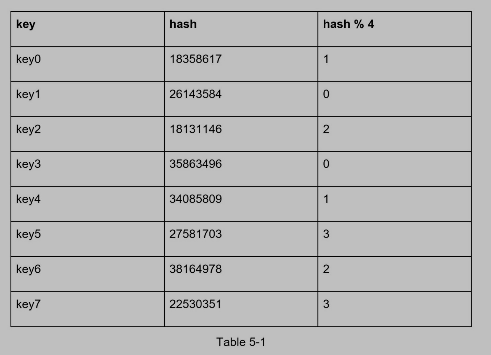
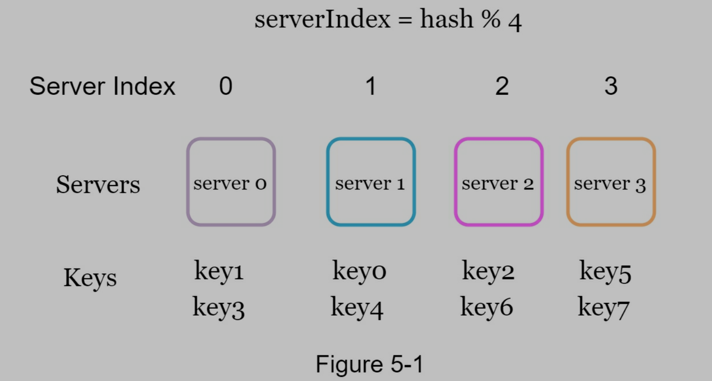

问题: 当加入或者移出 server 的时候怎么办?

假设此时 server1 坏了, server 数量变成 3 个, 通过改变取模函数, 可以得到如下分分配. 可以发现很多 key 被重新分配了, 这样很多 clients 将会链接到错误的 server. Consistent hashing 会解决这个问题.

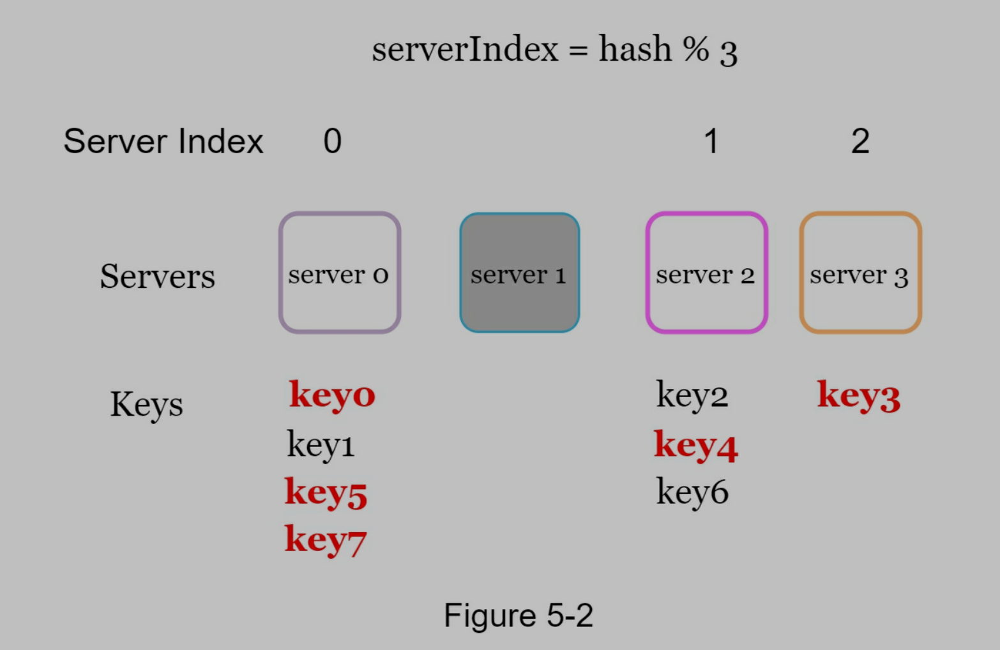

# Consistent hashing

当 hash table 变化时, consistent hashing 只需要迁移 k / n 和 key, 期中 k 是 key 的数量, n 是 slots 的数量

## Hash space and hash ring

假设使用 SHA-1 作为 hash function. 产生的 hash space 是 0 ~ 2^160 - 1

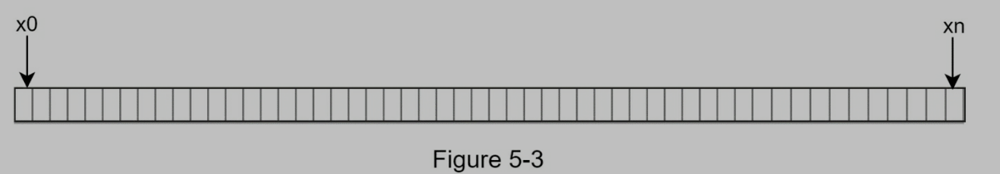

通过连接开始和结尾, 我们得到 hash ring

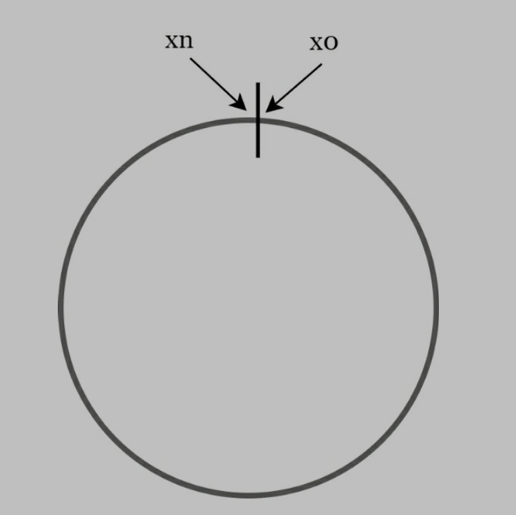

## Hash servers

可以使用 server 的 IP 或者 name, 结合 hash function 得到 server 在 hash ring 上的位置

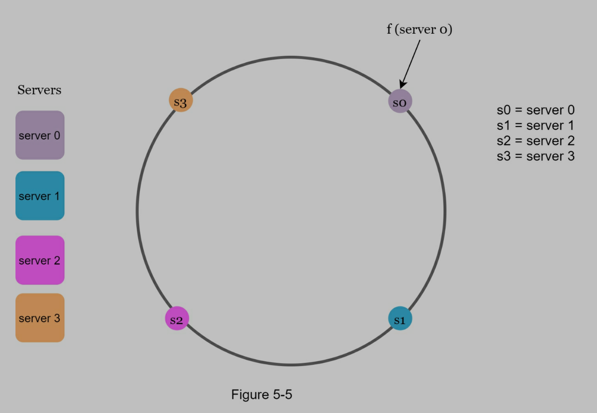

## Hash keys

不使用 modular operation, 假设此时有 4 个 hash key

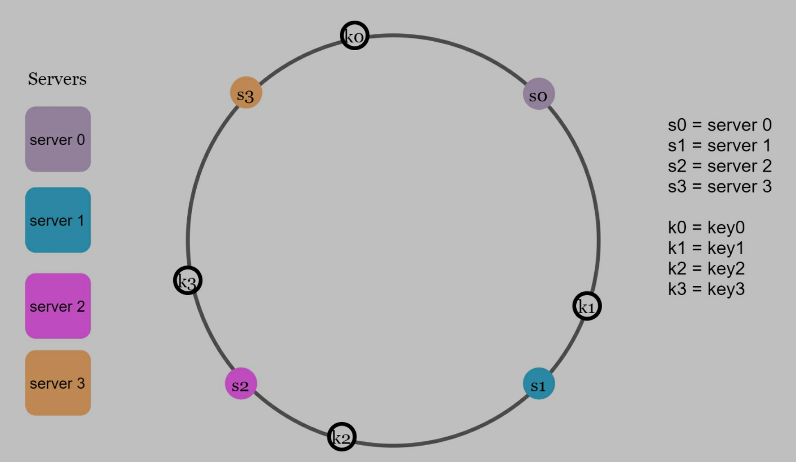

## server lookup

如果通过 key 找到 server? 从 key 的位置出发, 顺时针旋转, 直到找到第一个 server 在 hash ring 上. 如下图, 此时 k0 找到 server0, k1 找到 server1...

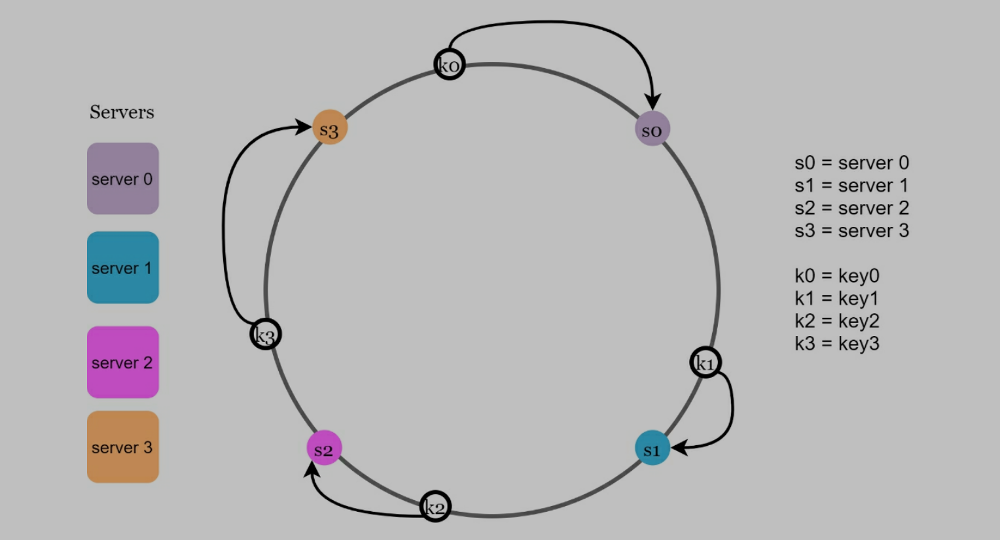

## add a server

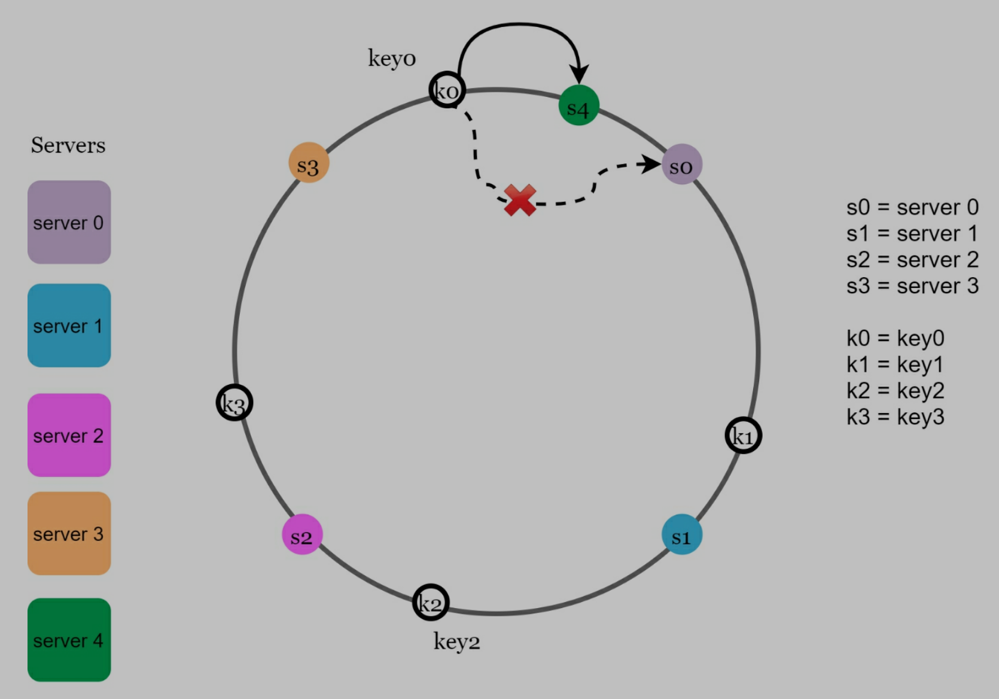

如上图, 加入一个新的 server4, 此时只需要转移 k0 从 server0 到 server4

## remove a server

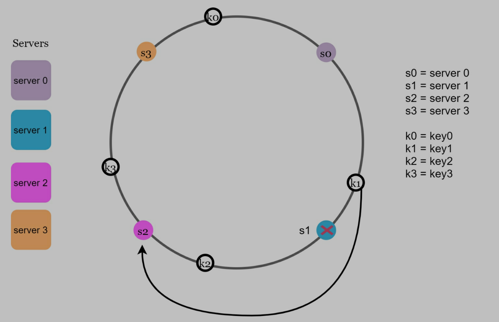

如上图, 当 server1 被去掉, 此时只需要转移 k2 从 server1 到 server2

## Two issues in the basic approach

consistent hash 的基本方法主要是两步:

- Map servers and keys on to the ring using a uniformly distributed hash function.
- To find out which server a key is mapped to, go clockwise from the key position until the first server on the ring is found.

基本方法有两个问题

- 无法确保环上的 server 分布均匀 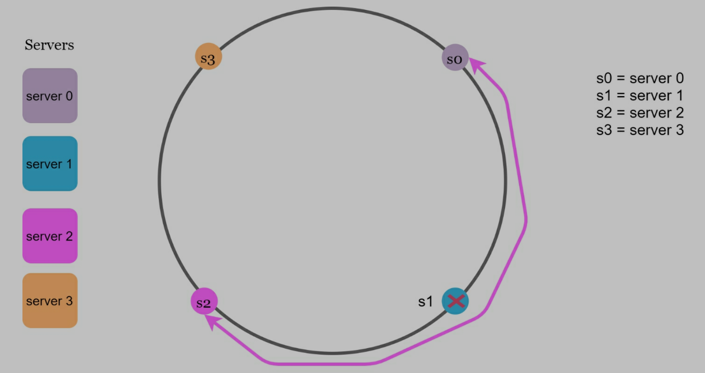
- 无法确保环上的每个 server 得到相对一样多的 data/request. 如下图, server2 得到了更多的 data/request 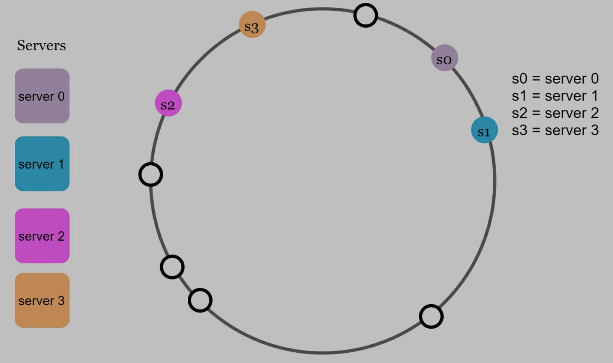

## Virtual nodes

为了解决上述问题, 提出 virtual nodes

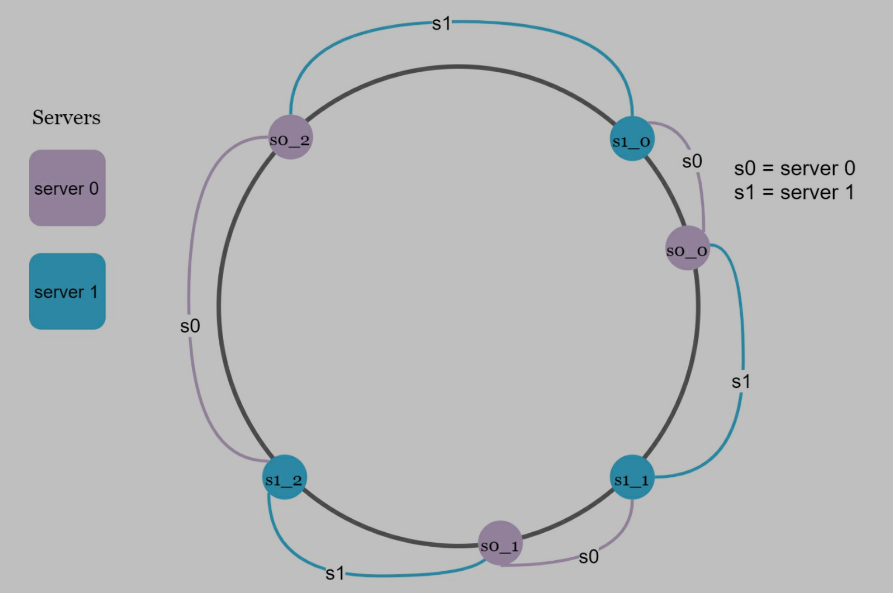

每一个 server 在环上被表示成多个 virtual nodes. 如上图, server0 和 server1 都具有 3 个 virtual nodes.(在实际的系统中, 通常选择很大的数, 而不是 3). server0 管理 3 个 virtual nodes 的范围, server1 管理 3 个 virtual nodes 的范围.


与基本方法类似, 同样进行顺时针旋转, 但是这次是找到第一个在环上的 virtual node, 从而找到真正的 server.

当 virtual node 的数量增加后, key 的分布就变得均匀了.

## Find affected keys

When redistributed, how can we find the affected range to redistribute the keys?

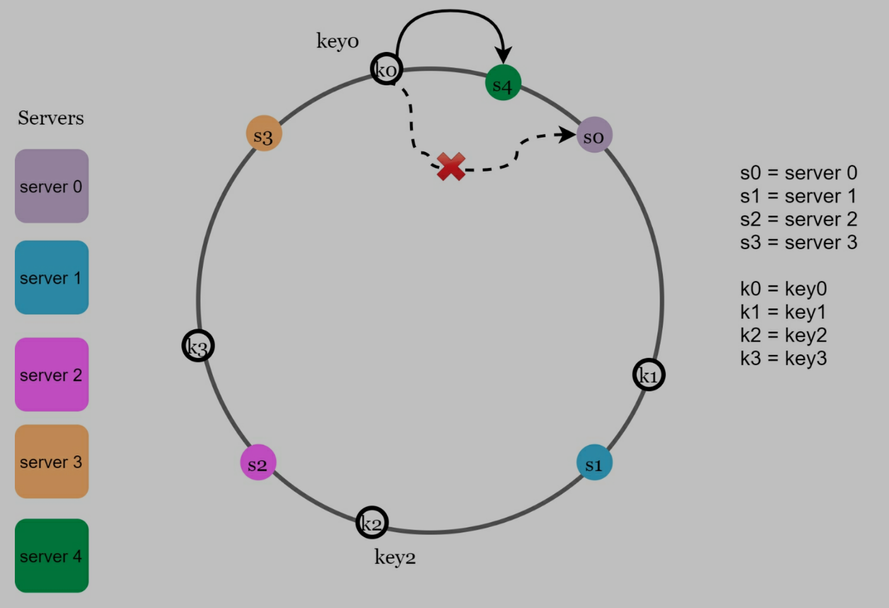

如上图, 添加了 server4, 此时我们需要从 server4 逆时针旋转, 直到找到第一个 server3, 那么从 server3 到 server4 之间的 data/request 就是我们需要转移的

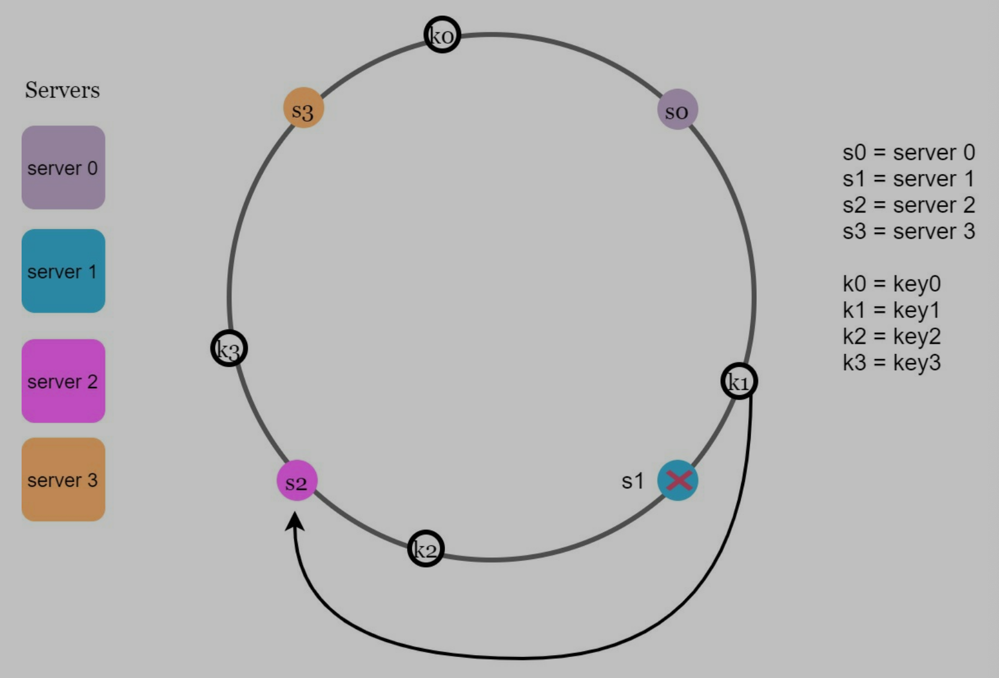

如上图, 删除了 server1, 此时我们需要从 server1 逆时针旋转, 直到找到第一个 server0, 那么从 server0 到 server1 之间的 data/request 就是我们需要转移的

# Wrap up

优点

- 当添加/删除 server 的时候, 我们移动更少的 key
- 更容易 scale horizontally, 因为数据 evenly distributed
- mitigate hotspot key problem: 不会造成有些 server 做了很多, 但是有些 server 却闲着的情况
