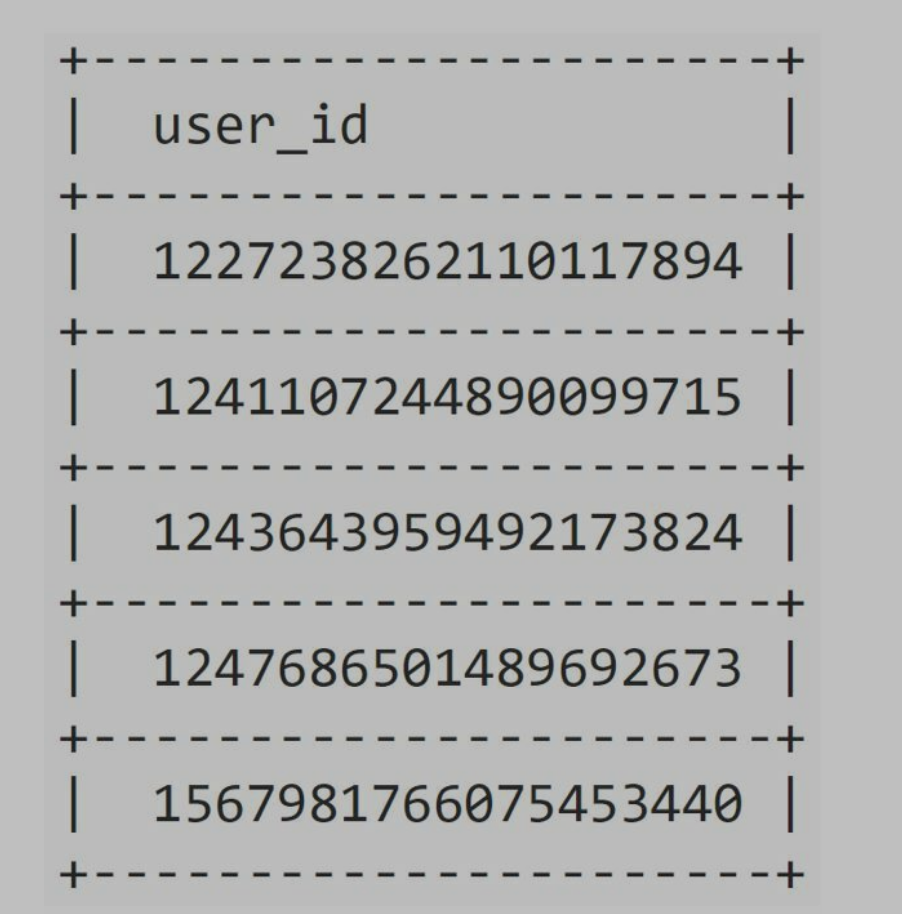
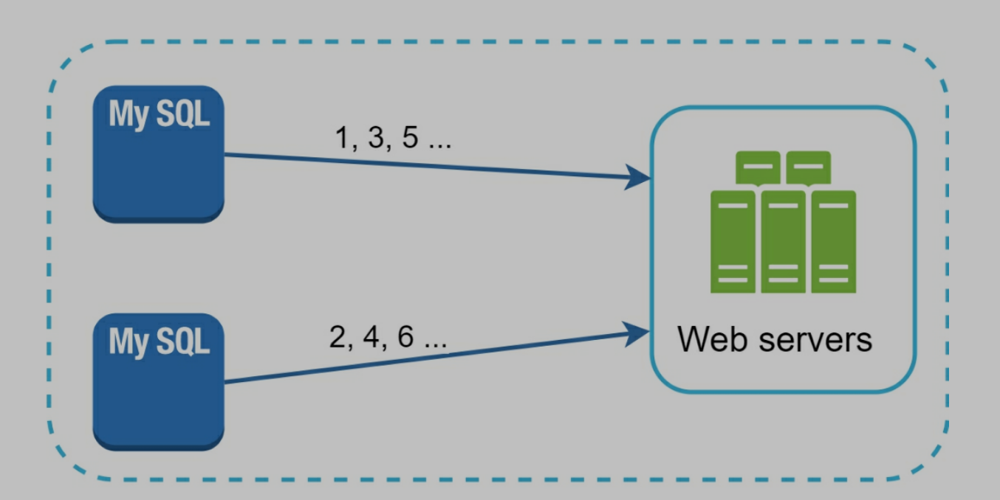
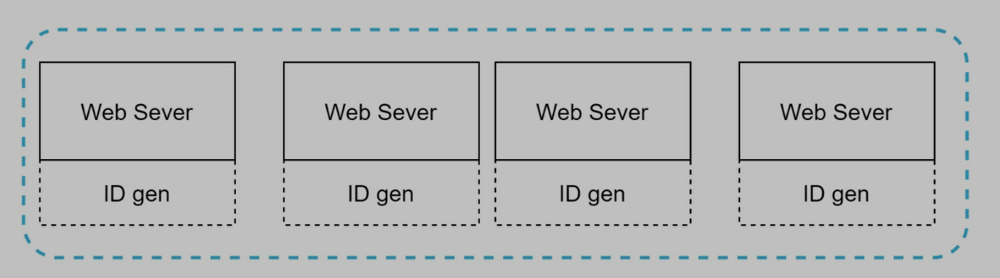
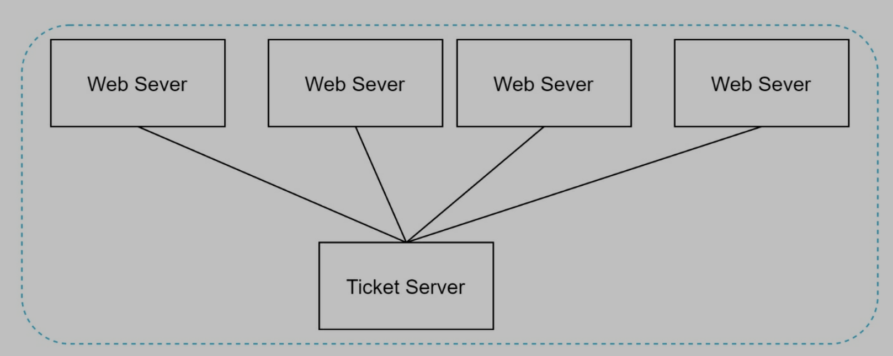
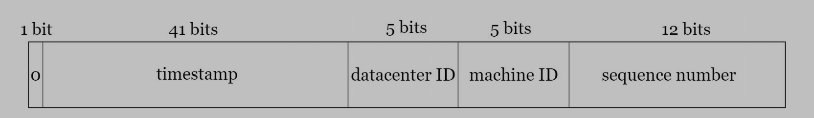
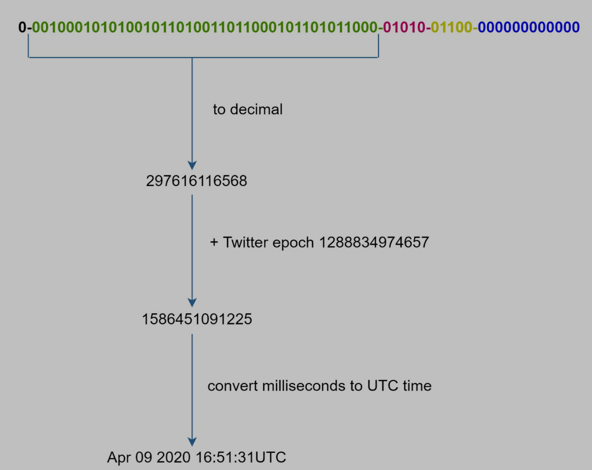

# Design a unique ID generator in distributed system

> Simple solution: use auto_increment in db, but we cannot use it in distributed system

- Single DB server is not large enough
- Delay across multiple DB

# Step 1: Understand the problem and establish design scope

## 1.1 Questions and answers

- Candidate: What are the characteristics of unique IDs?
- Interviewer: IDs must be unique and sortable.
- Candidate: For each new record, does ID increment by 1?
- Interviewer: The ID increments by time but not necessarily only increments by 1. IDs created in the evening are larger than those created in the morning on the same day.
- Candidate: Do IDs only contain numerical values?
- Interviewer: Yes, that is correct.
- Candidate: What is the ID length requirement?
- Interviewer: IDs should fit into 64-bit.
- Candidate: What is the scale of the system?
- Interviewer: The system should be able to generate 10,000 IDs per second.

## 1.2 Requirements

- IDs must be unique.
- IDs are numerical values only.
- IDs fit into 64-bit.
- IDs are ordered by date.
- Ability to generate over 10,000 unique IDs per second.

# Step 2: Propose high-level design and get buy-in

## 2.1 Multi-master replication

- Use auto_increment in db
- Increase k not 1, k is db server number
- Cons
  - Hard to scale with multiple data centers
  - IDs don't go up with time across multiple servers
  - Does not scale well when a server is added or removed

> We have 2 servers, so we increase 2 every time

## 2.2 UUID

- UUID is a 128-bit number used to identify information in computer systems.
- UUID is almost impossible to have collusion.
- Example: UUID: 09c93e62-50b4-468d-bf8a-c07e1040bfb2
- UUID can generate independently. No server communication
- Pros
  - Simple
  - Easy to scale
- Cons
  - IDs length is 128bit, but we need 64bit
  - IDs do not go up with time
  - IDs could be non-numeric

## 2.3 Ticket Server

- Centralized auto_increment in a single db server (ticket server)
- Pros
  - Numeric IDs
  - Easy to implement
  - For small to medium-scale app
- Cons
  - Single point of failure: if ticket server is down, system crash.
  - Although we can have ticket servers, we have to consider data synchronization

## 2.4 Twitter / Snowflake approach (Better solution)

> Divide an ID into different sections

- Sign bit
  - 1 bit
  - Always 0
  - Save it for future use, like changing to signed/unsigned number
- Timestamp
  - 41 bits
  - Milliseconds
  - Twitter snowflake default epoch: 1288834974657, same to 11/04/2010, 01:42:54 UTC
- Data center ID
  - 5 bits
  - We can have 32 data centers
  - It is a constant for whole system
- Machine ID
  - 5 bits
  - We can have 32 machines
  - It is a constant for whole system
- Sequence number
  - 12 bits
  - On a machine/process, generate one ID, increase 1
  - Reset to 0 every millisecond
- When generator is running, we only generate timestamp and sequence numbers, the other parts are constants

# Step 3: Design deep dive

## 3.1 Timestamp

> Transfer 41bits number to timestamp

- As timestamps grow with time, IDs are sortable by time.
- 41 bits can represent ~69 years

## 3.2 Sequence number

- 12 bits
- 4096 combinations
- Sequence number is 0, unless in 1 millisecond and on same server, we generate 2 IDs
- In theory, one server can generate 4096 IDs/millisecond

# Step 4: wrap up

- Clock synchronization
  - Current design use same clock for all servers, but servers can be located in different places
  - Solution: network time protocol
- Section length tuning
  - Change section length to improve system
  - Increase timestamp is good for low concurrency, long-term app
- High availability
