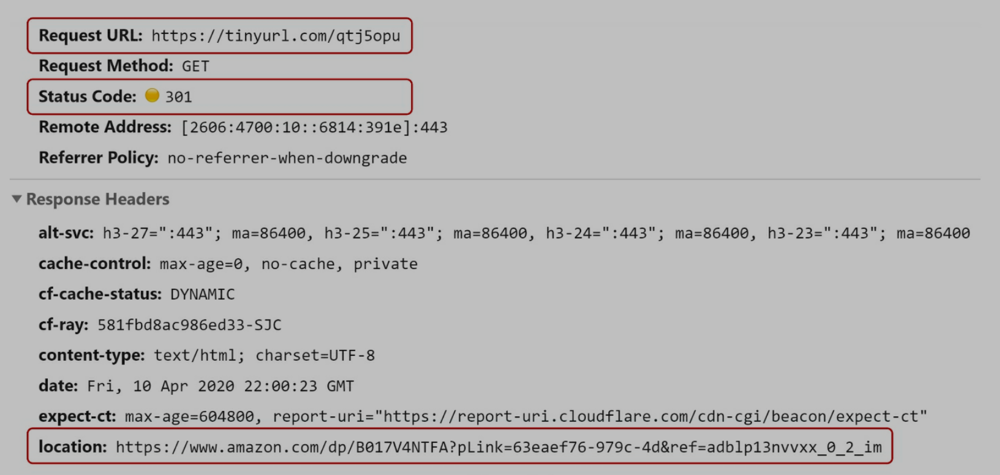
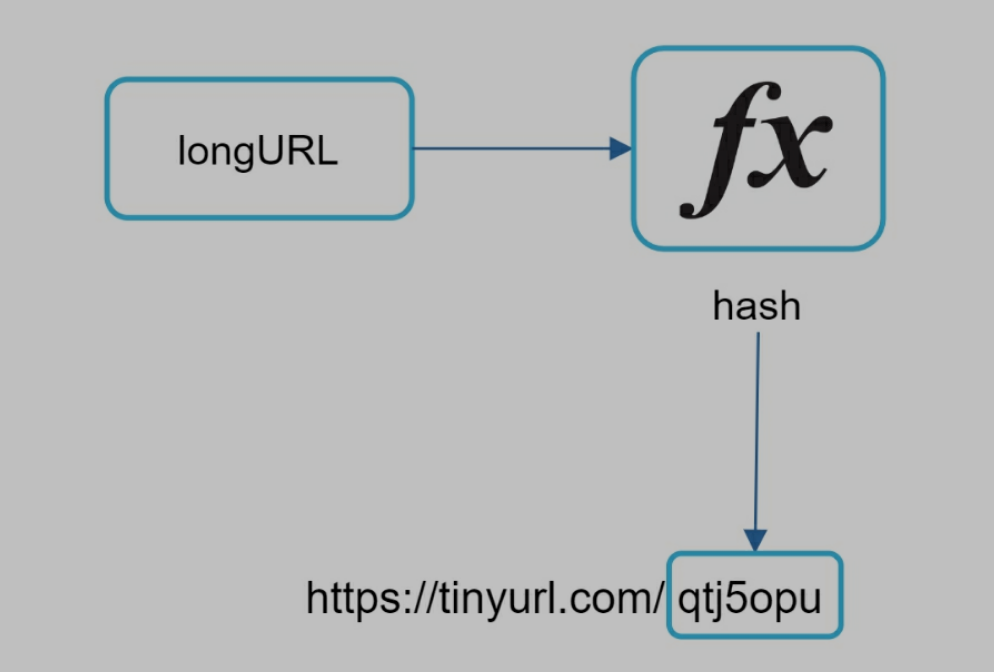
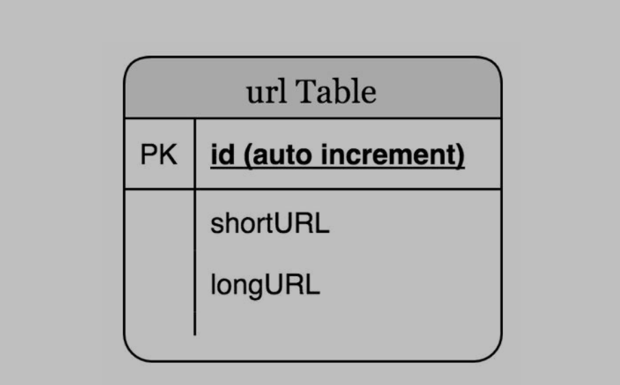
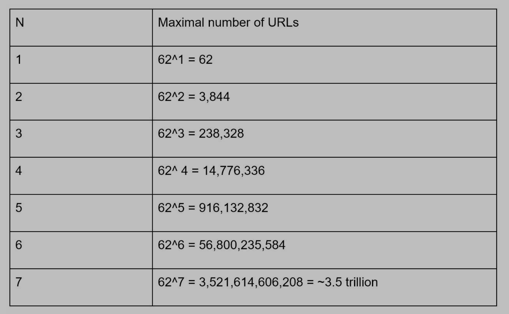
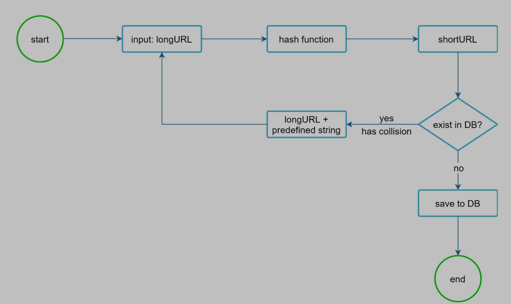
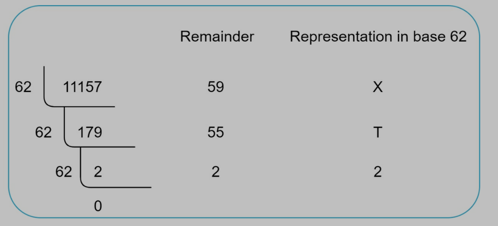
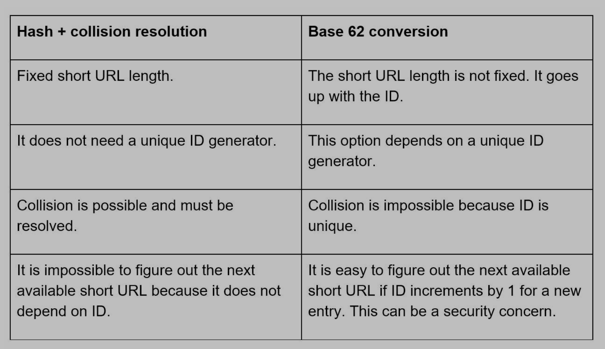
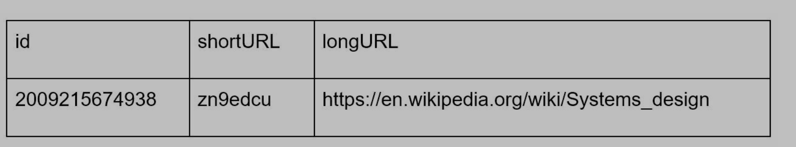

# Design a URL shortener

# Step 1: Understand the problem and establish design scope

## 可能的问题

- Candidate: Can you give an example of how a URL shortener work?
- Interviewer: Assume URL https://www.systeminterview.com/q=chatsystem&c=loggedin&v=v3&l=long is the original URL. Your service creates an alias with shorter length: https://tinyurl.com/y7keocwj. If you click the alias, it redirects you to the original URL.
- Candidate: What is the **traffic volume**?
- Interviewer: 100 million URLs are generated per day.
- Candidate: How long is the shortened URL?
- Interviewer: As short as possible.
- Candidate: What characters are allowed in the shortened URL?
- Interviewer: Shortened URL can be a combination of numbers (0-9) and characters (a-z, A-Z).
- Candidate: Can shortened URLs be deleted or updated?
- Interviewer: For simplicity, let us assume shortened URLs cannot be deleted or updated.

## 需求总结

- URL shortening: given a long URL => return a much shorter URL
- URL redirecting: given a shorter URL => redirect to the original URL
- High **availability**, **scalability**, and **fault tolerance** considerations

## back of the envelope estimation

- Write operation: 100 million URLs are generated per day.
- Write operation per second: 100 million / 24 /3600 = 1160
- Read operation: Assuming ratio of read operation to write operation is 10:1, read operation per second: 1160 \* 10 = 11,600
- Assuming the URL shortener service will run for **10 years**, this means we must support 100 million \* 365= 36.5 billion records.
- Assume average URL length is 100.
- Storage requirement over 10 years: 365 billion \* 100 bytes \* 10 years = 365 TB

# Step 2: Propose high-level design and get buy-in

## API endpoints

- URL shortening
  - create new short URL
  - POST api/v1/data/shorten
    - {longUrl: longUrlString}
    - return shortUrl
- URL redirecting
  - redirect short URL to long URL
  - GET api/v1/shortUrl
  - return longURL for HTTP redirection

## URL redirecting

- 向 short URL 发送请求
- server 返回 301 和一个 long URL

- 301 redirect
  - 表示 requested URL 永久的被移动到 long URL
  - browser 会 cache response
  - subsequent requests 将会直接发送到 long URL
  - 需要降低 server load 的时候使用
- 302 redirect
  - 表示 requested URL 暂时的被移动到 long URL
  - subsequent requests 仍然会被发送到 short URL
  - analytics 重要的时候使用

## URL shortening

- 需要一个 hash function 把 long 变成 short
- each long URL must be hased to one hash value
- each hash value can be mapped back to the long URL

# Step 3: Design deep dive

## Data model

> 最初构想, 放到 hash table 中. 但是 memory resources are expensive and limited

> 改进: 放到 DB 中, 如下图

## hash function

### hash value length

- hash value 包括[0-9, a-z, A-Z], 共 62 中字符
- 找到最小的长度 n, 使得 62 ^ n >= 365 billion, 从下表可知, n = 7

### hash + collision resolution

> 常用的 hash function

如何得到 7 为的 hash value 呢?

- 可以取上面 hash function 结果的前 7 位
- 当发生 hash collision 时, recursively append a new predefined string 直到没有 collision
- 缺点
  - query db to check collision (可以使用 bloom filter 提高性能)

### base 62 conversion (一共 62 中字符可以选择)

- 使用 62 个字符 encode
- 0-0,..., 9-9, 10-a, 11-b, ..., 61-Z
- 例如: 11157 = 2 x 62^2 + 55 x 62^1 + 59 x 62^0 = [2, 55, 59] -> [2, T, X]

### 两种方法对比

## URL shortening deep dive

1. long URL input
2. check if long URL is in db
3. if so, meaning it was converted to short URL before, fetch the short URL and return
4. if not, long URL is new. Unique ID generator creates a new unique ID (primary key)
5. Convert ID to short URL with base 62 conversion
6. Create a new db row with ID, shortURL, longURL.

举例

1. input https://en.wikipedia.org/wiki/Systems_design
2. Unique ID generator 生成 ID: 2009215674938
3. Convert ID to shortURL with base 62 conversion, 2009215674938 -> zn9edcu
4. Save ID, short URL, long URL to db

可以参考 Chapter 7 学习如何使用分布式系统生成 unique ID

## URL redirecting deep dive

- 因为 read 很多, 所以可以把<shortURL, longURL>存在 cache 中
- 流程
  - input short URL in browser
  - load balancer 转发请求到 server
  - 如果 short URL 在 cache, 返回 long URL
  - 如果 short URL 不在 cache, 从 db 中拿到 long URL
  - 如果不在 db 中, 那是一个错误的 URL
  - long URL return to client

# Step 4: wrap up

可以讨论的话题

- rate limiter: 一个可能的 security problem. 收到大量的 URL shortening requests. (查看 chapter 4)
- web server scaling: web tier is stateless, so it is easy to add/remove web servers
- database scaling: replication and sharding
- analytics: 可以添加工具分析数据, 得到多少人访问了某个 link
- availability, consistency, reliability: 参考 chapter 1
