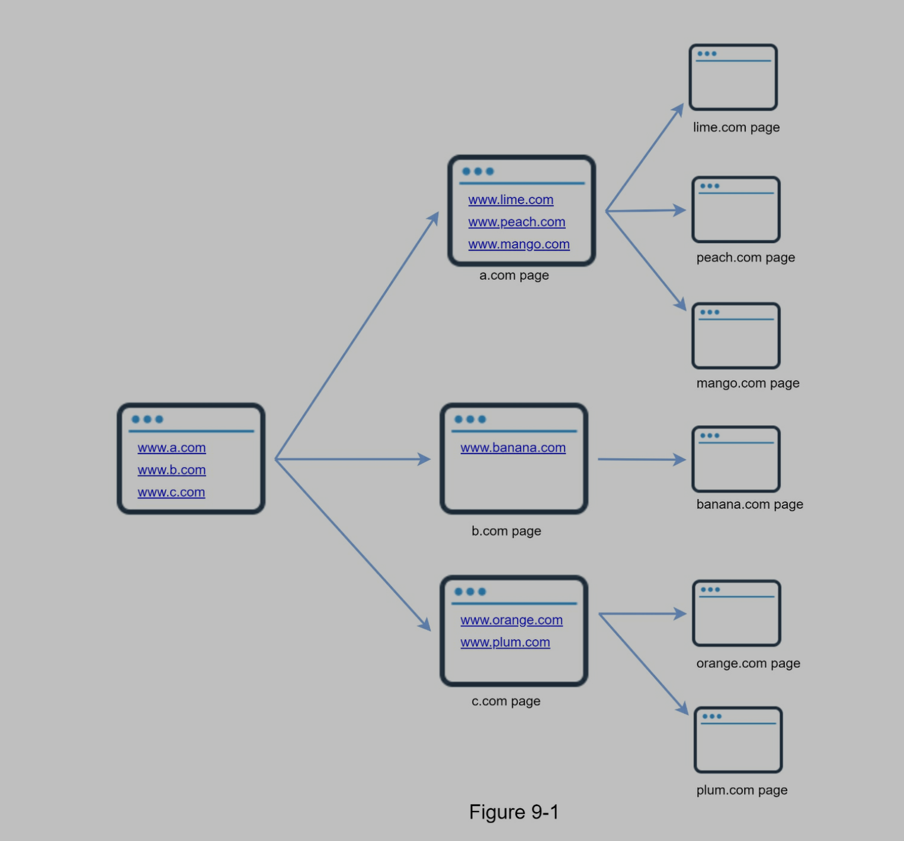
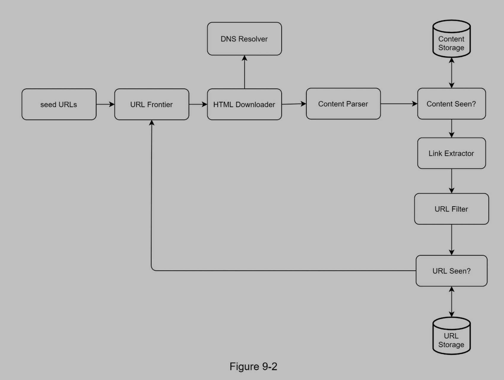
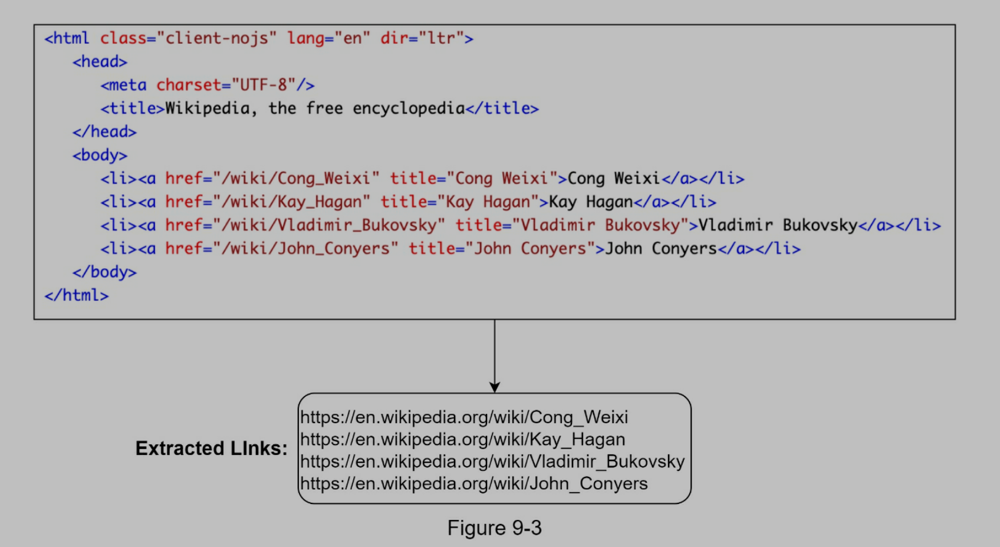
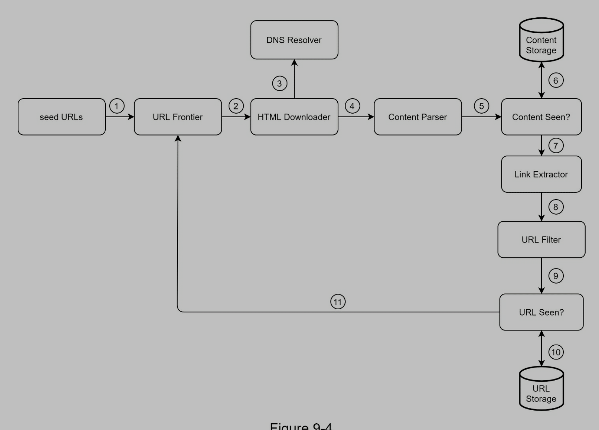
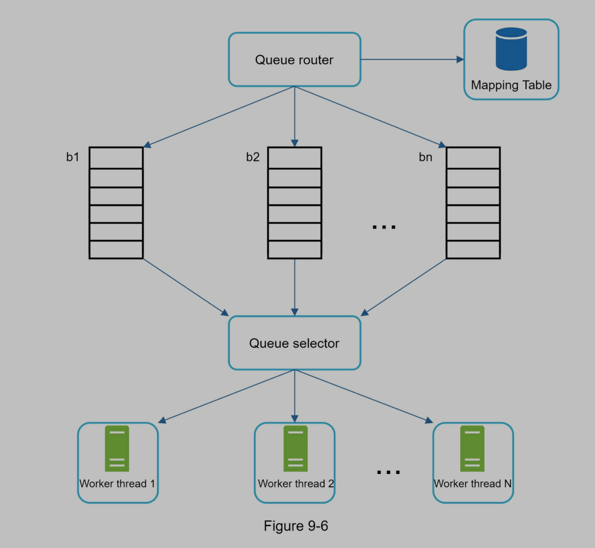
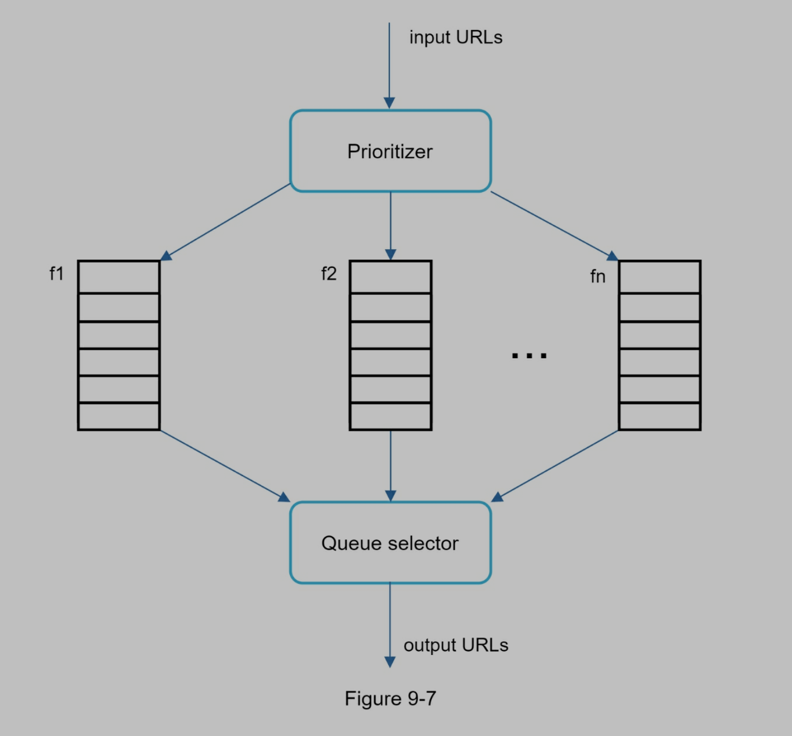
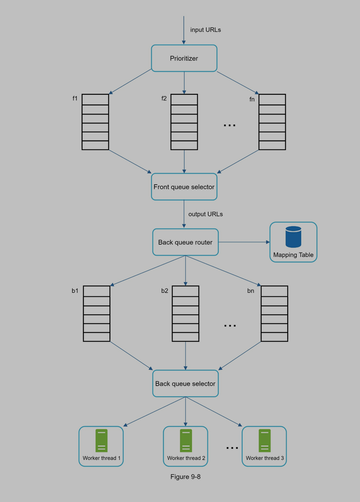
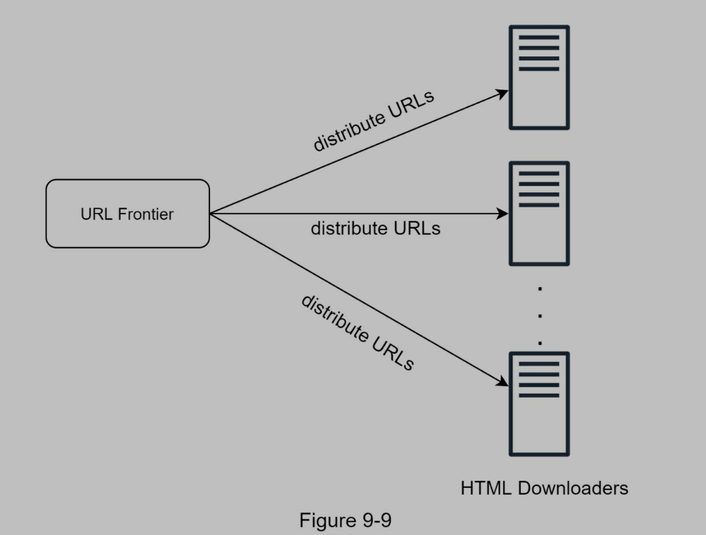
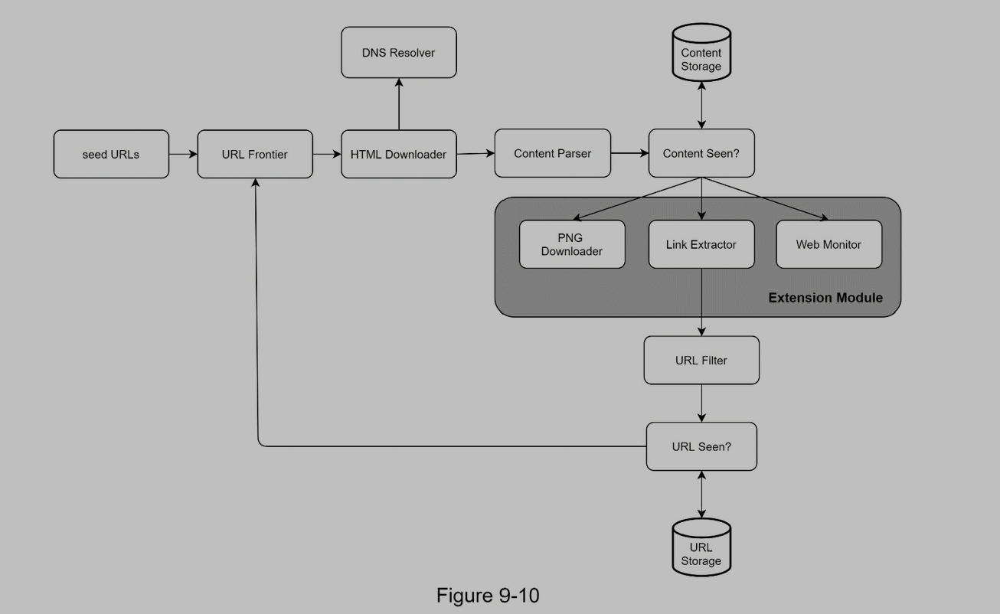

# Design a Web Crawler

> A web crawler is known as a robot or spider.



- Search engine indexing: like Googlebot
- Web archiving: save web page data, like some libraries use crawler
- Web mining: data mining
- Web monitoring

# Step 1 - Understand the problem and establish design scope

## 1.1 Basic solution

1. Given URLs, download web page
2. Extract URLs from downloaded web page
3. Add URLs from URL list
4. Repeat 1,2,3

## 1.2 Questions and answers

- Candidate: What is the main purpose of the crawler? Is it used for search engine indexing, data mining, or something else?
- Interviewer: Search engine indexing.
- Candidate: How many web pages does the web crawler collect per month?
- Interviewer: 1 billion pages.
- Candidate: What content types are included? HTML only or other content types such as PDFs and images as well?
- Interviewer: HTML only.
- Candidate: Shall we consider newly added or edited web pages?
- Interviewer: Yes, we should consider the newly added or edited web pages.
- Candidate: Do we need to store HTML pages crawled from the web?
- Interviewer: Yes, up to 5 years
- Candidate: How do we handle web pages with duplicate content?
- Interviewer: Pages with duplicate content should be ignored.

## 1.3 Other considerations

- Scalability: parallelization.
- Robustness: edge cases.
- Politeness: should not crawl same page in a short time
- Extensibility

## 1.4 Back-of-envelope estimation

- Assume 1 billion web pages are downloaded every month.
- QPS: 1,000,000,000 / 30 days / 24 hours / 3600 seconds = ~400 pages per second.
- Peak QPS = 2 \* QPS = 800
- Assume the average web page size is 500k.
- 1-billion-page x 500k = 500 TB storage per month.
- Assuming data are stored for five years, 500 TB \* 12 months \* 5 years = 30 PB. A 30 PB storage is needed to store five-year content.

# Step 2 - Propose high-level design and get buy-in



## 2.1 Components

- Seed URLs
  - Seed URLs is starting point
  - Domain name can be seed URL
- URL Frontier
  - 2 crawl states
    - To be downloaded (URL Frontier saves these URLs)
    - Already downloaded
- HTML downloader
  - Download we pages in URL Frontier
- DNS Resolver
  - HTML Downloader use DNS Resolver to get IP address
- Content parser
  - Parse content will slow crawl, we we separate download and parse
- Content seen?
  - Research reveals that 29% of the web pages are duplicated contents.
  - Compare HTML content and delete duplicate
- Content storage
  - Most contents are saved in disk
  - Popular contents are saved in memory
- URL extractor
  - Parse, extract links from HTML 
- URL filter
  - Excludes certain content types, file extensions, error links and URLs in “blacklisted” sites
- URL seen?
  - Check if a URL has been crawled
- URL storage
  - Save visited URLs

## 2.2 Web crawler workflow



1. Add seed URLs to URL Frontier
2. HTML downloader get URLs from URL Frontier
3. Downloader get IP from DNS
4. Content parser analyze HTML
5. If HTML is valid, pass to content seen?
6. Content seen check if content has been saved?
   1. Yes, drop HTML
   2. No, pass HTML to link extractor
7. Link extractor extract links
8. Pass links to URL filter
9. Pass valid URLs to URL seen
10. URL seen check if a URL has been crawled
    1. Yes, drop URL
    2. No, pass URL to URL Frontier
11. Back to 1

# Step 3 - Design deep dive

## 3.1 DFS VS BFS

- You can think of the web as a directed graph where web pages serve as nodes and hyperlinks (URLs) as edges.
- BFS is better since web is too deep

## 3.2 URL Frontier

### 3.2.1 Problems for BFS

- A lot of links to home page, it is impolite to crawl it a lot of times
- Basic BFS has no weight for URLs, but some might be important, some might be not

### 3.2.2 How URL Frontier solves problems

- Save URLs to be downloaded
- Ensure politeness, URL prioritization, freshness
  - Politeness
    - Should not crawl same pages in a short time
    - Add a delay between 2 download tasks
    - Politeness constraint is implemented by maintain a mapping from website hostnames to download (worker) threads. Each downloader thread has a separate FIFO queue and only downloads URLs obtained from that queue. 
  - Priority
    - We can use PageRank, website traffic, update frequency as standards
  - Freshness
    - Page is always updated, we have to download periodically
    - Determine if recrawl based on page update history
    - Download important pages more frequently
- Storage for URL Frontier
  - URL 非常多
  - 大部分存放在 disk
  - 在 memory 中维持一个 buffer, 存放一部分 URL, 这部分数据周期性的写入 disk
- URL Frontier design
  - Front queues: manage prioritization
  - Back queues: manage politeness



## 3.3 HTML downloader

### 3.3.1 Robots.txt (Robots Exclusion Protocol)

> Standard used by websites to communicate with crawlers

```Robots.txt
User-agent: Googlebot
Disallow: /creatorhub/*
Disallow: /rss/people/*/reviews
Disallow: /gp/pdp/rss/*/reviews
Disallow: /gp/cdp/member-reviews/
Disallow: /gp/aw/cr/
...
```

- Which pages can be downloaded
- crawler should obey Robots.txt rules
- cache robots file to avoid duplicate download

### 3.3.2 Performance optimization



- Distributed crawl
- Cache DNS resolver
  - DNS request is synchronous, it will take 10ms - 200ms
  - DNS cache save URL and IP map
- Locality
  - In distributed system, we can select servers which are close the page to crawl page
- Short timeout
  - Set up maximal wait time

## 3.4 Robustness

- Consistent hashing
  - Distribute loads in downloaders
  - A new downloader server can be added or removed using consistent hashing
- Save crawl states and data to db
- Exception handling
- Data validation

## 3.5 Extensibility



## 3.6 Detect and avoid problematic content

- Redundant content: check duplication with hash
- Spider traps: a web page causes a crawler in an infinite loop
- Data noise: some pages only have ad

# Step4: Wrap up

- Scalability
- Politeness
- Extensibility
- Robustness
- Server-side rendering: https://developers.google.com/search/docs/guides/dynamic-rendering
- Filter out unwanted pages: anti-spam component
- Database replication and sharding
- Horizontal scaling
- Availability, consistency, and reliability
- Analytics
