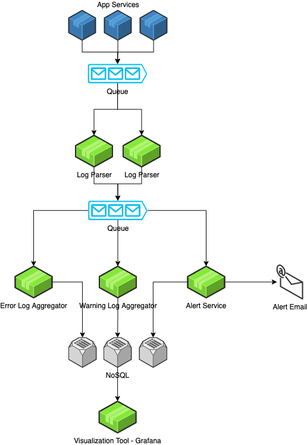

# Design Distributed Logging System

# Step 1: Understand the problem and establish design scope

## 1.1 Questions and answers

- Is it for a distributed system?
- What is the most important features for logging system?
- Can we retrieve logs based on filters?
- Do we need to send alerts when error logs?

## 1.2 Requirements

- Distributed logging system
- Centralized logging
- Centralized log tracing
- Generate reports to get specific type of error
- Alert mechanism based on errors

# Step 2: Propose high-level design and get buy-in

## 2.1 Monolithic vs Distributed System Logging

## 2.2 Basic Design

# Step 3: Design deep dive

## 3.1 Log shipper

You need a log shipper which can read the log from your directories or containers and ship them to the next place. This log shipper needs to have less resource footprint. You don’t want your logging application to take down your main application.

There are a few good log shippers present that can help you. Fluentd, rsyslog, logstash, etc can be a good choice.

## 3.2 Other

- Add Machine/Instance/Service ID into logs before sending to Log Parser
- Logs come from different services developed by different tech stacks, so we need log parser to format logs and then send to queue
- We should send emails/notifications to dev for important logs
