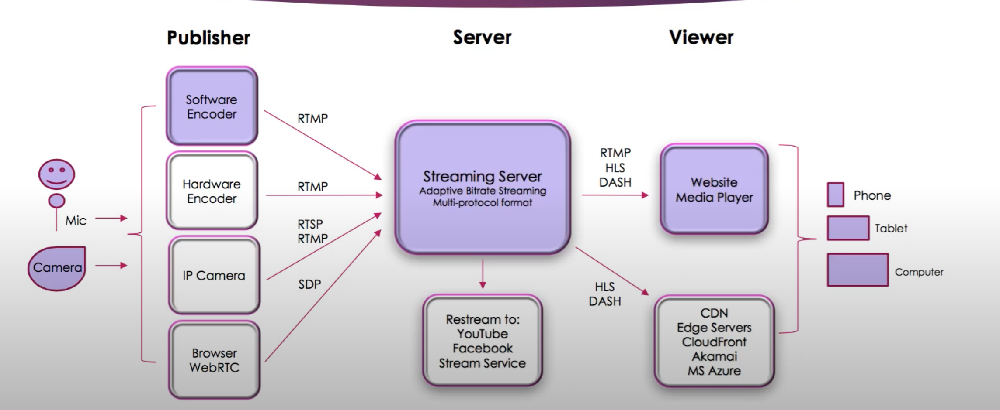

# Live Streaming Design

# Device

- mic
- camera

# Publisher

> Capture and encode data from device

- software encoder:
  - run on desktop
  - capture data from mic, camera
  - use RTMP (real-time message protocol) and send to streaming server
- hardware encoder
  - devices for streaming
- IP camera
  - a camera connected to network
- browser WebRTC
  - browser captures voice/video
  - use SDP

# Server

- adaptive bitrate streaming - 自适应流
  - 是一种在电脑网络使用的一种技术流技术。过去的流媒体技术多使用 RTP/RTSP，但现在的技术则大多基于 HTTP，并为更高效在大型分布式 HTTP 网络（例如互联网）分发而设计
  - 此技术根据实时检测的用户的带宽和 CPU 使用率，调整视频流的质量。这需要使用一种可以将单一视频源输出为多码率的编码器。播放器客户端依赖可用资源在不同码率的流之间切换。"结果就是：更少缓存、更快的开始播放、为低端和高端链接都提供良好的体验。"
- multi-protocol format
  - 生成不同的 format
- restream
  - 发送 stream 到别的 stream servers
- scale
  - 让 streaming server 链接到 cloud CDN

# Viewer

- media player
  - 例如 Youtube
  - 或者自己建 player
