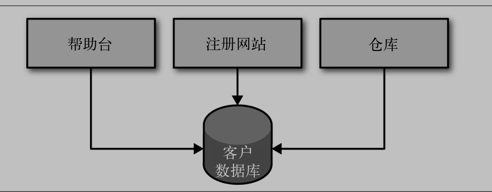
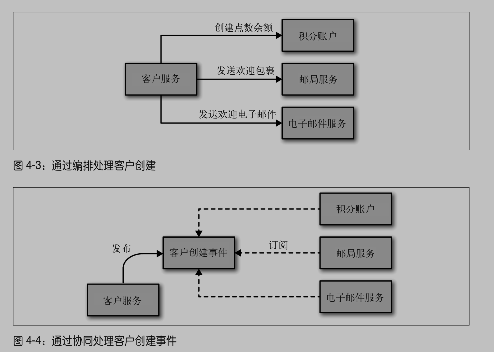

# 第 4 章 集成

# 4.1 寻找理想的集成技术

- 避免破坏性修改, 对已有的微服务的修改不应该影响到消费方
- 保证 API 的技术无关性
- 使服务易于消费方使用
- 隐藏内部实现细节, 降低耦合

# 4.2 为用户提供接口

# 4.3 共享数据库

- 最常见的集成就是数据库集成
- 不同服务共享一个数据库
- 缺点
  - 不同服务捆绑在一起, 可能造成 regression
  - 多个服务与单一的数据库技术捆绑在一起, 无法变成别的数据库类型
  - 多个服务同时具有数据库修改权限, 如果出现 bug 可能要同时检查多个地方, 内聚性降低

# 4.4 同步与异步

# 4.5 编排与协同

- 两种架构风格: 编排(orchestration)和协同(choreography)
- 协同可以降低耦合, 但是需要一些额外的工作来检测每个过程的进展

# 4.6 远程过程调用 (RPC, Remote Procedure Call)

- 有些 RPC 机制与特定的平台紧密绑定, 但是 thrift 和 protocol buffers 对不同语言的支持很好
- 分布式系统一个非常注明的错误观点就是网络是可靠的, 事实上网络并不可靠

# 4.7 REST

- REST 是 RPC 的一种替代方案

# 4.8 实现基于时间的异步协作方式

- 微服务发布事件机制和消费者接受事件机制
- 两种方式
  - 消息代理: 例如 RabbitMQ
  - HTTP 传播事件
- 异步架构的复杂性
  - catastrophic failover: 由于 worker 或者任务有 bug, 一个 worker 崩溃了, 另一个 worker 尝试处理遗留下来的任务也崩溃了
  - 需要设置最大尝试次数
  - 设置死信队列并且监控

# 4.9 服务即状态机

# 4.10 响应式扩展 - Reactive extensions

# 4.11 微服务世界中的 DRY 和代码重用的危险

# 4.12 按引用访问

# 4.13 版本管理

- MAJOR.MINOR.PATCH: 向后不兼容的改变:新功能增加:缺陷修复
-
