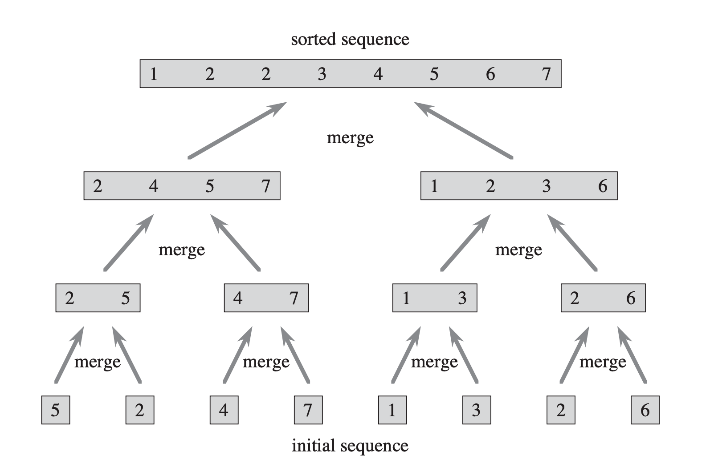
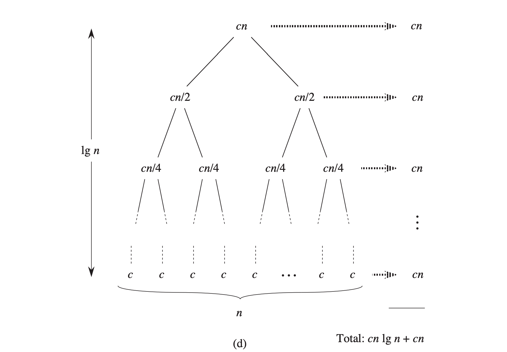

# 第 2 章 算法基础

# 2.1 插入排序 - insertion sort

```java
for j = 2 to A.length
    key = A[j]
    // insert A[j] into the sorted sequence A[1...j - 1].
    i = j - 1
    // 从后向前遍历
    while i > 0 and A[i] > key:
        A[i + 1] = A[i]
        i = i - 1
    A[i + 1] = key
```

> `[1...j - 1]` 称为循环不变式 (loop invariant)

- 用来理解算法的正确性
- 类似数学归纳法
- 三条性质
  - 初始化: 循环的第一次迭代之前为真 - 归纳法中的基本情况
  - 保持: 如果循环的某次迭代之前为真, 那么下次迭代之前也是真 - 归纳法中的归纳
  - 终止: 在循环终止时, 不变式提供一个性质来证明算法的正确性

> 证明插入排序的循环不变式

- 初始化
  - 第一次循环之前, j = 2, 循环不变式成立.
  - A[1...j - 1]中仅存在一个元素
  - A[1...j - 1]已排序
- 保持
  - for 循环每次向右移动一个位置, 直到找到 A[j]的位置, 然后讲 A[j]插入
  - 此时 A[1...j]由原有的 A[1...j]组成
  - A[1...j]已排序
- 终止
  - 终止条件 j > A.length = n
  - A[1...n]由原来的 A[1...n]组成, 此时的数组就是整个数组
  - A[1...n]已排序

# 2.2 分析算法

- 算法的运行时间指执行的基本操作数或步数
- 通常考虑最坏的运行时间

# 2.3 设计算法

- 分治法: 讲问题分解成几个规模较小但类似的子问题, 然后在合并子问题的解来建立原问题的解
- 归并算法(merge sort)

MERGE(A, p, q, r)

```java
n1 = q - p + 1
n2 = r - q

let L[1...n1 + 1] and R[1...n2 + 1]

for i = 1 to n1:
    L[i] = A[p + i - 1]
for j = 1 to n2:
    R[j] = A[q + j]
L[n1 + 1] = MAX
R[n2 + 1] = MAX
i = 1
j = 1
for k = p to r:
    if L[i] <= R[j]:
        A[k] = L[i]
        i = i + 1
    else A[k] = R[j]
        j = j + 1
```

MERGE-SORT(A, p, r)

```java
if p < r:
    q = [(p + r) / 2]
    MERGE-SORT(A, p, q)
    MERGE-SORT(A, q + 1, r)
    MERGE(A, p, q, r)
```




- cn 是合并子问题的时间
