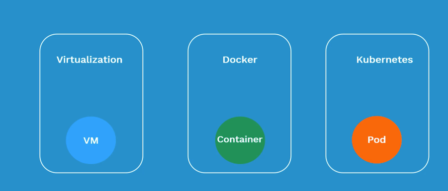
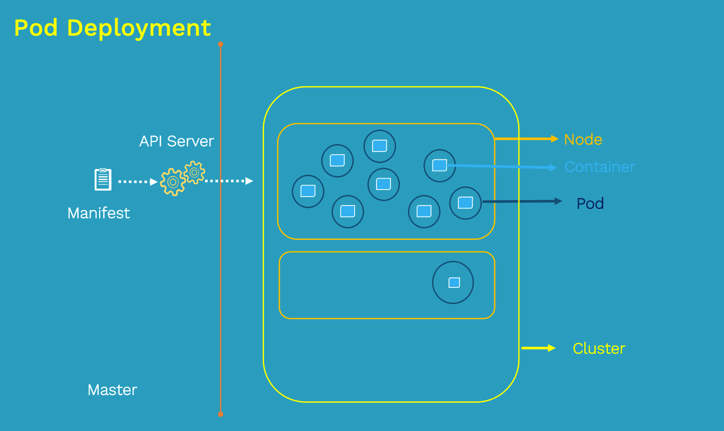
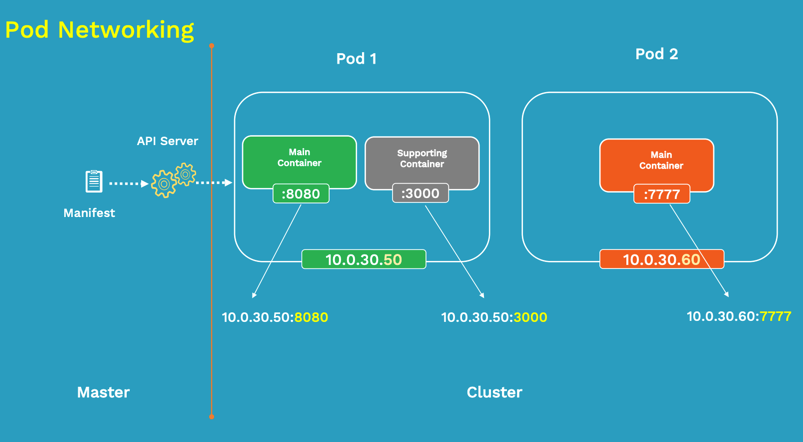
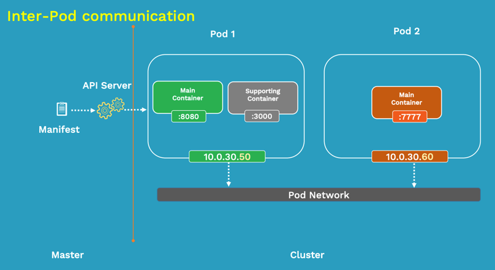
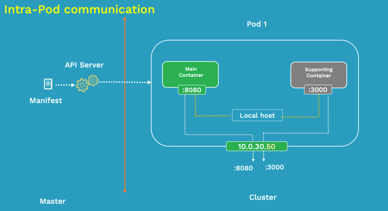
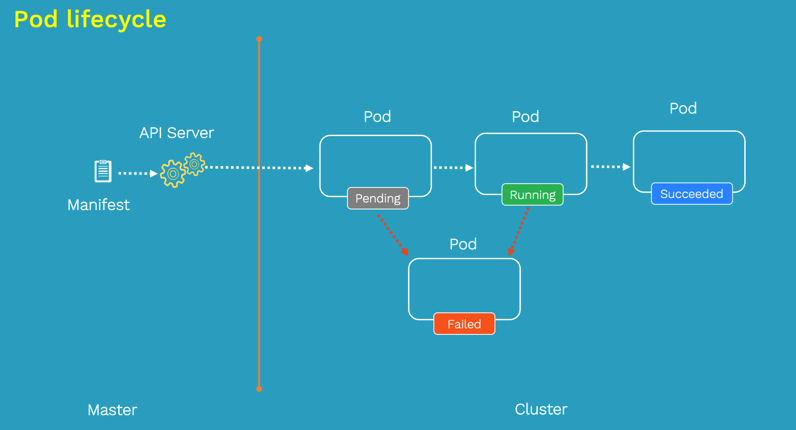
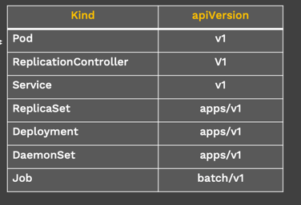

# What is Pod?

atomic unit of scheduling



> 一个pod可能包含多个containers



POD的IP和PORT


POD 之间链接


POD 内部链接


POD lifecycle




```yaml
apiVersion: v1
kind: Pod
metadata:
  name: nginx-pod
  labels:
    app: nginx
    tier: dev
spec:
  containers:
  -name: nginx-container
    image: nginx
```

```bash
kubtctl create -f nginx-pod.yaml

kubectl get pod -o wide

kubectl get pod nginx-pod -o yaml

kubectl describe pod nginx-pod 

ping 10.240.1.26

kubectl exec -it nginx-pod -- /bin/sh

kubectl delete pod nginx-pod
```


